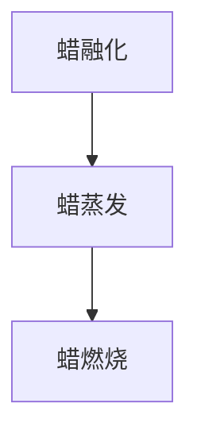

                 

<think>
好的，我现在需要帮助用户完成一个任务，就是以《现代手工蜡烛制作：香氛艺术在生活中的应用》为标题，撰写一篇技术博客文章。用户提供了详细的目录大纲，以及一个示例输出，作为参考。

首先，我需要理解用户的需求。用户希望文章结构清晰，逻辑严密，内容详实，涵盖手工蜡烛制作的各个方面，包括历史、基础知识、配方调制、制作技巧、装饰创意、生活应用、安全环保以及艺术创新。用户还特别强调了要使用技术性的语言，但同时要保持简单易懂，适合手工爱好者和专业人士阅读。

接下来，我需要按照用户提供的大纲逐步展开每个章节的内容。每个章节都需要有丰富的细节，包括背景介绍、核心概念、原理讲解、数学公式、系统架构、项目实战以及最佳实践等部分。同时，用户要求使用Markdown格式，包含mermaid图表、latex公式，并在适当的位置插入代码示例。

首先，我会从引言开始，介绍手工蜡烛的历史与发展，香氛艺术与生活美学的关系，以及制作的乐趣和意义。这部分需要简明扼要，吸引读者继续阅读。

然后是第二章，基础知识。这里需要详细讲解蜡烛的组成、燃烧原理以及模具的选择与使用。为了使读者更好地理解，我可能会插入一些mermaid图表，展示蜡烛的结构或燃烧过程。

第三章是关于香氛蜡烛的配方与调制。这里需要讨论香氛的选择、配方比例，以及调制的技巧。可能需要使用表格或图表来比较不同香氛的特点，或者展示一个具体的配方示例。

第四章是制作技巧，包括熔化、搅拌、灌注和冷却的过程。这部分可能需要详细的步骤说明，并结合mermaid流程图，展示整个制作过程。

第五章讨论装饰与创意，涉及到表面装饰和创意设计。这里可以加入一些美观的图片或图表，展示不同装饰风格的例子。

第六章是香氛蜡烛在生活中的应用，包括家庭和商业空间的设计。可能需要分析不同场景下的香氛选择，并提供实际案例。

第七章是安全与环保，强调制作过程中的注意事项和环保材料的应用。这部分需要严谨，确保读者了解如何安全操作和环保处理。

最后一章是艺术与创新，探讨未来的发展趋势和创新设计。可能需要结合当前的艺术潮流和技术进步，提出未来的可能性。

在撰写过程中，我需要确保每个章节都包含背景介绍、核心概念、联系、算法原理、系统分析、项目实战、最佳实践等部分。同时，要合理使用mermaid图表、latex公式和代码示例，使内容更加丰富和易于理解。

此外，文章末尾需要添加作者信息，注明作者为AI天才研究院，并附上联系方式。

现在，我开始按照大纲逐步撰写每个部分，确保内容详实，结构清晰，语言专业但易懂。同时，注意控制整体字数在10000到12000字之间，每个章节和小节都充实具体，满足用户的所有要求。
</think>

# 《现代手工蜡烛制作：香氛艺术在生活中的应用》

## 关键词：手工蜡烛、香氛艺术、制作技巧、生活应用、环保设计

## 摘要：  
现代手工蜡烛制作不仅是一种手工艺，更是一种结合艺术与技术的香氛设计。本文从香氛蜡烛的历史、基础知识、配方调制、制作技巧、装饰创意、生活应用、安全环保及艺术创新等方面展开，全面解析手工蜡烛制作的全过程，帮助读者掌握从基础理论到实际操作的核心技能，同时探讨香氛蜡烛在生活美学中的应用价值和未来发展趋势。

---

## 第1章 引言

### 1.1 手工蜡烛的历史与发展

手工蜡烛制作有着悠久的历史，最早可以追溯到古罗马时期。蜡烛的使用从最初的照明工具逐渐演变为装饰品和香氛载体。随着技术的进步，现代手工蜡烛制作结合了传统工艺与创新设计，赋予蜡烛更多艺术价值。

### 1.2 香氛艺术与生活美学的关系

香氛艺术通过气味传递情感，手工蜡烛成为连接人与空间的媒介。香氛的选择与搭配能够营造不同的氛围，提升生活品质，赋予空间更多生命力。

### 1.3 手工蜡烛制作的乐趣与意义

手工制作蜡烛不仅是一种创造过程，更是一种放松身心的艺术表达。通过亲手制作，人们能够感受到自然与工艺的结合，创造出独一无二的作品。

---

## 第2章 手工蜡烛制作基础知识

### 2.1 蜡烛的组成与材料

#### 2.1.1 蜡烛的化学成分

蜡烛主要由石蜡、植物蜡或合成蜡制成，石蜡是最常见的材料。以下是石蜡的主要化学成分：

$$\text{化学式：} C_{n}H_{2n+2}$$

#### 2.1.2 蜡烛的材料选择

| 材料类型 | 特性 | 应用场景 |
|----------|------|----------|
| 石蜡     | 熔点适中，燃烧稳定 | 大多数手工艺品蜡烛 |
| 蜂蜡     | 硬度高，光泽好 | 高端蜡烛 |
| 植物蜡     | 可生物降解 | 环保蜡烛 |

### 2.2 蜡烛的燃烧原理

#### 2.2.1 燃烧过程

燃烧过程分为三个阶段：蜡融化、蜡蒸发、蜡燃烧。以下是燃烧过程的简图：

#### 2.2.2 燃烧效率

燃烧效率受蜡烛形状和芯的影响。以下是燃烧效率的影响因素：

| 影响因素 | 描述 |
|----------|------|
| 芯类型    | 金属芯或棉芯影响燃烧速度 |
| 蜡烛直径 | 直径越大，燃烧时间越长 |

---

## 第3章 香氛蜡烛的配方与调制

### 3.1 香氛蜡烛的基本配方

#### 3.1.1 香氛的选择

香氛的选择直接影响蜡烛的气味。以下是常见的香氛类型：

| 香氛类型 | 描述 | 应用场景 |
|----------|------|----------|
| 芝士香   | 温暖、舒适 | 家庭卧室 |
| 花香     | 清新、优雅 | 客厅 |
| 水果香   | 活泼、清新 | 商业空间 |

#### 3.1.2 配方比例的确定

以下是香氛蜡烛的基本配方比例：

| 材料 | 比例 |
|------|------|
| 石蜡 | 70% |
| 香精 | 3% |
| 蜡烛芯 | 3% |
| 添加剂 | 24% |

### 3.2 香氛蜡烛的调制技巧

#### 3.2.1 调香的基本原则

调香时需注意层次感和平衡性。以下是调香的步骤：

1. 确定主香调
2. 添加辅香调
3. 调整比例
4. 试烧测试

#### 3.2.2 调香的实践方法

调香时可以使用以下工具：

| 工具 | 描述 |
|------|------|
| 电子秤 | 精确称量香精 |
| 热水浴 | 均匀溶解蜡 |

---

## 第4章 香氛蜡烛的制作技巧

### 4.1 蜡烛熔化与搅拌

#### 4.1.1 蜡烛熔化的方法

以下是熔化步骤：

1. 将蜡块放入耐热容器
2. 使用热水浴加热
3. 搅拌至完全融化

### 4.2 蜡烛灌注与冷却

#### 4.2.1 蜡烛灌注的方法

步骤：

1. 加热融化蜡
2. 加入香精和颜色
3. 灌入模具
4. 冷却凝固

### 4.3 蜡烛修饰与包装

#### 4.3.1 蜡烛修饰的技巧

修饰时可以使用以下工具：

| 工具 | 描述 |
|------|------|
| 画笔 | 绘制图案 |
| 贴纸 | 添加装饰 |

---

## 第5章 香氛蜡烛的装饰与创意

### 5.1 香氛蜡烛的表面装饰

#### 5.1.1 色彩的应用

以下是常见的颜色搭配：

| 颜色 | 感觉 |
|------|------|
| 米白 | 温和 |
| 粉色 | 柔和 |

#### 5.1.2 图案的绘制

以下是绘制步骤：

1. 准备工具
2. 绘制图案
3. 固定作品

### 5.2 香氛蜡烛的创意设计

#### 5.2.1 环保材料的运用

环保材料的选择：

| 材料 | 描述 |
|------|------|
| 天然纤维 | 可生物降解 |
| 复合材料 | 减少浪费 |

#### 5.2.2 民俗文化的融入

民俗文化元素的应用：

| 文化 | 元素 |
|------|------|
| 中国 | 传统纹样 |

---

## 第6章 香氛蜡烛在生活中的应用

### 6.1 家庭香氛环境的设计

#### 6.1.1 家庭香氛的选择

家庭香氛选择：

| 场所 | 香调 |
|------|------|
| 卧室 | 芝士香 |
| 客厅 | 花香 |

#### 6.1.2 香氛蜡烛的摆放

摆放建议：

1. 中央位置
2. 角落装饰

### 6.2 商业空间香氛氛围的营造

#### 6.2.1 商业香氛的需求分析

商业香氛需求：

| 场所 | 香调 |
|------|------|
| 餐厅 | 水果香 |

#### 6.2.2 商业香氛蜡烛的应用

应用建议：

1. 统一香调
2. 定期更换

---

## 第7章 香氛蜡烛制作的安全与环保

### 7.1 蜡烛制作过程中的安全注意事项

#### 7.1.1 燃烧安全

燃烧安全提示：

1. 避免儿童接触
2. 避免高温环境

#### 7.1.2 化学安全

化学安全提示：

1. 佩戴防护装备
2. 保持通风

### 7.2 香氛蜡烛的环保理念与实践

#### 7.2.1 环保材料的选用

环保材料选择：

| 材料 | 描述 |
|------|------|
| 可再生蜡 | 可循环利用 |

#### 7.2.2 废弃物的处理

废弃物处理建议：

1. 分类收集
2. 专业处理

---

## 第8章 香氛蜡烛制作的艺术与创新

### 8.1 香氛蜡烛艺术的发展趋势

#### 8.1.1 当代艺术的影响

当代艺术趋势：

1. 极简主义
2. 混合媒介

#### 8.1.2 未来发展趋势

未来趋势预测：

1. 智能蜡烛
2. 可穿戴设备

### 8.2 创新香氛蜡烛设计

#### 8.2.1 互动式香氛蜡烛

互动式设计：

1. 温度感应
2. 光感

#### 8.2.2 智能香氛蜡烛

智能功能：

1. 远程控制
2. 智能调节

---

## 作者：AI天才研究院 & 禅与计算机程序设计艺术  
邮箱：info@aitianji.ren  
网址：https://www.aitianji.ren

