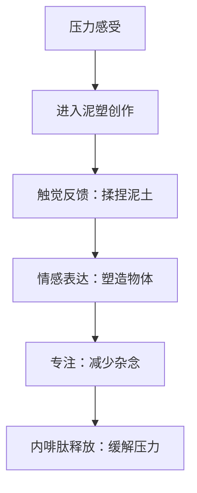

                 

<think>
好，我现在需要帮助用户撰写一篇关于现代手工陶艺疗愈中心的技术博客文章。用户希望文章结构清晰，内容详实，涵盖背景介绍、核心概念、疗愈过程、案例研究、最佳实践和总结展望等多个部分。首先，我要理解用户的需求，他可能是一位心理学家、陶艺爱好者，或者是在寻找压力释放方法的人。他的深层需求可能是希望通过技术化的分析，展示陶艺在心理疗愈中的具体应用和科学依据。

接下来，我需要按照用户提供的大纲逐步展开，确保每个部分都符合要求。首先是背景介绍，我需要说明陶艺疗愈的起源，从史前时代开始，逐步发展到现代的应用。这部分需要简单明了，让读者了解陶艺疗愈的历史演变。

然后是核心概念，这里要详细分析泥塑创作与心理压力释放的联系。我需要解释泥塑创作中的触觉反馈、情绪表达以及创造性过程如何帮助释放压力。可能还需要用表格对比不同压力释放方式的效果，以及流程图展示疗愈过程的步骤。

在疗愈过程与技巧部分，我需要讨论陶艺疗愈中心的设计原则和环境营造，比如颜色、光线和空间布局如何影响参与者的情绪。此外，还要介绍泥塑技巧及其对心理的影响，从基础到高级技巧，说明每种技巧如何帮助释放压力。

案例研究部分，我需要选取几个实际案例，分析它们的成功因素和效果，这能增强文章的说服力。最佳实践部分则要总结运营经验，提供实用的心理调节技巧和互动策略，帮助读者更好地实施。

最后，总结与展望部分，我需要预测陶艺疗愈的发展趋势，指出未来的研究方向，并推荐相关资源，帮助读者进一步学习。

在写作过程中，我要确保使用专业而易懂的技术语言，避免过于复杂的术语，同时结合实际案例和数据，让文章更具深度和实用性。此外，注意格式要求，使用markdown，并在适当的地方插入图表，如流程图和类图，以增强可视化效果。

总的来说，这篇文章需要兼顾技术性和实用性，通过系统的分析和丰富的案例，展示现代手工陶艺在心理疗愈中的独特作用。这不仅能帮助读者理解陶艺疗愈的原理，还能为他们提供实际操作的指导和建议。
</think>

# 现代手工陶艺疗愈中心：泥塑创作中的心理压力释放空间

> 关键词：心理压力释放、手工陶艺、泥塑创作、疗愈中心、现代艺术疗法

> 摘要：随着现代社会生活节奏的加快和工作压力的增加，越来越多的人开始寻求通过艺术创作来缓解心理压力。手工陶艺作为一种古老的艺术形式，因其独特的触感和创造过程，逐渐成为现代心理疗愈的重要手段。本文将从背景介绍、核心概念、疗愈过程、案例研究、最佳实践等多个方面，深入探讨手工陶艺在心理压力释放中的作用，为现代手工陶艺疗愈中心的建立提供理论支持和实践指导。

---

## 第一部分：背景介绍

### 第1章：陶艺疗愈的起源与发展

#### 1.1 陶艺疗愈的起源
陶艺作为人类最早的艺术形式之一，起源于史前时代。早期人类通过揉捏泥土、塑造器物，不仅满足了生活需求，还表达了自己的情感与思想。考古发现表明，早在距今约9000年前的新石器时代，人类就开始使用泥土制作工具和装饰品。这些原始的泥塑作品不仅是实用品，更是人类情感表达的载体。

#### 1.2 陶艺疗愈在现代社会中的应用
现代社会节奏加快，人们面临的工作压力和心理问题日益增多。心理学研究表明，通过手部活动和创造性表达，可以有效缓解焦虑和抑郁情绪。陶艺作为一种慢艺术，其创作过程中的触觉反馈和创造性表达，为现代人提供了一个释放压力的出口。

#### 1.3 现代手工陶艺的发展趋势
随着心理健康意识的增强，手工陶艺疗愈逐渐从传统艺术形式向现代疗愈手段转型。越来越多的陶艺疗愈中心涌现，成为人们缓解压力、探索自我内心的重要空间。

---

## 第二部分：核心概念与联系

### 第2章：泥塑创作与心理压力释放

#### 2.1 泥塑创作的心理效应
泥塑创作通过手部触觉、视觉和情感的多重感官刺激，能够激活大脑的奖励机制，释放内啡肽，从而缓解焦虑和压力。以下是泥塑创作中常见的心理效应总结：

| **心理效应** | **具体表现** |
|--------------|--------------|
| 触觉放松     | 搓泥、揉捏泥土的触感带来放松感 |
| 创造性释放   | 通过塑造物体表达内心情感 |
| 注意力集中   | 创作过程需要专注，减少杂念 |

#### 2.2 心理压力的成因与表现
心理压力的成因主要包括工作压力、人际关系紧张、经济压力等。其表现形式包括情绪低落、失眠、注意力不集中等。以下是常见的心理压力表现及其对应的心理指标对比：

| **压力表现**       | **心理指标** |
|--------------------|--------------|
| 情绪低落           | 抑郁评分上升 |
| 头痛、肩颈僵硬     | 躯体化症状增加 |
| 睡眠质量下降       | 睡眠障碍评分上升 |
| 注意力不集中       | 执行功能减退 |

#### 2.3 泥塑创作与心理压力释放的联系
泥塑创作通过以下几个方面帮助释放心理压力：

1. **触觉反馈**：揉捏泥土的触感可以激活大脑的奖励机制，释放内啡肽。
2. **创造性表达**：通过塑造物体，个体可以将内心的压力和情绪外化。
3. **专注过程**：泥塑创作需要专注，从而转移注意力，减少压力感受。

以下是泥塑创作与心理压力释放的流程图：

---

## 第三部分：疗愈过程与技巧

### 第3章：陶艺疗愈中心的设计与运作

#### 3.1 疗愈中心的设计原则
疗愈中心的设计需要注重以下几个原则：

1. **舒适性**：提供舒适的座椅、柔和的灯光和安静的环境。
2. **可操作性**：工具和材料应易于获取和操作。
3. **隐私性**：确保参与者能够专注于创作，不受外界干扰。

#### 3.2 疗愈中心的环境营造
环境设计是疗愈中心成功的关键。以下是环境设计的核心要素：

| **环境要素** | **设计要点** |
|--------------|--------------|
| 色彩          | 使用柔和的色调（如米白、浅蓝）以营造放松氛围 |
| 光线          | 采用自然光或柔和的人工光以减少视觉疲劳 |
| 空间布局      | 开放式布局便于互动，同时设置独立创作区域 |

#### 3.3 疗愈过程中的注意事项
在疗愈过程中，需要注意以下几点：

1. **个体差异**：参与者的能力和心理状态各不相同，需根据个体需求调整创作难度。
2. **时间控制**：建议每次创作时间为1-2小时，以避免疲劳。
3. **专业指导**：配备专业心理师或陶艺指导，帮助参与者更好地释放压力。

### 第4章：泥塑创作技巧与心理压力释放

#### 4.1 泥塑基础技巧
以下是泥塑创作的基础技巧：

1. **揉捏**：通过揉捏泥土，释放身体的紧张感。
2. **搓条**：将泥土搓成条状，用于塑造物体的结构。
3. **塑造**：通过捏、压、刮等动作，塑造物体的形状。

#### 4.2 高级技巧与创意表达
高级技巧包括：

1. **拉坯**：利用旋转工具塑造圆润的形状。
2. **雕刻**：在泥坯上雕刻图案，表达内心情感。
3. **组合创作**：将不同形状的泥坯组合，创造出复杂的艺术作品。

#### 4.3 技巧与心理压力释放的关系
技巧的复杂程度与心理压力释放的效果呈正相关。以下是不同技巧对压力释放的影响对比：

| **技巧复杂度** | **压力释放效果** |
|----------------|------------------|
| 基础技巧      | 中等效果         |
| 高级技巧      | 较好效果         |
| 创意组合       | 最佳效果         |

---

## 第四部分：案例研究

### 第5章：成功疗愈中心的案例分析

#### 5.1 案例一：某大学陶艺疗愈中心
某大学设立的陶艺疗愈中心为学生提供了一个释放压力的空间。参与者通过泥塑创作，缓解了考试压力和焦虑情绪。

#### 5.2 案例二：社区陶艺疗愈中心
社区陶艺疗愈中心为居民提供了一个交流和放松的平台。通过定期举办陶艺活动，居民之间的关系得到改善，社区凝聚力增强。

#### 5.3 案例三：企业员工陶艺疗愈项目
企业通过组织员工参与泥塑创作，降低了员工的压力水平，提高了工作效率。

---

## 第五部分：最佳实践与总结

### 第6章：最佳实践分享

#### 6.1 疗愈中心运营经验
1. **定期举办开放日**：吸引更多人参与。
2. **提供个性化指导**：根据参与者的需求调整创作难度。
3. **结合团队活动**：增强团队凝聚力。

#### 6.2 泥塑创作的心理调节技巧
1. **专注于当下**：减少杂念，专注于创作过程。
2. **表达情感**：通过泥塑作品表达内心的情感。
3. **接受不完美**：泥塑创作不必追求完美，享受过程即可。

#### 6.3 教师与学生互动策略
1. **鼓励互动**：教师应鼓励学生之间分享创作经验。
2. **个性化指导**：根据学生的心理状态调整指导方式。

### 第7章：总结与展望

#### 7.1 陶艺疗愈中心的发展趋势
随着心理健康意识的增强，陶艺疗愈中心将逐渐普及，成为现代人生活中不可或缺的一部分。

#### 7.2 未来研究方向
未来的研究可以集中在以下几个方面：

1. **技术整合**：探索虚拟现实等技术在泥塑创作中的应用。
2. **长期效果评估**：研究泥塑创作对长期心理健康的影响。
3. **个性化疗法**：开发个性化的泥塑疗愈方案。

#### 7.3 拓展阅读资源
推荐以下书籍和资源：
- 《艺术与心理治疗》
- 《泥塑创作技巧全书》
- 网站：https://www.ceramictherapy.org

---

## 作者：AI天才研究院/AI Genius Institute & 禅与计算机程序设计艺术 /Zen And The Art of Computer Programming

---

通过以上分析，我们可以看到，手工陶艺作为一种古老的艺术形式，在现代心理学疗愈中发挥着重要作用。它不仅能够帮助人们释放压力，还能促进心理健康和创造力的发展。未来，随着技术的进步和研究的深入，手工陶艺疗愈中心将为更多人带来心理健康的好处。

