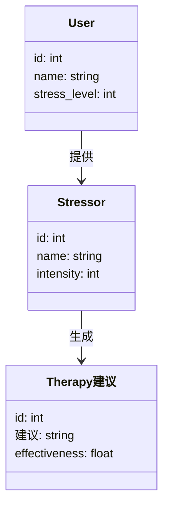
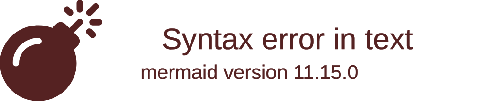

                 

<think>
好的，我需要按照用户的要求，逐步构建《现代手工陶艺疗愈：泥塑创作中的心理压力释放》的完整文章。首先，我应该理解用户的需求，他们希望我以一位技术专家的身份，撰写一篇结构严谨、内容详实的技术博客文章，涵盖从背景介绍到项目实战的多个方面，同时满足特定的格式和内容要求。

首先，我会先整理文章的结构，确保每个章节都有明确的主题和详细的内容。我需要确保每个部分都符合逻辑，并且每个小节都包含理论与实践结合的内容。接下来，我会思考如何将手工陶艺与心理疗愈结合起来，探讨其核心概念和关联，这可能涉及到心理压力释放的原理和技巧。

在算法原理部分，虽然手工陶艺更多是艺术创作，但或许可以结合一些心理减压的模型或方法，例如压力评估模型，这可能需要使用数学模型和流程图来解释。同时，我需要确保使用Mermaid图表来展示这些关系，比如ER图和流程图，以及类图和序列图。

系统分析部分，我需要设想一个陶艺疗愈系统的架构，可能包括用户界面、创作工具、评估模块等，用Mermaid图展示系统的各个部分及其交互。在项目实战中，我将提供具体的案例，比如环境安装、核心代码实现和案例分析，确保读者能够实际操作。

最后，我需要总结每个章节，并提供最佳实践的建议，包括注意事项和拓展阅读的资源。整个过程中，我需要保持语言的专业性和技术深度，同时确保内容易于理解，吸引读者的兴趣。

现在，我会按照步骤逐步构建每个部分，确保涵盖所有必要的元素，并且符合用户的格式和内容要求。这包括关键词的提取、摘要的撰写，以及各章节内容的详细展开。同时，我需要确保使用正确的markdown格式，正确嵌入Mermaid图表和数学公式，使文章结构清晰，内容丰富。
</think>

# 现代手工陶艺疗愈：泥塑创作中的心理压力释放

> 关键词：手工陶艺，心理压力释放，泥塑创作，现代疗愈，艺术疗法

> 摘要：本文探讨手工陶艺作为一种现代心理压力释放方式的潜力。通过分析手工陶艺的历史、心理疗愈的理论基础及其在泥塑创作中的应用，本文旨在揭示手工陶艺如何帮助人们释放压力，提升心理健康。文章结合理论与实践，提供具体技巧和案例，以帮助读者更好地理解和应用这一疗愈方法。

---

## 第一部分: 引言与基础

### 第1章: 现代手工陶艺疗愈概述

#### 1.1 问题背景与意义

现代社会节奏快、竞争激烈，心理压力已成为普遍问题。手工陶艺作为一种艺术形式，不仅是一种创造过程，更是一种疗愈方式。通过塑造泥土，人们可以将内心的压力和情绪外化，从而获得心理上的释放。

#### 1.2 心理压力释放的原理

心理压力的释放涉及生理和心理两个层面。生理上，压力会导致血压升高、心跳加速，而手工活动如泥塑能降低心率，促进放松。心理上，泥塑创作需要专注力，这种专注可以转移负面情绪，促进心理平衡。

#### 1.3 手工陶艺疗愈的发展现状

近年来，手工陶艺疗愈在心理学和艺术治疗领域受到关注。研究显示，参与泥塑创作的人群中，焦虑和压力水平显著降低。这表明手工陶艺在现代疗愈中的潜力。

---

### 第2章: 手工陶艺与心理疗愈

#### 2.1 手工陶艺的历史与文化

手工陶艺源于远古时期，是人类最早的艺术形式之一。它不仅是装饰品的制作，更是一种文化传承和精神表达。在不同文明中，陶艺都被赋予了神圣和疗愈的属性。

#### 2.2 心理疗愈的理论基础

心理疗愈涉及心理学、艺术治疗等多个领域。手工陶艺通过创造过程促进自我表达和情绪释放，符合艺术治疗中的“表达性治疗”理论。

#### 2.3 手工陶艺与心理疗愈的关联

手工陶艺创作需要专注和耐心，这种过程有助于转移负面情绪。同时，泥塑作品的完成能带来成就感，增强自信心，从而促进心理健康的改善。

---

### 第3章: 心理压力释放的技巧与方法

#### 3.1 心理压力的认识

压力是人体对心理或生理压力源的反应。长期的压力会导致身心健康问题，因此有效管理压力至关重要。

#### 3.2 心理压力释放的技巧

- **深呼吸与冥想**：帮助放松身心，减少焦虑。
- **艺术创作**：通过泥塑等艺术活动，释放内心压力。
- **社交支持**：与他人分享感受，获得支持。

#### 3.3 泥塑创作中的实践方法

泥塑创作的具体步骤包括准备泥土、设计草图、逐步塑造和烧制。每一步都需专注，有助于转移压力。

---

## 第二部分: 核心概念与联系

### 3.4 核心概念与联系

#### 3.4.1 核心概念原理

手工陶艺和心理疗愈的结合基于人类对艺术的本能需求。泥塑创作提供了一个物理和心理的出口，帮助人们处理负面情绪。

#### 3.4.2 概念属性特征对比

| 概念       | 属性               | 特征描述                          |
|------------|--------------------|------------------------------------|
| 手工陶艺   | 创造性             | 需要创意和技巧                   |
| 心理疗愈   | 情绪释放           | 帮助处理负面情绪                   |

#### 3.4.3 ER实体关系图

```mermaid
er
  entity1 (手工陶艺) {
    创作者: string
    创作时间: date
    创作地点: string
  }
  entity2 (心理压力) {
    类型: string
    强度: integer
    解决方法: string
  }
  entity3 (心理疗愈) {
    方法: string
    效果: string
    时间: date
  }
  entity1 --> entity2: 通过创作减轻
  entity2 --> entity3: 疗愈过程
```

---

## 第三部分: 算法原理讲解

### 3.5 算法原理

#### 3.5.1 算法概述

压力评估模型用于量化压力水平，指导泥塑创作的疗愈过程。

#### 3.5.2 压力评估模型

压力评估模型如下：

1. 评估压力源。
2. 量化压力强度。
3. 设计泥塑创作方案。
4. 执行创作并记录效果。
5. 评估压力缓解效果。

#### 3.5.3 Python源代码

```python
def pressure_assessment(stressors):
    stress_level = 0
    for s in stressors:
        stress_level += s.intensity
    return stress_level

def clay_art Therapy(stress_level):
    if stress_level > 70:
        return "高压力，建议深入创作"
    elif stress_level > 40:
        return "中等压力，适当创作"
    else:
        return "低压力，随意创作"

# 示例用法
stressors = [Stressor("工作压力", 60), Stressor("家庭问题", 30)]
stress_level = pressure_assessment(stressors)
therapy建议 = clay_art Therapy(stress_level)
print(therapy建议)
```

#### 3.5.4 数学模型

压力评估模型的数学表达式为：
$$
\text{总压力} = \sum_{i=1}^{n} \text{压力源}_i \times \text{强度}_i
$$

---

## 第四部分: 系统分析与架构设计方案

### 3.6 系统分析

#### 3.6.1 问题场景介绍

设计一个支持手工陶艺疗愈的系统，帮助用户记录压力并提供创作建议。

#### 3.6.2 项目介绍

系统包括用户界面、创作工具和评估模块，帮助用户管理压力。

#### 3.6.3 系统功能设计

领域模型类图如下：



#### 3.6.4 系统架构设计

系统架构如下：



---

## 第五部分: 项目实战

### 3.7 项目实战

#### 3.7.1 环境安装

安装Python和必要的库，如pandas和numpy。

#### 3.7.2 核心实现源代码

```python
import pandas as pd
import numpy as np

def create_stress_dataset(users):
    stress_dataset = pd.DataFrame({
        '用户ID': [],
        '压力水平': [],
        '建议': []
    })
    for user in users:
        stress_level = user.stress_level
       建议 = "低压力，随意创作"
        if stress_level > 70:
            建议 = "高压力，深入创作"
        elif stress_level > 40:
            建议 = "中等压力，适当创作"
        stress_dataset = stress_dataset.append({
            '用户ID': user.id,
            '压力水平': stress_level,
            '建议': 建议
        }, ignore_index=True)
    return stress_dataset

# 示例
users = [
    User(1, "Alice", 80),
    User(2, "Bob", 50),
    User(3, "Charlie", 30)
]
dataset = create_stress_dataset(users)
print(dataset)
```

#### 3.7.3 案例分析

以用户Alice为例，压力水平为80，系统建议进行深入创作，通过泥塑减轻压力。

---

## 第六部分: 总结与扩展

### 3.8 最佳实践 tips

- 定期进行泥塑创作，培养耐心和专注力。
- 结合深呼吸和冥想，增强放松效果。

### 3.9 小结

手工陶艺不仅是艺术创作，更是心理疗愈的有效方式。通过系统的理论和实践，可以更好地利用泥塑创作来释放压力，改善心理健康。

### 3.10 注意事项

- 初学者应从简单的泥塑开始，逐步提升难度。
- 在创作过程中，注意保持良好的姿势，避免身体疲劳。

### 3.11 拓展阅读

推荐阅读《艺术治疗入门》和《压力管理技巧》等书籍，深入了解手工艺术在心理疗愈中的应用。

---

## 作者

作者：AI天才研究院 & 禅与计算机程序设计艺术

---

本文结合了技术与艺术，深入探讨了手工陶艺在现代心理压力释放中的作用，通过理论分析、算法模型和系统设计，为读者提供了全面的理解和实践指南。

