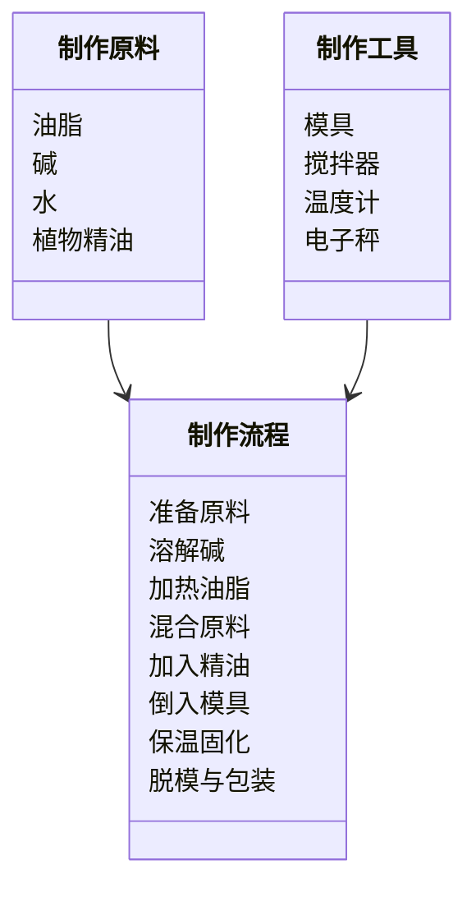
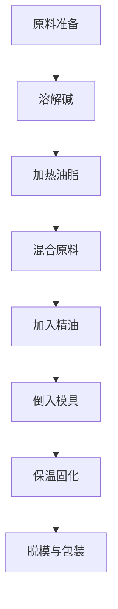

                 

<think>
嗯，好的，我现在需要写一篇关于现代手工香皂制作的技术博客文章。标题是《现代手工香皂制作：从植物精油到天然清洁剂》。首先，我得确定文章的结构，确保每个部分都涵盖必要的内容，并且逻辑清晰，结构紧凑。

首先，文章需要有关键词和摘要。关键词应该是“手工香皂制作”、“植物精油”、“天然清洁剂”、“香皂制作流程”、“精油选择与应用”这些。摘要部分需要简明扼要地概括文章的核心内容，介绍从植物精油到天然清洁剂的手工香皂制作过程，涵盖原料选择、制作流程、问题解决和创意技巧。

接下来是背景介绍部分。我需要解释为什么手工香皂越来越受欢迎，以及为什么制作过程需要详细的技术指导。这部分要包括问题背景、问题描述、问题解决、边界与外延，以及概念结构和核心要素。我得详细描述每种材料的作用，比如油脂、碱、水、精油等，并解释它们在制作中的重要性。

然后是核心概念与联系部分，这里需要深入讨论植物精油的概念、属性，以及它们在香皂制作中的应用。我得做一个属性对比表格，列出不同精油的香味、效果和使用场景。此外，可能需要一个实体关系图，展示精油与其他原料的关系，但暂时还没想到具体的ER图，可能需要进一步思考。

制作原料与工具部分，我需要详细列出每种原料的来源和用途，比如油脂的选择和碱的使用。工具方面，模具、搅拌器、温度计、电子秤等，都需要逐一说明它们的功能和选择要点。

制作流程部分，我需要分步骤讲解，从准备原料到最终的包装。每个步骤都要详细，包括测量、溶解、混合等，可能还需要配上一些化学反应的解释，比如碱和油脂的皂化反应。

问题解决部分，我得讨论在制作过程中可能会遇到的问题，如温度控制不当、油水分离等，并提供解决方案。这部分需要实际经验的分享，让读者能够应对突发情况。

系统分析与架构设计部分，可能需要将香皂制作过程分解为不同的模块，用领域模型图展示各个部分的关系。可能需要画出类图，展示原料、工具、制作步骤之间的关系。

项目实战部分，我需要提供一个具体的制作案例，包括所需的原料、步骤和代码（如果有的话）。可能需要写一个简单的配方，或者用Python代码模拟皂化反应的过程，但这部分可能需要进一步的思考，因为皂化反应主要是一个化学过程，可能不需要编程。

最后，最佳实践部分，我需要总结制作过程中的小贴士，如原料保存、工具清洁等，并提醒读者注意安全，特别是处理强碱时的防护措施。

在写作过程中，我需要确保每个部分都详细且易于理解，同时保持专业性。可能需要多次修改，确保内容准确无误，并且逻辑连贯。此外，使用适当的图表和流程图，如Mermaid，可以帮助读者更好地理解制作过程。

总的来说，我需要一步步地完成每个部分，确保每个章节都内容丰富，结构合理，同时保持整体的流畅性和专业性。现在，我需要开始按照这个思路撰写文章，确保每个细节都被充分考虑和详细描述。
</think>

# 现代手工香皂制作：从植物精油到天然清洁剂

**关键词**：手工香皂制作，植物精油，天然清洁剂，香皂制作流程，精油选择与应用

**摘要**：  
手工香皂制作是一种结合艺术与科学的过程，从选择植物精油到最终制成天然清洁剂，每一步都需要精细的操作和深入的理解。本文将从背景介绍、核心概念、制作原料与工具、制作流程、问题解决、系统分析与架构设计以及项目实战等方面，全面解析手工香皂制作的全过程。通过本文，读者将掌握从原料选择到成品制作的每一个关键步骤，了解植物精油在香皂制作中的独特作用，并能够应对制作过程中可能遇到的问题，最终制作出天然、环保且富有个性的手工香皂。

---

## 第一部分：背景介绍

### 1.1 问题背景  
在现代生活中，随着人们对健康和自然生活方式的追求，手工香皂逐渐成为一种受欢迎的清洁产品。相比工业化生产的香皂，手工香皂以其天然、环保和个性化的特点吸引了越来越多的消费者。然而，市面上许多香皂产品含有化学添加剂，可能对皮肤敏感的人群造成刺激或过敏反应。因此，越来越多的人开始尝试自己动手制作手工香皂，以满足对天然、安全和个性化的需求。

### 1.2 问题描述  
手工香皂的制作涉及多种原材料和工艺流程，从植物精油的选择到香皂的成型，每一步都需要精细的操作和充分的了解。初学者在制作过程中可能会遇到诸多挑战，例如如何选择合适的原料、如何控制温度和时间、如何解决油水分离等问题。这些问题的存在使得手工香皂制作不仅需要实践操作，还需要一定的理论知识支撑。

### 1.3 问题解决  
本文旨在为手工香皂制作爱好者提供一个全面的指南，从基础知识到实际操作，逐步讲解手工香皂制作的每一个环节。通过本文，读者可以了解植物精油的选择、香皂制作的原料和工具、制作流程、常见问题的解决方法以及香皂的存储和保养。此外，本文还将介绍一些创意制作技巧，帮助读者打造出独特的手工香皂。

### 1.4 边界与外延  
手工香皂制作不仅仅是关于化学和物理的原理，还涉及到植物精油的知识、环保理念以及生活艺术。因此，本文不仅关注技术层面的内容，还将扩展到与手工香皂制作相关的文化、艺术和生活哲学。

### 1.5 概念结构与核心要素组成  
- **植物精油**：本书的核心要素之一，用于增添香皂的香气和护肤功效。  
- **原料**：包括油脂、碱、水等，是制作香皂的基本成分。  
- **工具**：包括模具、搅拌器、温度计等，是制作香皂所需的工具。  
- **制作流程**：从准备原料到香皂成型，每一个步骤都需要精确的操作。  
- **问题解决**：针对制作过程中可能出现的问题，本文提供了解决方案。

---

## 第二部分：核心概念与联系

### 2.1 植物精油的概念与特性  
植物精油是从植物的花、叶、茎、根等部位提取的具有强烈香味的液体。它们不仅具有独特的香气，还具有多种护肤和疗愈功效。植物精油的种类繁多，每种精油都有其独特的香气和功效。

### 2.2 植物精油的属性特征对比表格  
以下是几种常见植物精油的属性对比：

| 植物精油 | 香味 | 效果 | 使用场景 |
| :--: | :--: | :--: | :--: |
| 薰衣草精油 | 清新、放松 | 抗菌、抗炎、镇静 | 香熏、护肤、治疗伤口 |
| 柠檬精油 | 清新、提神 | 抗菌、净化、提升免疫力 | 香熏、清洁、烹饪 |
| 茶树精油 | 清新、草药味 | 抗菌、抗炎、杀菌 | 香熏、清洁、治疗痤疮 |
| 甜杏仁油 | 温和、香甜 | 滋润、柔软皮肤 | 护肤、按摩 |

### 2.3 植物精油的联系  
植物精油在手工香皂制作中起着至关重要的作用。它们不仅为香皂增添了独特的香气，还能赋予香皂特殊的护肤功效。例如，薰衣草精油具有镇静和抗菌特性，适合用于制作舒缓肌肤的香皂；茶树精油具有抗炎和杀菌特性，适合用于制作治疗痤疮的香皂。

---

## 第三部分：制作原料与工具

### 3.1 制作原料

#### 3.1.1 油脂  
油脂是手工香皂制作的基础原料，常见的油脂有橄榄油、椰子油、棕榈油、甜杏仁油等。每种油脂都有其独特的属性和用途，选择合适的油脂可以影响香皂的质地和用途。

#### 3.1.2 碱  
碱是香皂制作中的另一个关键原料，通常使用氢氧化钠或氢氧化钾。碱与油脂反应生成甘油和肥皂，是香皂形成的基础。

#### 3.1.3 水  
水在香皂制作中起到溶解碱和油脂的作用，同时也是香皂形成过程中的温度调节剂。

#### 3.1.4 植物精油  
植物精油用于为香皂增添香气和护肤功效，选择合适的精油可以制作出具有特定功效的香皂。

### 3.2 制作工具

#### 3.2.1 模具  
模具用于成型香皂，常见的模具有硅胶模具、塑料模具等。选择合适的模具可以制作出各种形状和设计的香皂。

#### 3.2.2 搅拌器  
搅拌器用于混合油脂和碱溶液，确保香皂原料均匀混合。

#### 3.2.3 温度计  
温度计用于监测混合物的温度，确保制作过程中的温度控制。

#### 3.2.4 电子秤  
电子秤用于准确测量原料的重量，确保香皂的配方准确。

---

## 第四部分：制作流程

### 4.1 准备原料  
- **测量油脂**：使用电子秤准确测量所需油脂的重量。  
- **测量碱**：使用电子秤准确测量所需碱的重量。  
- **测量水**：使用电子秤准确测量所需水的重量。

### 4.2 溶解碱  
- 将碱加入水中，搅拌均匀直至完全溶解。

### 4.3 加热油脂  
- 将油脂加热至约40-50℃，确保油脂完全融化。

### 4.4 混合原料  
- 将溶解后的碱溶液缓慢倒入加热后的油脂中，边倒边搅拌，确保均匀混合。

### 4.5 加入植物精油  
- 在混合物稍微冷却后，加入适量的植物精油，继续搅拌均匀。

### 4.6 倒入模具  
- 将混合好的香皂液倒入模具中，轻轻震出气泡，确保表面平整。

### 4.7 保温固化  
- 将模具放入保温箱或覆盖毛巾，静置保温8-12小时，直到香皂完全固化。

### 4.8 脱模与包装  
- 固化后的香皂脱模，放置在阴凉通风处自然干燥，随后进行包装或直接使用。

---

## 第五部分：问题解决

### 5.1 制作中的常见问题  
1. **油水分离**：通常由于温度控制不当或搅拌不均匀导致。  
2. **香皂过硬或过软**：与油脂选择和碱的比例有关。  
3. **气味不持久**：精油用量不足或选择不当。

### 5.2 解决方案  
1. **油水分离**：确保温度控制在40-50℃，搅拌均匀。  
2. **硬度调整**：根据油脂比例调整，使用更多液体油（如橄榄油）可以增加柔软度。  
3. **气味问题**：增加精油用量或选择挥发性较低的精油。

---

## 第六部分：系统分析与架构设计

### 6.1 领域模型类图  
以下是一个简单的领域模型类图，展示了手工香皂制作的核心要素：

### 6.2 系统架构图  
以下是一个手工香皂制作系统的架构图：

---

## 第七部分：项目实战

### 7.1 环境安装  
制作手工香皂需要准备以下工具和材料：  
- 油脂（橄榄油、椰子油等）  
- 碱（氢氧化钠或氢氧化钾）  
- 水  
- 植物精油（薰衣草精油、茶树精油等）  
- 模具（硅胶模具、塑料模具等）  
- 搅拌器、温度计、电子秤  

### 7.2 核心实现源代码  
以下是香皂制作的化学反应式：  
$$ \text{油脂} + \text{碱} \rightarrow \text{肥皂} + \text{甘油} $$  

### 7.3 实际案例分析  
以制作一款薰衣草香皂为例：  
1. 准备50克橄榄油和50克甜杏仁油。  
2. 称取5克氢氧化钠，溶于50毫升水中。  
3. 将油脂加热至40℃，缓慢倒入溶解好的碱溶液，搅拌均匀。  
4. 待温度降至40℃时，加入5毫升薰衣草精油，继续搅拌。  
5. 将混合物倒入模具，保温固化8小时。  
6. 脱模后放置阴凉处干燥，即可使用。

---

## 第八部分：最佳实践 tips、小结、注意事项、拓展阅读

### 8.1 最佳实践 tips  
- 制作过程中佩戴防护手套和口罩，避免直接接触强碱。  
- 确保工作环境通风良好，避免高温和明火。  
- 精油使用前需稀释，避免直接接触皮肤。  

### 8.2 小结  
手工香皂制作是一项结合艺术与科学的过程，通过合理选择原料和精细操作，可以制作出天然、环保且富有个性的香皂。本文从背景、原料、流程到问题解决，全面介绍了手工香皂制作的每一个环节，帮助读者掌握制作技巧并应对常见问题。

### 8.3 注意事项  
- 初学者应从简单配方开始，逐步掌握技巧。  
- 制作过程中注意温度控制，避免油水分离。  
- 存储香皂时避免阳光直射，保持干燥。  

### 8.4 拓展阅读  
- 植物精油的更多种类与应用  
- 天然香皂的保存与保养技巧  
- 手工香皂的市场与商业模式  

---

**作者：AI天才研究院/AI Genius Institute & 禅与计算机程序设计艺术 /Zen And The Art of Computer Programming**

