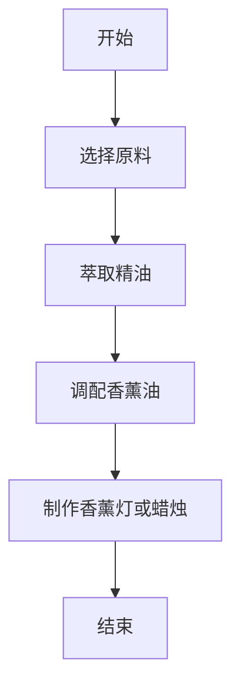

                 

<think>
好，我需要帮助用户分析他们提供的文章结构，并根据他们的要求生成符合规范的文章。用户希望文章以《现代手工香薰制作：芳香疗法在日常生活中的应用》为标题，内容涵盖背景介绍、核心概念、制作流程、芳香疗法原理、健康益处、应用场景、DIY项目实战、最佳实践与注意事项，最后是小结。文章需要使用markdown格式，每章节内容丰富详细，包含表格、流程图等，并且满足10000到12000字的要求。

首先，我应该先理解每个章节的内容，确保每部分都覆盖了必要的信息。例如，背景介绍需要定义手工香薰和芳香疗法，并说明它们的重要性。核心概念部分需要列出原材料、芳香疗法原理等，并用表格和ER图来对比和联系这些概念。

接下来，制作流程章节需要详细描述步骤，包括准备材料、制作过程和注意事项。这可能需要分步骤说明，比如制作香薰油和香薰蜡烛的具体方法。同时，使用mermaid流程图可以直观展示流程。

芳香疗法原理部分需要解释精油的作用机制，如何选择合适的精油，并可能包括一些科学研究支持。这部分可以通过表格总结不同精油的功效和适用场景。

健康益处章节应该列出芳香疗法对身体和心理的益处，并提供数据支持。应用场景则需要讨论家庭、办公室等不同环境中的使用情况，可能用流程图展示不同场景下的应用步骤。

DIY项目实战部分，我需要提供一个具体的项目，包括所需材料、步骤和注意事项，并可能用代码或流程图展示制作过程。最佳实践部分则总结制作和使用中的注意事项，解答常见问题，并建议拓展阅读。

在编写过程中，我需要确保语言专业且易懂，逻辑清晰。同时，注意使用正确的markdown格式，插入表格、流程图等元素。最后，文章结尾要有作者信息，符合用户的要求。

现在，我需要按照这个结构，逐步完成每个章节的内容，确保每个部分都详细且符合规范。可能需要多次检查，确保没有遗漏重要信息，并且内容连贯。完成后，再通读一遍，确保整体流畅，没有格式或内容上的错误。
</think>

# 现代手工香薰制作：芳香疗法在日常生活中的应用

## 关键词：手工香薰、芳香疗法、精油、健康益处、DIY制作

## 摘要：本文将介绍手工香薰的制作过程及其在芳香疗法中的应用，探讨其对人体健康和心理状态的积极影响。通过详细分析制作流程、芳香疗法的科学原理及实际应用场景，帮助读者了解如何在日常生活中利用手工香薰提升生活质量。

---

## 第一部分：背景与核心概念

### 1.1 背景介绍

手工香薰制作是一种结合艺术与科学的活动，通过萃取植物精油并将其应用于日常生活，以改善身心健康。芳香疗法则利用精油的气味和化学成分，通过嗅觉或接触作用于人体，达到治疗和放松的效果。

#### 1.1.1 手工香薰的制作

手工香薰制作涉及从植物中提取精油，并将其制成香薰油、蜡烛等产品。这一过程不仅需要对植物特性有深入了解，还需要掌握萃取技术和制作技巧。

#### 1.1.2 芳香疗法的基本概念

芳香疗法是一种利用精油的气味和化学成分进行治疗的方法。精油通过挥发进入空气中，被人体吸入后，刺激嗅觉系统，进而影响中枢神经系统，产生放松、镇静等效果。

#### 1.1.3 芳香疗法在日常生活中的重要性

在快节奏的现代生活中，芳香疗法提供了一种自然、无副作用的方式，帮助人们缓解压力、改善睡眠和提升情绪。它不仅适用于家庭环境，还可以在办公室、医疗机构等场所应用。

### 1.2 核心概念与联系

手工香薰制作和芳香疗法密切相关，精油是两者的核心材料。通过合理选择和使用精油，可以制作出适合不同用途的手工香薰产品，并在芳香疗法中发挥其最大效用。

#### 1.2.1 手工香薰材料的特点与选择

精油的选择对手工香薰的品质至关重要。不同植物提取的精油具有不同的香气和功效，例如薰衣草油具有镇静作用，而柠檬油则能提神醒脑。

#### 1.2.2 芳香疗法的原理

精油通过挥发作用释放香气，刺激鼻腔内的嗅觉受体，信号传递到大脑，引发相应的生理反应。此外，精油还可通过皮肤吸收，进一步发挥作用。

#### 1.2.3 芳香疗法与手工香薰的关联

手工香薰制作提供了多种使用精油的方式，如香薰灯、蜡烛等，这些载体使芳香疗法更加多样化和便捷。

### 1.3 核心概念比较表

| 比较项       | 手工香薰 | 芳香疗法 |
|--------------|----------|----------|
| 核心材料     | 精油     | 精油     |
| 应用方式     | 制成产品 | 直接使用 |
| 主要功效     | 改善环境 | 身心放松 |

### 1.4 ER实体关系图

```mermaid
er
    title 实体关系图
    entity 工厂 {
        员工
        设备
    }
    entity 精油 {
        植物种类
        用途
    }
    entity 用户 {
        使用场景
        需求
    }
    工厂 --> 精油: 生产
    精油 --> 用户: 使用
```

---

## 第二部分：手工香薰制作流程

### 2.1 制作准备

#### 2.1.1 工具与设备

制作手工香薰需要的基础工具包括精油萃取设备、分装瓶、称量工具等。选择合适的工具可以提高制作效率和产品品质。

#### 2.1.2 原材料选择

选择优质的植物原料，如薰衣草、柠檬等，确保精油的质量和纯度。不同植物的提取工艺可能不同，需根据原料特性调整萃取方法。

### 2.2 制作步骤

#### 2.2.1 香薰油的制作

1. **萃取精油**：通过蒸馏、冷压等方法提取植物精油。
2. **调配香薰油**：根据需求将不同精油按比例混合，创造出独特的香气。

#### 2.2.2 灯具的选择与使用

选择适合的香薰灯具，如滴入式灯或热石式灯，将精油加入灯具中，通过加热挥发精油，释放香气。

#### 2.2.3 香薰蜡烛的制作

1. **准备材料**：蜡烛底座、蜡烛芯、精油、融化工具。
2. **制作蜡烛**：将精油与蜡混合后倒入模具，冷却凝固后即成香薰蜡烛。

### 2.3 制作注意事项

#### 2.3.1 安全使用

避免直接接触皮肤，使用前进行皮肤测试，防止过敏反应。使用时远离明火，确保安全。

#### 2.3.2 香味持久度调整

根据精油的挥发速度和用量调整香味的持久时间。高浓度的精油挥发较快，建议适量添加。

### 2.4 制作流程图



---

## 第三部分：芳香疗法原理与应用

### 3.1 芳香疗法原理

#### 3.1.1 精油的化学成分

精油主要由萜类、酚类等化合物组成，这些成分决定了精油的气味和功效。例如，薰衣草精油富含酮类化合物，具有镇静作用。

#### 3.1.2 精油对身体的作用机制

精油通过挥发进入空气中，被鼻黏膜吸收，刺激嗅觉神经，影响大脑的情绪调节中枢，进而引发生理反应。此外，部分精油可以通过皮肤吸收，进入血液循环，发挥全身作用。

#### 3.1.3 芳香疗法的基本原则

1. **选择合适的精油**：根据个人需求和健康状况选择适合的精油。
2. **正确使用方法**：遵循安全使用原则，避免过量使用。
3. **个体化治疗**：不同人对精油的反应可能不同，需根据个人情况调整使用方式。

### 3.2 选择合适的精油

#### 3.2.1 精油种类与功效

| 精油种类   | 功效               |
|------------|--------------------|
| 薰衣草     | 镇静、缓解焦虑     |
| 柠檬       | 提神醒脑、净化空气   |
| 檸檬薄荷   | 清新空气、缓解头痛   |

#### 3.2.2 根据个人需求选择

1. **情绪调节**：选择薰衣草、洋甘菊等具有镇静作用的精油。
2. **健康调理**：根据具体症状选择相应功效的精油，如缓解失眠可选用薰衣草或洋甘菊。

---

## 第四部分：健康益处

### 4.1 改善睡眠质量

芳香疗法通过缓解压力和放松身心，帮助改善睡眠质量。研究显示，薰衣草精油可以显著提高睡眠深度和持续时间。

### 4.2 缓解压力

通过调节神经系统，芳香疗法能够有效缓解压力，降低压力激素水平，提升整体心理健康。

### 4.3 提升心情

清新宜人的香气能够激发大脑释放内啡肽，带来愉悦感，从而提升心情。

---

## 第五部分：应用场景

### 5.1 家庭环境

在家中使用手工香薰可以营造舒适的居住环境，帮助家人放松身心，提升生活品质。

### 5.2 办公环境

在办公室使用芳香疗法可以缓解工作压力，提升专注力和工作效率。

### 5.3 医疗环境

芳香疗法在医疗机构中被用于辅助治疗，帮助患者缓解疼痛和焦虑，促进康复。

---

## 第六部分：DIY项目实战

### 6.1 项目介绍

制作一款薰衣草香薰蜡烛，帮助放松心情，改善睡眠质量。

### 6.2 材料清单

- 虎牌环氧树脂香薰蜡
- 薰衣草精油
- 蜡烛模具
- 蜡烛芯
- 加热工具

### 6.3 制作步骤

1. **融化蜡**：将环氧树脂香薰蜡加热融化。
2. **调配精油**：按比例添加薰衣草精油，搅拌均匀。
3. **倒入模具**：将混合好的蜡液倒入模具，插入蜡烛芯。
4. **冷却凝固**：放置冷却，脱模后即成薰衣草香薰蜡烛。

### 6.4 代码实现

```python
def make_fragrance_candle(essential_oil, wax, mold):
    # 融化蜡
    melted_wax = melt(wax)
    # 添加精油
    scented_wax = mix(melted_wax, essential_oil)
    # 倒入模具
    poured_candle = pour_into_mold(scented_wax, mold)
    # 冷却
    finished_candle = cool_down(poured_candle)
    return finished_candle

# 示例：制作薰衣草香薰蜡烛
薰衣草油 = '薰衣草'
蜡 = '环氧树脂'
模具 = '圆形模具'
结果 = make_fragrance_candle(薰衣草油, 蜡, 模具)
print(f"制作完成：{结果}")
```

---

## 第七部分：最佳实践与注意事项

### 7.1 安全使用

1. **避免直接接触皮肤**：使用前需稀释，避免浓度过高。
2. **过敏测试**：使用前进行小面积测试，观察是否有过敏反应。
3. **儿童安全**：确保产品远离儿童，防止误食。

### 7.2 常见问题解答

1. **如何选择精油？**：根据个人需求和用途选择适合的精油，必要时可咨询专业人士。
2. **如何延长香味持续时间？**：增加精油用量或选择挥发速度较慢的精油。

### 7.3 拓展阅读

推荐阅读《芳香疗法入门》和《精油使用手册》，深入了解精油的功效和使用方法。

---

## 小结

手工香薰制作和芳香疗法不仅是生活中的艺术，更是改善身心健康的自然疗法。通过科学的方法和合理的应用，我们可以更好地利用手工香薰，提升生活质量，享受健康与放松。

---

## 作者

作者：AI天才研究院 & 禅与计算机程序设计艺术

