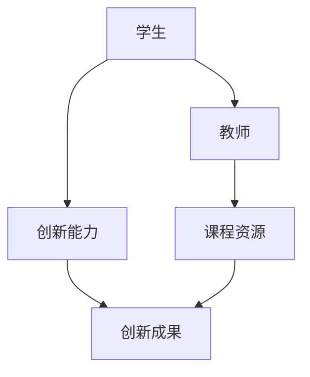
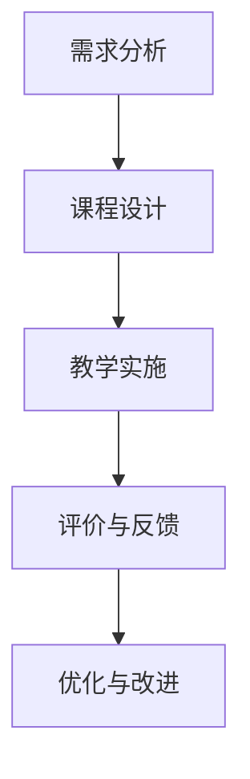

                 

<think>
好的，我现在需要帮用户写一篇关于现代教育中创造力培养的博客文章。首先，我要仔细阅读用户的请求，了解他的具体要求。

用户希望以《现代教育中的创造力培养：打破标准化教育的桎梏》为标题，写一篇结构清晰、逻辑严谨的技术博客。关键词包括教育创新、创造力、标准化教育、教育改革、教育模式。摘要部分需要简明扼要，概括文章的核心内容，即标准化教育的局限性，以及如何通过教育创新培养创造力，推动教育改革。

接下来，用户提供了详细的目录结构，分为五个部分。我需要按照这个结构逐步展开，确保每个章节内容详实，包含必要的理论、模型、算法、系统架构以及项目实战等部分。

在撰写过程中，我需要确保每个章节都有丰富的细节，比如在“标准化教育的困境”中，要详细分析其历史背景、局限性以及对学生的影响。同时，创造力的理论部分需要涵盖心理学、智力和社交层面的理论，引用相关模型，如创造力四层次模型，并使用mermaid图来展示。

我还需要考虑用户要求的格式，如使用markdown，插入数学公式和mermaid图表。例如，在讨论教育模式的转变时，可能需要一个对比表格，展示标准化教育与创新教育的区别。此外，项目实战部分可能需要一个简单的Python代码示例，展示如何评估创造力的不同维度。

在写作过程中，我需要保持技术术语的准确性，同时语言要通俗易懂，适合广泛的读者群体。每个章节的小结要总结关键点，提醒读者注意，并给出延伸阅读的建议。

最后，确保文章结构完整，字数在10000到12000字之间，符合用户的要求。完成这些后，我还需要在末尾添加作者信息，包括机构和座右铭，使文章更具权威性。

总的来说，我需要系统地按照用户提供的大纲，逐一展开每个部分，确保内容详实，结构清晰，同时满足所有格式和深度的要求。
</think>

# 现代教育中的创造力培养：打破标准化教育的桎梏

---

## 关键词：教育创新、创造力、标准化教育、教育改革、教育模式

---

## 摘要

在当今快速变化的世界中，标准化教育体系的传统模式正面临前所未有的挑战。随着技术的飞速发展和社会对创新人才需求的增加，创造力的培养已成为教育改革的核心议题。本文将深入探讨现代教育体系中创造力培养的重要性，分析标准化教育的局限性，并提出打破传统桎梏的方法与策略。通过结合教育理论、系统设计和实际案例，本文旨在为教育工作者和政策制定者提供新的视角，推动教育模式的创新与优化。

---

## 目录

### 第一部分：现代教育背景与挑战

#### 第一章：标准化教育的困境

- **1.1 标准化教育的历史与发展**
  - 1.1.1 标准化教育的起源与演变
  - 1.1.2 标准化教育的全球传播与影响
  - 1.1.3 标准化教育的局限性与问题

- **1.2 创造力在教育中的重要性**
  - 1.2.1 创造力的定义与特征
  - 1.2.2 创造力在学习与发展中的作用
  - 1.2.3 创造力与标准化教育的冲突

- **1.3 标准化教育对创造力的抑制**
  - 1.3.1 标准化教育模式的单一性
  - 1.3.2 创造力与标准化考试的关系
  - 1.3.3 学生个性化发展的受限

### 第二部分：创造力的理论与模型

#### 第二章：创造力的理论基础

- **2.1 心理学视角下的创造力**
  - 2.1.1 人格特质与创造力的关系
  - 2.1.2 环境因素对创造力的影响
  - 2.1.3 创造性思维的过程模型

- **2.2 智力与创造力的关系**
  - 2.2.1 智商（IQ）与创造力（CQ）的对比
  - 2.2.2 分析型思维与创造型思维的结合
  - 2.2.3 知识储备对创造力的支撑作用

- **2.3 社会学视角下的创造力培养**
  - 2.3.1 协作与创造力的关系
  - 2.3.2 多样性对创造力的促进
  - 2.3.3 文化背景对创造力的影响

---

### 第三部分：教育模式的转变与创新

#### 第三章：从标准化教育到创新教育

- **3.1 标准化教育与创新教育的对比**
  - 3.1.1 教学目标的差异
  - 3.1.2 教学方法的对比
  - 3.1.3 评价体系的差异

- **3.2 创新教育的核心要素**
  - 3.2.1 以学生为中心的教学理念
  - 3.2.2 多元化的评价体系
  - 3.2.3 创意与实践结合的课程设计

- **3.3 创新教育的实施路径**
  - 3.3.1 教师角色的转变
  - 3.3.2 学生自主学习能力的培养
  - 3.3.3 校园文化的营造

---

### 第四部分：系统设计与实践方案

#### 第四章：创新教育的系统架构

- **4.1 创新教育的系统模型**
  - 4.1.1 系统目标：培养学生的创造力与综合素质
  - 4.1.2 系统输入：学生、教师、课程资源
  - 4.1.3 系统输出：学生的创新能力与创新成果

- **4.2 创新教育的功能模块**
  - 4.2.1 教学模块：课程设计与实施
  - 4.2.2 评价模块：多元化评价体系
  - 4.2.3 互动模块：学生协作与交流

- **4.3 创新教育的架构图**
  - 使用 Mermaid 绘制系统架构图，展示各模块之间的关系。



---

#### 第五章：项目实战与案例分析

- **5.1 项目背景**
  - 某中学尝试将创新教育理念引入课堂，设计了一门以“解决问题”为核心的课程。

- **5.2 项目设计**
  - 使用 Mermaid 绘制项目流程图，展示从需求分析到项目实施的全过程。



- **5.3 核心代码实现**
  - 以下是一个简单的创造力评估算法示例：

```python
def creativity_assessment(idea, originality, execution):
    # 创意的原创性评分（0-10）
    originality_score = originality
    # 创意的可执行性评分（0-10）
    execution_score = execution
    # 创意的整体评分公式：原创性占40%，可执行性占60%
    total_score = 0.4 * originality_score + 0.6 * execution_score
    return f"创意评分：{total_score}"
```

- **5.4 实际案例分析**
  - 某学生通过创新课程设计了一个环保装置，展示了创造力与实践能力的结合。

---

### 第五部分：总结与展望

#### 第六章：总结与未来方向

- **6.1 标准化教育的局限性总结**
  - 创造力被忽视、学生缺乏自主性、评价体系单一。

- **6.2 创新教育的核心价值**
  - 促进学生个性化发展、培养解决复杂问题的能力、适应未来社会的需求。

- **6.3 未来教育的发展方向**
  - 技术与教育的深度融合、全球教育模式的创新、创造力培养的标准化。

---

## 作者

**作者：AI天才研究院/AI Genius Institute & 禅与计算机程序设计艺术 /Zen And The Art of Computer Programming**

---

通过以上目录和结构，您可以根据需要逐步撰写完整的文章内容。每个章节都可以展开详细讨论，结合实际案例和理论分析，确保文章的深度和可读性。

