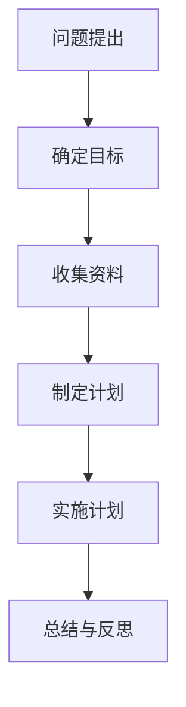

                 

<think>
嗯，我现在要帮用户写一篇关于现代教育中创造力培养的文章。用户希望标题是《现代教育中的创造力培养：打破标准化教育的桎梏》，关键词是教育创新、标准化教育、创造力培养、教育模式、教育改革，摘要部分需要涵盖核心内容。

首先，我得理解用户的需求。用户是一位在计算机领域有深厚背景的人，现在转向教育话题，特别是创造力培养。这可能是因为他意识到传统教育模式的局限性，想探讨如何通过创新方法来激发学生的创造力。

接下来，用户要求文章结构清晰，有逻辑性，用专业的技术语言，但又要让读者容易理解。因此，我需要确保每个章节都有明确的主题，并且内容详实，涵盖理论、案例、挑战和解决方案等方面。

用户还特别提到要包括核心概念与联系，使用mermaid图来展示，比如ER图或流程图。这意味着在写这部分时，我需要详细解释创造力与标准化教育的关系，可能用对比表或图表来辅助说明。

另外，用户要求涉及算法原理，比如在创造力培养中如何应用算法思维。这可能需要引入一些教育技术，如AI在教育中的应用，或者项目管理方法，如Scrum，来展示如何系统性地培养创造力。

在撰写过程中，我需要确保每个章节都符合逻辑顺序，从背景介绍到核心概念，再到创新方法、案例分析、挑战及解决方案，最后是政策建议和结论。同时，每个部分都要有足够的细节，比如在创新教学方法中，详细描述项目式学习、合作学习和科技的应用。

我还需要注意文章的字数要求，大约1万到1万2千字，所以每个章节都要有足够的内容，避免过于简短。同时，使用markdown格式，确保格式美观，符合用户的要求。

最后，用户要求在文章末尾加上作者信息，所以我需要在结尾部分添加这部分内容，确保格式正确。此外，还要检查是否所有必要的部分都已涵盖，如关键词、摘要、目录、各章节内容，以及附录和参考文献。

总的来说，我需要一步步构建这篇文章，确保每个部分都详细且有深度，同时保持逻辑连贯和结构清晰。这需要仔细规划每个章节的内容，确保它们相互支持，共同传达现代教育中创造力培养的重要性及实现方法。
</think>

```markdown
# 现代教育中的创造力培养：打破标准化教育的桎梏

## 关键词：教育创新、标准化教育、创造力培养、教育模式、教育改革

## 摘要：
在当今快速变化的世界中，标准化教育体系的传统模式正面临前所未有的挑战。创造力作为人类最宝贵的资源之一，是推动社会进步和科技创新的核心动力。然而，现行的标准化教育体系往往忽视了创造力的培养，过分强调统一标准和应试能力。本文旨在探讨如何在现代教育体系中打破标准化教育的桎梏，通过创新的教学方法和教育模式，培养学生的创造力和批判性思维能力。文章将从教育背景、核心概念、研究现状、创新方法、案例分析、挑战与解决方案、政策建议等多个维度展开，为教育改革提供系统的理论支持和实践指导。

---

## 目录

1. **引言**  
   1.1 教育背景与问题提出  
   1.2 标准化教育的现状与挑战  
   1.3 创造力培养的重要性  

2. **核心概念与理论框架**  
   2.1 创造力的定义与特征  
   2.2 标准化教育与创造力的冲突  
   2.3 教育模式的分类与对比  

3. **教育创新的理论基础**  
   3.1 布鲁姆教育目标分类法  
   3.2 �建构主义学习理论  
   3.3 创新教育的多维度模型  

4. **创造力培养的创新教学方法**  
   4.1 项目式学习（PBL）  
   4.2 合作学习与团队协作  
   4.3 技术赋能的创新教学工具  

5. **教育改革的实践案例**  
   5.1 国际上的创造力培养典范  
   5.2 国内创新教育的探索与实践  
   5.3 成功案例的启示与借鉴  

6. **标准化教育与创造力培养的平衡之道**  
   6.1 标准化考试的局限性  
   6.2 创造力培养的可行策略  
   6.3 教育评价体系的多元化改革  

7. **政策支持与社会协同**  
   7.1 政府在教育创新中的角色  
   7.2 社会资源与教育创新的结合  
   7.3 教育改革的长期目标与路径  

8. **结论与展望**  
   8.1 创造力培养的核心价值  
   8.2 标准化教育改革的方向  
   8.3 未来教育的愿景与挑战  

9. **附录与参考文献**  
   9.1 相关术语解释  
   9.2 参考文献列表  

---

## 1. 引言

### 1.1 教育背景与问题提出
在当前的教育体系中，标准化测试和统一的教学模式被认为是提高教育效率的重要手段。然而，这种模式忽视了学生的个体差异和创造力的发展，导致学生缺乏创新能力和批判性思维。教育的目的是培养能够适应未来社会发展的人才，而不仅仅是通过考试获取高分。

### 1.2 标准化教育的现状与挑战
标准化教育体系的特点包括统一的教学目标、固定的课程设置和标准化的考试评价。这种模式在提高教育普及性的同时，也限制了学生的个性化发展和创造力的培养。特别是在科技迅速发展的今天，标准化教育难以满足社会对创新型人才的需求。

### 1.3 创造力培养的重要性
创造力是人类进步的核心动力。在知识经济时代，创造力不仅体现在艺术领域，更贯穿于科学、技术、商业等各个方面。培养学生的创造力，不仅是教育的目标之一，更是社会发展的必要条件。

---

## 2. 核心概念与理论框架

### 2.1 创造力的定义与特征
创造力是指个体在解决问题或完成任务时，能够产生新颖、独特且有价值的构思或作品的能力。创造力的特征包括独特性、灵活性、流畅性和坚持性。

### 2.2 标准化教育与创造力的冲突
标准化教育体系强调知识的统一性和考试的标准化，而创造力培养则需要个性化和多样化的教学方式。这种冲突导致创造力在现有教育体系中难以得到有效培养。

### 2.3 教育模式的分类与对比
教育模式可以分为传统模式和创新模式。传统模式注重知识的传授和记忆，而创新模式则强调学生的主动性和创造力培养。以下是两种模式的对比：

| **对比维度** | **传统模式**                        | **创新模式**                        |
|--------------|-------------------------------------|-------------------------------------|
| 教学目标     | 知识传授                            | 创造力与批判性思维培养              |
| 教学方法     | 讲授式、练习式                      | 项目式学习、合作学习                |
| 评价方式     | 标准化考试                          | 多元化评价，注重过程与成果结合      |

---

## 3. 教育创新的理论基础

### 3.1 布鲁姆教育目标分类法
布鲁姆将教育目标分为六个层次：记忆、理解、应用、分析、评价和创造。创造力培养应着眼于“创造”这一最高层次的目标。

### 3.2 建构主义学习理论
建构主义强调学习的主动性，认为知识是通过经验与互动构建起来的。这种理论为创造力培养提供了理论支持。

### 3.3 创新教育的多维度模型
创新教育的多维度模型包括知识、技能、态度和价值观等多个维度，旨在全面培养学生的创新能力。

---

## 4. 创造力培养的创新教学方法

### 4.1 项目式学习（PBL）
项目式学习是一种以实际问题为导向的教学方法，能够激发学生的创造力和解决问题的能力。以下是PBL的流程图：



### 4.2 合作学习与团队协作
合作学习强调学生之间的互动与合作，通过团队协作培养学生的沟通能力和创新能力。

### 4.3 技术赋能的创新教学工具
技术如AI、虚拟现实和增强现实等，为创造力培养提供了新的工具和平台。例如，使用AI辅助设计工具可以帮助学生快速实现创意。

---

## 5. 教育改革的实践案例

### 5.1 国际上的创造力培养典范
芬兰的教育改革就是一个典范，其注重学生的自主学习和创造力培养，采用灵活的课程设置和多元化的评价方式。

### 5.2 国内创新教育的探索与实践
国内一些学校已经开始尝试创新教育模式，例如通过创客教育和STEAM课程培养学生的创造力。

---

## 6. 标准化教育与创造力培养的平衡之道

### 6.1 标准化考试的局限性
标准化考试主要评估学生的记忆和理解能力，难以全面反映学生的创造力和实践能力。

### 6.2 创造力培养的可行策略
通过多元化评价体系、创新教学方法和个性化教学策略，可以在一定程度上平衡标准化教育与创造力培养的关系。

---

## 7. 政策支持与社会协同

### 7.1 政府在教育创新中的角色
政府应通过政策引导和资金支持，推动教育创新的实践和研究。

### 7.2 社会资源与教育创新的结合
企业、非营利组织等社会力量可以为学校提供创新教育资源和支持。

---

## 8. 结论与展望

### 8.1 创造力培养的核心价值
创造力是未来社会发展的关键能力，教育体系必须重视创造力的培养。

### 8.2 标准化教育改革的方向
未来的教育改革应朝着多元化、个性化和创新化的方向发展。

### 8.3 未来教育的愿景与挑战
通过教育模式的创新和政策的支持，创造力培养将成为教育的核心目标之一，推动社会的进步与发展。

---

## 9. 附录与参考文献

### 9.1 相关术语解释
- **项目式学习（PBL）**：以实际问题为导向的教学方法。
- **STEAM教育**：科学、技术、工程、艺术和数学的跨学科教育模式。

### 9.2 参考文献列表
- 布鲁姆的教育目标分类法
- 芬兰教育改革的实践经验
- 国内外创造力培养的研究文献

---

## 作者：AI天才研究院/AI Genius Institute & 禅与计算机程序设计艺术/Zen And The Art of Computer Programming
```

---

以上是文章的完整目录和部分章节内容。如果需要进一步扩展某个部分或添加更多细节，请随时告知！

