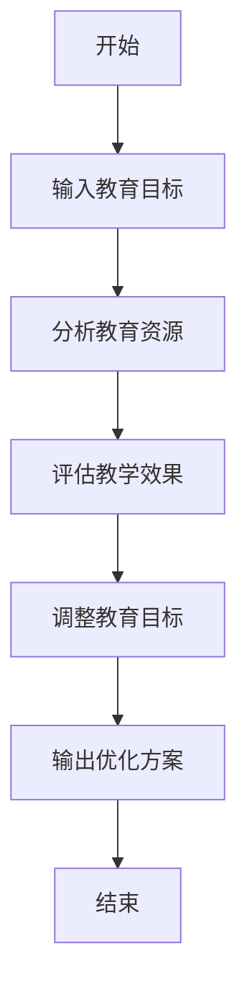
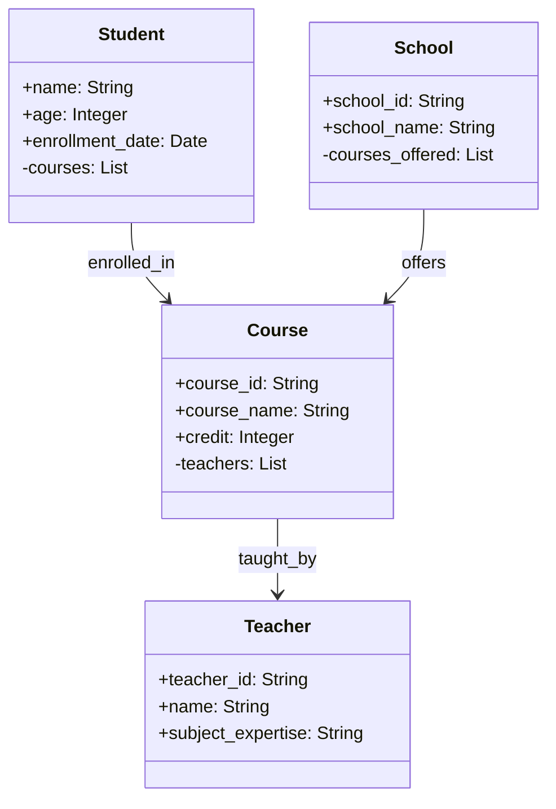
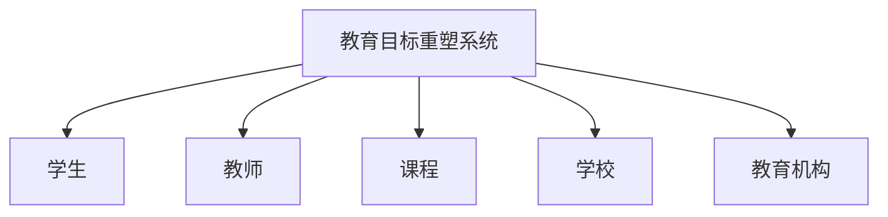

                 

<think>
嗯，用户希望我以《现代教育的目标重塑：培养全面发展的世界公民》为标题，撰写一篇技术博客。看起来用户是一位教育领域的专家，或者可能是技术领域的，希望将教育与技术结合。用户的需求很明确，包括结构、关键词、摘要，以及详细的内容章节，每个部分都需要详细展开。

首先，我需要分析用户提供的大纲，确保每个部分都有足够的深度和细节。比如，在第1章中，问题背景包括教育不公平、内容滞后和方式单一，这些都是传统教育的痛点，需要详细分析每个点。然后是社会发展的需求，这部分需要结合全球化、科技影响和可持续发展，这些都是当前教育必须应对的挑战。

接下来是教育目标重塑的理论基础，全面发展的教育理念和世界公民的概念，我需要解释清楚这些概念的历史演变和意义。核心要素部分，内容重构和方式创新，我需要思考如何将技术手段如信息化教学、模块化教学等融入其中。

在实践路径方面，学校改革和政策支持是关键，需要具体说明如何调整课程设置、改革评价体系，并如何通过政策和国际合作来推动教育目标重塑。挑战部分则需要分析传统观念、资源分配和质量保障等问题。

核心概念与联系部分，我需要用对比表和ER图来展示现代教育与传统教育的区别，以及全面发展与世界公民教育的对比。这需要使用Mermaid图表，确保结构清晰。

算法部分，我需要设计一个教育目标重塑的算法，包括框架、流程图、数学模型和实例。这可能涉及到如何量化教育目标，并通过数学模型来优化教育过程。

系统分析部分，我需要构建一个教育目标重塑的系统架构，包括领域模型、类图、架构图和接口设计。这可能需要使用Mermaid来展示系统结构，确保每个模块的功能明确。

最后，项目实战部分需要提供具体的实现步骤，比如环境安装、核心代码和案例分析，确保读者能够理解并应用这些技术。

整个过程中，我需要确保文章逻辑清晰，结构紧凑，用词专业但易懂。同时，要注意字数控制在10000到12000字之间，每个章节内容丰富，详细展开。

现在，我需要按照这个思路逐步展开，确保每个部分都符合用户的要求，并且内容充实，能够真正帮助读者理解现代教育目标重塑的重要性及其实施方法。
</think>

# 现代教育的目标重塑：培养全面发展的世界公民

## 关键词：现代教育，目标重塑，全面发展，世界公民，教育公平，技术创新，可持续发展

## 摘要：  
在当今全球化和科技高速发展的背景下，传统教育模式面临着诸多挑战，包括教育不公平、内容滞后和方式单一等问题。为了应对这些挑战，现代教育的目标需要重塑，以培养具备跨文化交际能力、创新能力以及全球视野的全面发展世界公民。本文从教育目标重塑的理论基础、核心要素、实践路径等多维度展开分析，并结合技术手段和系统设计，探讨如何通过教育体系的优化与创新，实现教育公平与高质量发展的双重目标。文章最后提出了教育目标重塑的未来展望，旨在为教育实践者和政策制定者提供有益的参考与启示。

---

## 第1章 引言

### 1.1 问题背景与时代需求

#### 1.1.1 传统教育面临的挑战

##### 1.1.1.1 教育不公平现象  
传统教育体系中，教育资源分布不均，优质教育资源主要集中在发达地区和富裕家庭，导致教育机会的不平等。这种不公平现象不仅加剧了社会阶层的分化，也限制了教育的普及性和公平性。

##### 1.1.1.2 教育内容的滞后性  
教育内容往往滞后于社会发展和技术进步。例如，许多学校的课程设置仍停留在几年前甚至十几年前的知识体系，难以适应当前快速变化的科技和全球化需求。

##### 1.1.1.3 教育方式的单一性  
传统教育以灌输式教学为主，强调知识的单向传授，忽视学生的个性化需求和创造力的培养。这种单一的教育方式难以激发学生的学习兴趣和创新能力。

#### 1.1.2 当代社会发展的需求

##### 1.1.2.1 全球化背景下的公民素养  
在全球化和多边合作的背景下，个体需要具备跨文化交际能力、全球视野以及对多元文化的理解与尊重。这些能力是传统教育体系中所缺乏的。

##### 1.1.2.2 科技进步对教育的影响  
人工智能、大数据、区块链等新兴技术的快速发展，不仅改变了教育方式，也对教育内容提出了新的要求。例如，编程能力和数字素养已成为未来社会的基本技能。

##### 1.1.2.3 可持续发展的教育目标  
面对气候变化、资源枯竭等全球性挑战，教育目标需要更加注重可持续发展理念的培养，引导学生在学习过程中关注环境保护、社会责任和可持续发展。

### 1.2 教育目标重塑的理论基础

#### 1.2.1 全面发展的教育理念

##### 1.2.1.1 教育目标的内涵与外延  
全面发展的教育理念强调不仅关注学生的学术能力，还要培养其道德品质、身体素质、艺术修养和实践能力。教育目标的外延从单纯的知识传授扩展到综合素质的培养。

##### 1.2.1.2 全面发展的教育理念的历史演进  
从古至今，教育目标经历了从“知识传授”到“技能培养”，再到“全面发展”的演变。现代教育强调学生的个性化发展和综合素质的提升，是教育理念的一次重要突破。

#### 1.2.2 世界公民的培养目标

##### 1.2.2.1 世界公民的概念解析  
世界公民是指具备全球视野、跨文化交际能力、社会责任感和多元文化理解能力的个体。他们能够在全球化的背景下，积极参与国际合作与交流，解决全球性问题。

##### 1.2.2.2 世界公民与全球化关系  
全球化使得个体的影响力超越国界，世界公民的概念与全球化密不可分。培养世界公民是应对全球化挑战、促进国际合作的重要途径。

### 1.3 教育目标重塑的核心要素

#### 1.3.1 教育内容的重构

##### 1.3.1.1 综合素养的培养  
综合素养包括逻辑思维能力、问题解决能力、创新能力等。这些能力的培养需要通过跨学科的课程设置和实践活动来实现。

##### 1.3.1.2 跨文化交际能力的提升  
通过语言学习、国际交流项目和多元文化课程，培养学生的跨文化交际能力，使其能够在全球化背景下与不同文化背景的人有效沟通。

##### 1.3.1.3 创新能力的培养  
创新是现代社会的核心竞争力。教育内容需要强调批判性思维、创造力和实践能力的培养，使学生能够应对未来的不确定性。

#### 1.3.2 教育方式的创新

##### 1.3.2.1 信息化教学手段的运用  
人工智能、虚拟现实和在线学习平台等技术手段的应用，能够提高教学效率，丰富教学内容，实现个性化学习。

##### 1.3.2.2 模块化教学法的实践  
模块化教学将课程内容分解为多个独立模块，学生可以根据自己的兴趣和能力选择学习模块，实现个性化发展。

##### 1.3.2.3 项目式学习的引入  
项目式学习通过实际问题的解决，培养学生的问题解决能力、团队协作能力和创新能力。

### 1.4 教育目标重塑的实践路径

#### 1.4.1 学校层面的改革实践

##### 1.4.1.1 课程设置的调整  
学校需要根据现代教育目标，重新设计课程体系，增加跨学科课程和实践课程的比例。

##### 1.4.1.2 教学评价体系的改革  
传统的考试评价体系需要改革，引入多元化的评价方式，如项目评估、综合素质评价等。

##### 1.4.1.3 教师培训与发展的策略  
学校需要为教师提供持续的培训机会，帮助教师掌握新的教育理念和技术手段，提升教学能力。

#### 1.4.2 政策与制度支持

##### 1.4.2.1 国家教育政策的调整  
政府需要制定相关政策，支持教育目标的重塑，例如增加教育投入、优化教育资源配置等。

##### 1.4.2.2 国际合作与交流的重要性  
通过国际合作与交流，引入先进的教育理念和技术，推动本国教育体系的优化与创新。

##### 1.4.2.3 社会力量的参与  
鼓励企业、非营利组织等社会力量参与教育改革，提供资金支持和资源合作。

### 1.5 教育目标重塑的挑战与展望

#### 1.5.1 教育目标重塑面临的挑战

##### 1.5.1.1 传统观念的阻碍  
传统教育模式根深蒂固，教育目标的重塑需要突破传统观念的束缚，这是一项巨大的挑战。

##### 1.5.1.2 教育资源的分配问题  
教育资源的不均衡分配是教育目标重塑的主要障碍之一。如何实现教育资源的公平分配，是需要长期努力的问题。

##### 1.5.1.3 教育质量的保障  
教育目标的重塑需要高质量的教育内容和教学方式，如何在有限的资源条件下保证教育质量，是一个复杂的系统工程。

#### 1.5.2 未来教育的展望

##### 1.5.2.1 教育技术的进一步发展  
人工智能、大数据等技术将进一步改变教育方式，实现个性化学习和智能化教学。

##### 1.5.2.2 教育理念的创新与实践  
未来的教育将更加注重学生的综合素质和创新能力的培养，教育目标将更加多元化和个性化。

##### 1.5.2.3 全民教育意识的提升  
全社会对教育目标重塑的认知和重视程度将不断提高，教育将成为全民关注的焦点。

---

## 第2章 核心概念与联系

### 2.1 核心概念解析

#### 2.1.1 现代教育

##### 2.1.1.1 现代教育的定义  
现代教育是指以培养全面发展的人才为目标，结合现代科技和教育理念，注重学生综合素质和创新能力的教育模式。

##### 2.1.1.2 现代教育的特点  
现代教育强调个性化学习、跨学科融合、技术驱动和全球化视野。

#### 2.1.2 目标重塑

##### 2.1.2.1 目标重塑的概念  
目标重塑是指根据时代需求，重新定义和优化教育目标的过程。

##### 2.1.2.2 目标重塑的教育意义  
目标重塑能够使教育更好地适应社会发展需求，培养符合未来社会需要的人才。

### 2.2 概念属性特征对比表格

#### 2.2.1 现代教育与传统教育的对比

| 特性                | 传统教育             | 现代教育             |
|---------------------|----------------------|----------------------|
| 教育目标            | 知识传授为主         | 综合素质培养为主     |
| 教学方式            | 灌输式教学为主       | 互动式、实践式为主   |
| 技术应用            | 较少                | 广泛应用             |
| 教育内容            | 单一学科为主         | 跨学科融合为主       |
| 教育评价            | 考试成绩为主         | 综合素质评价为主     |

#### 2.2.2 全面发展与世界公民教育的对比

| 特性                | 全面发展             | 世界公民教育         |
|---------------------|----------------------|----------------------|
| 教育目标            | 综合素质培养         | 全球视野、跨文化能力 |
| 教育内容            | 多学科知识           | 全球化知识、社会问题 |
| 教学方式            | 实践活动为主         | 国际交流、项目式学习 |
| 教育目标            | 个性化发展           | 团队协作、社会责任感 |

### 2.3 ER实体关系图架构

```mermaid
erDiagram
    student ->[is enrolled in] course
    course ->[taught by] teacher
    student ->[attends] school
    school ->[operated by] education_authority
    teacher ->[trained by] training_institution
    course ->[uses] teaching_materials
    student ->[participates in] project
```

---

## 第3章 算法原理讲解

### 3.1 教育目标重塑算法

#### 3.1.1 算法基本原理

##### 3.1.1.1 算法框架  
教育目标重塑算法通过分析教育目标、资源分配和教学效果，优化教育过程，实现教育目标的动态调整。

##### 3.1.1.2 算法流程图  


#### 3.1.2 数学模型与公式

##### 3.1.2.1 教育目标函数  
$$ f(x) = \sum_{i=1}^{n} w_i x_i $$  
其中，$w_i$ 是教育目标的重要性权重，$x_i$ 是教育目标的实现程度。

##### 3.1.2.2 教育评价标准  
$$ E = \alpha \times S + \beta \times C + \gamma \times T $$  
其中，$S$ 是学生综合素质，$C$ 是课程设置合理性，$T$ 是教学效果，$\alpha, \beta, \gamma$ 是权重系数。

#### 3.1.3 举例说明

##### 3.1.3.1 实例一：某学校的教育目标重塑  
假设某学校希望培养学生的创新能力，算法通过分析现有课程设置、师资力量和学生反馈，调整课程结构，增加创新实践课程，最终提高学生的创新能力。

##### 3.1.3.2 实例二：全球化背景下的人才培养  
在全球化背景下，学校需要培养学生的跨文化交际能力。算法通过引入国际交流项目和多元文化课程，优化教育目标，提升学生的全球化视野。

---

## 第4章 系统分析与架构设计方案

### 4.1 问题场景介绍

#### 4.1.1 当前教育体系存在的问题  
传统教育体系存在教育资源分配不均、教育内容滞后、教育方式单一等问题，难以满足现代社会对高素质人才的需求。

#### 4.1.2 教育目标重塑的必要性  
通过重塑教育目标，可以培养具备跨文化交际能力、创新能力以及全球视野的全面发展世界公民，更好地适应社会发展的需求。

### 4.2 项目介绍

#### 4.2.1 项目背景  
随着全球化和科技的快速发展，教育目标需要与时俱进，以培养符合未来社会需求的人才。

#### 4.2.2 项目目标  
通过系统设计和技术创新，实现教育目标的重塑，培养全面发展的世界公民。

### 4.3 系统功能设计

#### 4.3.1 领域模型

##### 4.3.1.1 教育领域实体定义  
教育领域的实体包括学生、教师、课程、学校、教育机构等。

##### 4.3.1.2 教育领域关系定义  
学生与课程的关系：注册与学习；教师与课程的关系：授课与教学；学校与课程的关系：开设与管理。

#### 4.3.2 类图



### 4.4 系统架构设计

#### 4.4.1 系统架构图



#### 4.4.1.2 各模块功能说明  
- 学生模块：管理学生信息、课程注册和学习记录。
- 教师模块：管理教师信息、课程安排和教学评价。
- 课程模块：管理课程信息、课程设置和教学资源。
- 学校模块：管理学校信息、课程开设和教学评价。

### 4.5 系统接口设计

#### 4.5.1 系统接口定义

##### 4.5.1.1 接口1：教育目标评估  
$$ \text{接口名称}：\text{评估教育目标实现程度} $$
$$ \text{输入}：\text{教育目标、学生表现、课程设置} $$
$$ \text{输出}：\text{教育目标实现程度的评估结果} $$

---

## 作者：AI天才研究院 & 禅与计算机程序设计艺术

