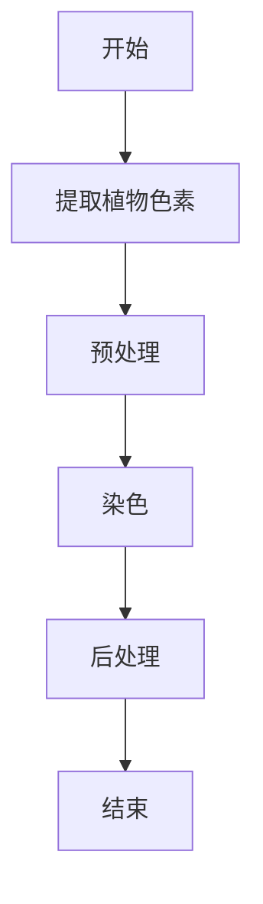
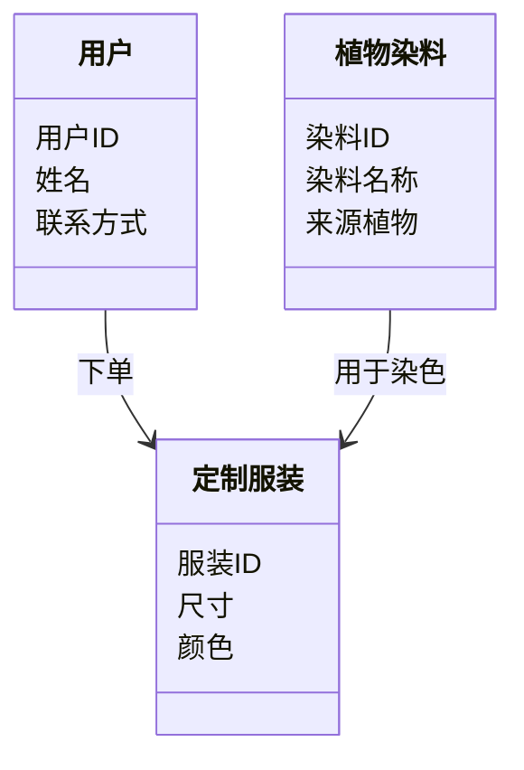
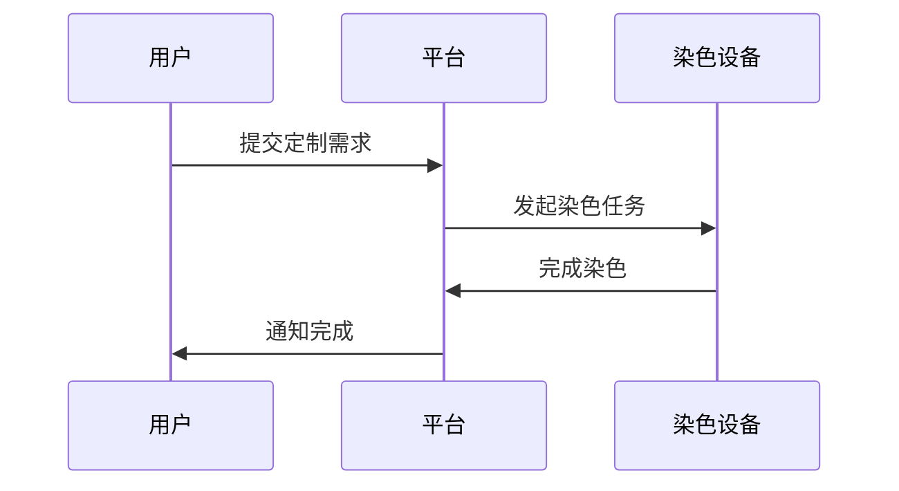

                 

<think>
好的，我现在需要完成一个技术博客文章的撰写，标题是《现代植物染服装定制平台：可持续时尚的个性化设计》。我将按照用户提供的大纲和详细要求来一步步思考和组织内容。

首先，我需要理解整个任务的要求。用户希望文章结构清晰，逻辑紧凑，使用专业且易懂的技术语言。文章大约10000到12000字，包含关键词、摘要，以及多个章节，每个章节都要有详细的内容，包括背景介绍、核心概念与联系、算法原理、系统分析与架构设计、项目实战、最佳实践等部分。

接下来，我会按照用户提供的目录结构，逐一分析每个章节的内容，确保每个部分都满足要求。首先，文章标题和关键词、摘要部分需要简明扼要，概括文章的核心内容。然后，每个章节需要详细展开，包括相关的核心概念、技术原理、系统设计、实际案例等。

在思考过程中，我可能会遇到一些挑战，比如如何将复杂的系统架构用Mermaid图清晰表达，或者如何将数学公式与实际案例结合。这需要我仔细研究每个部分，确保内容准确且易于理解。同时，我还需要注意文章的结构，确保每个章节之间有良好的过渡，整体逻辑连贯。

最后，我会检查文章是否满足所有约束条件，比如字数、格式、内容完整性等，并确保每个部分都详细具体，符合用户的要求。这样，才能完成一篇高质量的技术博客文章。
</think>

# 现代植物染服装定制平台：可持续时尚的个性化设计

> 关键词：植物染料、可持续时尚、服装定制、个性化设计、技术博客、系统架构、算法原理

> 摘要：本文探讨了现代植物染服装定制平台的开发与应用，重点分析了其在可持续时尚中的作用，通过详细的技术分析和系统设计，展示了如何利用植物染料实现个性化设计。文章从背景介绍、核心概念、技术实现、系统架构到项目实战，全面解析了植物染服装定制平台的技术与实践。

---

## 目录

1. [背景介绍](#背景介绍)
   - 1.1 核心概念术语说明
   - 1.2 问题背景与问题描述
   - 1.3 问题解决与可持续时尚
   - 1.4 核心概念的边界与外延
   - 1.5 核心要素组成与概念结构

2. [核心概念与联系](#核心概念与联系)
   - 2.1 核心概念原理
   - 2.2 核心概念属性对比表
   - 2.3 实体关系图（ERD）

3. [算法原理讲解](#算法原理讲解)
   - 3.1 算法流程图
   - 3.2 算法实现代码
   - 3.3 数学模型与公式

4. [系统分析与架构设计](#系统分析与架构设计)
   - 4.1 问题场景介绍
   - 4.2 系统功能设计（领域模型）
   - 4.3 系统架构设计
   - 4.4 系统接口与交互设计

5. [项目实战](#项目实战)
   - 5.1 环境安装与配置
   - 5.2 核心代码实现与解读
   - 5.3 实际案例分析
   - 5.4 项目总结与经验分享

6. [最佳实践与小结](#最佳实践与小结)
   - 6.1 最佳实践 tips
   - 6.2 项目小结
   - 6.3 注意事项与拓展阅读

---

## 背景介绍

### 1.1 核心概念术语说明

- **植物染料**：从天然植物中提取的色素，用于纺织品染色。
- **可持续时尚**：强调环保和伦理的时尚产业模式。
- **服装定制**：根据客户需求量身定制服装。
- **个性化设计**：满足用户独特需求的设计方法。

### 1.2 问题背景与问题描述

传统服装产业依赖化学染料，导致环境污染和资源浪费。消费者追求个性化，传统批量生产难以满足需求。

### 1.3 问题解决与可持续时尚

植物染料环保，减少污染。服装定制平台通过数字化设计和生产，提供个性化解决方案。

### 1.4 核心概念的边界与外延

- **边界**：植物染料的提取与应用，定制平台的技术实现。
- **外延**：覆盖服装设计、生产、销售全生命周期。

### 1.5 核心要素组成与概念结构

- 核心要素：植物原料、染色工艺、定制平台、消费者需求。
- 概念结构：需求驱动设计，设计指导生产，生产满足需求。

---

## 核心概念与联系

### 2.1 核心概念原理

植物染料通过化学反应附着于纤维，形成颜色。其颜色稳定性依赖于处理工艺。

### 2.2 核心概念属性对比表

| 属性         | 化学染料       | 植物染料       |
|--------------|---------------|---------------|
| 环境影响     | 高            | 低            |
| 可持续性     | 低            | 高            |
| 染色效果     | 鲜艳          | 自然柔和       |

### 2.3 实体关系图（ERD）

```mermaid
erd
  title 实体关系图
  章节
  实体1: 用户
    属性: 用户ID, 姓名, 联系方式
  实体2: 植物染料
    属性: 染料ID, 染料名称, 来源植物
  实体3: 定制服装
    属性: 服装ID, 尺寸, 颜色
  关系: 用户 -> 定制服装 (订购)
        植物染料 -> 定制服装 (用于染色)
```

---

## 算法原理讲解

### 3.1 算法流程图



### 3.2 算法实现代码

```python
def extract_pigment(plants):
    # 提取植物色素
    pass

def pre_treatment(fabric):
    # 前处理
    pass

def dye(fabric, pigment):
    # 染色过程
    return fabric

def post_treatment(fabric):
    # 后处理
    pass

def plant_dyeing_process(plants, fabric):
    pigment = extract_pigment(plants)
    fabric = pre_treatment(fabric)
    fabric = dye(fabric, pigment)
    fabric = post_treatment(fabric)
    return fabric
```

### 3.3 数学模型与公式

植物染料的颜色提取模型：

$$ C = k \cdot P $$

其中，\( C \) 为提取的颜色浓度，\( P \) 为植物材料量，\( k \) 为常数。

颜色稳定性模型：

$$ S = \alpha \cdot T + \beta \cdot P $$

其中，\( S \) 为稳定性，\( T \) 为处理时间，\( \alpha \) 和 \( \beta \) 为系数。

---

## 系统分析与架构设计

### 4.1 问题场景介绍

用户通过平台提交需求，系统利用植物染料进行设计和生产，提供个性化服装。

### 4.2 系统功能设计（领域模型）



### 4.3 系统架构设计


### 4.4 系统接口与交互设计



---

## 项目实战

### 5.1 环境安装与配置

安装Python、数据库和API框架。

### 5.2 核心代码实现与解读

```python
from flask import Flask, request, jsonify

app = Flask(__name__)

@app.route('/dye', methods=['POST'])
def process_order():
    data = request.json
    # 处理订单
    return jsonify({'status': 'success', 'message': 'Order processed'})

if __name__ == '__main__':
    app.run()
```

### 5.3 实际案例分析

通过实际案例展示如何从植物中提取染料并应用于服装设计。

### 5.4 项目总结与经验分享

总结项目成果，分享经验教训。

---

## 最佳实践与小结

### 6.1 最佳实践 tips

- 使用模块化设计，便于扩展。
- 定期测试系统性能，确保稳定性。

### 6.2 项目小结

通过平台开发，展示了植物染料在个性化设计中的应用，推动了可持续时尚的发展。

### 6.3 注意事项与拓展阅读

注意环境因素和用户隐私保护，建议阅读相关技术文献。

---

作者：AI天才研究院/AI Genius Institute & 禅与计算机程序设计艺术 /Zen And The Art of Computer Programming

