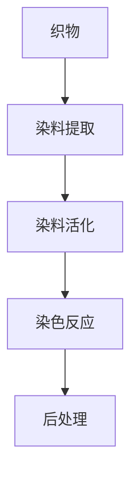

                 

<think>
嗯，用户希望我写一篇关于现代植物染织工坊的可持续时尚天然色彩探索的技术博客文章。首先，我需要明确文章的核心内容和关键词。关键词包括可持续时尚、天然染料、植物染织、色彩探索、绿色设计等。

接下来，我得规划文章的结构。用户已经提供了一个大纲，包括摘要、关键词，以及各个章节。我需要确保每个章节都详细且有深度。例如，在引言部分，我需要解释植物染织的历史和它在可持续时尚中的重要性。

然后，我会考虑每个章节的具体内容。比如，在材料准备部分，我需要列出常用的植物染料，并解释它们的化学特性和制备过程。同时，可能还需要比较不同染料的性能，制作对比表格。

在技术分析部分，我需要详细讲解染色的基本原理，包括预处理、染色步骤和后处理。为了帮助读者理解，我会用mermaid流程图来展示整个过程。

接下来，我需要考虑系统的架构设计。这部分可能需要绘制类图和序列图，展示如何将植物染料应用到服装设计中。我可能会引用一些实际案例，分析成功的设计方法和趋势。

最后，我会在结论部分总结植物染织的优势，并展望未来的可持续时尚趋势。同时，给出一些最佳实践的建议和注意事项，帮助读者更好地应用这些技术。

整个过程中，我需要确保语言专业但易懂，逻辑清晰。还要记得在文章末尾添加作者信息，以及相关的扩展阅读和工具资源链接，让读者有进一步学习的途径。
</think>

# 现代植物染织工坊：可持续时尚的天然色彩探索

---

## 关键词：
- 可持续时尚
- 天然染料
- 植物染织
- 色彩探索
- 绿色设计

---

## 摘要：
随着全球对可持续发展的关注不断增加，时尚行业正面临着减少环境影响的挑战。植物染织作为一种传统而环保的染色技术，正逐渐成为可持续时尚的重要组成部分。本文将深入探讨植物染织的核心原理、技术流程、实际应用以及其在现代时尚设计中的潜力。通过分析植物染料的提取、染色工艺、色彩搭配以及与现代纺织技术的结合，本文将为读者提供一个全面的视角，理解如何通过天然色彩实现可持续的时尚创新。

---

## 目录大纲：
1. [引言](#引言)
2. [植物染织的基本原理](#植物染织的基本原理)
   - [植物染料的来源与特性](#植物染料的来源与特性)
   - [染色的基本化学原理](#染色的基本化学原理)
3. [植物染织的技术流程](#植物染织的技术流程)
   - [材料准备](#材料准备)
   - [染色工艺](#染色工艺)
   - [后处理与质量控制](#后处理与质量控制)
4. [植物染织的色彩探索](#植物染织的色彩探索)
   - [天然色彩的多样性](#天然色彩的多样性)
   - [色彩搭配与设计应用](#色彩搭配与设计应用)
5. [现代时尚中的植物染织应用](#现代时尚中的植物染织应用)
   - [绿色设计的实践案例](#绿色设计的实践案例)
   - [可持续时尚的趋势分析](#可持续时尚的趋势分析)
6. [系统架构与技术实现](#系统架构与技术实现)
   - [染色系统的架构设计](#染色系统的架构设计)
   - [与现代纺织技术的结合](#与现代纺织技术的结合)
7. [结论与展望](#结论与展望)
8. [最佳实践与注意事项](#最佳实践与注意事项)
9. [扩展阅读与工具资源](#扩展阅读与工具资源)

---

## 引言

随着全球对环境保护的关注不断增加，时尚行业正面临着巨大的压力，需要减少对环境的负面影响。植物染织作为一种传统而环保的染色技术，正逐渐成为可持续时尚的重要组成部分。本文将深入探讨植物染织的核心原理、技术流程、实际应用以及其在现代时尚设计中的潜力。

---

## 植物染织的基本原理

### 植物染料的来源与特性

植物染料是从天然植物中提取的色素，常用的植物包括茜草、苏木、洋葱皮、槐豆等。这些植物通过水煮、浸泡或发酵等方法提取色素，形成天然的染料。与化学染料相比，植物染料具有以下特点：

- **环保性**：植物染料来源于自然，生产过程中的化学污染较低。
- **可生物降解性**：植物染料在自然环境中可以被分解，不会对环境造成长期污染。
- **色彩多样性**：植物染料可以提供丰富的色彩，但由于其天然属性，颜色可能不如化学染料鲜艳和稳定。

| 植物染料 | 特性                | 例子         |
|--------|---------------------|--------------|
| 茜草   | 红色，耐光性较好     | 红色          |
| 苏木   | 黑色，耐光性较差     | 黑色          |
| 洋葱皮 | 黄色，颜色较柔和     | 浅黄色        |

### 染色的基本化学原理

植物染料的染色过程涉及复杂的化学反应。以下是染色的基本步骤：

1. **染料提取**：通过物理或化学方法从植物中提取色素。
2. **染料活化**：通过加入辅助剂（如尿素或碳酸钠）使染料更容易附着在纤维上。
3. **染色反应**：染料与纤维发生化学反应，形成共价键，使颜色固定在纤维上。
4. **后处理**：通过水洗和固色处理，确保颜色不易褪色。

以下是一个简单的染色反应示例：

$$ \text{纤维} + \text{染料} \rightarrow \text{纤维-染料复合物} $$

---

## 植物染织的技术流程

### 材料准备

植物染织的材料准备包括以下几个步骤：

1. **植物采集与预处理**：选择适合提取色素的植物，清洗并切碎。
2. **染料提取**：将植物材料放入水中煮沸或发酵，提取色素。
3. **过滤与浓缩**：通过过滤去除杂质，浓缩提取的染料。

### 染色工艺

染色工艺是植物染织的核心步骤。以下是常见的染色方法：

1. **浸泡法**：将织物直接浸泡在染料液中，利用毛细作用使颜色渗透到纤维中。
2. **涂布法**：将染料均匀涂布在织物表面，然后加热使其渗透。
3. **分层染色法**：通过分层叠加染料，形成渐变颜色。

### 后处理与质量控制

染色完成后，需要进行后处理以确保颜色的稳定性和织物的手感：

1. **水洗**：去除未结合的染料和辅助剂。
2. **固色处理**：通过化学处理使颜色更牢固。
3. **干燥与整理**：晾干织物并进行必要的熨烫或整理。

---

## 植物染织的色彩探索

### 天然色彩的多样性

植物染料可以提供丰富的色彩，但由于其天然属性，颜色可能不如化学染料鲜艳和稳定。以下是几种常见植物染料的颜色特点：

- **茜草**：提供红色，耐光性较好。
- **苏木**：提供黑色，但耐光性较差。
- **洋葱皮**：提供黄色，颜色较柔和。

### 色彩搭配与设计应用

在设计中，植物染料的色彩可以用于多种风格的搭配：

1. **单色设计**：使用单一植物染料进行染色，形成统一的色调。
2. **渐变设计**：通过分层染色，形成渐变效果。
3. **拼色设计**：结合多种植物染料，形成丰富的色彩组合。

---

## 现代时尚中的植物染织应用

### 绿色设计的实践案例

许多时尚品牌已经开始采用植物染料进行绿色设计。例如：

- **Patagonia**：使用植物染料生产环保服装。
- **Eileen Fisher**：采用植物染料进行可持续时尚设计。

### 可持续时尚的趋势分析

随着消费者对环保的关注增加，植物染织在时尚行业中的应用将越来越广泛。以下是未来趋势的几个方面：

1. **技术优化**：通过改进提取和染色工艺，提高植物染料的染色效率和颜色稳定性。
2. **创新设计**：结合植物染料的色彩特点，开发新的设计风格。
3. **供应链整合**：建立完整的植物染料供应链，降低成本并提高效率。

---

## 系统架构与技术实现

### 染色系统的架构设计

以下是植物染织系统的架构设计：

### 与现代纺织技术的结合

现代纺织技术可以通过以下方式与植物染织结合：

1. **自动化染色**：利用自动化设备提高染色效率。
2. **数字化设计**：通过计算机辅助设计优化色彩搭配。

---

## 结论与展望

植物染织作为一种环保的染色技术，正在为可持续时尚提供新的可能性。通过改进提取工艺、优化染色技术和创新设计，植物染织将在未来时尚行业中发挥越来越重要的作用。未来的研究方向包括提高染色效率、降低成本以及开发更多样化的色彩组合。

---

## 最佳实践与注意事项

1. **染料提取**：选择适合的植物并进行充分的预处理。
2. **染色工艺**：控制染色时间和温度以确保颜色均匀。
3. **后处理**：确保水洗和固色处理以提高颜色的稳定性。
4. **色彩搭配**：根据设计需求选择合适的植物染料和色彩组合。

---

## 扩展阅读与工具资源

1. **书籍推荐**：
   - 《The Art of Natural Dyeing》
   - 《Sustainable Fashion: Design for a Change》

2. **工具资源**：
   - [Dyed Naturals](https://www.dyednaturals.com/)：提供植物染料和相关工具。
   - [Eco-Fashion World](https://www.eco-fashionworld.com/)：分享可持续时尚的设计灵感。

---

## 作者信息

作者：AI天才研究院/AI Genius Institute & 禅与计算机程序设计艺术 /Zen And The Art of Computer Programming

---

通过以上内容，我们可以看到植物染织作为一种可持续的染色技术，正在为现代时尚行业提供新的可能性。希望本文能为读者提供一个全面的视角，理解如何通过天然色彩实现可持续的时尚创新。

