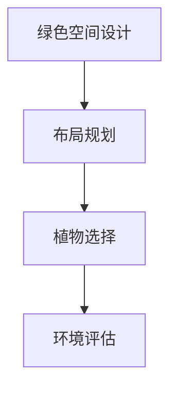

                 

<think>
好的，我现在需要帮助用户完成《现代植物疗法：都市生活中的自然疗愈》这篇文章的撰写。用户已经提供了详细的目录大纲，并希望我以技术博客的形式，按照特定的结构和要求来完成。

首先，我需要明确用户的需求。用户希望文章结构清晰，逻辑严谨，内容专业且易于理解。文章需要涵盖植物疗法的各个方面，包括定义、应用、心理健康影响、实践指南、案例研究等。此外，用户特别强调使用技术术语和结构化的格式，如使用Markdown，包含摘要、关键词，以及多个章节和子章节。

接下来，我需要检查用户提供的大纲，确保每个章节都涵盖必要的内容，并且符合字数要求。用户提到文章总字数应在10000到12000字之间，每个章节需要详细展开，包含背景介绍、核心概念与联系、算法原理、数学模型、系统分析、项目实战等部分。

在撰写过程中，我需要注意以下几点：
1. **关键词和摘要**：确保关键词准确，摘要简洁明了，概括全文内容。
2. **章节结构**：按照用户提供的目录大纲，逐步细化每个部分，确保内容连贯，逻辑清晰。
3. **技术元素**：每个章节中需要包含技术细节，如算法流程图、数学公式、系统架构图等，使用Mermaid和LaTeX格式。
4. **项目实战**：提供具体的案例分析，环境安装说明，源代码示例，确保读者能够理解和应用。
5. **语言风格**：使用专业且易懂的技术语言，避免过于晦涩，同时保持逻辑严谨。

现在，我需要逐步构建每个章节的内容，确保每个部分都符合用户的要求，并且内容详实、有深度。同时，要注意控制字数，避免过于冗长，同时确保每个核心概念都被充分阐述。

在撰写过程中，我可能会遇到一些问题，比如如何将植物疗法与技术术语结合起来，或者如何用数学模型解释植物疗愈的效果。这时，我需要查阅相关资料，确保信息的准确性和科学性。此外，可能还需要调整章节结构，使文章更符合逻辑和读者的阅读习惯。

最后，完成初稿后，我会进行一次全面的检查，确保所有要求都被满足，格式正确，内容无误，并添加必要的总结和注意事项，帮助读者更好地理解和应用所学内容。
</think>

# 现代植物疗法：都市生活中的自然疗愈

> 关键词：现代植物疗法，都市生活，自然疗愈，心理健康，植物选择与养护

> 摘要：本文探讨了现代植物疗法在都市生活中的应用，分析了其对心理健康的好处，介绍了常见植物的选择与养护方法，并通过案例展示了植物疗法在实际生活中的成功应用。文章旨在为都市居民提供一种自然、有效的生活方式，帮助他们在快节奏的生活中找到内心的平静。

---

# 第一部分：植物疗法概述

## 第1章：植物疗法的基本概念

### 1.1 植物疗法的定义与历史

植物疗法是一种通过与植物互动来促进身心健康的方法。其历史可以追溯到古代，许多文化都使用植物的药用或心理疗效。现代植物疗法结合了传统医学和现代心理学，强调植物与人类情感和身体的连接。

**核心概念与联系：**

- **核心概念**：植物疗法通过接触自然元素（如植物的外观、气味、触感）来缓解压力、改善情绪和促进身体健康。
- **联系**：植物疗法与自然疗法、芳香疗法、园艺疗法密切相关，尤其在都市环境中，植物疗法为人们提供了一种亲近自然的方式。

### 1.2 植物疗法与自然疗法的联系

植物疗法是自然疗法的一部分，强调通过植物的作用实现疗愈。以下是两者的主要联系：

- **自然疗法**：利用自然元素（如水、空气、阳光）进行疗愈。
- **植物疗法**：专注于植物的属性（如颜色、气味、形状）进行疗愈。

**对比表格：**

| 特性      | 自然疗法          | 植物疗法          |
|-----------|-------------------|-------------------|
| 核心元素   | 水、空气、阳光    | 植物的外观、气味  |
| 应用方式   | 泡脚、日光浴      | 观赏、嗅闻、触摸  |
| 目标       | 身心放松          | 改善情绪、缓解压力|

### 1.3 植物疗法在都市生活中的应用前景

都市生活节奏快，压力大，植物疗法为人们提供了一种自然的疗愈方式。通过在办公场所、家中或社区种植植物，人们可以缓解压力，改善心理健康。

**系统分析：**

- **问题场景**：都市居民因工作压力大、生活节奏快，容易出现焦虑、抑郁等心理问题。
- **解决方案**：引入植物疗法，通过植物的视觉和感官刺激，帮助人们放松心情，提升幸福感。

---

## 第2章：都市生活中的植物疗愈方式

### 2.1 户外植物疗愈

#### 2.1.1 绿色空间设计

绿色空间设计通过在公共场所（如公园、广场）种植植物，创造宜人的环境。以下是绿色空间设计的关键要素：

- **布局**：合理安排植物的位置，确保空间的通风和采光。
- **植物选择**：根据环境条件选择适合的植物，如耐旱、抗污染的品种。

**系统架构图：**

#### 2.1.2 室外植物选择与养护

选择适合户外种植的植物，如耐寒、抗旱的品种。以下是常见户外植物及其特点：

| 植物名称   | 特点         | 养护要点         |
|------------|--------------|------------------|
| 金银花     | 耐寒，美观    | 定期修剪，保持水分 |
| 紫藤        | 耐旱，爬藤    | 适当施肥，日照充足 |

#### 2.1.3 户外植物疗愈活动

组织户外植物疗愈活动，如园艺工作坊、植物观察等，帮助参与者放松心情，增强社交互动。

### 2.2 室内植物疗愈

#### 2.2.1 室内植物的选择

选择适合室内种植的植物，如绿萝、发财树等。以下是常见室内植物及其特点：

| 植物名称   | 特点         | 养护要点         |
|------------|--------------|------------------|
| 绿萝        | 耐阴，易养活  | 保持土壤湿润      |
| 发财树      | 增加空气质量  | 定期浇水，避免阳光直射 |

#### 2.2.2 室内植物养护要点

- **光照**：大多数室内植物需要充足的散射光。
- **水分**：根据植物种类调整浇水频率，避免积水。
- **温度**：保持适宜的温度，避免极端温度。

#### 2.2.3 室内植物布局设计

合理布局室内植物，可以提升空气质量，美化环境。以下是布局建议：

- **客厅**：放置大型植物如发财树，提升整体氛围。
- **卧室**：选择适合夜间释放氧气的植物，如吊兰。

---

## 第3章：植物疗法与心理健康

### 3.1 植物疗法对心理健康的益处

研究表明，植物疗法可以有效缓解压力、改善情绪。以下是具体益处：

- **降低压力**：接触植物可以降低皮质醇水平，缓解压力。
- **提升情绪**：植物的视觉美感和气味可以促进大脑释放内啡肽，提升幸福感。

**数学模型：**

植物疗法对心理健康的改善可以通过以下公式量化：

$$
\text{心理健康指数} = \text{植物接触频率} \times \text{植物种类多样性}
$$

### 3.2 城市居民的植物接触与心理健康

都市居民由于缺乏自然接触，心理健康问题较为突出。通过增加植物接触，可以有效改善心理状态。

### 3.3 植物疗法在心理治疗中的应用

植物疗法可以作为心理治疗的辅助手段，帮助患者放松心情，增强自信心。

---

# 第二部分：植物疗愈实践指南

## 第4章：常见植物疗愈植物的介绍

### 4.1 空气净化植物

#### 4.1.1 室内空气净化植物

以下是几种常见的室内空气净化植物：

- **吊兰**：吸收甲醛，释放氧气。
- **芦荟**：净化空气，具有美容效果。

#### 4.1.2 室外空气净化植物

- **大叶黄杨**：吸收二氧化碳，释放氧气。
- **香樟树**：释放杀菌物质，净化空气。

### 4.2 舒压植物

#### 4.2.1 舒压植物的特点

舒压植物通常具有放松的气味和触感，如薰衣草、迷迭香等。

#### 4.2.2 舒压植物的养护与使用

- **薰衣草**：喜欢干燥、通风的环境，常用于制作香包。
- **迷迭香**：喜阳，常用于烹饪，也可用于缓解头痛。

### 4.3 美观植物

#### 4.3.1 室内美观植物

- **发财树**：寓意吉祥，适合放在家中或办公室。
- **绿植墙**：通过垂直种植植物，美化空间，提升空气质量。

#### 4.3.2 室外美观植物

- **玫瑰**：象征爱情，美化庭院。
- **竹子**：寓意坚韧，美化环境。

---

## 第5章：植物疗愈活动设计与实施

### 5.1 绿色植物疗愈课程

#### 5.1.1 课程内容设计

- **理论部分**：植物的种类、养护方法。
- **实践部分**：种植活动、植物观察。

#### 5.1.2 课程实施步骤

1. **引入**：介绍植物疗法的益处。
2. **实践**：参与者种植植物，观察植物的生长过程。
3. **总结**：分享感受，讨论植物疗法的效果。

### 5.2 室内植物疗愈空间设计

#### 5.2.1 空间选择

选择通风良好、采光充足的房间，避免阳光直射。

#### 5.2.2 植物布局设计

- **分区布局**：根据植物的需求分区种植。
- **装饰布局**：将植物与家具、装饰品结合，美化空间。

#### 5.2.3 照明与通风设计

- **照明**：使用柔和的灯光，避免直射。
- **通风**：保持空气流通，避免潮湿。

### 5.3 植物疗愈工作坊

#### 5.3.1 工作坊策划

- **目标**：通过植物互动，缓解参与者压力。
- **内容**：植物种植、气味疗法、视觉疗法。

#### 5.3.2 工作坊实施

1. **引入**：介绍植物疗法的好处。
2. **实践**：参与者种植植物，进行气味和视觉疗法。
3. **分享**：参与者分享感受，讨论植物疗法的效果。

---

## 第6章：植物疗法实践中的问题与解决

### 6.1 常见问题与解决方法

- **问题**：植物养护不当导致枯萎。
- **解决方法**：定期检查土壤湿度，避免积水。

### 6.2 植物疗愈中的安全注意事项

- **避免过敏**：对植物花粉过敏的人应避免接触。
- **正确使用植物**：避免误食有毒植物。

### 6.3 植物疗法的挑战与应对策略

- **挑战**：城市空间有限，难以种植大型植物。
- **应对策略**：选择适合室内种植的植物，利用垂直空间。

---

# 第三部分：植物疗法案例研究

## 第8章：植物疗法在都市生活实践中的应用

### 8.1 案例一：城市公园植物疗愈项目

通过在城市公园种植多种植物，为市民提供放松的空间，提升社区凝聚力。

### 8.2 案例二：办公室室内植物疗愈改造

在办公室内种植绿色植物，提升空气质量，缓解员工压力。

### 8.3 案例三：社区植物疗愈工作坊

组织社区居民参与植物种植活动，促进交流，提升心理健康。

---

## 第9章：植物疗法的发展趋势与未来展望

### 9.1 植物疗法的发展趋势

随着人们对自然的向往，植物疗法在都市生活中的应用将越来越广泛。未来，植物疗法将与科技结合，如智能植物养护系统。

### 9.2 植物疗法在未来都市生活中的应用

通过科技手段优化植物疗法，如开发植物疗法APP，提供个性化的植物养护建议。

### 9.3 植物疗法的发展挑战与解决方案

- **挑战**：缺乏专业人员，推广难度大。
- **解决方案**：加强培训，提高公众认知度。

---

# 作者

**作者：AI天才研究院/AI Genius Institute & 禅与计算机程序设计艺术 /Zen And The Art of Computer Programming**

---

以上是《现代植物疗法：都市生活中的自然疗愈》的完整目录和内容概要。通过系统的分析和实践，我们可以看到植物疗法在都市生活中的巨大潜力，它不仅能够改善心理健康，还能美化环境，提升生活质量。希望本文能够为读者提供有价值的参考，帮助他们在快节奏的都市生活中找到自然的疗愈方式。

