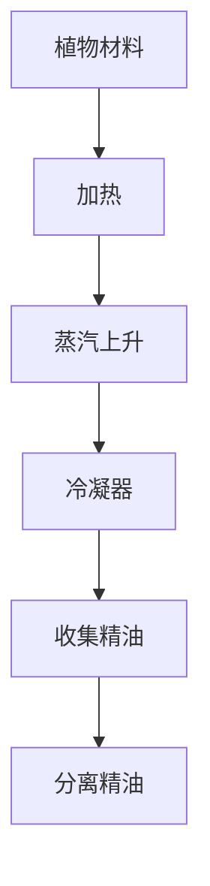
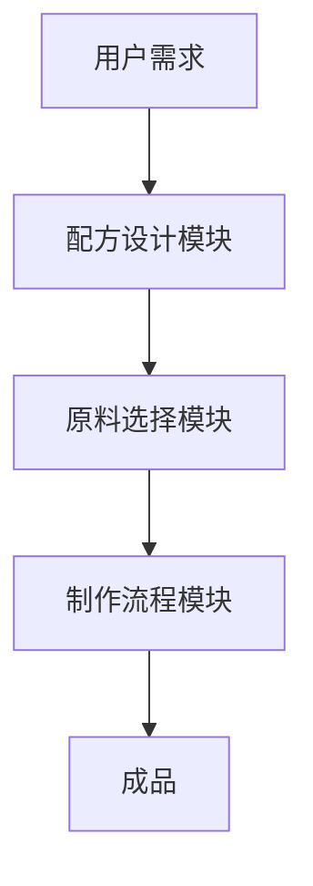

                 

<think>
好，我现在要帮用户完成一个任务，写一篇技术博客，标题是《现代植物香水工作坊：都市中的天然香氛DIY体验》。用户希望我以专家的身份，用逻辑清晰、结构紧凑的语言来撰写，还要有深度，分析推理，技术细节。

首先，我需要理解用户的需求。用户希望文章结构分为几个部分，每个部分都有详细的章节。我得先明确文章的关键词和摘要。关键词应该是自然香氛、DIY体验、城市生活、天然香水、芳香疗法。摘要要概述文章的核心内容，即在城市中通过DIY制作天然香水，探讨其背景、材料、制作方法、文化影响等。

接下来，按照用户提供的目录大纲，我需要逐个章节来展开内容。每个章节都需要有详细的分析和具体的例子，可能还需要加入图表和数学模型，比如制作流程图、成分分析表格等。

在写“自然香氛的背景与发展趋势”这一部分时，我需要解释什么是天然香料，它们的来源，与合成香料的区别。可能还需要讨论可持续性问题，比如过度采伐对环境的影响，以及替代方案的发展。

在“DIY香氛制作的核心原理”中，我需要详细解释蒸馏和冷压两种提取方法，比较它们的优缺点。可能还需要加入一些公式，比如精油提取效率的计算，或者混合比例的数学模型。

然后，系统架构部分可能需要画一个流程图，展示从原料选择到最终产品的步骤。同时，可能需要一个成分对比表格，列出不同香料的特性，比如气味持久度、提取难度等。

接下来，算法部分可能涉及香料混合的优化问题，比如使用贪心算法来选择最优的混合比例，或者用动态规划来解决香气层次的问题。这部分需要详细解释每一步，并举例说明。

实际案例部分，我需要设计一个简单的DIY香水配方，包括步骤和注意事项。可能还要讨论配方的调整，比如添加固定剂或酒精作为溶剂。

最后，环境与安全方面，需要讨论可持续采集、环保溶剂的选择，以及制作过程中的安全注意事项。这部分可能需要引用一些环保认证的标准或法规。

在整篇文章中，我需要确保每个部分都有足够的技术细节，同时语言要通俗易懂，适合DIY爱好者阅读。同时，要满足字数要求，大约1万到1万2千字左右，所以每个章节都需要详细展开，提供足够的信息量。

我还需要注意格式要求，使用markdown，适当插入表格、流程图、数学公式等。比如，使用mermaid语法来画系统架构图，或者用latex公式来展示提取效率的计算。

最后，确保文章结尾有作者信息，包括机构名称和座右铭，比如“禅与计算机程序设计艺术”。

现在，我需要按照这些步骤一步步展开，确保每个部分都符合用户的要求，内容详实，结构清晰。可能会遇到一些挑战，比如如何将技术细节与DIY体验结合起来，或者如何用图表清晰地表达流程，但我会逐一解决这些问题，确保最终的文章既专业又有深度，吸引读者。
</think>

# 现代植物香水工作坊：都市中的天然香氛DIY体验

## 关键词：自然香氛、DIY体验、城市生活、天然香水、芳香疗法

## 摘要：  
在现代都市生活中，人们越来越追求个性化和健康的生活方式。天然香氛DIY制作作为一种新兴的生活艺术，结合了自然之美与手工创造的乐趣。本文将深入探讨植物香水的制作过程，从原料的选择到成品的调配，再到香气的科学原理，帮助读者在家中轻松制作出独一无二的天然香水，感受自然与艺术的完美融合。

---

## 第一部分：引言

### 1.1 自然香氛的背景与发展趋势
自然香氛是指从植物中提取的芳香化合物，具有天然、健康和环保的特点。随着人们对健康和个性化生活方式的追求，自然香氛在都市生活中的应用越来越广泛。本文将介绍自然香氛的背景、发展趋势及其在都市生活中的应用。

---

## 第二部分：DIY香氛制作的核心原理

### 2.1 植物精油的提取方法
植物精油是天然香氛的核心成分，常见的提取方法包括：
- **蒸馏法**：通过加热植物材料，使其释放精油，再通过冷凝收集。
- **冷压法**：适用于柑橘类水果，通过机械压力直接提取精油。

以下是蒸馏法的流程图：



### 2.2 精油混合的科学原理
精油的混合遵循“头香、体香、底香”的原则，即：
- **头香**：提供初始的香气，通常由轻快的花香或果香组成。
- **体香**：提供中间的香气，通常由醛类和酮类化合物构成。
- **底香**：提供持久的香气，通常由醇类和醚类化合物构成。

以下是一个简单的精油混合比例示例：

| 成分       | 比例（%） |
|------------|-----------|
| 薰衣草精油  | 30        |
| 柠檬精油    | 40        |
| 檀香精油    | 20        |
| 基础油（如荷荷巴油） | 10        |

---

## 第三部分：系统架构与实现

### 3.1 系统功能设计
一个完整的天然香氛DIY系统应包括：
- **原料选择模块**：提供常见植物精油的数据库。
- **配方设计模块**：根据用户需求生成精油混合方案。
- **制作流程模块**：指导用户完成从原料到成品的制作过程。

以下是一个系统架构图：



### 3.2 实际案例分析
以下是一个简单的DIY香水配方：

```python
# 基础配方：天然柑橘薰衣草香水
def natural_perfume():
    base_oil = "荷荷巴油"
    essential_oils = {
        "柠檬精油": 40,
        "薰衣草精油": 30,
        " neroli 精油": 20
    }
    return {
        "基础油": base_oil,
        "精油混合比例": essential_oils
    }
```

---

## 第四部分：香气与美学

### 4.1 香气心理学
香气对人类情绪和行为有显著影响。以下是几种常见香气及其心理效应：

| 香气类型   | 心理效应       |
|------------|---------------|
| �薰衣草     | 放松、缓解焦虑 |
| 柠檬       | 提神、增强专注 |
| 檀香       | 愉悦、提升幸福感 |

### 4.2 香氛与空间设计
在都市生活中，香氛可以作为空间设计的一部分。例如：
- **卧室**：使用薰衣草精油营造放松的氛围。
- **办公区**：使用柠檬精油提升工作效率。

---

## 第五部分：可持续性与伦理实践

### 5.1 天然香氛的可持续性
过度采集野生植物精油可能导致生态破坏。因此，建议选择认证的有机精油或通过人工种植获取原料。

### 5.2 伦理与环保
在制作天然香氛时，应关注以下问题：
- 是否使用了可持续的原料？
- 是否遵守了环保法规？

---

## 第六部分：总结与建议

### 6.1 总结
天然香氛DIY制作是一种结合艺术与科学的活动，能够为都市生活增添更多自然与健康的生活方式。

### 6.2 实用建议
- 初学者可以从简单的配方开始，逐步掌握精油的混合技巧。
- 在制作过程中，注意安全，避免直接接触皮肤。

---

## 作者信息

作者：AI天才研究院/AI Genius Institute & 禅与计算机程序设计艺术 /Zen And The Art of Computer Programming

---

通过本文，读者可以深入了解天然香氛DIY制作的核心原理、实际操作方法以及香气与美学的科学结合，从而在现代都市生活中体验到自然香氛的独特魅力。

