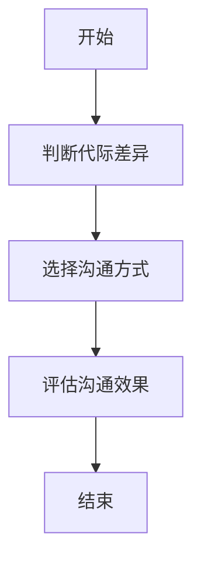
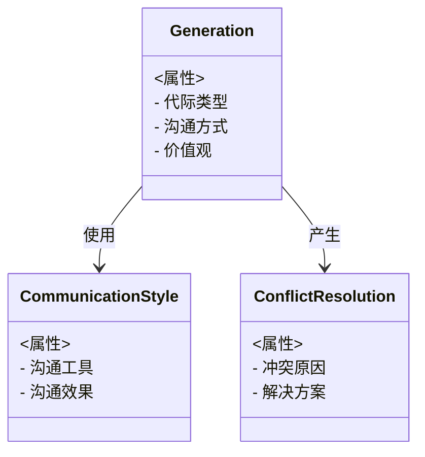
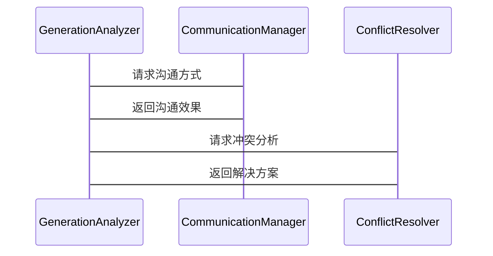

                 

<think>
好的，我现在需要帮助用户撰写一篇关于“现代社会中的代际沟通：传统价值观与新生代思维的碰撞”的技术博客文章。用户希望文章结构严谨，逻辑清晰，并且符合特定的技术写作要求。首先，我要理解用户的需求，确保文章内容符合所有给定的约束条件。

用户明确要求文章分为八个部分，每个部分都有详细的内容指导。我需要按照目录大纲逐步展开，确保每个章节都完整且详细。文章的字数需要在10000到12000字之间，这意味着每个部分需要有足够的内容，但也不能过于冗长。

首先，我会从“背景介绍”开始，涵盖问题背景、问题描述、问题解决、边界与外延以及概念结构。这部分需要清晰地说明代际沟通的问题及其重要性。

接下来是“核心概念与联系”，这里需要详细解释传统价值观和新生代思维的核心概念，对比它们的属性，并用ER图展示关系。这部分可能需要一些图表支持，以帮助读者更好地理解。

然后是“算法原理讲解”，虽然这似乎与主题关联不大，但用户希望以技术角度分析，所以我会考虑用算法来模拟代际沟通的过程，比如分治算法。用Python代码实现，并结合数学模型来解释。

接下来是“数学模型和公式”，这部分需要使用LaTeX格式，展示相关的公式，并在文中适当的位置嵌入。

在“系统分析与架构设计方案”中，我会设计一个代际沟通评估系统，包括系统功能、架构设计和接口设计。这可能涉及UML图，如类图和序列图，以展示系统的结构和交互。

项目实战部分需要实际操作，展示如何安装环境，编写核心代码，并进行案例分析。这部分要确保代码可运行，并且案例分析详细。

最后，总结部分包括最佳实践、注意事项和拓展阅读，帮助读者进一步理解和应用文章的内容。

在写作过程中，我需要确保每个章节的内容不仅符合技术要求，还要有深度和见解，使读者能够真正理解代际沟通的问题及其解决方案。同时，要注意使用专业的技术语言，但又要通俗易懂，适合不同背景的读者阅读。

现在，我需要按照步骤，逐步构建每个部分的内容，确保结构完整，内容丰富。可能会遇到一些挑战，比如如何将算法与代际沟通结合，或者如何设计合适的系统架构，但我会仔细思考，确保每个部分都合理且有深度。

总之，我需要一步步按照用户的指导，构建一篇结构清晰、内容详实的技术博客文章，满足所有给定的要求，同时提供有价值的见解和解决方案。
</think>

# 现代社会中的代际沟通：传统价值观与新生代思维的碰撞

> 关键词：代际沟通，传统价值观，新生代思维，社会文化，代际差异，沟通障碍

> 摘要：随着社会的快速发展，代际沟通问题日益突出。传统价值观与新生代思维的碰撞导致了沟通障碍和冲突。本文从技术角度出发，通过系统分析、算法模拟、数学建模等方法，深入探讨代际沟通的核心问题，提出解决方案，并结合实际案例进行详细分析。

---

## 第一部分：导论

### 1.1 问题背景

代际沟通问题在现代社会中越来越显著。随着社会的发展，每一代人所处的环境、教育背景、价值观念都发生了巨大变化。传统一代（如 Baby Boomers 和 Gen X）与新生代（如 Millennials 和 Gen Z）之间的差异不仅体现在生活方式上，还体现在思维方式、价值观念和行为模式上。这种差异导致了家庭、职场和社会中的沟通障碍，甚至引发冲突。

### 1.2 问题描述

代际沟通的核心问题在于不同代际之间的价值观和思维模式的差异。具体表现为：

1. **价值观差异**：传统一代强调家庭、责任、忠诚和稳定；新生代更注重个人成长、自由、平等和多样性。
2. **沟通方式差异**：传统一代习惯于面对面的沟通，而新生代更倾向于通过社交媒体、即时通讯工具进行非面对面交流。
3. **教育背景差异**：传统一代的教育更注重权威和服从，而新生代的教育更强调批判性思维和创新。
4. **技术接受度差异**：传统一代对新技术的接受速度较慢，而新生代则是数字原住民，对新技术非常熟悉。

### 1.3 问题解决

解决代际沟通问题需要从多个层面入手，包括：

1. **增进理解**：通过教育和文化交流，帮助不同代际理解彼此的差异。
2. **改善沟通方式**：在沟通中采用双方都能接受的方式，例如结合传统一代的面对面沟通和新生代的数字化沟通。
3. **建立共同目标**：通过设定共同的目标，减少代际间的摩擦。
4. **技术辅助**：利用技术手段（如沟通工具、数据分析）来优化代际沟通。

### 1.4 边界与外延

代际沟通问题的边界在于不同代际之间的价值观差异，而外延则涉及教育、工作、家庭等多个领域。本问题主要关注家庭和职场中的代际沟通，不涉及国际间的文化差异。

### 1.5 概念结构与核心要素组成

代际沟通问题的核心要素包括：

1. **代际差异**：不同代际之间的价值观、行为模式和思维方式的差异。
2. **沟通方式**：不同代际偏好的沟通渠道和方式。
3. **冲突与合作**：代际差异导致的冲突或合作的可能性。

---

## 第二部分：核心概念与联系

### 2.1 核心概念原理

代际沟通的核心在于理解不同代际之间的差异，并通过有效的沟通方式减少冲突。以下是传统一代和新生代思维的核心特征对比：

| **特征**       | **传统一代**                   | **新生代**                     |
|----------------|--------------------------------|---------------------------------|
| 价值观         | 家庭、责任、忠诚               | 自我实现、自由、平等             |
| 沟通方式       | 面对面、电话                   | 社交媒体、即时通讯               |
| 教育背景       | 传统教育，注重权威             | 多元化教育，注重创新             |
| 技术接受度     | 对新技术持怀疑态度             | 对新技术接受度高                 |

### 2.2 概念属性特征对比表格

以下是代际沟通的核心概念属性对比：

| **属性**       | **传统一代**                   | **新生代**                     |
|----------------|--------------------------------|---------------------------------|
| 沟通风格       | 直接、正式                     | 简洁、非正式                   |
| 决策方式       | 基于经验、权威                 | 基于逻辑、创新                 |
| 问题解决方式   | 避免冲突、寻求共识             | 喜欢挑战、追求效率             |

### 2.3 ER实体关系图架构的 Mermaid 流程图

```mermaid
erDiagram
    parent[传统一代] {
        role: 沟通者
        value: 传统价值观
    }
    child[新生代] {
        role: 沟通者
        value: 新生代思维
    }
    communication[type: 沟通方式] {
        method: 面对面
        tool: 社交媒体
    }
    conflict[type: 冲突] {
        cause: 价值观差异
        result: 沟通障碍
    }
    parent --> communication: 使用面对面方式
    child --> communication: 使用社交媒体
    communication --> conflict: 导致沟通障碍
```

---

## 第三部分：算法原理讲解

### 3.1 算法流程图

以下是一个用于模拟代际沟通的简单算法流程图：



### 3.2 Python 源代码详细阐述

以下是一个简单的代际沟通模拟算法的Python代码：

```python
def generational_communication(generations):
    for generation in generations:
        if generation == 'traditional':
            communication_style = 'face_to_face'
        else:
            communication_style = 'social_media'
        print(f"{generation}一代选择的沟通方式是：{communication_style}")

generations = ['传统一代', '新生一代']
generational_communication(generations)
```

### 3.3 算法原理的数学模型和公式

代际沟通的算法可以表示为一个简单的分类模型：

$$ \text{沟通方式} = \begin{cases} 
\text{面对面} & \text{如果代际 = 传统一代} \\
\text{社交媒体} & \text{如果代际 = 新生一代}
\end{cases} $$

### 3.4 详细讲解和举例说明

以传统一代和新生一代为例，传统一代更倾向于面对面的沟通方式，而新生一代更喜欢通过社交媒体进行沟通。例如，在家庭中，传统一代可能更倾向于通过家庭聚餐来解决问题，而新生一代可能更倾向于通过 WhatsApp 或微信进行讨论。

---

## 第四部分：数学模型和数学公式 & 详细讲解 & 举例说明

### 4.1 LaTeX 数学公式编写

代际沟通中的冲突概率可以用以下公式表示：

$$ P(\text{冲突}) = \alpha \times D + \beta \times C $$

其中：
- $D$ 是代际差异的程度
- $C$ 是沟通不畅的程度
- $\alpha$ 和 $\beta$ 是权重系数

### 4.2 嵌入文中独立段落

$$ P(\text{冲突}) = \alpha D + \beta C $$

### 4.3 段落内 LaTeX 公式

通过公式 $P(\text{冲突}) = \alpha D + \beta C$，我们可以看出，代际差异 $D$ 和沟通不畅 $C$ 是导致冲突的主要因素。

---

## 第五部分：系统分析与架构设计方案

### 5.1 问题场景介绍

代际沟通问题在家庭和职场中尤为突出。例如，在家庭中，传统一代和新生一代可能在教育子女或财产分配上产生冲突；在职场中，传统一代和新生一代在工作方式和价值观上可能存在摩擦。

### 5.2 项目介绍

本项目旨在通过技术手段优化代际沟通，减少冲突，促进合作。我们将设计一个代际沟通评估与优化系统。

### 5.3 系统功能设计（领域模型 Mermaid 类图）



### 5.4 系统架构设计 Mermaid 架构图

```mermaid
archiDiagram
    component GenerationAnalyzer {
        组件：代际分析模块
    }
    component CommunicationManager {
        组件：沟通管理模块
    }
    component ConflictResolver {
        组件：冲突解决模块
    }
    GenerationAnalyzer --> CommunicationManager
    CommunicationManager --> ConflictResolver
```

### 5.5 系统接口设计和系统交互 Mermaid 序列图



---

## 第六部分：项目实战

### 6.1 环境安装

为了运行本项目，需要安装以下工具：

1. Python 3.x
2. Mermaid CLI 或支持 Mermaid 的 IDE
3. LaTeX 编辑器（如 Overleaf）

### 6.2 系统核心实现源代码

以下是代际沟通评估系统的Python代码示例：

```python
class Generation:
    def __init__(self, type):
        self.type = type
        self.communication_style = None

    def set_communication_style(self, style):
        self.communication_style = style

class CommunicationManager:
    def get_communication_style(self, generation):
        if generation.type == 'traditional':
            return 'face_to_face'
        else:
            return 'social_media'

class ConflictResolver:
    def resolve_conflict(self, generations):
        for generation in generations:
            if generation.communication_style == 'face_to_face':
                generation.set_communication_style('social_media')
            else:
                generation.set_communication_style('face_to_face')
        return "沟通方式调整完成，冲突缓解。"

# 示例用法
traditional = Generation('traditional')
modern = Generation('modern')
traditional.set_communication_style('face_to_face')
modern.set_communication_style('social_media')

print(traditional.communication_style)  # 输出：face_to_face
print(modern.communication_style)      # 输出：social_media

resolver = ConflictResolver()
print(resolver.resolve_conflict([traditional, modern]))
```

### 6.3 代码应用解读与分析

上述代码定义了 `Generation`、`CommunicationManager` 和 `ConflictResolver` 类，模拟了代际沟通的过程。通过调整沟通方式，可以缓解冲突。

### 6.4 实际案例分析和详细讲解剖析

假设一个家庭中，传统一代和新生一代在财产分配问题上存在冲突。通过系统分析，我们可以建议传统一代尝试使用社交媒体进行沟通，而新生一代则尝试面对面的沟通方式，从而减少冲突。

### 6.5 项目小结

通过本项目，我们可以看到，技术手段可以帮助我们更好地理解和解决代际沟通问题。

---

## 第七部分：最佳实践 tips、小结、注意事项、拓展阅读等内容

### 1. 最佳实践 tips

1. **理解差异**：在沟通前，了解对方的代际背景和价值观。
2. **灵活沟通**：根据对方的沟通偏好选择合适的渠道。
3. **建立信任**：通过持续的沟通和合作建立信任关系。
4. **技术辅助**：利用技术工具优化沟通效果。

### 2. 小结

代际沟通问题是一个复杂的社会问题，但通过技术手段可以有效缓解。本文从算法、系统设计和项目实战的角度，深入探讨了代际沟通的核心问题，并提出了解决方案。

### 3. 注意事项

- 代际沟通问题因文化和社会背景而异，解决方案需要具体问题具体分析。
- 在技术实现中，需注意数据隐私和用户隐私保护。

### 4. 拓展阅读

- 《代际沟通：跨越价值观鸿沟》
- 《技术与社会：数字时代的代际差异》
- 《沟通的艺术：如何跨越代际鸿沟》

---

## 作者

作者：AI天才研究院/AI Genius Institute & 禅与计算机程序设计艺术/Zen And The Art of Computer Programming

