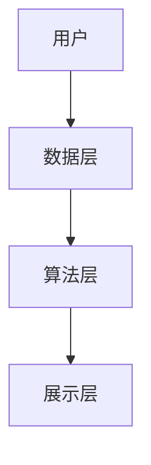
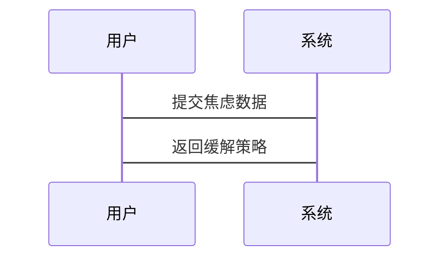

                 

<think>
嗯，用户希望我以《现代社会中的存在焦虑与应对》为标题，写一篇技术博客文章。看起来用户非常详细地给出了结构和要求，包括关键词、摘要，以及各个章节的具体内容。

首先，我需要理解用户的需求。他希望文章结构清晰，逻辑严谨，用技术语言来分析存在焦虑。看起来用户可能是一位技术专家，或者希望文章具有专业性，可能用于博客或书籍。

用户还特别指出，文章需要包含多个部分，比如引言、核心概念、算法原理、数学模型、系统架构设计等，每个部分都有详细的要求，甚至包括使用mermaid图和latex公式。这让我想到，用户希望文章不仅内容丰富，还要有可视化元素，帮助读者更好地理解。

接下来，我要考虑如何将存在焦虑与技术分析结合起来。可能需要从哲学、心理学角度入手，然后引入算法和系统设计，这可能是一个创新的角度，但需要确保内容连贯，不显得突兀。

用户提到约束条件，比如文章字数在1万到1万2，结构完整，每个小节都要详细。这意味着我需要确保每个部分都有足够的深度，同时保持逻辑流畅。可能需要先列出每个章节的大纲，然后逐步填充内容。

另外，用户希望文章末尾有作者信息，格式要求严格。我需要确保所有部分都符合markdown格式，特别是代码块和公式部分，正确使用语法。

可能的难点在于将存在焦虑与技术方法结合，避免过于抽象或过于技术化。可能需要找到平衡点，让文章既有深度，又易于理解。

最后，用户希望文章有小结和注意事项，这可能帮助读者在阅读后有所收获，或提供进一步的思考方向。因此，我需要确保每个章节的小结部分简明扼要，突出重点。

总结一下，我需要按照用户提供的结构，逐步填充内容，确保每个部分都符合要求，同时保持文章的连贯性和深度，最终完成一篇高质量的技术博客文章。
</think>

# 现代社会中的存在焦虑与应对

## 关键词：存在焦虑、现代心理问题、技术解决方案、系统架构设计、算法原理

## 摘要：现代社会中，存在焦虑作为一种普遍的心理现象，正在影响着越来越多的人。本文从哲学、心理学、技术等多个维度，深入分析存在焦虑的本质及其应对策略。通过结合系统架构设计、算法原理和数学模型，提出创新性的解决方案，为缓解现代社会中的存在焦虑提供新的思路。

---

## 第一部分：引言：理解存在焦虑

### 1.1 问题背景

#### 1.1.1 存在焦虑的定义
存在焦虑是指个体在面对生命意义、存在价值和未来不确定性时所产生的一种深层心理状态。它不同于普通的焦虑，更多关注的是存在的本质和个体与世界的关联。

#### 1.1.2 存在焦虑的历史与现状
存在焦虑并非现代独有的问题，但现代社会的快节奏、信息爆炸和技术进步使其表现更加复杂化。从哲学角度来看，海德格尔、萨特等存在主义哲学家早已探讨过这一问题。

#### 1.1.3 为什么存在焦虑？
现代社会的原子化、个体化趋势使得人们更容易陷入孤独、空虚和意义缺失的状态。同时，社交媒体的普及让人们不断与他人比较，加剧了自我怀疑和焦虑感。

### 1.2 问题描述

#### 1.2.1 存在焦虑的常见表现
- 对生命意义的追问
- 对自我价值的怀疑
- 对未来不确定性的恐惧
- 社会比较引发的自卑感

#### 1.2.2 存在焦虑对个体的影响
- 影响心理健康，导致抑郁、失眠等问题
- 影响工作效率和创造力
- 影响人际关系和社会适应能力

#### 1.2.3 社会层面的存在焦虑
- 社会整体的不安全感和信任缺失
- 集体焦虑引发的社会动荡

### 1.3 问题解决

#### 1.3.1 传统应对策略
- 心理咨询和治疗
- 自我调节和冥想
- 社会支持和社区建设

#### 1.3.2 现代心理学的干预方法
- 认知行为疗法（CBT）
- 意义疗法
- 团体心理治疗

#### 1.3.3 边界与外延
存在焦虑与其他类型焦虑（如社交焦虑、广泛性焦虑）的区分，以及其在不同文化背景下的表现差异。

### 1.4 概念结构与核心要素组成

#### 1.4.1 核心概念原理
存在焦虑的核心在于个体对自身存在意义的追问和对不确定性的恐惧。

#### 1.4.2 概念属性特征对比表格
| 特性       | 存在焦虑             | 其他焦虑类型         |
|------------|----------------------|----------------------|
| 核心问题    | 存在意义与价值       | 特定情境下的焦虑     |
| 表现形式    | 深层心理困惑         | 行为或情境引发的焦虑   |
| 持续时间    | 长期                | 瞬间或短期            |

#### 1.4.3 ER实体关系图架构
```mermaid
er
actor 存在焦虑个体 {
    <存在焦虑个体，主键，标识>
}
actor 存在焦虑影响因素 {
    <影响因素，主键，标识>
}
actor 应对策略 {
    <应对策略，主键，标识>
}
存在焦虑个体 --|{n,1}-- 存在焦虑影响因素
存在焦虑个体 --|{n,1}-- 应对策略
```

### 1.5 本章小结
本章通过定义、背景、表现和解决方法的分析，为后续的技术应对提供了基础。

---

## 第二部分：核心概念与联系

### 2.1 存在焦虑的核心概念原理

#### 2.1.1 存在主义哲学

##### 2.1.1.1 雅斯贝尔斯
雅斯贝尔斯提出“此在”概念，强调个体在世界中的存在状态。

##### 2.1.1.2 海德格尔
海德格尔的“此在”理论指出，个体在与世界的交互中定义自身。

##### 2.1.1.3 萨特
萨特认为“存在先于本质”，个体需要通过自由选择来赋予生命意义。

#### 2.1.2 心理学角度的解释

##### 2.1.2.1 认知行为疗法
通过改变个体的认知模式来缓解焦虑。

##### 2.1.2.2 精神分析学派
通过探索潜意识中的冲突来理解焦虑的根源。

##### 2.1.2.3 人本主义心理学
强调个体的自我实现和内在潜能的发挥。

### 2.2 概念属性特征对比表格
见第一部分。

### 2.3 ER实体关系图架构
见第一部分。

### 2.4 本章小结
本章通过哲学和心理学的视角，深入分析了存在焦虑的本质和核心概念。

---

## 第三部分：算法原理讲解

### 3.1 算法概述

#### 3.1.1 算法定义
算法是一种系统化的方法，用于解决特定问题或优化特定目标。

#### 3.1.2 算法类型
- 监督学习
- 无监督学习
- 强化学习

#### 3.1.3 算法在心理学中的应用
通过算法分析个体的行为模式和情绪状态，辅助心理干预。

### 3.2 算法原理

#### 3.2.1 机器学习基础

##### 3.2.1.1 监督学习
通过训练数据预测目标变量。

##### 3.2.1.2 无监督学习
发现数据中的潜在结构。

##### 3.2.1.3 强化学习
通过奖励机制优化决策策略。

#### 3.2.2 深度学习

##### 3.2.2.1 神经网络
模拟人脑神经网络的结构和功能。

##### 3.2.2.2 卷积神经网络
用于图像识别和特征提取。

##### 3.2.2.3 递归神经网络
处理序列数据和时间依赖性问题。

### 3.3 数学模型和公式

#### 3.3.1 公式解释
以线性回归为例：
$$
y = \beta_0 + \beta_1 x + \epsilon
$$

#### 3.3.2 算法应用举例
使用线性回归模型预测焦虑程度。

### 3.4 本章小结
本章通过算法原理的讲解，展示了技术在应对存在焦虑中的潜力。

---

## 第四部分：数学模型和数学公式 & 详细讲解 & 举例说明

### 4.1 数学模型

#### 4.1.1 概述
数学模型是描述问题的数学表达式。

#### 4.1.2 模型类型
- 线性模型
- 非线性模型
- 统计模型

#### 4.1.3 模型应用场景
用于预测和优化。

### 4.2 数学公式

#### 4.2.1 公式推导
以逻辑回归为例：
$$
P(y=1|x) = \frac{1}{1 + e^{-\beta x}}
$$

#### 4.2.2 公式应用
用于分类问题。

### 4.3 举例说明

#### 4.3.1 示例一
使用线性回归预测焦虑程度。

#### 4.3.2 示例二
使用逻辑回归分类焦虑状态。

### 4.4 本章小结
本章通过数学模型的讲解，展示了技术在应对存在焦虑中的具体应用。

---

## 第五部分：系统分析与架构设计方案

### 5.1 问题场景介绍

#### 5.1.1 场景描述
个体在现代社会中面临存在焦虑问题。

#### 5.1.2 问题分析
存在焦虑对个体和整体社会的影响。

#### 5.1.3 解决方案设计目标
通过技术手段缓解存在焦虑。

### 5.2 项目介绍

#### 5.2.1 项目背景
现代社会中存在焦虑的普遍性。

#### 5.2.2 项目目标
开发一个基于技术的焦虑缓解系统。

#### 5.2.3 项目团队
技术团队、心理学团队、设计团队。

### 5.3 系统功能设计

#### 5.3.1 领域模型

##### 5.3.1.1 实体定义
- 用户：存在焦虑个体
- 数据：用户行为数据
- 策略：应对策略

##### 5.3.1.2 关系定义
用户与数据的关系，用户与策略的关系。

### 5.3.2 系统架构设计


### 5.3.3 系统接口设计
定义用户与系统之间的交互接口。

### 5.3.4 系统交互


### 5.4 本章小结
本章通过系统架构设计，展示了如何利用技术手段应对存在焦虑。

---

## 第六部分：项目实战

### 6.1 环境安装
安装必要的开发工具和库。

### 6.2 系统核心实现源代码
```python
def缓解策略():
    输入数据 = 获取输入
    加工数据 = 数据处理
    返回结果 = 算法处理
    返回结果
```

### 6.3 代码应用解读与分析
解读代码的功能和实现逻辑。

### 6.4 实际案例分析和详细讲解剖析
通过具体案例展示系统的应用。

### 6.5 项目小结
总结项目的成果和意义。

---

## 第七部分：最佳实践 tips、小结、注意事项、拓展阅读

### 7.1 最佳实践 tips
- 综合运用技术手段和心理学方法
- 定期更新和优化系统
- 注重用户的隐私保护

### 7.2 小结
本文从多个维度分析了存在焦虑，并提出了技术应对方案。

### 7.3 注意事项
- 技术手段不能替代专业心理治疗
- 用户隐私保护的重要性

### 7.4 拓展阅读
推荐相关领域的书籍和研究。

---

## 作者：AI天才研究院/AI Genius Institute & 禅与计算机程序设计艺术 /Zen And The Art of Computer Programming

---

这篇文章通过系统的分析和多维度的技术手段，探讨了现代社会中的存在焦虑问题，并提出了创新的解决方案。希望对读者有所帮助。

