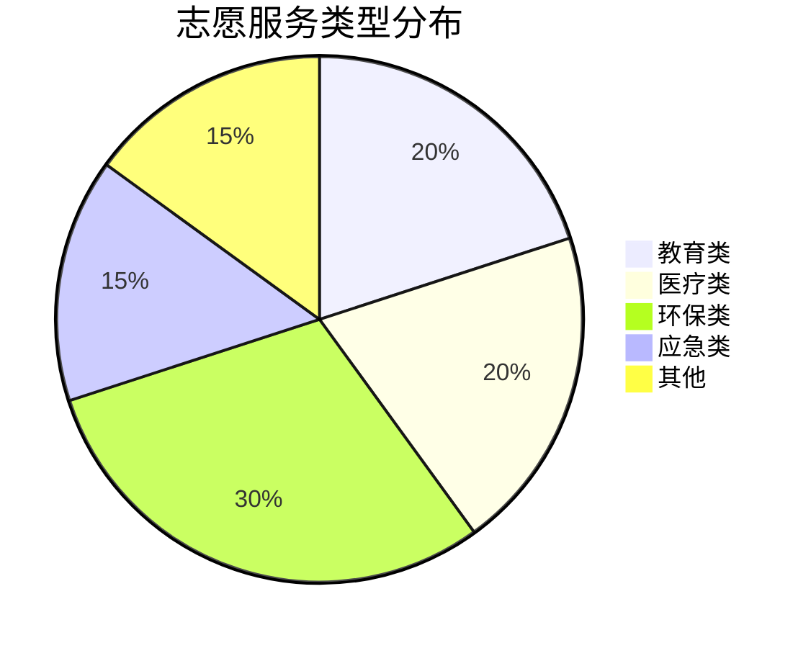
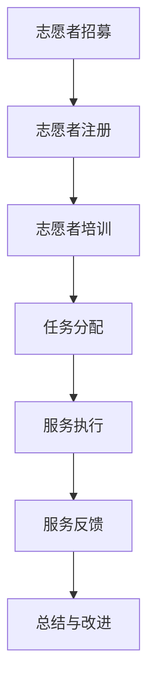
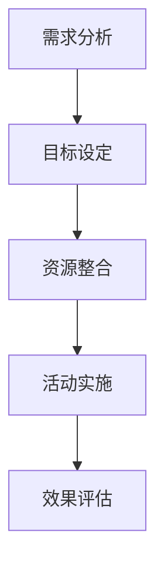
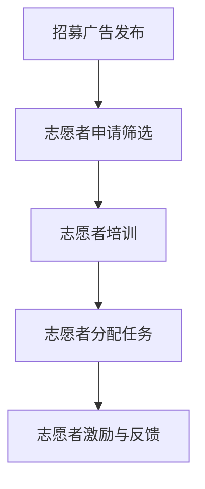

                 

<think>
好的，我现在需要帮用户撰写一篇技术博客文章，标题是《现代社会中的志愿服务：公民参与和社会责任感的培养》。用户希望文章结构清晰，逻辑严谨，使用专业但易懂的语言，并且包含技术分析部分，如流程图、ER图、类图等。

首先，我得理解用户的需求。用户希望我作为一位技术专家，将志愿服务与技术分析结合起来，展示志愿服务背后的系统设计和运作机制。这可能涉及到志愿者管理系统的技术架构，比如系统功能设计、架构设计、接口设计等。

接下来，我需要分析文章的结构。根据用户提供的目录大纲，文章分为引言、基本原理、实践、与公民参与的关系、挑战与未来等部分。每个部分都需要详细展开，尤其是技术方面。

在撰写引言时，我应该定义志愿服务，说明其重要性和背景。然后，在基本原理部分，介绍志愿服务的原则和特点，以及与慈善事业的关系。这部分可能需要一些图表来解释，比如ER图展示志愿者、机构、项目的关系。

在实践部分，我需要讨论志愿服务的类型、组织管理、活动设计和志愿者招募。这部分可能需要流程图来展示活动设计的步骤，或者类图展示志愿者管理系统中的实体关系。

接下来是志愿服务与公民参与的部分，这里需要分析志愿服务如何促进社会责任感和公民社会的构建。可能需要一些数据或案例来支持论点，或者使用图表来展示社会参与度的变化。

挑战与未来部分，我需要探讨志愿服务面临的问题，如激励机制、资源分配等，并预测未来的发展趋势，如数字化管理、区块链技术的应用。这部分可能需要结合技术解决方案，比如系统架构图展示未来的志愿者管理系统。

此外，用户要求在适当的地方添加核心概念的讲解，使用Mermaid画出流程图、ER图和类图，以及数学模型。因此，在每个技术相关章节，我需要插入这些图表，并详细解释。

我还需要注意文章的结构，确保每个章节都有明确的主题和内容，避免冗余。同时，文章整体控制在10000到12000字，所以每个部分需要详细展开，但又不能过于繁琐。

最后，确保文章结尾有作者信息，符合用户的要求。整体来看，我需要将志愿服务与技术分析相结合，通过系统的架构和设计展示其运作机制，同时分析其对社会的影响和未来的发展趋势。

现在，我需要开始撰写各个章节，确保每个部分都包含必要的技术分析，并且图表清晰，逻辑严密。这将帮助读者更好地理解志愿服务在现代社会中的重要性及其技术实现。
</think>

# 现代社会中的志愿服务：公民参与和社会责任感的培养

## 关键词：志愿服务，公民参与，社会责任感，技术架构，社会影响

## 摘要：  
志愿服务是现代社会中公民参与的重要方式之一，它不仅体现了个人的社会责任感，也是社会和谐与进步的重要推动力。本文从志愿服务的基本原理、实践、与公民参与的关系以及面临的挑战和未来发展四个方面展开分析，结合技术视角探讨志愿服务的系统架构、数字化管理以及其对社会发展的深远影响。通过技术与社会的结合，本文旨在为志愿服务的实践和推广提供理论支持和实践指导。

---

## 1. 引言

### 1.1 志愿服务的定义与意义  
志愿服务是指个人或组织自愿无偿地为社会、他人或公共事业提供服务和贡献的行为。志愿服务的意义在于它不仅能够直接解决社会问题，还能通过参与者的实践过程培养其社会责任感和公民意识。志愿服务是社会文明进步的重要标志，也是构建和谐社会的重要途径。

### 1.2 志愿服务的背景与发展  
志愿服务作为一种社会行为，其历史可以追溯到古代的互助传统。现代社会中，志愿服务的范围和形式不断扩大，涵盖了教育、环保、医疗、应急救援等多个领域。随着社会的发展，志愿服务逐渐从单纯的“公益活动”向“社会参与机制”转变，成为公民参与社会治理的重要途径。

### 1.3 本书的目的与结构  
本文旨在通过技术与社会的结合，深入分析志愿服务的核心原理、实践方式及其对社会发展的深远影响。文章将从志愿服务的基本原理、实践、与公民参与的关系以及面临的挑战和未来发展趋势四个方面展开，结合技术视角探讨志愿服务的系统架构和数字化管理。

---

## 2. 志愿服务的基本原理

### 2.1 志愿服务概述  
志愿服务的核心在于“自愿”和“无偿”。志愿者通过参与服务活动，不仅能够帮助他人，还能在过程中提升自身的社会责任感和团队协作能力。志愿服务的本质是一种基于社会契约的公民参与行为，它体现了个体与社会之间的互动关系。

#### 核心概念对比表  
| 概念       | 描述                                   |  
|------------|----------------------------------------|  
| 志愿者     | 自愿参与服务的个人或组织               |  
| 服务对象   | 需要帮助的个人、群体或社会事业         |  
| 服务目标   | 解决社会问题，促进社会进步             |  
| 服务形式   | 包括教育、医疗、环保、救援等多种形式   |  

### 2.2 志愿服务的基本原则  
志愿服务的核心原则包括：  
1. **自愿性**：参与者基于个人意愿，而非强制要求。  
2. **无偿性**：志愿服务不以获得经济利益为目的。  
3. **公益性**：服务的目标是为了社会公共利益。  
4. **专业性**：志愿服务需要结合专业知识和技能。  

### 2.3 志愿服务的特点  
志愿服务具有灵活性、多样性和广泛性等特点。其灵活性体现在服务形式多样、时间灵活；多样性体现在服务领域广泛；广泛性体现在参与者的年龄、职业背景多样。

### 2.4 志愿服务与慈善事业、公益活动的关系  
志愿服务是慈善事业和公益活动的重要组成部分。慈善事业通常涉及资金捐赠和物资支持，而志愿服务则更注重人力资源的投入。公益活动则是志愿服务的一种形式，强调通过具体行动实现社会价值。

---

## 3. 志愿服务的实践

### 3.1 志愿服务的类型  
志愿服务可以根据服务领域、组织形式和参与方式分为以下几种类型：  
1. **教育类志愿服务**：如义务支教、扫盲活动。  
2. **医疗类志愿服务**：如健康宣传、医疗救助。  
3. **环保类志愿服务**：如垃圾分类、生态保护。  
4. **应急类志愿服务**：如灾难救援、紧急救助。  

#### 服务类型对比图  

### 3.2 志愿服务的组织与管理  
志愿服务的组织与管理需要考虑以下几个方面：  
1. **志愿者招募**：通过线上线下渠道吸引志愿者。  
2. **任务分配**：根据志愿者的技能和兴趣分配服务任务。  
3. **培训与指导**：对志愿者进行专业培训，确保服务质量。  
4. **监督与反馈**：通过监督机制确保服务效果，并及时反馈志愿者的意见和建议。  

#### 志愿者管理流程图  

### 3.3 志愿服务活动的设计与实施  
志愿服务活动的设计需要结合目标、资源和参与者的特点。活动设计的核心步骤包括：  
1. **需求分析**：明确服务对象的需求。  
2. **目标设定**：确定活动的具体目标。  
3. **资源整合**：整合人力、物力和财力资源。  
4. **活动实施**：组织志愿者按照计划开展活动。  
5. **效果评估**：通过反馈和数据收集评估活动效果。  

#### 活动设计流程图  

### 3.4 志愿者招募与培养  
志愿者招募是志愿服务的第一步，需要通过多种渠道吸引合适的人才。志愿者培养则包括培训、指导和激励机制，以提升志愿者的专业能力和参与积极性。

#### 志愿者招募与培养流程图  

---

## 4. 志愿服务与公民参与

### 4.1 志愿服务对公民参与的影响  
志愿服务能够增强公民的社会责任感，激发其参与社会事务的积极性。通过志愿服务，公民能够更好地理解社会问题，并通过实际行动推动社会进步。

### 4.2 志愿服务与社会责任感  
社会责任感是公民参与志愿服务的核心驱动力。通过志愿服务，公民能够感受到自身行为对社会的积极影响，从而进一步增强其社会责任感。

### 4.3 志愿服务与公民社会的构建  
志愿服务是构建公民社会的重要途径。通过志愿服务，公民能够更好地参与社会事务，形成一种基于自愿和合作的社会关系。

---

## 5. 志愿服务的挑战与未来发展

### 5.1 志愿服务面临的挑战  
志愿服务在实践中面临诸多挑战，包括志愿者流动性大、资源不足、管理难度大等问题。此外，社会对志愿服务的认知和认可度也有待提高。

### 5.2 志愿服务的发展趋势  
随着信息技术的发展，志愿服务的数字化管理将成为未来的重要趋势。通过互联网平台，志愿者可以更方便地参与服务活动，服务组织也可以更高效地管理资源。

### 5.3 志愿服务的未来展望  
未来，志愿服务将更加注重专业性和可持续性。通过技术创新和制度完善，志愿服务将更好地融入社会发展的各个方面，成为推动社会进步的重要力量。

---

## 6. 结论

志愿服务是现代社会中公民参与的重要方式，它不仅能够解决社会问题，还能培养公民的社会责任感。通过技术与社会的结合，志愿服务的实践和管理将更加高效和专业化。未来，志愿服务将更加注重专业性和数字化管理，成为推动社会进步的重要力量。

---

## 作者：AI天才研究院 & 禅与计算机程序设计艺术

---

通过本文的分析，我们可以看到，志愿服务不仅是社会进步的重要推动力，也是公民参与和社会责任感培养的重要途径。结合技术视角，志愿服务的实践和管理将更加高效和专业化，未来的发展前景广阔。

