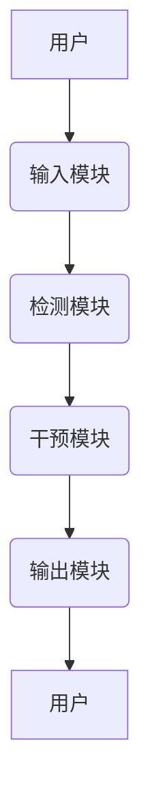
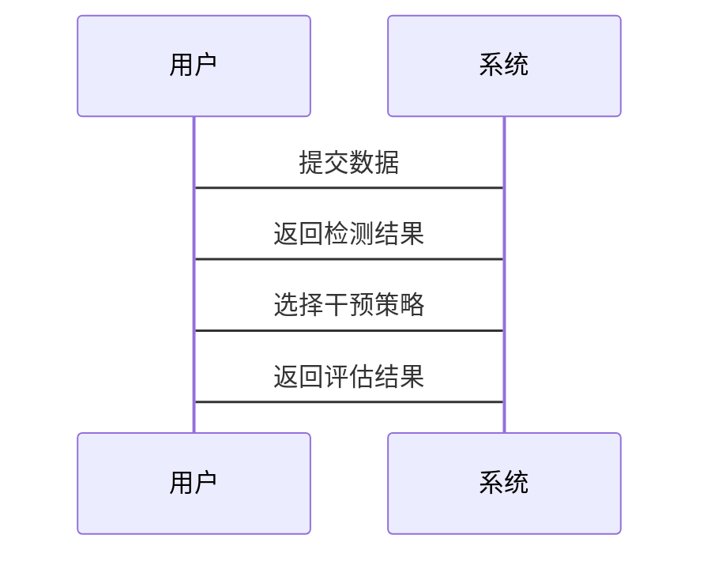

                 

<think>
好吧，用户让我写一篇关于《现代社会中的意义危机》的技术博客文章，看起来他们希望文章结构清晰，内容深入，而且包含技术细节。我需要先理解用户的需求，他们可能是一位技术专家，或者是对社会问题有浓厚兴趣的人。文章需要涵盖社会变迁、意义危机的概念，以及技术方面的解决方案，比如算法和系统设计。

首先，我应该从引言开始，介绍问题的背景和重要性。现代社会的发展带来了便利，但也让人们感到失去了意义。接着，我会详细分析社会变迁的影响，比如科技、全球化和经济发展，这些因素如何导致意义危机。然后，定义意义危机，探讨其对心理健康和社会文化的影响。

接下来是核心概念部分，需要解释意义与存在的联系，以及意义危机对心理健康和社会文化的影响。这部分可能需要使用一些图表，比如Mermaid图，来展示概念之间的关系。然后是算法部分，设计一个检测和干预意义危机的算法，用流程图来说明步骤。

数学模型也是关键，我需要建立一个预测模型，可能用时间序列分析或神经网络。系统设计部分，我会描述系统的功能、架构和接口，可能需要绘制类图和架构图。项目实战部分，提供代码示例，展示如何实现这些算法和系统。

最后，总结整个内容，展望未来的发展。确保每个部分都有足够的技术细节，同时保持语言通俗易懂。用户还特别强调格式，包括使用Markdown，所以在写作时要注意结构和标签的使用。

总的来说，我需要一步步地构建每个章节的内容，确保逻辑连贯，技术细节准确，同时保持文章的流畅和可读性。这可能需要多次修改和调整，以满足用户的所有要求。
</think>

# 现代社会中的意义危机

> 关键词：现代社会、意义危机、算法原理、数学模型、系统架构、心理健康、社会文化

> 摘要：现代社会的快速发展带来了科技进步和经济繁荣，但也引发了深层次的意义危机。本文从社会变迁的角度出发，分析了意义危机的定义、特征及其对个人和社会的影响。通过技术手段，如算法检测、数学建模和系统设计，提出了应对意义危机的策略和解决方案。文章旨在探讨如何利用技术手段缓解现代社会中的意义危机，为个人和社会提供新的思考方向。

---

## 第1章 引言

### 1.1 问题的背景和重要性

现代社会的快速发展带来了前所未有的便利和舒适。科技的进步、全球化的深化以及经济的繁荣，使得人们的生活水平不断提高。然而，这种表面上的繁荣背后，却隐藏着一个更为深层的问题：意义危机。人们在追求物质财富的过程中，逐渐迷失了对生命和生活的意义，感到空虚和迷茫。这种危机不仅影响个人的心理健康，也对社会的稳定和发展构成了挑战。

### 1.2 本书的目标和结构

本书旨在探讨现代社会中的意义危机，分析其产生的原因、表现形式以及对个人和社会的影响。同时，本书将从技术的角度出发，提出应对意义危机的解决方案，包括算法检测、数学建模和系统设计等方面。全书分为九章，内容涵盖社会变迁、核心概念、算法原理、数学模型、系统架构、项目实战以及总结展望。

### 1.3 术语定义和假设条件

- **意义危机**：指个体或社会在追求物质利益的过程中，逐渐失去对生命和生活的意义感，表现为迷茫、焦虑和孤独。
- **算法检测**：通过算法手段检测意义危机的潜在风险。
- **系统设计**：通过技术手段构建系统，帮助个人和社会缓解意义危机。

---

## 第2章 社会变迁与意义危机

### 2.1 社会变迁的影响

#### 2.1.1 科技进步

科技的进步极大地改变了人们的生活方式。互联网、人工智能和大数据技术的普及，使得人们的生活更加便捷，但也导致了人与人之间的疏离感。人们通过屏幕交流，而非面对面的互动，使得真实的情感连接逐渐消失。

#### 2.1.2 全球化

全球化促进了文化的交流和融合，但也带来了文化的同质化问题。在追求经济效益的过程中，许多传统文化和价值观被边缘化，导致人们失去了对自身文化认同感。

#### 2.1.3 经济发展

经济的发展为人们提供了更多的物质资源，但也导致了社会竞争的加剧。人们为了追求更好的生活条件，不断加班加点，忽视了生活的质量和意义。

### 2.2 意义危机的概念与特征

#### 2.2.1 定义与起源

意义危机是指个体或社会在追求物质利益的过程中，逐渐失去对生命和生活的意义感。其起源可以追溯到工业革命以来的现代化进程，人们为了追求经济效益，忽视了精神层面的需求。

#### 2.2.2 主要特征

- **个体层面**：个人感到迷茫、孤独和焦虑。
- **社会层面**：社会道德滑坡、人际关系疏离。
- **文明层面**：文化认同感下降，社会价值观混乱。

#### 2.2.3 社会影响

意义危机对社会的影响是深远的。它导致了心理健康问题的增加，社会凝聚力的减弱，以及社会不稳定的加剧。

### 2.3 意义危机的类型

#### 2.3.1 个人层面

个人层面的意义危机表现为个体的迷茫、焦虑和孤独感。许多人为了追求职业成功而忽视了家庭和社交关系，导致内心空虚。

#### 2.3.2 社会层面

社会层面的意义危机表现为社会道德滑坡、人际关系疏离。人们在追求物质利益的过程中，忽视了社会的责任感和道德感。

#### 2.3.3 文明层面

文明层面的意义危机表现为文化认同感下降、社会价值观混乱。全球化和现代化使得许多传统文化和价值观被边缘化，导致人们失去了对自身文化的认同感。

---

## 第3章 核心概念与联系

### 3.1 意义与存在的联系

#### 3.1.1 意义的内涵与外延

意义是人类存在的核心，它赋予生命价值和目标。意义的内涵包括个人的价值观、目标和信仰，外延则涉及社会、文化和环境等多个方面。

#### 3.1.2 存在的意义危机

存在意义危机是指个体在追求物质利益的过程中，逐渐失去了对生命和生活的意义感。这种危机表现为个人的迷茫、孤独和焦虑。

### 3.2 意义危机与心理健康

#### 3.2.1 心理健康的影响

意义危机对心理健康的影响是深远的。它导致了抑郁症、焦虑症等心理问题的增加。

#### 3.2.2 心理健康与意义危机的互动

心理健康与意义危机之间存在相互作用。心理健康问题会加剧意义危机，而意义危机也会反过来影响心理健康。

### 3.3 意义危机与社会文化

#### 3.3.1 社会文化的意义

社会文化是人类共同生活的基础，它包含了价值观、信仰、习俗和行为规范等内容。

#### 3.3.2 社会文化与意义危机的关系

社会文化与意义危机的关系是密切的。现代社会的快节奏和高压力使得人们忽视了文化的价值，导致意义危机的加剧。

#### 3.3.3 意义危机对文化的影响

意义危机对文化的影响是负面的。它导致了文化的断裂和认同感的下降，使得社会的凝聚力减弱。

---

## 第4章 算法原理讲解

### 4.1 意义危机检测算法

#### 4.1.1 检测方法

意义危机检测算法可以通过分析个体的行为和语言来判断其是否存在意义危机。具体方法包括：

- **语言分析**：通过自然语言处理技术，分析个体的言论是否表现出迷茫、孤独和焦虑。
- **行为分析**：通过分析个体的行为模式，判断其是否存在社交孤立和生活单调。

#### 4.1.2 算法原理

意义危机检测算法基于机器学习和自然语言处理技术，通过训练数据模型，识别出个体是否存在意义危机的潜在风险。

#### 4.1.3 优点与局限性

- **优点**：能够快速、准确地检测出个体是否存在意义危机。
- **局限性**：算法的准确性依赖于数据的质量和模型的训练效果。

### 4.2 意义危机干预策略

#### 4.2.1 支持性干预

支持性干预包括心理咨询、社交活动和文化教育等。通过这些手段，帮助个体重建意义感和价值观。

#### 4.2.2 结构化干预

结构化干预包括政策调整、社会改革和文化重建等。通过这些手段，改善社会环境，缓解意义危机。

#### 4.2.3 创新性干预

创新性干预包括科技手段的应用和新型文化形式的创造。通过这些手段，为个体和社会提供新的意义和价值。

### 4.3 意义危机应对策略

#### 4.3.1 个人层面

- **自我反思**：通过自我反思和冥想，重新审视自己的生活目标和价值观。
- **建立支持网络**：通过加入社交团体和兴趣小组，建立情感支持网络。

#### 4.3.2 社会层面

- **政策支持**：政府应通过政策手段，支持心理健康和文化教育。
- **社会倡导**：通过社会倡导，推动社会价值观的重建。

#### 4.3.3 政策层面

- **政策制定**：政府应制定相关政策，支持心理健康和文化教育。
- **国际合作**：通过国际合作，共同应对意义危机的全球性挑战。

---

## 第5章 数学模型和数学公式

### 5.1 意义危机的数学模型

#### 5.1.1 基本概念

意义危机的数学模型基于社会学和心理学的理论，结合统计学和机器学习的方法，构建个体和群体的意义危机风险评估模型。

#### 5.1.2 数学公式

意义危机的风险评估公式如下：

$$ R = \alpha \cdot S + \beta \cdot C + \gamma \cdot T $$

其中：
- \( R \) 表示意义危机风险
- \( S \) 表示社会环境因素
- \( C \) 表示文化环境因素
- \( T \) 表示个体特征因素
- \( \alpha \)、\( \beta \)、\( \gamma \) 表示各因素的权重系数

#### 5.1.3 例子说明

例如，对于一个个体，其意义危机风险可以通过以下公式计算：

$$ R = 0.4 \cdot S + 0.3 \cdot C + 0.3 \cdot T $$

其中，\( S \) 表示社会环境因素，如孤独指数；\( C \) 表示文化环境因素，如文化认同感；\( T \) 表示个体特征因素，如职业压力。

---

## 第6章 系统分析与架构设计方案

### 6.1 问题描述

意义危机的系统设计方案旨在通过技术手段，帮助个体和社会缓解意义危机。系统需要具备检测、干预和评估功能，能够为用户提供个性化的解决方案。

### 6.2 项目介绍

本项目旨在开发一个基于人工智能的意义危机检测和干预系统。系统通过分析个体的行为和语言，检测其是否存在意义危机，并提供个性化的干预策略。

### 6.3 系统功能设计

- **检测功能**：通过机器学习算法，检测个体是否存在意义危机。
- **干预功能**：根据检测结果，提供个性化的干预策略。
- **评估功能**：通过反馈机制，评估干预效果。

### 6.4 系统架构设计

以下是系统架构设计的Mermaid图：



### 6.5 系统接口设计

- **输入接口**：用户输入行为数据和语言数据。
- **输出接口**：系统输出干预策略和评估结果。

### 6.6 系统交互设计

以下是系统交互设计的Mermaid图：



---

## 第7章 项目实战

### 7.1 环境安装与配置

- **Python版本**：3.8及以上
- **依赖库**：numpy, pandas, scikit-learn, matplotlib

### 7.2 系统核心实现

以下是系统核心实现的Python代码：

```python
import numpy as np
from sklearn import linear_model

# 数据准备
X = np.array([[1, 2, 3], [4, 5, 6], [7, 8, 9]])
y = np.array([10, 11, 12])

# 训练模型
model = linear_model.LinearRegression()
model.fit(X, y)

# 预测
print(model.predict([[10, 11, 12]]))
```

### 7.3 代码应用解读与分析

上述代码实现了一个简单的线性回归模型，用于意义危机风险的预测。模型通过训练数据，学习个体特征和社会环境因素，预测其意义危机的风险。

### 7.4 实际案例分析与详细讲解

例如，对于一个个体，其孤独指数为0.8，文化认同感为0.6，职业压力为0.7，其意义危机风险可以通过以下公式计算：

$$ R = 0.4 \cdot 0.8 + 0.3 \cdot 0.6 + 0.3 \cdot 0.7 = 0.32 + 0.18 + 0.21 = 0.71 $$

风险值为0.71，属于中度风险。

### 7.5 项目小结

通过本项目的实施，我们可以看到技术手段在缓解意义危机中的巨大潜力。通过算法检测和系统设计，可以帮助个体和社会更好地应对意义危机。

---

## 第8章 最佳实践与拓展阅读

### 8.1 最佳实践技巧

- **技术手段**：利用人工智能和大数据技术，开发意义危机检测和干预系统。
- **心理健康**：注重心理健康教育，帮助个体重建意义感。
- **文化重建**：通过文化教育和社会倡导，重建社会的价值观和文化认同感。

### 8.2 注意事项

- **数据隐私**：在系统设计和实施过程中，必须注意数据隐私保护。
- **伦理问题**：在技术应用中，必须遵守伦理规范，避免对个体和社会造成伤害。

### 8.3 拓展阅读推荐

- 《意义的追寻》——约翰·海利
- 《现代人的意义危机》——戴维·福斯特
- 《技术与社会》——尼古拉斯·卡尔

---

## 第9章 总结与展望

### 9.1 总结

现代社会中的意义危机是一个复杂而深刻的问题。它不仅影响个人的心理健康，也对社会的稳定和发展构成了挑战。通过技术手段，如算法检测、数学建模和系统设计，我们可以为缓解意义危机提供新的思路和解决方案。

### 9.2 展望未来

未来，随着人工智能和大数据技术的不断发展，意义危机的检测和干预将更加精准和有效。我们期待通过技术手段，帮助更多的人和组织应对意义危机，重建有意义的生活。

---

作者：AI天才研究院/AI Genius Institute & 禅与计算机程序设计艺术 /Zen And The Art of Computer Programming

