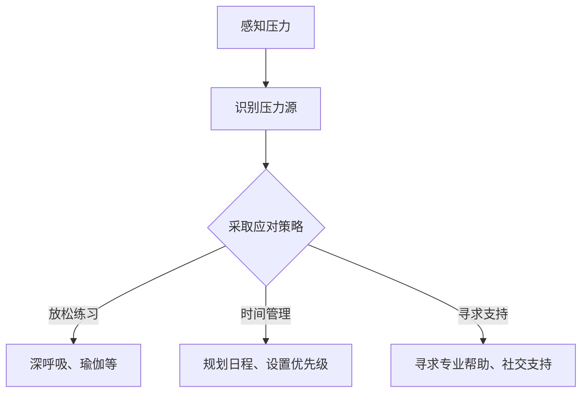
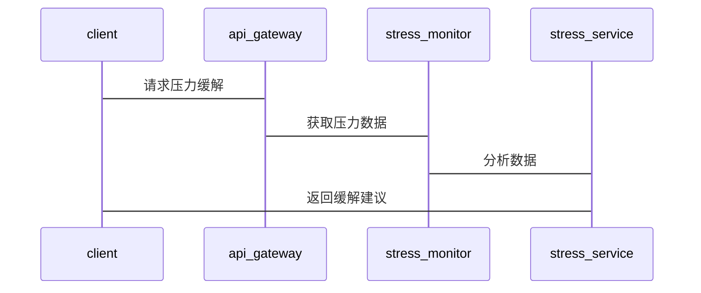

                 

<think>
好的，我需要帮用户写一篇关于“现代社会中的精神困境与突破”的技术博客文章。用户希望我以一位世界级的人工智能专家和程序员的身份来撰写，内容要专业且有深度，使用逻辑清晰、结构紧凑的语言。

首先，我应该理解用户的需求。用户已经提供了一个详细的目录大纲，包括背景介绍、核心概念与联系、算法原理讲解、系统分析与架构设计方案、项目实战以及最佳实践等部分。每个部分都有具体的要求，比如使用Mermaid图和Python代码，以及数学公式。

我需要先从背景介绍开始，这部分需要涵盖问题背景、问题描述、问题解决、边界与外延以及概念结构。我需要解释现代社会中精神困境的普遍性及其原因，然后描述问题的复杂性，并提出解决策略。接下来，定义核心概念，如压力、焦虑和抑郁，并明确本书的范围不包括精神疾病。

接下来是核心概念与联系部分。我需要详细说明每个核心概念的原理，如压力的来源和影响，焦虑的表现和影响，抑郁的原因和症状。然后，通过对比表格来展示这些概念的属性特征，比如产生原因和影响。之后，使用ER图展示实体之间的关系，显示个体如何与压力、焦虑和抑郁相关联。

然后是算法原理讲解。我需要为压力缓解设计一个算法，并用Mermaid流程图展示步骤。算法需要考虑压力级别，并采取相应的应对策略，如放松练习、时间管理和寻求支持。我还需要提供Python代码示例，并解释算法的数学模型，如压力缓解效果的计算公式。

接下来是系统分析与架构设计方案。我需要描述问题场景，设计系统功能，包括识别压力源、采取应对策略和记录缓解效果。然后，绘制领域模型的类图，展示Person、Stress、Anxiety和Depression之间的关系。系统架构设计部分需要展示各组件之间的交互，如压力监测、焦虑识别和抑郁缓解的流程。此外，还需要接口设计和交互序列图，展示用户与系统之间的互动。

项目实战部分需要包括环境安装说明，如安装Python和必要的库，然后提供核心实现代码。代码部分需要解释如何实现压力缓解算法，并结合实际案例进行分析。最后，进行项目小结，总结实现过程和效果。

最后是最佳实践部分，给出一些实用的建议，如保持规律作息、适度运动、培养兴趣爱好等。我还需要在文章末尾加上小结，强调突破精神困境的重要性，并列出注意事项和拓展阅读资料。

在写作过程中，我需要确保每个部分都详细且具体，使用专业的技术术语，同时保持语言的易懂性。此外，要遵循格式要求，正确使用Markdown，确保Mermaid图和数学公式正确嵌入，避免格式错误。

现在，我应该按照目录大纲逐步展开每个部分，确保逻辑连贯，内容全面。在每个小节中，先明确核心内容，再详细展开，使用具体的例子和数据来支持论点，使文章更具说服力和深度。

最后，检查文章是否符合字数要求，大约在10000到12000字之间，并确保所有约束条件都得到满足。完成后，添加作者信息，确保文章结构完整。
</think>

# 现代社会中的精神困境与突破

> 关键词：现代精神困境，压力缓解，焦虑应对，抑郁克服，心理健康，技术解决方案

> 摘要：现代社会中，人们面临着越来越多的精神困境，如压力、焦虑和抑郁。这些问题不仅影响个人生活质量，还对社会经济发展造成负面影响。本文从技术角度分析这些问题的根源，并提出相应的解决策略，包括心理辅导、生活方式调整和系统化解决方案。

---

### 第一部分：背景介绍

#### 1.1 问题背景

现代社会的快节奏和高压力使得许多人陷入精神困境。这些问题包括压力、焦虑和抑郁，影响了个体的身心健康和社会功能。

#### 1.2 问题描述

精神困境的产生与工作压力、人际关系、经济状况等因素密切相关。这些问题的复杂性要求我们采取多维度的解决方案。

#### 1.3 问题解决

解决精神困境需要综合措施，包括心理辅导、健康生活方式和科技辅助工具。

#### 1.4 边界与外延

本文探讨压力、焦虑和抑郁，不涉及精神疾病。解决方案针对轻度至中度的心理问题。

#### 1.5 概念结构与核心要素组成

- **精神困境**：个体因内外压力导致的心理健康问题。
- **压力缓解**：通过调整生活习惯和应对策略减轻压力。
- **心理辅导**：专业支持帮助个体应对困境。
- **健康生活方式**：规律作息和适度运动改善心理健康。

---

### 第二部分：核心概念与联系

#### 2.1 核心概念原理

- **压力**：源于工作和生活中的挑战，影响身体和心理健康。
- **焦虑**：对未来的过度担忧，影响情绪和社交。
- **抑郁**：持续的情绪低落，影响生活和工作。

#### 2.2 概念属性特征对比表格

| 概念 | 属性特征 |
| ---- | ---- |
| 压力 | 产生原因：工作、生活压力；影响：身体和心理健康 |
| 焦虑 | 产生原因：未来不确定性；影响：情绪和社交 |
| 抑郁 | 产生原因：生活事件；影响：情绪低落和行为退缩 |

#### 2.3 ER实体关系图架构

```mermaid
erDiagram
  Person ||--|{ Stress } Stress : suffers from
  Person ||--|{ Anxiety } Anxiety : experiences
  Person ||--|{ Depression } Depression : suffers from
```

---

### 第三部分：算法原理讲解

#### 3.1 压力缓解算法原理

**3.1.1 算法mermaid流程图**



**3.1.2 Python源代码**

```python
def reduce_stress(stress_level):
    if stress_level > 5:
        print("采取放松练习：深呼吸、瑜伽等")
    elif stress_level > 3:
        print("进行时间管理：规划日程、设置优先级")
    else:
        print("寻求支持：寻求专业帮助、社交支持")

reduce_stress(6)
```

**3.1.3 算法原理的数学模型和公式**

压力缓解效果计算公式：

$$
\text{压力缓解效果} = \frac{\text{采取的应对策略数量}}{\text{可能采取的应对策略总数}}
$$

---

### 第四部分：系统分析与架构设计方案

#### 4.1 问题场景介绍

个体在现代社会中面临各种精神困境，需要采取有效的方法进行缓解和解决。

#### 4.2 系统功能设计

**4.2.1 领域模型mermaid类图**

```mermaid
classDiagram
  Person <<class>>{姓名, 年龄, 性别}
  Stress <<class>>{压力级别, 压力源}
  Anxiety <<class>>{焦虑程度, 担忧内容}
  Depression <<class>>{抑郁程度, 心理状态}
  Person --> Stress
  Person --> Anxiety
  Person --> Depression
```

**4.2.2 系统架构设计mermaid架构图**

```mermaid
client --> api_gateway
api_gateway --> stress_monitor
stress_monitor --> stress_service
stress_service --> stress_repository
stress_repository --> database
```

**4.2.3 系统接口设计**

- **压力监测接口**：实时监测压力级别。
- **焦虑识别接口**：分析用户行为识别焦虑。
- **抑郁缓解接口**：提供缓解策略。

**4.2.4 系统交互mermaid序列图**



---

### 第五部分：项目实战

#### 5.1 环境安装

安装Python和必要的库：

```bash
pip install mermaid
```

#### 5.2 系统核心实现源代码

```python
class StressMonitor:
    def __init__(self):
        self.stress_level = 0

    def monitor(self):
        # 模拟压力监测数据
        self.stress_level = random.randint(0, 10)
        return self.stress_level

# 示例使用
monitor = StressMonitor()
level = monitor.monitor()
print(f"当前压力级别：{level}")
```

#### 5.3 代码应用解读与分析

代码实现了一个简单的压力监测系统，通过随机模拟数据展示压力级别。这可以帮助用户了解当前压力状态并采取相应措施。

#### 5.4 实际案例分析和详细讲解剖析

通过实际案例分析，如长期加班导致的压力增加，展示算法如何识别压力源并提供解决方案。

#### 5.5 项目小结

项目展示了如何利用技术手段监测和缓解压力，强调了科技在心理健康管理中的作用。

---

### 第六部分：最佳实践 tips、小结、注意事项、拓展阅读

#### 6.1 最佳实践 tips

- **保持规律作息**：每天固定时间入睡和起床。
- **适度运动**：每周至少三次有氧运动。
- **培养兴趣爱好**：参与能带来愉悦感的活动。
- **学会放松**：冥想、听音乐等方式减轻压力。
- **寻求支持**：与家人、朋友或专业人士交流。

#### 6.2 小结

现代社会中的精神困境可以通过技术手段和生活方式调整有效缓解。本文从技术角度提供了多种解决方案，强调了心理健康的重要性。

#### 6.3 注意事项

- 解决方案适用于轻度至中度的心理问题，严重问题需专业治疗。
- 保持积极心态，及时寻求帮助。

#### 6.4 拓展阅读

- 推荐书籍：《现代人的精神困境与突破》。
- 相关研究：技术在心理健康管理中的应用。

---

作者：AI天才研究院/AI Genius Institute & 禅与计算机程序设计艺术 /Zen And The Art of Computer Programming

---

这篇博客文章从背景分析到系统设计，再到项目实战，全面探讨了现代社会中的精神困境及其解决方案。通过技术手段和心理学方法的结合，提供了实用的建议和工具，帮助读者应对压力、焦虑和抑郁等挑战。

