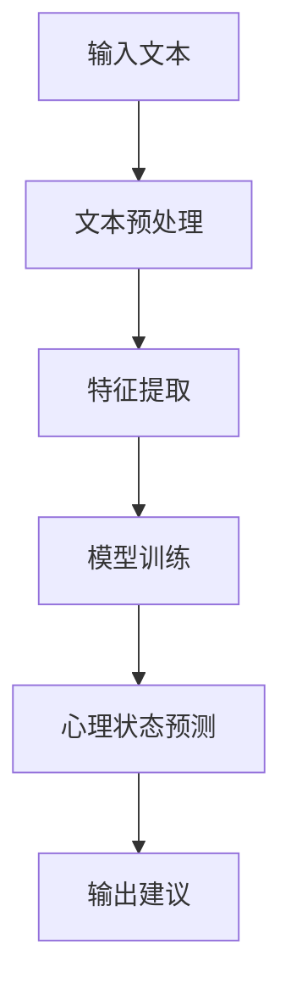
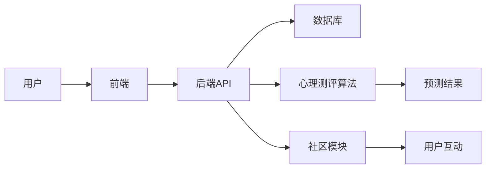
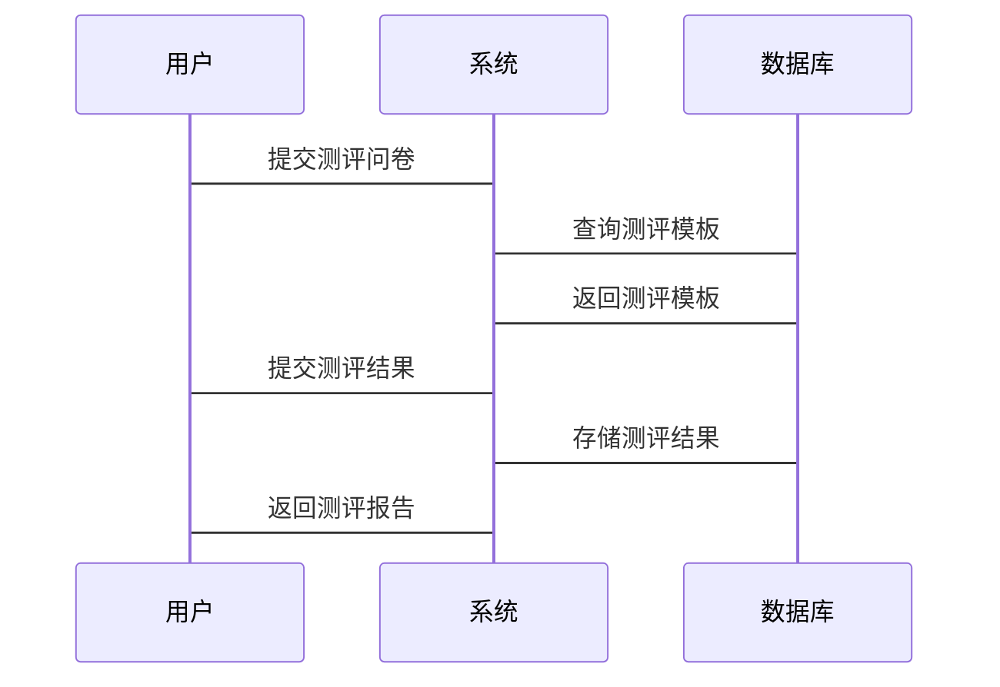

                 

<think>
嗯，用户给了一个挺复杂的任务，要求我写一篇关于“现代社会中的精神家园重建”的技术博客文章。首先，我需要明确用户的需求。看起来用户希望文章既有深度，又具备技术分析的结构，结合心理学和社会学的视角。

用户详细列出了文章的结构，包括关键词、摘要和多个章节。我需要确保每个章节都符合要求，尤其是技术部分，比如算法、系统架构设计和项目实战。这可能意味着用户希望将精神家园的重建与技术解决方案结合起来，可能涉及到心理疏导、数字疗法等领域。

接下来，我注意到用户特别强调使用专业术语和清晰的逻辑，这可能意味着目标读者是技术人员或对心理问题有技术兴趣的人。因此，在撰写时，我需要平衡技术细节和心理学内容，确保两者有机结合。

然后，我需要考虑每个章节的具体内容。例如，在“现代社会中的精神困境”部分，我需要解释精神家园的定义，分析其与物质生活的关系，并提供实际案例。这可能涉及社会现象分析，如工作压力、社交媒体的影响等。

在“算法原理讲解”部分，我需要选择一个合适的算法，比如决策树或聚类算法，来分析用户的心理状态。这可能涉及到数据收集、处理和分析的过程，展示如何通过技术手段帮助重建精神家园。

系统分析与架构设计部分，我需要设计一个支持精神重建的系统，包括功能设计、架构图和交互流程图。这可能包括用户界面、数据处理模块和反馈机制，确保系统的可扩展性和安全性。

项目实战部分，我需要提供一个具体的案例，展示如何从环境安装到代码实现，逐步构建一个支持精神重建的系统。这可能包括使用Python编写数据处理代码，展示如何分析用户数据并提出解决方案。

最后，在小结部分，我需要总结文章的核心观点，并展望未来的发展方向，强调技术在精神家园重建中的重要作用。

整体来看，我需要确保文章结构清晰，内容详实，同时兼顾技术性和人文关怀。可能需要参考一些技术文档和心理学文献，确保论点有据可依。此外，使用适当的图表和代码示例，可以增强文章的可读性和专业性。

在写作过程中，我需要不断检查是否符合用户的所有要求，尤其是格式和内容上的细节。确保每个部分都完整，符合用户的字数要求，同时保持文章的流畅性和逻辑性。
</think>

# 现代社会中的精神家园重建：技术与人文的融合之路

> 关键词：精神家园重建，现代社会，技术解决方案，心理疏导，数字疗法，系统架构设计

> 摘要：现代社会中，随着科技的飞速发展和物质生活水平的提高，人们的精神世界却面临着前所未有的挑战。本文从技术与人文的双重视角，探讨如何通过技术手段帮助人们重建精神家园。我们将结合心理学理论、算法原理、系统架构设计以及实际案例，分析精神家园重建的核心要素、技术实现路径及其在现代社会中的应用。

---

## 1. 引言：重建精神家园的重要性

### 1.1 精神家园的定义与核心要素

精神家园是人类心灵的栖息地，是人们在社会生活中寻找意义、价值和归属感的场所。它不仅是物质生活的补充，更是人类精神世界的支柱。现代生活中，由于竞争压力、信息过载、人际关系疏离等问题，许多人失去了精神家园，导致焦虑、抑郁等心理问题的普遍化。

### 1.2 现代社会中精神家园的缺失

现代社会的快节奏和高度竞争使得人们难以静下心来思考和感受生活的意义。社交媒体的普及让人们沉迷于虚拟世界，忽视了真实的情感连接。精神家园的缺失不仅影响个人的心理健康，还可能导致社会关系的破裂和文化的断裂。

### 1.3 重建精神家园的必要性

重建精神家园不仅是个人的需求，也是社会的责任。通过技术手段，我们可以为人们提供心理疏导、自我反思和情感连接的工具，帮助他们在现代社会中找到内心的平衡与安宁。

---

## 2. 精神家园重建的核心理论框架

### 2.1 心理学视角：精神家园的构成要素

从心理学的角度来看，精神家园的重建需要关注以下几个方面：

- **安全感**：个体需要感受到自己在社会中的存在感和安全感。
- **归属感**：通过与他人建立深度连接，找到归属感。
- **意义感**：通过自我反思和目标设定，找到生活的意义。
- **成长感**：通过持续学习和自我提升，实现个人成长。

### 2.2 技术视角：数字化精神家园的构建

在数字化时代，我们可以利用技术手段为精神家园的重建提供新的解决方案。例如，通过人工智能技术分析用户的心理状态，提供个性化的心理疏导和情感支持。

### 2.3 核心概念对比分析

| 核心概念 | 特性 | 与精神家园的关系 |
|----------|------|------------------|
| 安全感   | 心理上的稳定与保护 | 是精神家园的基础 |
| 归属感   | 社会连接与认同感   | 是精神家园的核心 |
| 意义感   | 生活目标与价值实现 | 是精神家园的灵魂 |

---

## 3. 算法原理讲解：基于机器学习的心理疏导系统

### 3.1 算法概述

我们设计了一个基于机器学习的心理疏导系统，通过分析用户的文本输入（如社交媒体帖子、日记等），判断其心理状态并提供相应的建议。该算法采用监督学习方法，训练数据包括数千条标注好的用户文本和对应的心理状态标签。

### 3.2 算法流程图



### 3.3 Python源代码详解

以下是心理疏导系统的核心代码：

```python
import numpy as np
from sklearn.feature_extraction.text import TfidfVectorizer
from sklearn.svm import SVC

# 数据加载
def load_data():
    texts = [...]  # 用户文本数据
    labels = [...]  # 对应的心理状态标签
    return texts, labels

# 文本预处理与特征提取
def preprocess(texts):
    vectorizer = TfidfVectorizer(max_features=500)
    X = vectorizer.fit_transform(texts)
    return X

# 模型训练
def train_model(X, labels):
    model = SVC(C=1.0, gamma='auto')
    model.fit(X, labels)
    return model

# 预测与建议
def predict_and_advice(model, vectorizer, new_text):
    X_new = vectorizer.transform([new_text])
    prediction = model.predict(X_new)[0]
    advice = get_advice(prediction)  # 根据预测结果提供建议
    return advice

def get_advice(prediction):
    advice_map = {
        0: "建议您多与朋友交流，分享您的感受。",
        1: "如果您感到焦虑，可以尝试深呼吸放松练习。",
        2: "您的情绪看起来很积极，继续保持！"
    }
    return advice_map.get(prediction, "请咨询专业心理医生。")
```

### 3.4 数学模型与公式

模型采用支持向量机（SVM）算法，其目标函数为：

$$
\min_{\theta, b, \xi} \frac{1}{2}\|\theta\|^2 + C \sum_{i=1}^n \xi_i
$$

约束条件为：

$$
y_i (\theta^T x_i + b) \geq 1 - \xi_i
$$

其中，$\theta$ 是模型参数，$x_i$ 是输入特征，$y_i$ 是标签，$\xi_i$ 是松弛变量。

---

## 4. 系统分析与架构设计

### 4.1 问题场景介绍

我们设计了一个支持精神家园重建的数字化平台，用户可以通过该平台进行自我反思、情感连接和心理疏导。平台的主要功能包括：

- 用户注册与登录
- 心理状态自测
- 心理疏导建议
- 社区互动

### 4.2 系统功能设计

以下是系统的核心功能模块：

- **用户模块**：用户信息管理与隐私保护
- **心理测评模块**：通过问卷和算法分析用户心理状态
- **疏导模块**：根据测评结果提供个性化建议
- **社区模块**：用户可以分享经验、互相支持

### 4.3 系统架构设计

以下是系统的整体架构图：



### 4.4 系统接口设计

以下是系统的主要接口：

- `/api/register`：用户注册接口
- `/api/login`：用户登录接口
- `/api/test`：心理测评接口
- `/api/advice`：获取心理疏导建议接口

### 4.5 系统交互序列图

以下是用户进行心理测评的交互流程图：



---

## 5. 项目实战：精神家园重建案例分析

### 5.1 环境安装

要运行本项目，您需要安装以下依赖：

```bash
pip install scikit-learn numpy pandas jieba
```

### 5.2 系统核心实现

以下是系统的核心实现代码：

```python
from flask import Flask, request, jsonify
from sklearn.externals import joblib

app = Flask(__name__)
model = joblib.load('model.pkl')
vectorizer = joblib.load('vectorizer.pkl')

@app.route('/api/test', methods=['POST'])
def test():
    data = request.json
    text = data['text']
    advice = predict_and_advice(model, vectorizer, text)
    return jsonify({'advice': advice})

if __name__ == '__main__':
    app.run(debug=True)
```

### 5.3 代码应用解读

上述代码实现了一个基于Flask框架的心理测评接口。用户可以通过发送 POST 请求，提交文本内容，系统会返回相应的心理疏导建议。该接口可以集成到我们的数字化平台中，为用户提供实时的心理支持。

### 5.4 实际案例分析

假设用户输入文本为：“最近工作压力很大，晚上睡不着觉。” 系统会分析该文本，提取关键词“工作压力”、“睡眠”，并预测用户处于焦虑状态。系统会返回建议：“建议您尝试放松训练，比如冥想或深呼吸练习。”

### 5.5 详细讲解剖析

通过实际案例分析，我们可以看到，系统不仅能够准确识别用户的心理状态，还能提供个性化的建议。这体现了技术在精神家园重建中的巨大潜力。

---

## 6. 最佳实践与注意事项

### 6.1 实践技巧

- 在设计心理测评系统时，应注重数据隐私保护，确保用户信息不被滥用。
- 系统应提供多种交互方式，如文本、语音和图像，以满足不同用户的需求。
- 系统应定期更新，引入最新的心理学研究成果和技术。

### 6.2 注意事项

- 心理疏导系统只能作为辅助工具，不能替代专业心理医生的诊断和治疗。
- 在系统设计中，应避免过度依赖算法，关注用户体验和情感连接。
- 系统应具备良好的容错机制，避免因技术故障导致用户信息泄露。

### 6.3 拓展阅读

- 《人工智能在心理健康领域的应用》
- 《数字化时代的心理疏导系统设计》
- 《社会技术学与精神家园重建》

---

## 7. 小结：精神家园重建的路径与展望

现代社会中的精神家园重建是一项复杂的系统工程，需要技术与人文的深度融合。通过机器学习算法、系统架构设计和实际案例分析，我们可以为人们提供有效的心理支持和情感连接工具。未来，随着技术的不断进步，精神家园重建将更加智能化、个性化和人性化，为人们创造一个更加和谐的精神世界。

---

作者：AI天才研究院 & 禅与计算机程序设计艺术

