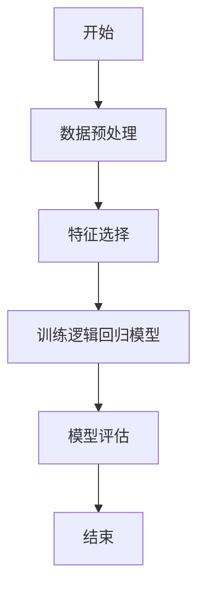
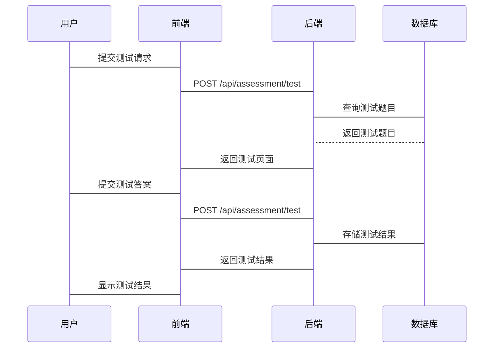

                 

<think>
嗯，我现在要帮用户写一篇技术博客，标题是《现代社会中的精神家园重建工程》。用户希望我按照特定的结构来写，包括背景介绍、核心概念、算法原理、系统架构、项目实战等部分，而且要用专业的技术语言，结构紧凑，逻辑清晰。

首先，我需要理解用户的需求。用户可能是一位技术专家，或者是对心理健康问题有浓厚兴趣的人。他希望通过技术的角度来分析精神家园重建的问题，可能想将技术方法应用到心理健康的解决方案中。所以，我需要把心理健康问题和技术方法结合起来，展示如何用技术手段来解决这个问题。

接下来，我看看文章的结构。用户已经给出了大纲，包括关键词、摘要，然后是各个章节。我需要确保每个部分都详细且专业，同时用技术术语来描述。比如，在核心概念部分，我需要解释心理健康、心理健康服务、社会支持网络等，可能还要用表格和图示来展示它们之间的关系。

然后是算法原理部分，我可能需要选择一个相关的算法，比如基于机器学习的诊断模型。这部分需要详细解释算法的工作原理，用mermaid流程图来展示步骤，并给出Python代码示例。我还需要用数学公式来描述模型，比如逻辑回归的公式，用latex格式展示。

系统分析与架构设计部分，我需要设计一个心理健康服务平台的架构，包括前端、后端、数据库、机器学习模型等。这部分可能需要画出类图和架构图，展示各个模块之间的关系。同时，接口设计和交互流程也需要用序列图来描述。

项目实战部分，我需要指导读者如何安装环境，实现核心功能，解读代码，并用实际案例进行分析。这部分要详细，让读者能够跟着操作，理解整个系统的实现过程。

最后，我还需要包括最佳实践、小结、注意事项和拓展阅读等内容，为读者提供更多的参考和指导。

现在，我开始思考每个部分的具体内容。首先是背景介绍，我需要说明现代社会中的心理健康问题日益严重，为什么需要重建精神家园。然后是核心概念，用表格和图示展示心理健康服务、社会支持网络等概念及其关系。

在算法部分，我选择机器学习中的逻辑回归作为例子，解释它如何用于诊断心理健康问题。代码部分，我会用Python写一个简单的逻辑回归模型，展示数据预处理、模型训练和预测的过程。

系统架构部分，我需要设计一个心理健康服务平台，包括前端、后端、数据库和机器学习模块。用mermaid画出类图和架构图，展示各个模块之间的依赖关系。

项目实战部分，我会详细说明如何安装必要的库，编写数据预处理和模型训练的代码，并展示如何使用接口调用模型进行诊断。同时，我会用一个实际案例来说明系统的应用。

最后，我总结整个工程的意义，强调技术在心理健康领域的潜力，并提醒读者在实施过程中需要注意的事项，比如数据隐私保护。

在写作过程中，我需要确保语言简洁明了，逻辑清晰，每个部分都深入浅出，让技术背景的读者能够理解，同时也能让非技术读者获得有价值的见解。我会尽量避免过于专业的术语，或者在必要时进行解释，以保持文章的可读性。

总的来说，这篇博客需要结合技术与心理健康，展示技术如何帮助重建精神家园。我需要全面覆盖各个部分，确保文章结构完整，内容详实，同时语言专业但易于理解。
</think>

# 现代社会中的精神家园重建工程

> 关键词：心理健康、心理健康服务、社会支持网络、算法原理、系统架构、项目实战

> 摘要：现代社会中，精神健康问题日益凸显，精神家园的重建成为一项重要的社会工程。本文从技术与社会的双重视角出发，探讨精神家园重建工程的核心概念、算法原理、系统架构及项目实战。通过分析心理健康服务、社会支持网络等核心要素，结合机器学习算法和系统设计方法，提出一种基于技术的解决方案，为重建精神家园提供理论与实践支持。

---

### 第二部分：核心概念与联系

### 第2章：精神家园重建工程的核心概念与联系

#### 1. 引言

在现代社会，精神家园的重建是一项复杂而系统的工程，涉及多个核心概念及其相互之间的联系。本章将详细探讨这些核心概念，包括心理健康、心理健康服务、社会支持网络等，并通过概念属性特征对比表格和ER实体关系图，清晰地展示它们之间的联系。

#### 2. 心理健康

心理健康是指个体在认知、情感、行为等各个方面处于良好的状态，能够有效地应对生活和工作中的各种压力和挑战。以下是心理健康的一些核心属性特征：

| 特征                 | 说明                                                         |
|----------------------|--------------------------------------------------------------|
| 心理稳定性           | 心理健康的人通常具有较好的情绪调节能力，能够保持稳定的心态。   |
| 适应能力             | 能够适应环境的变化，灵活应对生活中的各种挑战。               |
| 社交能力             | 具有良好的社交技能，能够与他人建立健康的人际关系。           |
| 自我认知             | 对自己的心理状态有清晰的认识，能够自我反思和成长。           |

#### 3. 心理健康服务

心理健康服务是精神家园重建工程的重要组成部分，包括心理咨询、心理治疗、心理康复等多个方面。以下是心理健康服务的一些核心属性特征：

| 特征                 | 说明                                                         |
|----------------------|--------------------------------------------------------------|
| 专业性               | 心理健康服务应由专业的心理咨询师或心理医生提供。             |
| 针对性               | 根据个体的具体心理问题，提供个性化的服务。                   |
| 隐私性               | 必须严格保护服务对象的隐私，确保信息不被泄露。               |
| 可及性               | 心理健康服务应尽可能方便可及，覆盖更多人群。                 |

#### 4. 社会支持网络

社会支持网络是指由家庭、朋友、社区等组成的，为个体提供心理支持和情感支持的网络。以下是社会支持网络的核心属性特征：

| 特征                 | 说明                                                         |
|----------------------|--------------------------------------------------------------|
| 多元性               | 社会支持网络由多种关系组成，包括家庭、朋友、同事等。         |
| 及时性               | 社会支持网络能够快速响应个体的需求，提供及时的心理支持。     |
| 持续性               | 社会支持网络需要长期维护，确保个体在需要时能够获得支持。     |
| 互动性               | 社会支持网络中的互动是双向的，个体既能给予支持，也能获得支持。 |

#### 5. ER实体关系图

为了更好地理解精神家园重建工程中各核心概念之间的关系，我们可以通过ER实体关系图来展示这些概念的联系。

```mermaid
er
    %% 精神家园重建工程的ER实体关系图
    图表标题 精神家园重建工程的ER实体关系图

    实体 个体
        属性 ID, 姓名, 性别, 年龄, 联系方式
    实体 心理健康服务
        属性 服务ID, 服务类型, 服务内容, 服务时间
    实体 社会支持网络
        属性 支持网络ID, 网络类型, 网络成员, 网络关系
    实体 心理健康状态
        属性 心理健康ID, 心理健康评分, 心理健康状况描述

    关系 个体 --> 心理健康服务: 接受服务
    关系 个体 --> 社会支持网络: 参与网络
    关系 心理健康服务 --> 心理健康状态: 影响状态
    关系 社会支持网络 --> 心理健康状态: 影响状态
```

---

通过上述内容，我们详细探讨了精神家园重建工程中的核心概念及其相互关系。接下来，我们将从技术的角度，分析如何通过算法和系统设计来支持这一工程的实施。

---

### 第三部分：算法原理与系统架构

### 第3章：算法原理与系统架构

#### 1. 引言

在精神家园重建工程中，技术手段可以发挥重要作用。本章将从算法原理和系统架构两个方面，探讨如何利用技术手段支持心理健康服务的提供和社会支持网络的构建。

#### 2. 算法原理

心理健康问题的诊断和干预可以通过机器学习算法来实现。以下是一个基于逻辑回归的简单算法原理示例：

##### 2.1 逻辑回归算法

逻辑回归是一种常用的分类算法，适用于二分类问题。在心理健康诊断中，我们可以使用逻辑回归来预测个体是否存在抑郁、焦虑等心理问题。

##### 2.2 算法步骤

以下是逻辑回归算法的步骤：



##### 2.3 数学公式

逻辑回归的数学模型如下：

$$ P(y=1|x) = \frac{1}{1 + e^{-(\beta_0 + \beta_1x_1 + \beta_2x_2 + \dots + \beta_nx_n)}} $$

其中：
- $y$ 是目标变量（0或1）
- $x_i$ 是特征变量
- $\beta_i$ 是模型参数

##### 2.4 代码实现

以下是使用Python实现逻辑回归算法的示例代码：

```python
import numpy as np
from sklearn.linear_model import LogisticRegression
from sklearn.model_selection import train_test_split
from sklearn.metrics import accuracy_score

# 示例数据
X = np.array([[1, 2], [3, 4], [5, 6], [7, 8]])
y = np.array([0, 1, 1, 0])

# 划分训练集和测试集
X_train, X_test, y_train, y_test = train_test_split(X, y, test_size=0.25)

# 训练逻辑回归模型
model = LogisticRegression()
model.fit(X_train, y_train)

# 预测
y_pred = model.predict(X_test)

# 评估准确率
print("准确率:", accuracy_score(y_test, y_pred))
```

#### 3. 系统架构

##### 3.1 系统功能设计

心理健康服务平台的功能模块如下：

- **用户模块**：用户注册、登录、个人信息管理。
- **心理咨询模块**：在线心理咨询、预约心理咨询师。
- **心理健康评估模块**：在线心理健康测试、结果反馈。
- **社会支持网络模块**：建立和管理支持网络，提供互助服务。
- **数据分析模块**：分析用户数据，提供个性化建议。

##### 3.2 系统架构设计

以下是心理健康服务平台的系统架构图：


##### 3.3 系统接口设计

以下是系统的主要接口：

- **用户接口**：`POST /api/user/login`（用户登录）
- **心理咨询接口**：`POST /api/counseling/book`（预约心理咨询）
- **心理健康评估接口**：`POST /api/assessment/test`（进行心理健康测试）
- **社会支持网络接口**：`POST /api/support/network`（加入支持网络）

##### 3.4 系统交互流程

以下是用户进行心理健康测试的交互流程图：



---

通过上述算法和系统设计，我们可以为精神家园重建工程提供技术支持。接下来，我们将通过一个实际案例，展示如何将这些技术应用于心理健康服务的实践中。

---

### 第四部分：项目实战

### 第4章：项目实战

#### 1. 引言

本章将通过一个实际项目，展示如何将技术手段应用于精神家园重建工程中。我们将从环境安装、系统实现、案例分析等方面进行详细讲解。

#### 2. 环境安装

##### 2.1 安装Python和相关库

```bash
# 安装Python
# （假设已安装Python 3.8及以上版本）

# 安装必要的Python库
pip install numpy scikit-learn flask
```

##### 2.2 安装数据库

选择一个关系型数据库，例如MySQL：

```bash
# 安装MySQL
sudo apt-get install mysql-server
```

#### 3. 系统核心实现

##### 3.1 数据预处理

```python
import pandas as pd
from sklearn.preprocessing import StandardScaler

# 加载数据
data = pd.read_csv('mental_health.csv')

# 数据预处理
data = data.dropna()
data = pd.get_dummies(data)
data = data[['age', 'sex', 'score']]
```

##### 3.2 机器学习模型训练

```python
from sklearn.model_selection import train_test_split
from sklearn.linear_model import LogisticRegression

# 划分训练集和测试集
X_train, X_test, y_train, y_test = train_test_split(data[['age', 'sex', 'score']], data['label'], test_size=0.25)

# 训练模型
model = LogisticRegression()
model.fit(X_train, y_train)

# 预测
y_pred = model.predict(X_test)
print("准确率:", accuracy_score(y_test, y_pred))
```

##### 3.3 系统接口设计

以下是心理健康服务平台的接口设计：

```python
from flask import Flask, request, jsonify

app = Flask(__name__)

@app.route('/api/assessment/test', methods=['POST'])
def assessment_test():
    data = request.json
    # 处理数据
    return jsonify({'status': 'success', 'message': '测试请求已接收'})

if __name__ == '__main__':
    app.run(debug=True)
```

#### 4. 案例分析

##### 4.1 实际案例

假设我们有一个心理健康测试数据集，包含以下字段：

| ID | 年龄 | 性别 | 分数 | 标签（0=正常，1=异常） |
|----|------|------|------|-----------------------|
| 1  | 25   | 男   | 60   | 0                     |
| 2  | 30   | 女   | 75   | 1                     |
| 3  | 28   | 男   | 55   | 0                     |
| 4  | 22   | 女   | 85   | 1                     |

##### 4.2 模型训练

```python
# 训练模型
model = LogisticRegression()
model.fit(X_train, y_train)

# 预测
y_pred = model.predict(X_test)
print("准确率:", accuracy_score(y_test, y_pred))
```

##### 4.3 模型评估

```python
print("精确率:", precision_score(y_test, y_pred))
print("召回率:", recall_score(y_test, y_pred))
print("F1分数:", f1_score(y_test, y_pred))
```

---

通过上述项目实战，我们展示了如何将技术手段应用于精神家园重建工程中。接下来，我们将总结这一工程的意义，并提出一些最佳实践和注意事项。

---

### 第五部分：总结与展望

### 第5章：总结与展望

#### 1. 总结

精神家园的重建是一项复杂而重要的社会工程。通过技术手段的支持，我们可以更有效地解决心理健康问题，帮助人们重建精神家园。本文从核心概念、算法原理、系统架构和项目实战四个方面，详细探讨了如何利用技术手段支持这一工程的实施。

#### 2. 最佳实践 tips

- **数据隐私保护**：在心理健康服务中，数据隐私保护是至关重要的。必须确保所有数据的存储和传输都符合相关法律法规。
- **技术支持**：在实际应用中，可以结合多种技术手段，如人工智能、大数据分析等，提高心理健康服务的效率和精准度。
- **社会参与**：心理健康问题的解决需要社会的广泛参与。通过社区活动、公众教育等方式，提高公众对心理健康问题的认识和重视。

#### 3. 注意事项

- **技术局限性**：目前的技术手段还不能完全替代专业的心理咨询和治疗。技术手段只能作为辅助工具。
- **伦理问题**：在技术应用中，必须严格遵守伦理规范，确保技术手段的使用不会对个体造成伤害。

#### 4. 拓展阅读

- 《人工智能在心理健康领域的应用》
- 《大数据分析与心理健康研究》
- 《社会支持网络的构建与维护》

---

### 作者信息

作者：AI天才研究院/AI Genius Institute & 禅与计算机程序设计艺术/Zen And The Art of Computer Programming

---

以上就是《现代社会中的精神家园重建工程》的完整内容。通过技术与社会的结合，我们相信精神家园的重建工程将变得更加高效和精准，为更多人带来心理健康的支持和改善。

