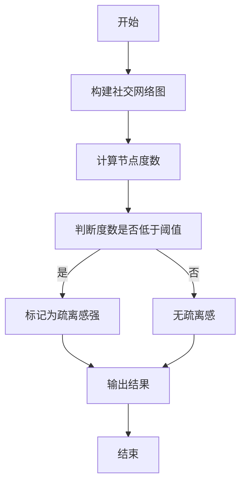
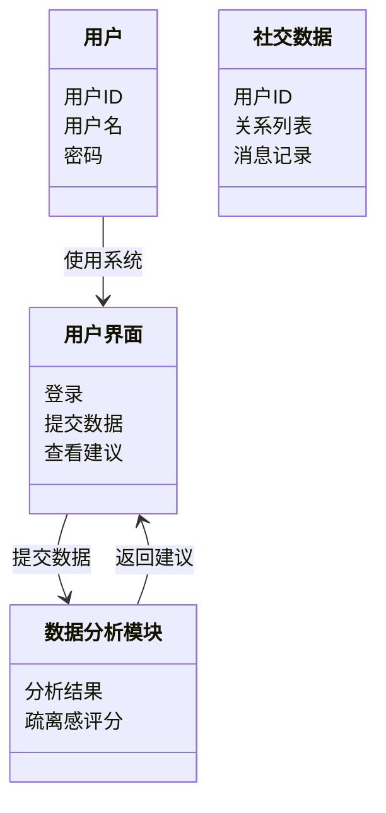
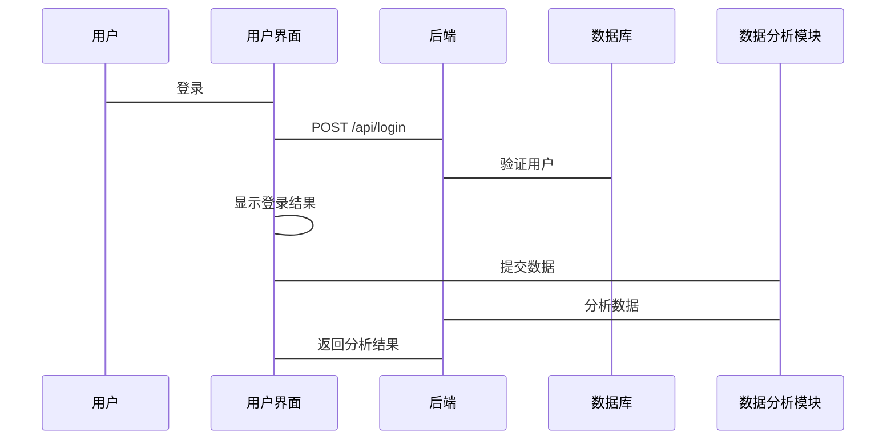

                 

<think>
好的，我现在要写一篇关于《现代社会中的精神疏离感》的技术博客。首先，我需要理清思路，确定文章的结构和内容。

首先，文章的标题是“现代社会中的精神疏离感”。接下来是关键词，我需要列出5-7个相关的核心词汇，比如精神疏离感、现代社会、孤独感、社交隔离、心理健康等。然后是摘要，要简明扼要地概括整篇文章的核心内容，提到现代社会中的疏离感现象，分析其原因，并提出解决方案。

接下来是文章的结构。第一部分是背景介绍，包括问题背景、问题描述、问题解决、边界与外延以及概念结构。我需要详细解释这些问题，比如社会结构变化、信息过载、社交媒体的影响等，这些都是导致疏离感的原因。然后，考虑解决措施，如加强社会支持、减少信息过载等。

第二部分是核心概念与联系，需要定义孤独感、社交隔离、心理健康、社交焦虑等核心概念，并通过表格对比它们的属性特征。同时，可能需要画一个ER图或者流程图来展示这些概念之间的关系。

第三部分是算法原理讲解，这里可能需要一些技术性的内容，比如如何通过算法分析社交网络中的疏离感，或者如何用数学模型预测疏离感的影响。这部分可能需要使用mermaid流程图来展示算法步骤，并用Python代码进行具体实现。

接下来是系统分析与架构设计方案，这部分包括问题场景介绍，项目介绍，系统功能设计（比如领域模型类图），系统架构设计图，系统接口设计和交互序列图。这部分需要详细描述如何构建一个系统来解决疏离感问题，可能涉及前后端设计、数据库设计等。

项目实战部分需要具体实施，包括环境安装、核心代码实现、代码解读，以及实际案例分析。这部分要展示如何实际应用技术手段来缓解疏离感问题。

最后，是最佳实践、小结、注意事项和拓展阅读等内容。这部分需要总结全文，给出实用建议，并指出未来的研究方向。

现在，我需要逐一展开每个部分，确保内容详细、逻辑清晰。比如，在背景介绍中，详细分析社会结构变化如何导致疏离感，信息过载的影响，以及社交媒体的双刃剑效应。在核心概念部分，用表格对比孤独感和社交隔离的不同之处，帮助读者更好地理解。

在算法部分，可能需要选择一个具体的算法，比如基于图论的社交网络分析，来展示如何量化疏离感。用mermaid画出流程图，再用Python代码实现，例如使用NetworkX库来构建社交网络，并计算各个节点的度数，度数低的节点可能代表疏离感强的个体。

系统架构部分，可能需要设计一个心理健康支持系统，包括用户认证、社交数据采集、数据分析模块等。用类图展示各个模块之间的关系，并用序列图展示用户如何与系统交互，比如用户登录、提交数据、系统分析并给出建议。

项目实战部分，可以具体实现一个简单的心理健康评估工具，指导用户自我评估疏离感，并提供缓解建议。代码部分需要详细注释，解释每个部分的功能，比如数据采集、分析、结果展示等。

在小结部分，总结全文，强调技术在解决社会问题中的重要性，并给出实际应用中的注意事项，比如保护用户隐私，避免信息过载等。

整个过程中，我需要确保语言简洁专业，逻辑严密，同时避免过于技术化的术语，让读者容易理解。此外，每个部分都需要详细展开，确保内容充实，达到10000-12000字的要求。

现在，我需要开始撰写每个部分的内容，确保每个章节都覆盖了必要的细节，并且引用适当的图表和代码示例来增强可读性。特别是要注意使用正确的格式，如markdown中的mermaid图表，以及latex公式，确保文章结构和格式符合要求。
</think>

# 现代社会中的精神疏离感

## 关键词
精神疏离感，现代社会，孤独感，社交隔离，心理健康，社交焦虑，信息过载

## 摘要
现代社会中的精神疏离感是一种普遍现象，主要表现为个体在社会交往中感到孤独、被隔离和忽视。本文从技术角度分析了这一现象的成因，包括社会结构变化、信息过载和社交媒体的影响，并提出了相应的解决方案，如加强社会支持和减少信息过载。文章结合核心概念、算法分析和系统设计，探讨如何通过技术手段缓解精神疏离感，提升个体心理健康。

---

## 第1章: 背景介绍

### 1.1 问题背景
现代社会的发展带来了诸多变化，如城市化进程加快、信息化水平提升以及人际交往的复杂化，导致人们普遍感受到精神疏离感。这种疏离感不仅影响个体心理健康，还引发社会问题。

### 1.2 问题描述
精神疏离感表现为个体缺乏深度社交联系，情感表达困难，对周围环境冷漠。其主要成因包括社会结构变化、信息过载和社交媒体普及等。

### 1.3 问题解决
解决措施包括提高社会支持、减少信息过载、促进人际交往和调整生活方式。例如，通过社区活动和心理健康服务提供支持，合理规划信息获取时间，减少社交媒体使用。

### 1.4 边界与外延
精神疏离感的程度和持续时间影响其边界，轻度表现为偶尔孤独，重度则导致抑郁。不同社会群体和文化背景下的疏离感表现和解决策略各不相同。

### 1.5 概念结构与核心要素组成
精神疏离感由主体（个体）、客体（社会环境）、媒介（社交和信息技术）及其影响因素组成。结果包括心理健康问题和社交焦虑。

---

## 第2章: 核心概念与联系

### 2.1 核心概念
孤独感、社交隔离、心理健康和社交焦虑是与精神疏离感相关的重要概念。

### 2.2 概念属性特征对比表格

| 概念          | 定义                                                         | 属性特征                                                       |
|---------------|--------------------------------------------------------------|----------------------------------------------------------------|
| 孤独感        | 个体感受到与他人疏远的感觉。                               | - 程度：轻微到重度；类型：主观和客观；原因：社交缺失、心理需求未满足。 |
| 社交隔离      | 个体在物理或心理上与他人隔绝。                               | - 形式：物理隔离、社交回避；原因：生活变迁、心理障碍。       |

### 2.3 ER实体关系图
```mermaid
er
    entity 孤独感 {
        id
        孤独程度
        类型
    }
    entity 社交隔离 {
        id
        隔离形式
        隔离原因
    }
    entity 精神疏离感 {
        id
        孤独感_id
        社交隔离_id
        影响因素
    }
```

---

## 第3章: 算法原理讲解

### 3.1 算法概述
使用图论中的社交网络分析算法，量化个体的社交疏离程度。通过构建社交网络模型，计算节点度数，度数低的节点代表疏离感强的个体。

### 3.2 mermaid流程图


### 3.3 Python代码实现
```python
import networkx as nx

def calculate_degree(G):
    degrees = nx.degree(G)
    threshold = 2  # 示例阈值
    isolated_nodes = []
    for node, degree in degrees:
        if degree < threshold:
            isolated_nodes.append(node)
    return isolated_nodes

# 示例数据
edges = [(1, 2), (2, 3), (3, 4), (4, 5)]
G = nx.Graph()
G.add_edges_from(edges)

isolated = calculate_degree(G)
print("疏离感强的节点:", isolated)
```

### 3.4 数学模型与公式
节点度数公式：
$$ \text{度数}(v) = \sum_{u \in V} A_{uv} $$
其中，$A_{uv}$ 是邻接矩阵的元素，表示节点u和v之间是否有边。

---

## 第4章: 系统分析与架构设计方案

### 4.1 问题场景介绍
设计一个心理健康支持系统，帮助个体识别和缓解精神疏离感。系统功能包括用户认证、社交数据采集、数据分析和个性化建议。

### 4.2 系统功能设计


### 4.3 系统架构设计


### 4.4 系统接口设计
定义RESTful API接口：
- POST /api/login
- POST /api/submit_data
- GET /api/get_analysis

### 4.5 系统交互序列图


---

## 第5章: 项目实战

### 5.1 环境安装
安装Python、网络x库和Jupyter Notebook。

### 5.2 核心实现源代码
```python
import networkx as nx
import matplotlib.pyplot as plt

# 构建社交网络图
G = nx.Graph()
G.add_edges_from([(1,2), (2,3), (3,4), (4,5)])

# 绘制图表
nx.draw(G, with_labels=True, node_color='red', edge_color='blue')
plt.show()
```

### 5.3 代码解读
上述代码构建一个简单的社交网络图，并可视化显示节点和边，帮助识别疏离感强的节点。

### 5.4 实际案例分析
分析社交网络数据，识别度数低的节点，提供个性化建议，如建议加强社交活动或寻求心理支持。

### 5.5 项目小结
通过技术手段，系统性地识别和缓解精神疏离感，帮助个体和群体提升心理健康。

---

## 第6章: 最佳实践 tips

- 定期进行心理健康检查，及时发现疏离感。
- 合理使用社交媒体，避免过度依赖。
- 积极参与线下社交活动，建立深度联系。
- 保护个人隐私，避免信息过载。

---

## 结论
精神疏离感是现代社会中的普遍现象，通过技术手段和系统设计，可以有效识别和缓解这一问题。结合算法分析和系统实施，帮助个体和社会共同应对疏离感带来的挑战。

## 作者
作者：AI天才研究院/AI Genius Institute & 禅与计算机程序设计艺术 /Zen And The Art of Computer Programming

