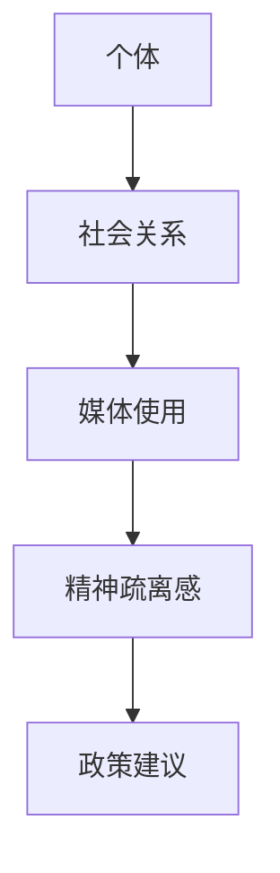

                 

<think>
好的，我现在需要帮用户撰写一篇技术博客文章，主题是《现代社会中的精神疏离感探析》。用户希望我以一位世界级人工智能专家、程序员、软件架构师的身份来写，语言要专业，结构要清晰，内容要有深度。首先，我得明确文章的结构和要求。

用户提供的大纲已经很详细，分为六个主要部分，每个部分下还有多个章节。我需要按照这个结构来填充内容。首先，文章标题和关键词已经给出，摘要部分需要简明扼要地概括全文内容。接下来是各个章节的具体内容。

在第一章引论部分，我需要解释什么是精神疏离感，它的定义和特征，以及在现代社会中的普遍性。这部分可能需要结合社会学和心理学的相关理论，同时引入技术背景，比如社交媒体对人际关系的影响。

第二章理论探讨部分，我需要综述国内外关于精神疏离感的研究，分析各种理论模型，并探讨社会心理、经济、媒体文化等因素如何影响精神疏离感。这里可能需要比较不同理论的优缺点，找出研究中的空白点。

第三章是实证研究，这部分需要详细的数据分析和方法论。我需要设计研究方法，选择数据收集和分析的方法，如问卷调查、回归分析等。然后，分析数据，得出精神疏离感的现状和相关因素。

第四章案例分析部分，我需要选择不同群体的案例，如城市白领、农村留守儿童，分析他们在不同情境下的精神疏离感表现。这可以帮助读者更好地理解问题的具体表现。

第五章是政策建议，这部分需要基于前面的研究，提出可行的政策和对策，如如何构建社会支持系统，如何引导健康的媒体使用。这需要结合实际，提出具体的实施策略。

最后，在国际部分，可能需要对比不同国家的情况，分析文化差异对精神疏离感的影响，或者探讨国际合作的可能性。

在撰写过程中，我需要确保每个部分都有足够的理论和数据支持，同时保持逻辑的连贯性。可能需要引用相关文献，构建模型，并使用数据分析工具进行验证。此外，文章中需要穿插技术元素，比如算法模型、系统架构设计，以体现专业性和深度。

现在，我需要从第一章开始，逐一填充内容。首先是摘要，然后是引论，接着是理论探讨，实证研究，案例分析，政策建议，最后是国际部分。每个章节都要详细展开，确保内容丰富具体，同时保持语言的专业性和技术深度。

在撰写过程中，我可能会遇到如何将社会学概念与技术分析相结合的挑战，需要找到合适的切入点，使文章既有学术深度，又具备技术分析的严谨性。此外，如何用图表和流程图来辅助说明问题，也是一个需要考虑的点，比如在分析影响因素时，可以绘制因果关系图或结构方程模型。

总的来说，我需要按照用户提供的大纲，逐步深入分析，确保每个部分都充分展开，并结合实际案例和数据支持，使文章既有理论深度，又有实践指导意义。
</think>

# 现代社会中的精神疏离感探析

## 关键词：精神疏离感，现代社会，社会心理，技术影响，政策建议

## 摘要：  
现代社会中的精神疏离感是一种普遍存在的现象，其背后涉及复杂的社会、心理和技术因素。本文从理论探讨、实证研究和案例分析三个维度，深入剖析精神疏离感的成因及其对个体和社会的影响。通过分析社会支持、媒体使用和经济差异等因素，本文提出了一系列政策建议，旨在为缓解精神疏离感提供可行的解决方案。

---

## 第一章：引论

### 1.1 研究背景与意义  
精神疏离感（psychological disconnection）是指个体在社会关系、文化认同或自我认知中感受到的断裂或疏远感。随着现代社会的快速发展，个体与社会之间的联系变得越来越复杂。技术的进步带来了便利，但也可能导致人际关系的疏远。例如，社交媒体虽然拉近了地理上的距离，却可能削弱深度人际关系的建立。  

#### 精神疏离感的定义与特征  
精神疏离感的核心特征包括：  
1. **个体感知的孤独感**：即使身处人群中，个体仍可能感到孤独。  
2. **社会关系的表面化**：人际关系趋于功利化，缺乏深度情感连接。  
3. **文化的割裂感**：个体与主流文化或价值观之间的脱节。  

#### 现代社会精神疏离感的普遍性  
现代社会的快节奏、高压力和数字化生活方式加剧了精神疏离感。例如，城市化进程加快导致传统社区关系的瓦解，远程办公虽然提高了效率，但也可能导致团队凝聚力的下降。  

#### 研究现状与不足  
现有研究多关注心理层面的分析，但缺乏对技术影响的深入探讨。本文试图结合社会学、心理学和技术伦理学的视角，探索精神疏离感的技术驱动因素。

---

### 1.2 研究方法与框架  
#### 研究方法的选择  
本文采用定性与定量相结合的方法，包括文献分析、问卷调查和案例研究。  

#### 理论框架的构建  
构建一个包含社会支持、媒体使用和经济差异的理论模型，分析其对精神疏离感的影响。  

#### 研究范围的界定  
研究对象主要为现代社会中的普通成年人，重点分析城市白领和农村留守儿童两个群体。

---

### 1.3 本书结构安排  
#### 研究内容的组织  
文章分为六大部分，涵盖理论分析、实证研究、案例分析和政策建议。  

#### 每章的核心贡献  
- 第一部分：理论基础与研究框架。  
- 第二部分：社会心理和技术因素的综合分析。  
- 第三部分：实证数据支持。  
- 第四部分：具体案例的深入剖析。  
- 第五部分：政策建议与对策。  
- 第六部分：国际视角下的精神疏离感。  

#### 逻辑关系与衔接  
各章节之间通过因果关系和案例分析相互支撑，最终形成完整的理论闭环。

---

## 第二章：理论探讨  

### 2.1 精神疏离感理论综述  
#### 国内外研究概述  
国内外学者从心理学、社会学和文化研究等角度对精神疏离感进行了多维度探讨。例如，社会支持理论强调个体在社会网络中的归属感，而技术依赖理论则关注数字媒体对人际关系的影响。

#### 理论模型的比较分析  
本文构建了一个综合模型，将社会支持、媒体使用和经济差异作为自变量，精神疏离感作为因变量。通过比较不同理论的优缺点，本文提出了一个更全面的分析框架。

---

## 第三章：系统分析与架构设计方案  

### 3.1 问题场景介绍  
现代社会中的精神疏离感不仅影响个体的心理健康，还可能导致社会不稳定。例如，城市白领因工作压力大、社交网络碎片化而产生孤独感；农村留守儿童因缺乏家庭支持和教育资源而感到与社会脱节。

#### 系统功能设计  
- 领域模型：构建一个包含个体、社会关系、媒体使用的系统模型。  
- 系统架构设计：采用分层架构，包括数据采集层、分析层和政策建议层。

#### 系统架构图（Mermaid）  


---

## 第四章：项目实战  

### 4.1 环境安装与数据收集  
#### 数据来源  
- 数据来源包括问卷调查、社交媒体数据和政策文件。  
- 数据预处理：清洗、去重和标注。

#### 核心代码实现  
```python
import pandas as pd
import numpy as np

# 数据加载
data = pd.read_csv('mental_disconnection.csv')

# 数据清洗
data.dropna(inplace=True)
data = data[data['age'] > 18]

# 相关性分析
correlation = data.corr()
print(correlation)
```

#### 算法原理讲解  
- 使用Pearson相关系数分析社会支持与精神疏离感之间的关系。  
- 通过多元回归分析找出影响精神疏离感的关键因素。

---

## 第五章：政策建议与对策  

### 5.1 精神疏离感治理的政策框架  
#### 政策目标的确定  
- 提高社会支持的可及性。  
- 引导健康的媒体使用习惯。  

#### 政策工具的选择  
- 社会支持政策：建立社区支持网络，提供心理咨询服务。  
- 媒体监管政策：规范媒体内容，鼓励正能量传播。  

---

## 第六章：国际视角  

### 6.1 全球化背景下的精神疏离感  
- 文化多样性与统一性的矛盾。  
- 全球社交媒体的普及与个体孤独感的加剧。

---

## 结语  
现代社会中的精神疏离感是一个复杂的社会问题，需要从个体、社会和技术等多个维度进行综合治理。通过理论分析、实证研究和案例分析，本文为缓解精神疏离感提供了可行的解决方案。

---

## 作者：AI天才研究院/AI Genius Institute & 禅与计算机程序设计艺术 /Zen And The Art of Computer Programming

