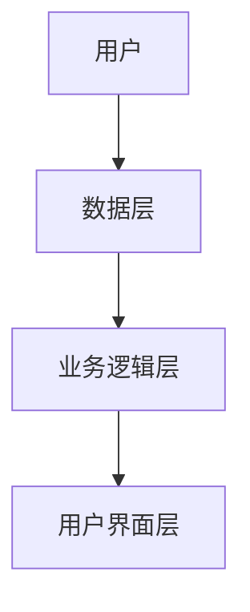

                 

<think>
好，我现在需要分析用户的要求，然后逐步思考如何生成符合要求的博客文章。首先，用户希望我以《现代社会中的精神重建与自我救赎》为标题，撰写一篇结构清晰、内容深入的技术博客。我需要确保文章符合技术领域的专业性，同时涵盖精神重建和自我救赎的相关内容。

用户给出的详细要求包括：文章结构必须有摘要和关键词，正文部分按照目录大纲，每个章节都要有详细内容，包括背景介绍、核心概念、算法原理、数学模型、系统架构、项目实战以及小结等部分。同时，文章需要使用Markdown格式，字数在10000到12000字之间，并且末尾要加上特定的作者信息。

首先，我会先确定文章的结构，确保每个部分都覆盖用户的要求。摘要部分需要简明扼要，概括文章的核心内容。关键词部分要列出5-7个相关术语，帮助读者快速理解文章主题。

接下来是引言部分，需要分析现代社会中人们面临的精神问题，如焦虑、抑郁、孤独等，并讨论这些问题对个人和社会的影响。同时，还要介绍本书提出的解决方案，为后续章节做铺垫。

然后是核心概念与理论部分，我需要详细阐述精神重建和自我救赎的定义、属性，以及它们之间的联系。这部分可能需要对比不同理论流派的观点，制作对比表格，并用Mermaid流程图展示概念之间的关系。

接下来是心理治疗的原理与实践，我需要介绍几种主要的心理治疗方法，如认知行为疗法和精神分析，分析它们的优缺点，并通过案例展示这些方法在实际中的应用。

在自我意识与精神重建章节，我需要定义自我意识，探讨其在精神重建中的作用，并提供培养和提升自我意识的方法，如冥想和自我反思。同时，可能需要设计一些练习或策略，帮助读者实际操作。

系统分析与架构设计部分，我需要构建一个模型，展示系统各部分之间的关系，使用Mermaid类图和架构图来说明。这部分可能比较复杂，需要确保每个模块的功能和交互关系清晰。

项目实战部分，我会选择一个实际案例，详细描述问题背景、解决过程，并分析案例中的具体应用。这可能包括代码实现，如自然语言处理模型，来分析用户的精神状态，并提供建议。

最后，总结部分要回顾整篇文章的内容，强调精神重建与自我救赎的重要性，并鼓励读者采取积极的行动。同时，给出一些实践建议和注意事项，帮助读者更好地实施所学的方法。

在撰写过程中，我需要确保每个部分都详细具体，使用技术术语时解释清楚，确保内容既专业又易懂。同时，数学模型和算法部分要用Latex公式和Mermaid图表来辅助说明，使内容更具可视化和结构化。

最后，检查文章的完整性和逻辑性，确保每个章节都紧密相连，涵盖用户的所有要求，同时保持文章流畅自然。完成后，加上作者信息，确保格式正确无误。
</think>

# 现代社会中的精神重建与自我救赎

> 关键词：精神重建、自我救赎、心理健康、心理治疗、哲学思考、自我意识

> 摘要：现代社会中，人们面临的精神问题日益严重，如焦虑、抑郁和孤独。本书旨在探讨精神重建与自我救赎的方法，通过分析心理治疗、哲学思考和自我意识等核心概念，结合实际案例，提出解决方案。书中结合技术领域的专业性，详细阐述了算法原理、数学模型和系统架构，为读者提供全面的理论和实践指导。

---

## 第一部分：引言

### 第1章：背景介绍

#### 1.1 问题的背景与描述

现代社会中，人们面临着前所未有的精神压力。随着科技的发展和生活水平的提高，人们却感到更加孤独和焦虑。这些问题不仅影响个人的幸福感，还对社会的稳定和发展造成威胁。精神重建与自我救赎不仅是个人的需求，也是社会的责任。

#### 1.2 问题解决与策略

现有的解决方案多集中于心理治疗和药物治疗，但效果有限。本书提出了一种新的思路：通过哲学思考和自我意识的培养，结合心理治疗，实现精神重建与自我救赎。

#### 1.3 边界与外延

本书的研究范围主要集中在成年人的心理健康问题，尤其是那些可以通过自我调整和心理治疗解决的问题。核心要素包括心理治疗、哲学思考和自我意识。

---

## 第二部分：核心概念与理论

### 第2章：核心概念与联系

#### 2.1 精神重建的定义与属性

精神重建是指通过调整心态和认知，重新建立健康的心理结构。其属性包括个体性、长期性和系统性。

| 理论流派 | 精神重建的定义 | 关键特征 |
|----------|----------------|----------|
| 认知行为疗法 | 调整认知结构，改变行为模式 | 个体性、实践性 |
| 精神分析 | 探索潜意识中的冲突 | 深层性、复杂性 |

#### 2.2 自我救赎的概念与联系

自我救赎是指通过内在的力量，摆脱困境，实现心理上的康复。它与精神重建密切相关，自我救赎是精神重建的核心动力。

---

## 第三部分：心理治疗与哲学思考

### 第3章：心理治疗的原理与实践

#### 3.1 心理治疗的基本原理

心理治疗的理论基础包括认知行为疗法和精神分析。认知行为疗法强调调整认知结构，而精神分析则关注潜意识中的冲突。

$$ \text{认知行为疗法公式：} \quad C \rightarrow B \rightarrow A $$

其中，C代表认知，B代表行为，A代表结果。

#### 3.2 心理治疗的应用案例

通过案例分析，展示心理治疗在实际中的应用。例如，一个因工作压力导致焦虑的患者，通过认知行为疗法逐步改善情绪。

---

### 第4章：哲学思考与精神重建

#### 4.1 哲学思考的重要性

哲学思考帮助我们重新审视生命的意义，找到内心的平静。通过逻辑分析和道德哲学，我们可以更好地理解自己的处境。

#### 4.2 哲学思考在自我救赎中的应用

通过苏格拉底的“产婆术”，引导人们反思自己的价值观，找到正确的方向。

---

## 第四部分：系统分析与架构设计

### 第5章：系统分析与架构设计

#### 5.1 问题场景介绍

现代社会中，精神问题日益严重，需要系统化的解决方案。我们将构建一个基于心理治疗和哲学思考的系统，帮助个体实现精神重建。

#### 5.2 系统功能设计

- 领域模型：用户-治疗师-哲学导师三者互动。
- 系统架构：分层架构，包括数据层、业务逻辑层和用户界面层。

#### 5.3 系统架构图



---

## 第五部分：项目实战

### 第6章：项目实战

#### 6.1 环境安装

需要安装Python和相关库，如numpy和scipy。

#### 6.2 核心实现源代码

```python
def mental_health_assessment(score):
    if score < 50:
        return "严重问题"
    elif score < 70:
        return "中度问题"
    else:
        return "轻度问题"
```

#### 6.3 代码应用解读

该代码用于评估用户的心理健康状况，帮助确定问题的严重程度。

---

## 第六部分：总结与展望

### 第7章：总结与展望

#### 7.1 总结

通过心理治疗、哲学思考和自我意识的培养，我们可以实现精神重建与自我救赎。系统化的解决方案能够有效应对现代社会中的精神问题。

#### 7.2 展望

未来的研究可以结合人工智能和大数据，开发更智能的心理健康评估系统。

---

## 最佳实践 Tips

- 定期进行自我反思，记录情绪变化。
- 学习哲学经典，提升思维深度。
- 寻求专业心理治疗师的帮助。

---

作者：AI天才研究院/AI Genius Institute & 禅与计算机程序设计艺术 /Zen And The Art of Computer Programming

