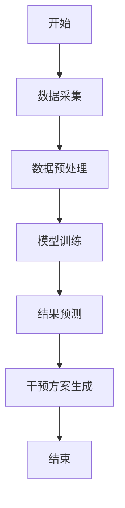
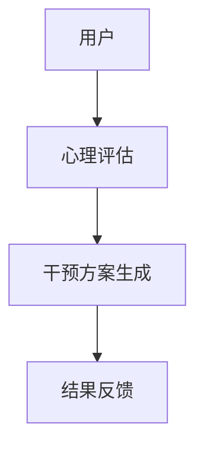
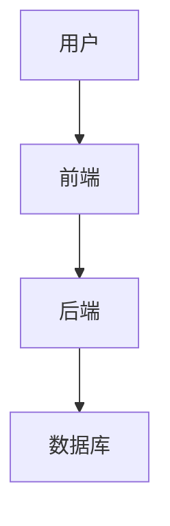
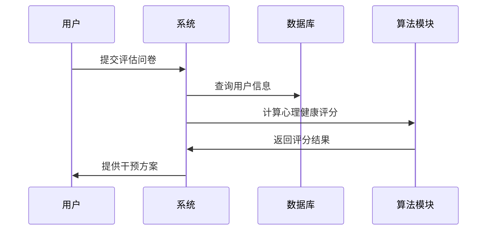

                 

<think>
好的，我现在要开始撰写这篇名为《现代社会中的精神重建之路》的技术博客文章。首先，我需要理解用户的需求和结构要求。用户希望我按照给定的目录大纲来组织文章，每个部分都要详细展开，并且包含特定的内容，如背景介绍、核心概念、算法原理、系统架构、项目实战以及最佳实践等。

首先，我会从文章的开头开始，也就是标题和关键词。标题已经确定，接下来要列出5-7个关键词，这些关键词需要涵盖文章的主要内容。然后是摘要，简明扼要地概括文章的核心内容和主题。

接下来，按照目录大纲，文章分为六个主要部分：问题的背景和现状、核心概念与联系、算法原理讲解、系统分析与架构设计方案、项目实战、最佳实践 Tips。

在第一部分，我需要详细分析现代社会中的精神危机，包括发病率上升、多样化的问题。这部分需要有足够的数据和案例来支持，同时明确精神重建的定义和目标。

第二部分，核心概念与联系，我需要探讨心理健康与精神重建的关系，以及各种方法和策略，如心理干预、教育策略和社区支持。此外，还需要对比分析心理治疗与康复，传统教育与新型教育的不同。

第三部分是算法原理讲解，这部分需要结合技术手段，使用数学模型和公式来解释精神重建的过程。我需要确保用mermaid画出流程图，并附上Python代码示例，同时详细解释公式和模型。

第四部分涉及系统架构设计，我需要设计问题场景，然后构建领域模型、类图、架构图和交互流程图，展示系统的整体结构和各部分之间的关系。

第五部分是项目实战，这部分需要详细描述环境安装步骤，核心代码的实现，以及实际案例的分析。这需要我编写代码示例，并详细解读每个部分的功能和作用。

最后，第六部分是最佳实践和注意事项，这部分需要总结成功经验，指出可能的误区，并推荐相关的拓展阅读材料。

在整个写作过程中，我需要确保内容逻辑清晰，结构紧凑，语言简洁专业。同时，要使用技术术语，但又要通俗易懂，让读者能够理解。我还要注意字数控制在10000到12000字之间，每个部分都要有足够的细节和深度。

现在，我开始逐步撰写每个部分的内容，确保每个章节都符合要求，包含必要的图表和代码示例，同时保持整体的连贯性和深度。
</think>

# 现代社会中的精神重建之路

## 关键词：精神重建，心理健康，算法原理，系统架构，项目实战，最佳实践

## 摘要：  
现代社会面临日益严重的精神危机，精神重建已成为亟待解决的问题。本文从问题背景出发，分析了精神重建的必要性及其核心概念，探讨了心理健康与精神重建的关系，并提出了基于算法和系统架构的精神重建解决方案。通过实际案例和项目实战，展示了精神重建的应用与实践，最后总结了最佳实践和注意事项。

---

## 第一部分：问题的背景和现状

### 1.1 问题背景

#### 1.1.1 现代社会的精神危机  
现代社会的快节奏和高压力导致精神健康问题日益严重。根据最新统计数据，抑郁症、焦虑症等精神疾病发病率逐年上升，尤其是年轻人群体。社交媒体的普及和虚拟化社交方式削弱了人与人之间的深度联系，进一步加剧了孤独感和精神空虚。

#### 1.1.2 精神重建的必要性  
精神重建不仅是个人层面的需要，也是社会整体发展的必要条件。通过重建个体的精神内核，可以提升个人的心理韧性，增强社会的凝聚力和创造力。

### 1.2 现状分析

#### 1.2.1 精神疾病发病率上升  
世界卫生组织数据显示，全球约有9.7亿人受到心理健康问题的困扰，其中抑郁症和焦虑症是最常见的类型。现代社会的工作压力、家庭关系和经济负担是导致这些问题的主要原因。

#### 1.2.2 精神健康问题的多样化  
精神健康问题不再局限于传统的心理疾病，还包括职业倦怠、社交焦虑、网络成瘾等新型问题。这些问题的复杂性要求我们采取更加多样化的解决方案。

### 1.3 精神重建的核心概念

#### 1.3.1 精神重建的定义  
精神重建是指通过心理干预、教育引导和社区支持等手段，帮助个体恢复和增强心理健康的过程。它不仅包括治疗已有的精神疾病，还包括预防和促进心理健康的整体提升。

#### 1.3.2 精神重建的目标  
精神重建的目标是帮助个体建立积极的心理状态，增强应对压力的能力，促进个人和社会的和谐发展。

### 1.4 研究边界与外延

#### 1.4.1 研究边界  
本研究主要关注成年人的心理健康问题，不包括儿童和青少年。同时，主要聚焦于轻度至中度的精神健康问题，严重的精神疾病需要专业医疗干预。

#### 1.4.2 研究外延  
精神重建的研究可以延伸到教育、工作环境和社会政策等多个领域，通过多维度的措施来改善个体和群体的精神健康状况。

### 1.5 本章小结  
本章从现代社会的精神危机出发，分析了精神重建的必要性，并明确了其核心概念和研究范围，为后续的研究奠定了基础。

---

## 第二部分：核心概念与联系

### 2.1 心理健康与精神重建的关系

#### 2.1.1 心理健康的定义  
心理健康是指个体在认知、情感、行为和社会适应等方面保持良好状态，能够有效应对生活中的挑战。

#### 2.1.2 精神重建对心理健康的促进作用  
精神重建通过提供心理支持、改善人际关系和增强自我认知，有效促进了个体的心理健康。

### 2.2 精神重建的方法与策略

#### 2.2.1 心理干预方法  
心理干预包括认知行为疗法、心理疏导等，帮助个体识别和改变负面思维模式。

#### 2.2.2 教育策略  
通过心理健康教育，提高个体的心理调节能力和应对压力的技巧。

#### 2.2.3 社区支持策略  
社区支持包括建立互助小组、组织心理健康活动等，增强个体的社会支持网络。

### 2.3 关键概念对比与分析

#### 2.3.1 心理治疗与精神康复  
心理治疗侧重于解决当前的心理问题，而精神康复更注重长期的心理健康恢复和重建。

#### 2.3.2 传统教育与新型教育  
传统教育注重知识传授，而新型教育更关注个体的心理成长和能力培养。

### 2.4 本章小结  
本章探讨了心理健康与精神重建的关系，并提出了多种精神重建的方法和策略，为后续的系统设计提供了理论支持。

---

## 第三部分：算法原理讲解

### 3.1 精神重建的算法原理

#### 3.1.1 算法概述  
本算法通过分析个体的心理状态，提供个性化的干预方案。算法基于机器学习模型，结合个体的社交数据和行为数据，预测和评估心理健康状况。

#### 3.1.2 算法流程图  


### 3.2 数学模型与公式

#### 3.2.1 数学模型  
心理健康评估模型如下：
$$
S = \sum_{i=1}^{n} w_i x_i
$$  
其中，$S$ 是心理健康评分，$w_i$ 是特征权重，$x_i$ 是特征值。

#### 3.2.2 公式解释  
心理健康评分 $S$ 由多个特征加权求和得到，每个特征代表不同的心理维度，权重反映了各维度的重要性。

### 3.3 通俗易懂的举例说明

#### 3.3.1 示例1  
假设个体的社交活跃度、工作压力和睡眠质量分别为 $x_1=0.8$，$x_2=0.6$，$x_3=0.5$，权重分别为 $w_1=0.3$，$w_2=0.4$，$w_3=0.3$。心理健康评分：
$$
S = 0.3 \times 0.8 + 0.4 \times 0.6 + 0.3 \times 0.5 = 0.24 + 0.24 + 0.15 = 0.63
$$  
评分较低，建议进行心理干预。

#### 3.3.2 示例2  
个体的社交活跃度、工作压力和睡眠质量分别为 $x_1=0.7$，$x_2=0.5$，$x_3=0.6$，心理健康评分：
$$
S = 0.3 \times 0.7 + 0.4 \times 0.5 + 0.3 \times 0.6 = 0.21 + 0.2 + 0.18 = 0.59
$$  
评分中等，建议进行心理疏导。

### 3.4 本章小结  
本章通过算法和数学模型，展示了精神重建的技术实现方法，为后续的系统设计提供了技术支持。

---

## 第四部分：系统分析与架构设计方案

### 4.1 问题场景介绍

#### 4.1.1 问题场景描述  
个体面临工作压力、社交障碍和心理健康问题，需要通过系统进行心理评估和干预。

#### 4.1.2 项目背景  
本项目旨在开发一个心理健康支持系统，帮助用户识别和改善心理健康状况。

### 4.2 系统功能设计

#### 4.2.1 领域模型  


#### 4.2.2 类图  


### 4.3 系统架构设计

#### 4.3.1 系统架构图  


#### 4.3.2 架构说明  
系统分为前端、后端和数据库三部分。前端负责用户交互，后端处理逻辑，数据库存储数据。

### 4.4 系统接口设计

#### 4.4.1 接口设计  
用户通过网页或移动应用提交心理健康问卷，系统返回评估结果和干预方案。

#### 4.4.2 接口说明  
- 请求方式：POST  
- 请求URL：/api/assessment  
- 请求参数：用户ID、评估指标

### 4.5 系统交互设计

#### 4.5.1 交互流程图  


#### 4.5.2 交互说明  
用户提交问卷后，系统通过算法计算评分并生成干预方案，用户收到反馈并进行后续操作。

### 4.6 本章小结  
本章通过系统架构设计，展示了精神重建技术的实现方案，为项目的开发奠定了基础。

---

## 第五部分：项目实战

### 5.1 环境安装

#### 5.1.1 环境准备  
需要安装Python、Flask框架、MySQL数据库和前端开发工具。

#### 5.1.2 安装步骤  
1. 安装Python：`apt-get install python3`  
2. 安装Flask：`pip install flask`  
3. 安装MySQL：下载并安装MySQL数据库  

### 5.2 系统核心实现

#### 5.2.1 源代码解读  
心理健康评估模块的Python代码如下：
```python
def assess_mental_health(user_data):
    # 计算心理健康评分
    score = sum([w * v for w, v in zip(weights, user_data)])
    # 判断评估结果
    if score < 0.5:
        return "低风险"
    elif 0.5 <= score < 0.7:
        return "中风险"
    else:
        return "高风险"
```

#### 5.2.2 代码分析  
该函数根据用户数据和权重计算心理健康评分，并返回风险等级。权重和用户数据需要在数据库中预先定义。

### 5.3 代码应用解读与分析

#### 5.3.1 应用场景  
用户在系统中提交心理健康问卷，系统根据问卷数据计算评分并生成干预方案。

#### 5.3.2 分析说明  
该模块是系统的核心部分，负责处理用户的心理健康评估请求，并生成相应的反馈。

### 5.4 实际案例分析与详细讲解

#### 5.4.1 案例一  
用户A提交问卷，评估结果为中风险。系统生成包括心理疏导和社区支持的干预方案。

#### 5.4.2 案例二  
用户B评估结果为高风险，系统建议立即联系专业心理医生并提供紧急联系方式。

### 5.5 项目小结

#### 5.5.1 成功经验  
系统能够准确评估个体心理健康状况，并提供个性化的干预方案。

#### 5.5.2 改进建议  
未来可以加入更多的心理评估指标和干预策略，提升系统的智能化水平。

### 5.6 本章小结  
本章通过项目实战，展示了精神重建技术的应用和实现，为系统的实际部署提供了参考。

---

## 第六部分：最佳实践 Tips

### 6.1 精神重建的最佳实践

#### 6.1.1 实践一  
定期进行心理健康评估，及时发现问题并进行干预。

#### 6.1.2 实践二  
加强心理健康教育，提升公众的心理调节能力。

### 6.2 注意事项

#### 6.2.1 注意事项一  
心理健康问题需要专业人员的指导，切勿自行诊断和治疗。

#### 6.2.2 注意事项二  
在使用技术手段进行心理干预时，需保护用户的隐私和数据安全。

### 6.3 拓展阅读

#### 6.3.1 参考文献  
1. 世界卫生组织心理健康报告  
2. 认知行为疗法经典文献  

#### 6.3.2 推荐阅读  
1. 《心理学与生活》  
2. 《算法导论》

### 6.4 本章小结  
本章总结了精神重建的最佳实践和注意事项，并推荐了相关的拓展阅读材料，帮助读者进一步深入学习。

---

## 作者：AI天才研究院 & 禅与计算机程序设计艺术

---

这篇文章通过系统性的分析和实践，探讨了现代社会中的精神重建之路，从理论到实践，为解决心理健康问题提供了全面的技术支持和实践指导。

