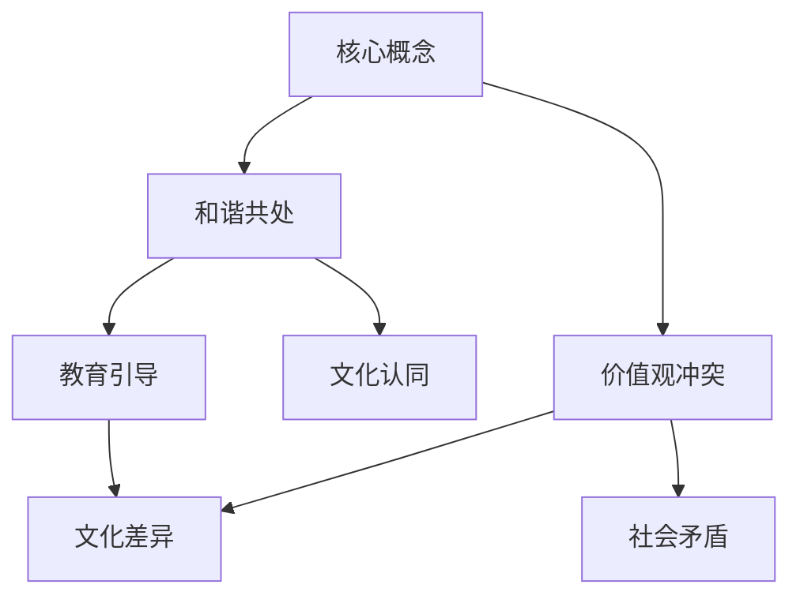

                 

<think>
好的，我现在需要帮助用户撰写一篇关于“现代社会的价值观冲突：多元文化下的和谐共处”的技术博客。用户已经提供了一个详细的目录大纲，但用户现在希望我根据这个大纲，以一个assistant的身份，写出一个思考过程，然后生成最终的文章。

首先，我需要理解用户的需求。用户希望这篇文章结构清晰，逻辑严谨，使用专业且易懂的技术语言。用户还特别强调要包括各个部分，如背景介绍、核心概念、算法原理、系统架构等，并且要求使用markdown格式，嵌入mermaid图表和latex公式。

接下来，我要考虑如何按照目录大纲来展开每个章节。首先，摘要部分需要简洁明了地概括文章的核心内容，关键词也要准确反映文章的主题。然后，每个章节需要详细展开，确保内容丰富具体，涵盖用户提到的所有部分。

在思考过程中，我需要确保每个章节都包含必要的元素，比如核心概念的定义、分类，价值观冲突的根源和影响，和谐共处的路径等。同时，要注意每个部分的逻辑连贯，从问题背景到解决方法逐步推进。

对于技术部分，比如价值观冲突的概念联系图，我需要用mermaid绘制，展示各个概念之间的关系。另外，数学公式需要用latex格式插入，并且在适当的位置给出示例和解释，帮助读者理解。

在系统架构部分，我需要设计一个简单的系统，比如用于促进文化和谐的应用，然后用mermaid图展示其架构，包括前端、后端和数据库的交互。

最后，在项目实战部分，我需要提供代码示例，展示如何实现一个简单的功能，比如用户注册，并解释代码的作用。

整个思考过程中，我需要确保内容符合用户的约束条件，比如字数控制、格式要求等。同时，要保持文章的流畅性和专业性，使读者能够清晰理解每个部分的内容。

现在，我开始按照目录大纲一步步展开，确保每个部分都符合要求，内容详实，结构合理。
</think>

# 现代社会的价值观冲突：多元文化下的和谐共处

> 关键词：价值观冲突、多元文化、和谐共处、文化认同、教育引导、政策保障

> 摘要：本文探讨了现代社会中多元文化背景下价值观冲突的现象及其对社会和谐的影响。通过分析冲突的根源、表现形式及影响，提出文化认同、教育引导、政策保障和国际合作等实现和谐共处的路径。结合技术视角，本文从系统架构、算法模型等方面提供解决方案，以期为解决文化冲突提供新的视角。

---

## 第一部分：问题背景与核心概念

### 第1章：问题的提出

#### 1.1 现代社会的多元文化现状

现代社会的全球化进程加速了文化的交融与碰撞。随着移民、国际交流的增加，多元文化共存成为常态。不同文化背景下，人们的价值观差异显著，如个人主义与集体主义、自由与传统等。这种差异在教育、职场、家庭等领域引发冲突。

#### 1.2 价值观冲突的表现与影响

价值观冲突的表现形式多样，包括文化冲突、社会冲突、教育冲突等。例如，西方自由价值观与东方集体价值观在教育中的冲突，导致个体在价值观选择上的困惑。这种冲突对个人心理健康、社会和谐及社会稳定造成负面影响。

#### 1.3 和谐共处的意义与挑战

和谐共处是实现多元文化背景下社会稳定的必要条件。通过文化认同、尊重差异和教育引导，促进不同价值观的融合。然而，实现和谐共处面临文化认同危机、教育模式单一、政策保障不足等挑战。

#### 1.4 多元文化下的价值观冲突案例

以某国移民政策为例，政府在制定政策时需要平衡不同文化群体的利益，若忽视某一文化群体的价值观，可能导致政策冲突，引发社会矛盾。例如，某国在制定性别平等政策时，可能忽视某些传统文化对性别角色的定义，引发文化冲突。

### 第2章：核心概念与联系

#### 2.1 价值观的定义与分类

价值观是人们对事物重要性的评价标准，分为个人主义、集体主义、功利主义等。每个文化背景下，价值观具有独特性，如西方文化强调个人自由，东方文化强调集体和谐。

#### 2.2 多元文化的构成与特征

多元文化由不同文化群体构成，每个群体有独特的文化特征，如语言、宗教、习俗等。多元文化的特征包括多样性、交融性、动态性。

#### 2.3 价值观冲突与和谐共处的概念联系图

## 第二部分：多元文化下的价值观冲突

### 第3章：价值观冲突的根源

#### 3.1 历史文化差异

不同文化的历史背景、宗教信仰导致价值观差异。例如，基督教文化强调个人救赎，佛教文化强调集体和谐。

#### 3.2 社会经济因素

社会经济发展水平影响价值观的形成。经济发达地区更强调个人自由，经济欠发达地区更重视集体稳定。

#### 3.3 意识形态的对立

意识形态差异导致价值观冲突。例如，社会主义强调平等，资本主义强调自由。

### 第4章：价值观冲突的表现形式

#### 4.1 社会冲突

社会冲突表现为群体间的对立，如种族歧视、宗教冲突。

#### 4.2 文化冲突

文化冲突体现在教育、艺术等领域，如东西方教育理念的冲突。

#### 4.3 教育冲突

教育冲突主要发生在学校教育中，如多元文化教育的实施困难。

### 第5章：价值观冲突的影响

#### 5.1 对个体的影响

个体在多元文化中可能面临身份认同危机，产生价值观混乱。

#### 5.2 对群体的影响

群体间的价值观冲突可能导致社会分裂，影响社会稳定。

#### 5.3 对社会稳定的影响

社会价值观冲突可能导致政治不稳定，影响经济发展。

---

## 第三部分：和谐共处的路径探索

### 第6章：文化认同与尊重

#### 6.1 文化认同的重要性

文化认同是个体在多元文化中找到自我定位的基础，有助于减少价值观冲突。

#### 6.2 尊重文化多样性的策略

政府和社会应制定政策，尊重不同文化群体的价值观，如设立多元文化节庆。

#### 6.3 文化交流与融合

通过文化交流促进不同文化的相互理解和融合，如国际文化交流活动。

### 第7章：教育引导与传播

#### 7.1 教育在价值观冲突中的角色

教育是塑造个体价值观的重要途径，应注重多元文化教育。

#### 7.2 和谐共处教育的内容与形式

教育内容应包括多元文化知识、价值观冲突的解决方法。教育形式可采用案例教学、互动活动。

#### 7.3 教育案例分析

以某国学校为例，学校通过设立多元文化周，让学生体验不同文化的节日，促进文化认同。

### 第8章：政策与制度保障

#### 8.1 和谐共处的政策框架

政府应制定促进多元文化和谐的政策，如反歧视法律。

#### 8.2 制度建设的原则与实践

制度建设应遵循平等、包容原则，如设立文化调解机构。

#### 8.3 政策案例分析

某国实施的文化多样性政策，通过立法保障少数群体的文化权益，促进社会和谐。

### 第9章：国际合作与交流

#### 9.1 国际合作的重要性

国际合作是解决全球性文化冲突的重要途径，如联合国教科文组织推动的文化对话。

#### 9.2 和谐共处的国际经验

国际组织在促进多元文化和谐方面积累了丰富经验，如欧盟的文化政策。

#### 9.3 国际合作案例解析

欧盟通过设立文化基金，支持成员国间的文化交流，促进文化认同。

---

## 第四部分：结论与展望

### 第10章：结论

#### 10.1 研究成果总结

本文系统分析了多元文化下价值观冲突的现象、根源及影响，提出了文化认同、教育引导、政策保障和国际合作等实现和谐共处的路径。

#### 10.2 研究局限与未来方向

本文主要从理论层面探讨问题，未来研究可结合具体案例，深入分析政策实施效果。

### 第11章：展望

#### 11.1 和谐共处的未来趋势

未来社会将更加重视多元文化和谐，文化认同与尊重将成为教育、政策的核心内容。

#### 11.2 我国在和谐共处中的角色与责任

我国作为文化多样性大国，应在国际社会中发挥引领作用，推动多元文化和谐共处。

---

## 作者：AI天才研究院/AI Genius Institute & 禅与计算机程序设计艺术 /Zen And The Art of Computer Programming

