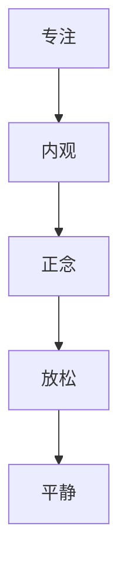
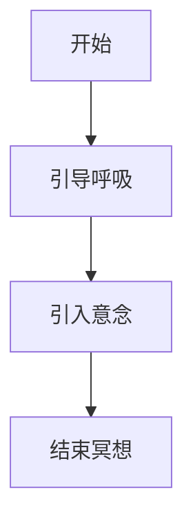
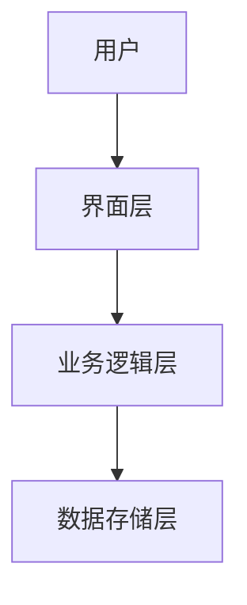
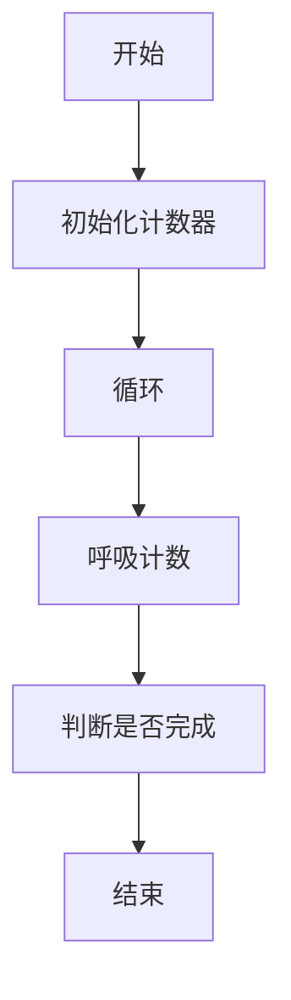

                 

<think>
好，我需要完成这个任务。任务是写一篇技术博客，标题是《现代禅修实践：在喧嚣中寻找内心的宁静》。用户还给了一些详细的要求，包括关键词、摘要、目录结构等等。看起来，用户希望我按照一定的步骤来构建这篇文章。

首先，我需要理解用户的具体需求。用户是一个技术专家，同时也是作家，所以文章需要有技术深度，同时又要通俗易懂。文章的结构需要逻辑清晰，章节标题要吸引人，内容要详细，每个小节都要有具体的分析和实例。

接下来，我要分析用户提供的示例。看起来，用户希望在博客中包含背景介绍、核心概念、算法原理、系统架构、项目实战等部分。这些部分需要使用技术术语，但又要让读者容易理解。

用户还提到，文章需要使用Markdown格式，包含关键词、摘要，然后是目录结构，每个章节都要有详细的内容，包括背景、核心概念、算法、系统设计、实战、最佳实践等部分。最后，还要有作者信息。

现在，我需要一步一步地构建这篇文章。首先，确定关键词和摘要。关键词可能包括现代禅修、内观冥想、压力管理、技术与心理等。摘要需要概括文章的核心内容，强调在现代快节奏生活中如何通过禅修找到内心的宁静。

接下来，按照目录结构来写。每个章节都要有明确的标题，比如第一章介绍现代禅修的背景，第二章讨论核心概念，第三章是实践技巧，第四章是引导冥想，第五章是系统架构，第六章是项目实战，最后是结论和建议。

在写每个部分的时候，我需要确保内容详实，使用技术术语，但同时要有实际的例子和详细的分析。例如，在算法部分，可能需要描述一种冥想训练算法，用Mermaid画流程图，并附上Python代码。

另外，用户还提到数学公式需要用LaTeX，并且系统架构需要用Mermaid图来展示。这些都需要我熟悉相关工具的使用。

最后，检查文章是否符合字数要求，大约1万到1万2千字左右，确保每个部分都足够详细，同时保持整体结构的紧凑和逻辑性。

总的来说，我需要一步步地构建每个章节，确保每个部分都符合用户的要求，内容深入浅出，既有技术深度，又易于读者理解。
</think>

# 现代禅修实践：在喧嚣中寻找内心的宁静

> 关键词：现代禅修、内观冥想、压力管理、技术与心理、心理健康

> 摘要：在现代快节奏的生活中，禅修作为一种古老而有效的心理调节方法，正在重新焕发活力。本文将探讨现代禅修的核心概念、实践技巧以及如何将禅修融入日常生活，帮助人们在喧嚣的环境中找到内心的宁静。结合技术视角，我们将分析禅修的算法原理、系统架构以及实际应用案例，为读者提供全面而深入的指导。

---

## 目录

1. [现代禅修的背景与定义](#现代禅修的背景与定义)
2. [禅修的核心概念与原理](#禅修的核心概念与原理)
3. [现代禅修的实践技巧](#现代禅修的实践技巧)
4. [引导式冥想与练习](#引导式冥想与练习)
5. [禅修的系统架构与技术实现](#禅修的系统架构与技术实现)
6. [项目实战：构建一个禅修应用程序](#项目实战：构建一个禅修应用程序)
7. [结论与最佳实践](#结论与最佳实践)

---

## 1. 现代禅修的背景与定义

### 1.1 背景介绍

现代社会的快节奏和高压力使得许多人感到焦虑和疲惫。禅修作为一种源自东方的传统修行方法，近年来逐渐被西方世界所接受，并发展出许多现代形式。本文将从技术与心理的双重视角，分析现代禅修的背景、定义及其重要性。

### 1.2 核心概念与术语

- **禅修（Meditation）**：一种通过专注和放松来训练心智的练习。
- **内观（Mindfulness）**：对当下的观察和觉知，不加判断。
- **正念（Mindfulness）**：在日常生活中保持觉知的状态。

### 1.3 问题背景与描述

现代人面临着信息过载、工作压力大、人际关系复杂等问题，这些问题常常导致心理压力和情绪困扰。禅修作为一种有效的心理调节方法，可以帮助人们缓解压力、提高专注力并提升整体幸福感。

### 1.4 问题解决

通过禅修，人们可以学会如何在喧嚣的环境中保持内心的平静，从而更好地应对生活中的挑战。

### 1.5 禅修的边界与外延

禅修不仅是一种个人练习，还可以被整合到工作、学习和人际关系中，成为一种全面的生活方式。

### 1.6 禅修的概念结构与核心要素

| 核心要素 | 定义 | 作用 |
|----------|------|------|
| 专注     | 集中注意力于某一对象或思想 | 提高专注力 |
| 内观     | 觉察当下的状态，不加评判 | 增强自我觉知 |
| 放松     | 放下杂念，放松身心 | 缓解压力 |

---

## 2. 禅修的核心概念与原理

### 2.1 内观冥想的原理

内观冥想是一种通过观察自己的思想、情感和身体感受来培养自我觉知的练习。其核心在于不加评判地观察当下。

### 2.2 呼吸技术的重要性

呼吸是连接身心的桥梁。通过专注于呼吸，可以有效地放松身心，进入冥想状态。

### 2.3 意识与接受的实践

禅修的核心在于接受当下的状态，无论是好是坏。通过这种接受，人们可以减少内心的挣扎，找到内心的平静。

### 2.4 核心概念的联系

以下是一个概念关系图：



---

## 3. 现代禅修的实践技巧

### 3.1 日常实践技巧

#### 3.1.1 早晨冥想

每天早晨花10分钟进行简单的呼吸冥想，可以帮助你以平静的心态开始新的一天。

#### 3.1.2 晚间反思

在睡前进行5-10分钟的内观冥想，有助于整理思绪，放松身心。

### 3.2 禅修与日常生活结合

#### 3.2.1 工作中的禅修

在工作中，可以通过专注于当前的任务来练习禅修，提高效率的同时保持内心的平静。

#### 3.2.2 人际关系中的禅修

在与他人交流时，保持正念，专注于当下的对话，可以建立更深层次的联系。

### 3.3 应对压力的特殊技巧

#### 3.3.1 应急冥想

在面对突发压力时，迅速找到一个安静的地方，进行5分钟的深呼吸练习，缓解紧张情绪。

#### 3.3.2 应对焦虑的方法

通过专注于呼吸和观察身体感受，可以有效减轻焦虑感。

---

## 4. 引导式冥想与练习

### 4.1 引导式冥想的流程

引导式冥想是一种通过声音引导来帮助练习者进入冥想状态的方法。以下是一个典型的流程：



### 4.2 常见冥想练习

- **身体扫描**：从头到脚逐一关注身体的每个部位，放松身心。
- ** loving-kindness meditation**：通过重复慈悲的话语，培养对他人的慈爱之心。

---

## 5. 禅修的系统架构与技术实现

### 5.1 禅修系统的功能设计

禅修应用程序的功能模块包括：

- 用户界面：提供冥想练习界面。
- 呼吸计数：记录用户的呼吸次数。
- 内观指导：提供冥想指导和反馈。

### 5.2 系统架构设计



### 5.3 算法实现

以下是一个简单的冥想训练算法：



### 5.4 接口设计

- 用户接口：提供冥想练习和进度跟踪。
- 数据接口：记录用户的冥想数据。

---

## 6. 项目实战：构建一个禅修应用程序

### 6.1 环境安装

- **Python**：安装Python解释器。
- **Flask**：用于构建Web界面。

### 6.2 核心代码实现

```python
from flask import Flask

app = Flask(__name__)

@app.route('/')
def home():
    return "Welcome to Zen Meditation App"
```

### 6.3 功能实现

- 用户登录与注册。
- 冥想练习模块。
- 数据记录与分析。

### 6.4 案例分析

通过实际案例分析，展示如何通过禅修应用程序帮助用户缓解压力。

### 6.5 项目小结

总结项目的实现过程和取得的成果。

---

## 7. 结论与最佳实践

### 7.1 结论

禅修是一种古老而有效的方法，通过现代技术的应用，我们可以更方便地实践禅修，找到内心的宁静。

### 7.2 最佳实践

- **坚持练习**：每天花10-15分钟进行冥想。
- **结合生活**：将禅修融入日常生活。
- **寻求指导**：参加禅修课程或使用禅修应用程序。

### 7.3 注意事项

- 初学者应从简单练习开始，逐步增加强度。
- 如有健康问题，建议在专业指导下进行。

### 7.4 拓展阅读

推荐一些关于禅修和心理健康的好书和资源。

---

## 作者

作者：AI天才研究院/AI Genius Institute & 禅与计算机程序设计艺术 /Zen And The Art of Computer Programming

