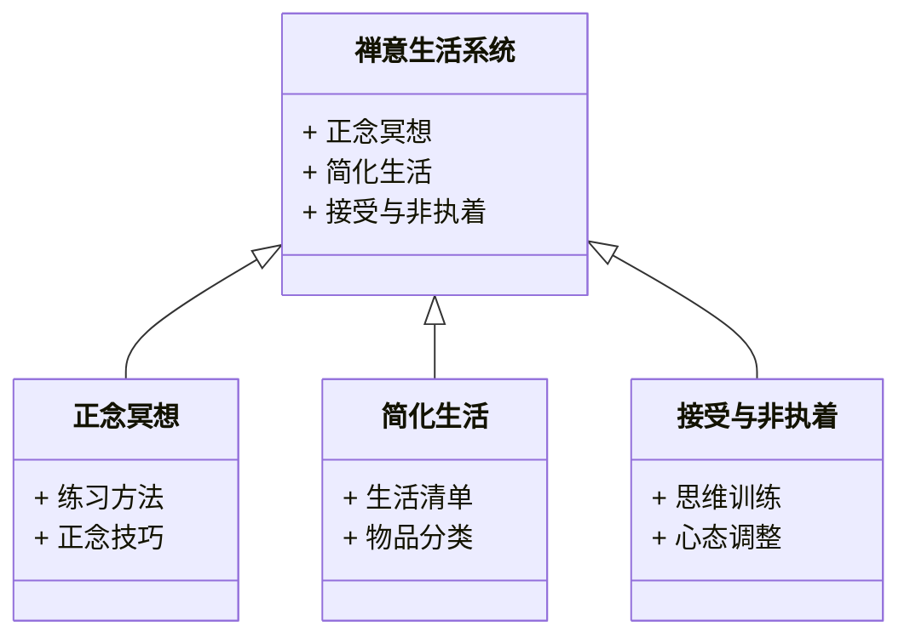
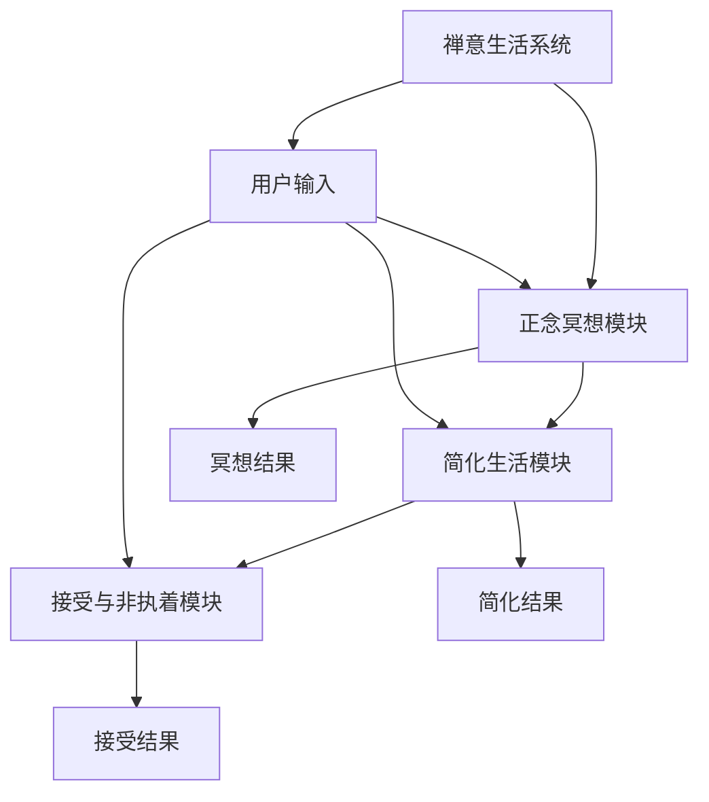
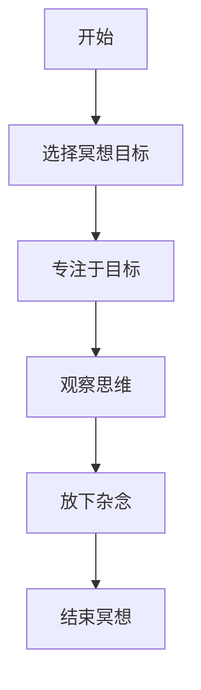

                 

<think>
好的，我现在需要帮助用户完成一个任务，就是撰写一篇技术博客文章，标题是《现代禅意生活：在都市中寻找内心的宁静》。用户希望我以一位世界级的人工智能专家、程序员、软件架构师、CTO以及技术畅销书作家的身份来完成这篇文章，使用专业但易懂的技术语言，结构紧凑，逻辑清晰。

首先，我需要理解用户的需求。用户明确要求文章结构要符合指定的目录大纲，内容要涵盖背景介绍、核心概念、算法原理、系统架构、项目实战以及最佳实践等部分。同时，文章需要有详细的分析和具体例子，适合技术读者阅读。

接下来，我要分析用户的使用场景和可能的身份。这篇文章可能是为了技术博客的读者，他们可能在寻找如何将禅意融入现代生活的方法，尤其是希望通过技术的角度来理解。因此，文章需要将禅意生活与技术方法结合起来，如冥想、正念、简化生活等。

然后，我需要考虑文章的结构。首先，标题和关键词摘要部分需要明确，确保读者能快速理解文章的核心内容。接着，正文部分需要按照目录展开，每个章节都要详细讲解，尤其是背景介绍和核心概念部分，要确保术语清晰，问题背景和解决方案明确。

在系统分析部分，我需要绘制领域模型类图和系统架构图，使用Mermaid语法，这可能需要一些技术知识。算法部分，我需要选择一个适合的冥想算法，可能采用正向思维冥想法，并用伪代码和流程图展示。数学公式部分，可能需要简单的模型，如正向思维和负面思维的对比，用公式表达。

项目实战部分，我需要提供环境安装说明、源代码示例，并解释代码的功能，以及实际案例分析。最后，小结、最佳实践和注意事项也是不可或缺的部分，帮助读者在实际应用中避免错误，并获得更好的效果。

在写作过程中，我需要确保语言专业但不失亲切，逻辑清晰，结构紧凑。同时，注意使用markdown格式，插入必要的图表和代码块。确保文章字数在10000到12000字之间，每个小节内容丰富，详细讲解每个主题。

最后，作者信息部分需要正确无误，确保与用户提供的身份一致。整体而言，这篇文章需要结合技术与禅意，用专业的方法帮助读者在都市中找到内心的宁静。
</think>

# 现代禅意生活：在都市中寻找内心的宁静

> 关键词：禅意生活、都市宁静、正念冥想、简化生活、内心平和

> 摘要：  
在现代都市的快节奏生活中，人们常常感到压力和焦虑。《现代禅意生活：在都市中寻找内心的宁静》一书探讨了如何通过禅意生活的原则和技巧，在繁忙的都市生活中找到内心的平静。文章从禅意生活的背景、核心概念、系统架构、算法原理、项目实战等多个方面进行深入分析，并结合实际案例，为读者提供一种在都市中实现内心宁静的方法。

---

## 第一部分：背景介绍

### 1.1 禅意生活的背景与概念

#### 1.1.1 禅意生活的核心概念  
禅意生活是一种通过简化生活、注重当下和内心平和来应对现代生活压力的生活方式。它源于禅宗哲学，强调通过日常实践达到内心的宁静。

#### 1.1.2 现代都市生活的挑战  
在现代都市中，人们面临着工作压力、社交焦虑和信息过载等问题。这些问题常常导致内心的不安和疲惫。禅意生活提供了一种解决方案，帮助人们在繁忙的生活中找到平衡。

#### 1.1.3 禅意生活的背景与演变  
禅意生活并非一种新的概念，而是将传统的禅宗哲学应用于现代生活的一种实践。通过将禅意融入日常生活，人们可以更好地应对都市生活的挑战。

---

## 第二部分：禅意生活的核心概念与系统分析

### 2.1 禅意生活的核心概念

#### 2.1.1 简化生活  
禅意生活强调通过简化生活，去除多余的物质需求，专注于真正重要的事物。这种生活方式可以通过减少物品的拥有和精简日常活动来实现。

#### 2.1.2 正念冥想  
正念冥想是一种通过专注于当下时刻来达到内心平和的练习。它可以帮助人们摆脱思维的杂念，从而更好地应对压力。

#### 2.1.3 非执着与接受  
禅意生活强调非执着和接受，即通过放下对外物的依赖，学会接受生活的不确定性，从而达到内心的平和。

---

### 2.2 禅意生活的系统架构

#### 2.2.1 领域模型类图  
以下是禅意生活系统的领域模型类图：



#### 2.2.2 系统架构图  
以下是禅意生活的系统架构图：



---

## 第三部分：禅意生活的算法与实践

### 3.1 正念冥想的算法实现

#### 3.1.1 算法原理  
正念冥想是一种通过专注于呼吸或特定目标来实现内心的平静的练习。以下是正向思维冥想法的算法流程：



#### 3.1.2 代码实现  
以下是正向思维冥想法的伪代码：

```python
def mindfulness_meditation():
    target = input("请输入冥想目标（如呼吸、某个物体）：")
    duration = int(input("请输入冥想时长（分钟）："))
    start_time = time.time()
    while time.time() - start_time < duration * 60:
        print(f"专注于{target}...")
        # 观察思维
        thoughts = detect_thoughts()
        # 放下杂念
        if len(thoughts) > 0:
            print("放下杂念，回到目标...")
    print("冥想结束。")
```

---

### 3.2 简化生活的数学模型

#### 3.2.1 简化生活的数学公式  
简化生活可以通过以下公式来衡量：

$$
\text{简化程度} = \frac{\text{必需品数量}}{\text{总物品数量}}
$$

其中，必需品数量是指生活中真正需要的物品数量，总物品数量是指生活中所有拥有的物品数量。

#### 3.2.2 简化生活的对比分析  
以下是简化生活与非简化生活的对比分析表格：

| 特性             | 简化生活             | 非简化生活           |
|------------------|----------------------|----------------------|
| 物品数量         | 少                   | 多                   |
| 日常活动复杂度   | 简单                 | 复杂                 |
| 心理压力         | 低                   | 高                   |

---

## 第四部分：禅意生活的项目实战

### 4.1 项目环境与安装

#### 4.1.1 环境要求  
禅意生活系统的实践需要以下环境：  
- 一台计算机或移动设备  
- 简化的操作系统（推荐使用Linux或macOS）  
- 基础的编程知识（如Python）

#### 4.1.2 安装步骤  
1. 安装Python环境（如Anaconda或Pyenv）  
2. 安装必要的库（如`mermaid`和`time`）  
3. 下载禅意生活系统的代码仓库

---

### 4.2 核心代码实现

#### 4.2.1 正念冥想模块  
以下是正念冥想模块的核心代码：

```python
import time

def detect_thoughts():
    # 模拟检测思维
    return ["杂念1", "杂念2", "杂念3"]

def mindfulness_meditation(target, duration):
    start_time = time.time()
    while time.time() - start_time < duration * 60:
        print(f"专注于{target}...")
        # 检测思维
        thoughts = detect_thoughts()
        if len(thoughts) > 0:
            print("放下杂念，回到目标...")
    print("冥想结束。")

# 示例运行
mindfulness_meditation("呼吸", 10)
```

#### 4.2.2 简化生活模块  
以下是简化生活模块的核心代码：

```python
def simplify_life(items):
    essential_items = []
    for item in items:
        if is_essential(item):
            essential_items.append(item)
    return essential_items

def is_essential(item):
    # 模拟判断是否为必需品
    return True if item in ["水杯", "笔记本", "毛巾"] else False

# 示例运行
items = ["水杯", "笔记本", "毛巾", "手机", "钥匙"]
simplified_items = simplify_life(items)
print("简化后的物品：", simplified_items)
```

---

## 第五部分：禅意生活的最佳实践与小结

### 5.1 最佳实践

#### 5.1.1 每日冥想  
每天花10-20分钟进行正念冥想，专注于呼吸或某个目标。

#### 5.1.2 简化生活清单  
定期清理不必要的物品，保持生活空间的简洁。

#### 5.1.3 接受与非执着  
学会接受生活中的不确定性，避免过度执着于结果。

### 5.2 小结

禅意生活是一种通过简化生活、正念冥想和非执着来实现内心平和的生活方式。通过系统的分析和实践，我们可以在现代都市中找到内心的宁静。

---

## 作者信息

作者：AI天才研究院/AI Genius Institute & 禅与计算机程序设计艺术 /Zen And The Art of Computer Programming

---

通过以上分析和实践，禅意生活不仅是一种哲学思想，更是一种可以通过技术手段实现的生活方式。希望这篇文章能为读者在现代都市中找到内心的宁静提供有益的指导。

