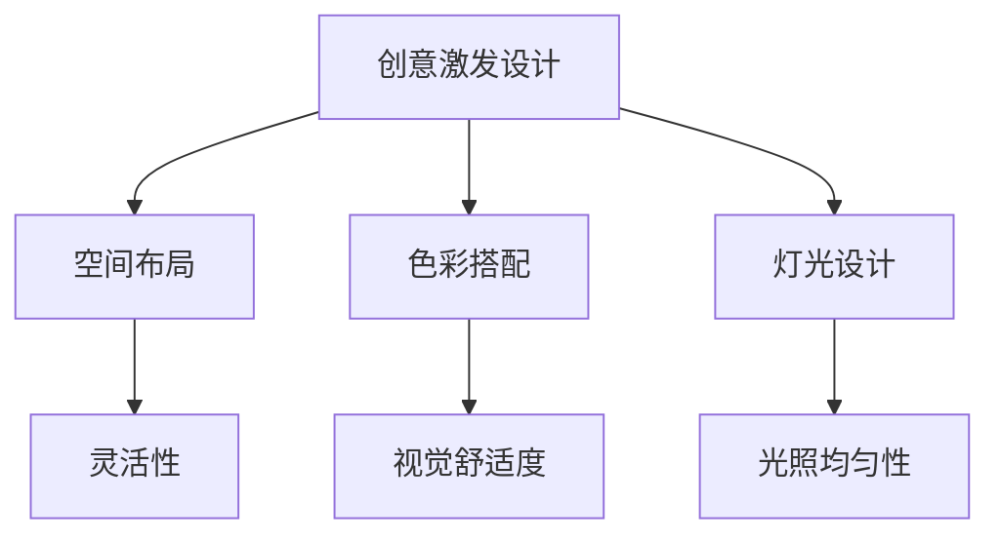

                 

<think>
好的，我现在需要帮助用户完成一个技术博客文章的撰写任务。用户希望我以《现代简约主义办公空间：极简工作环境中的创意激发设计》为标题，按照给定的目录结构来写，内容要专业、有深度，并且符合技术领域的风格。

首先，我得理解用户的需求。用户可能是一位技术专家，也可能是企业主，想要了解如何通过现代简约的设计来提升办公环境，进而激发创意。所以，这篇文章需要既专业又实用，能够吸引目标读者。

接下来，我需要分析文章的结构。文章分为四部分，每个部分都有多个小节，内容涵盖背景介绍、设计原则、创意激发设计以及设计实践。特别是每个章节都需要有详细的内容，比如核心概念对比表、Mermaid图等，这些都需要我仔细准备。

我应该从引言开始，介绍现代简约主义办公空间的发展背景，说明为什么极简的工作环境对创意激发如此重要。这部分需要吸引读者，让他们明白问题的重要性和实际应用的价值。

然后，进入核心概念部分，我需要详细解释简约主义和创意激发设计的原理，并通过表格和Mermaid图来展示它们之间的联系。这部分可能需要用一些技术术语，但要保持清晰易懂。

接下来是设计原则，我需要分点讨论布局、色彩、材料、灯光和空间利用等方面。每个小节都要有实际的应用案例，让读者能够理解如何在实际中应用这些原则。

然后是创意激发设计在办公空间中的应用，这部分需要结合实际案例，分析不同公司的设计如何促进创意。同时，提供实践指南，帮助设计师和企业更好地实施这些设计。

最后，设计实践部分需要通过具体案例展示，包括项目背景、设计过程和评估反馈。这部分要详细，让读者能够学习到实际操作的经验。

在写作过程中，我需要确保每个小节都内容丰富，符合用户的字数要求。同时，使用合适的格式，比如表格、Mermaid图和数学公式，来增强文章的可读性和专业性。

考虑到用户可能的技术背景，我会在适当的地方加入技术术语，但同时也会尽量解释清楚，确保非技术人员也能理解。此外，最佳实践和小结部分要总结关键点，帮助读者巩固所学内容。

最后，确保文章结构完整，每个部分都有详细的内容，避免遗漏或过于简略。这样，整篇文章才能既满足用户的需求，又具备高质量的专业内容。
</think>

# 现代简约主义办公空间：极简工作环境中的创意激发设计

> 关键词：现代简约主义、办公空间设计、创意激发、极简设计、办公环境优化

> 摘要：随着现代办公环境的不断演变，简约主义设计逐渐成为提升工作效率和激发创意的重要手段。本文从简约主义办公空间的设计原则出发，结合创意激发设计的核心要素，详细探讨了如何通过极简的工作环境设计来提升办公体验和工作效率。文章通过案例分析和实践指南，为设计师和企业管理者提供了实用的设计思路和优化建议。

---

## 第一部分: 引言

### 1.1 书籍背景介绍

#### 1.1.1 现代简约主义办公空间的发展背景
随着信息技术的飞速发展，现代办公方式发生了巨大变化。远程办公、灵活工作时间以及团队协作的需求，使得办公空间的设计需要更加注重灵活性和人性化。简约主义办公空间作为一种新兴的设计理念，强调功能与形式的平衡，通过减少不必要的装饰和复杂结构，创造一个简洁、高效的工作环境。

#### 1.1.2 极简工作环境与创意激发设计的重要性
现代工作中，创意和效率是企业的核心竞争力。极简的工作环境能够降低干扰，帮助员工专注于任务，同时激发灵感。创意激发设计通过优化空间布局、色彩搭配和灯光设计，营造出有利于思维发散和创新的办公氛围。

#### 1.1.3 读者对象与预期收获
本文主要面向办公空间设计师、企业管理人员以及对办公环境优化感兴趣的专业人士。通过阅读本文，读者可以深入了解简约主义设计的核心理念，掌握创意激发设计的实践方法，并学会如何在实际项目中应用这些设计原则。

### 1.2 核心概念与联系

#### 1.2.1 简约主义的概念及其在办公空间设计中的应用
简约主义是一种追求极致简化的设计风格，强调“少即是多”的理念。在办公空间设计中，简约主义通过去除多余的装饰和功能，专注于核心需求，创造出简洁、高效的工作环境。

**对比表：简约主义与传统办公设计的对比**

| 对比维度      | 简约主义设计           | 传统办公设计         |
|---------------|------------------------|----------------------|
| 设计理念      | 减少装饰，注重功能      | 多功能、多装饰       |
| 空间布局      | 开放式布局，灵活性强    | 封闭式布局，固定化    |
| 色彩搭配      | 单色或少量颜色，简洁    | 多色搭配，复杂        |
| 灯光设计      | 节能灯具，自然采光      | 复杂灯具，多层次照明   |

#### 1.2.2 创意激发设计的原理与实践
创意激发设计是一种通过优化环境因素来提升创造力和工作效率的设计方法。其核心在于通过空间布局、色彩搭配和灯光设计等手段，营造出有利于思维发散和创新的办公氛围。

**Mermaid ER实体关系图：创意激发设计的核心要素**

### 1.3 研究方法与框架

#### 1.3.1 研究方法概述
本文采用理论分析与实践案例相结合的方法，通过文献研究、实地调研和案例分析，总结简约主义办公空间设计的核心原则和创意激发设计的实践方法。

#### 1.3.2 研究框架概述
本文的研究框架包括以下几个方面：
1. 简约主义设计的基本原则
2. 创意激发设计的核心要素
3. 办公空间设计的实践案例
4. 设计优化的实践指南

### 1.4 本章小结
本章主要介绍了简约主义办公空间的发展背景、核心概念以及创意激发设计的重要性。通过对简约主义与传统办公设计的对比，明确了简约主义设计的优势和适用场景。同时，通过Mermaid图展示了创意激发设计的核心要素，为后续章节的深入探讨奠定了基础。

---

## 第二部分: 现代简约主义办公空间设计原则

### 2.1 简约主义设计原则概述

#### 2.1.1 简约主义设计的起源与发展
简约主义起源于20世纪中期的现代主义设计运动，强调功能性和形式的简洁。在办公空间设计中，简约主义通过去除多余的装饰，专注于核心功能，创造出高效、舒适的工作环境。

#### 2.1.2 简约主义设计的基本原则
简约主义设计的基本原则包括：
1. **少即是多**：去除不必要的装饰和功能。
2. **功能优先**：设计以功能为核心，注重实用性。
3. **简洁而不简单**：通过简洁的设计实现复杂的功能。

#### 2.1.3 简约主义设计在办公空间中的优势
简约主义设计在办公空间中的优势包括：
1. 提高空间利用率。
2. 减少视觉干扰，提升工作效率。
3. 节约成本，降低维护费用。

### 2.2 办公空间布局设计

#### 2.2.1 办公空间布局设计原则
办公空间布局设计的原则包括：
1. **灵活性**：适应不同的工作场景和团队需求。
2. **开放性**：促进团队协作和信息共享。
3. **功能性**：确保每个区域的高效利用。

#### 2.2.2 办公空间布局设计案例分析
以某科技公司为例，其办公空间采用开放式布局，通过模块化设计实现灵活性和功能性。

#### 2.2.3 办公空间布局设计的注意事项
1. 考虑团队规模和工作性质。
2. 确保空间的灵活性和可扩展性。

### 2.3 色彩与材料选择

#### 2.3.1 色彩在简约主义办公空间设计中的应用
简约主义设计中，色彩搭配通常以中性色为主，搭配少量高饱和度的颜色作为点缀，营造出简洁而富有层次感的视觉效果。

#### 2.3.2 材料在简约主义办公空间设计中的应用
简约主义设计中，常用简洁的材料如白色墙面、浅色木材和金属装饰，通过材料的质感和光泽度提升空间的现代感。

#### 2.3.3 色彩与材料的搭配原则
1. 使用中性色作为基色，搭配少量亮色点缀。
2. 材料选择简洁大方，注重质感和光泽度。

### 2.4 灯光设计

#### 2.4.1 灯光在办公空间中的作用
灯光设计在办公空间中起到营造氛围、提升视觉舒适度和优化工作效率的作用。

#### 2.4.2 灯光设计的原则与方法
1. 采用多层次灯光设计。
2. 使用节能灯具，注重自然采光。

#### 2.4.3 灯光设计的案例分析
以某创意设计工作室为例，其灯光设计采用主灯和辅助灯结合的方式，营造出舒适而富有层次感的办公环境。

### 2.5 空间利用与功能性

#### 2.5.1 办公空间利用率最大化
通过模块化设计和多功能区域划分，最大化空间利用率。

#### 2.5.2 办公空间的功能性设计
设计多功能区域，满足不同工作场景的需求。

#### 2.5.3 办公空间设计中的创新点
结合智能化设备和绿色植物，提升办公环境的舒适性和可持续性。

### 2.6 本章小结
本章详细探讨了简约主义设计的基本原则和办公空间设计的关键要素，包括布局、色彩、材料和灯光设计。通过对案例的分析和实践指南的总结，为设计师和企业管理者提供了实用的设计思路和优化建议。

---

## 第三部分: 极简工作环境中的创意激发设计

### 3.1 创意激发设计的基本原理

#### 3.1.1 创意激发设计的定义与作用
创意激发设计是一种通过优化环境因素来提升创造力和工作效率的设计方法。其核心作用在于通过空间设计激发员工的灵感和创造力。

#### 3.1.2 创意激发设计的方法
创意激发设计的方法包括：
1. **空间布局优化**：通过开放式布局促进团队协作。
2. **色彩与材料搭配**：利用色彩和材料的特性提升视觉舒适度。
3. **灯光设计**：通过多层次灯光设计营造舒适的工作氛围。

#### 3.1.3 创意激发设计的案例分析
以某科技公司为例，其办公空间设计通过简约主义和创意激发设计的结合，营造出高效、舒适的工作环境。

### 3.2 环境因素对创意激发设计的影响

#### 3.2.1 办公空间环境对创意的影响
办公空间环境通过布局、色彩和灯光设计影响员工的情绪和创造力。

#### 3.2.2 色彩与材料对创意的影响
色彩和材料的选择能够影响员工的视觉舒适度和工作效率。

#### 3.2.3 照明设计对创意的影响
灯光设计能够营造出有利于思维发散和创新的办公氛围。

### 3.3 创意激发设计在办公空间中的应用

#### 3.3.1 创意激发设计在办公空间布局中的应用
通过开放式布局和模块化设计，促进团队协作和信息共享。

#### 3.3.2 创意激发设计在色彩与材料选择中的应用
通过简洁的色彩搭配和质感丰富的材料选择，提升视觉舒适度和工作效率。

#### 3.3.3 创意激发设计在灯光设计中的应用
通过多层次灯光设计，营造出舒适、富有层次感的办公环境。

### 3.4 创意激发设计的案例分析

#### 3.4.1 案例一：某科技公司的极简办公空间设计
某科技公司通过简约主义设计，营造出高效、舒适的工作环境。

#### 3.4.2 案例二：某创意设计工作室的办公空间设计
某创意设计工作室通过创意激发设计，提升了团队的创造力和工作效率。

#### 3.4.3 案例三：某金融机构的简约办公空间设计
某金融机构通过简约主义设计，营造出专业、高效的办公氛围。

### 3.5 创意激发设计的实践指南

#### 3.5.1 设计师实践指南
1. 理解客户需求，制定个性化设计方案。
2. 注重功能性和美观性的结合。

#### 3.5.2 企业实践指南
1. 明确办公空间设计的目标和预算。
2. 选择专业的设计团队，确保设计方案的实施。

#### 3.5.3 创意激发设计的未来趋势
随着技术的发展，创意激发设计将更加注重智能化和可持续性，通过科技手段提升办公环境的舒适度和效率。

### 3.6 本章小结
本章详细探讨了创意激发设计的基本原理、环境因素对创意的影响以及创意激发设计在办公空间中的应用。通过对实际案例的分析和实践指南的总结，为设计师和企业管理者提供了实用的设计思路和优化建议。

---

## 第四部分: 现代简约主义办公空间的设计实践

### 4.1 设计实践概述

#### 4.1.1 设计实践的目的与意义
设计实践的目的是通过实际项目验证简约主义设计和创意激发设计的理论和方法，提升办公环境的舒适度和工作效率。

#### 4.1.2 设计实践的基本流程
设计实践的基本流程包括：
1. 项目需求分析。
2. 设计方案制定。
3. 设计实施。
4. 项目评估与优化。

#### 4.1.3 设计实践的挑战与解决方案
设计实践中常见的挑战包括需求变更、预算限制和实施难度等，需要通过灵活的设计方案和有效的沟通协调来解决。

### 4.2 设计实践案例一：某科技公司的办公空间设计

#### 4.2.1 项目背景与目标
某科技公司希望通过简约主义设计打造一个高效、舒适的工作环境。

#### 4.2.2 空间布局设计
采用开放式布局，通过模块化设计实现灵活性和功能性。

#### 4.2.3 色彩与材料选择
选择简洁的中性色作为基色，搭配少量亮色点缀，材料选择以白色墙面和浅色木材为主。

#### 4.2.4 照明设计
采用主灯和辅助灯结合的方式，确保空间的光照均匀性和视觉舒适度。

#### 4.2.5 创意激发设计应用
通过开放式布局和色彩搭配，营造出有利于团队协作和创新的办公环境。

#### 4.2.6 项目评估与反馈
通过员工满意度调查和工作效率提升评估，验证设计方案的有效性和优化空间。

### 4.3 设计实践案例二：某创意设计工作室的办公空间设计

#### 4.3.1 项目背景与目标
某创意设计工作室希望通过创意激发设计提升团队的创造力和工作效率。

#### 4.3.2 空间布局设计
采用开放式布局，通过模块化设计实现灵活性和功能性。

#### 4.3.3 色彩与材料选择
选择简洁的中性色作为基色，搭配少量亮色点缀，材料选择以白色墙面和浅色木材为主。

#### 4.3.4 照明设计
采用主灯和辅助灯结合的方式，确保空间的光照均匀性和视觉舒适度。

#### 4.3.5 创意激发设计应用
通过开放式布局和色彩搭配，营造出有利于团队协作和创新的办公环境。

#### 4.3.6 项目评估与反馈
通过员工满意度调查和工作效率提升评估，验证设计方案的有效性和优化空间。

### 4.4 设计实践案例三：某金融机构的办公空间设计

#### 4.4.1 项目背景与目标
某金融机构希望通过简约主义设计打造一个专业、高效的办公环境。

#### 4.4.2 空间布局设计
采用开放式布局，通过模块化设计实现灵活性和功能性。

#### 4.4.3 色彩与材料选择
选择简洁的中性色作为基色，搭配少量亮色点缀，材料选择以白色墙面和浅色木材为主。

#### 4.4.4 照明设计
采用主灯和辅助灯结合的方式，确保空间的光照均匀性和视觉舒适度。

#### 4.4.5 创意激发设计应用
通过开放式布局和色彩搭配，营造出有利于团队协作和创新的办公环境。

#### 4.4.6 项目评估与反馈
通过员工满意度调查和工作效率提升评估，验证设计方案的有效性和优化空间。

### 4.5 本章小结
本章通过三个实际案例详细探讨了现代简约主义办公空间的设计实践，包括项目背景、设计方案和实施效果。通过对实际案例的分析，验证了简约主义设计和创意激发设计的有效性和优化空间。

---

## 作者：AI天才研究院/AI Genius Institute & 禅与计算机程序设计艺术 /Zen And The Art of Computer Programming

