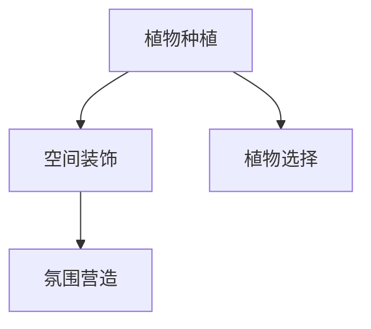
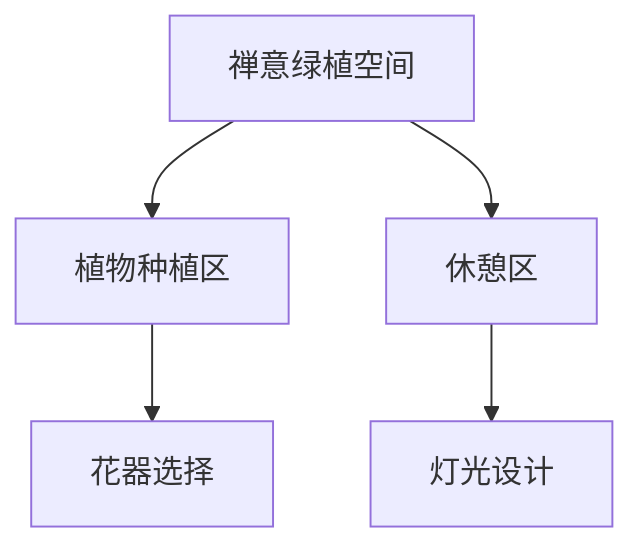
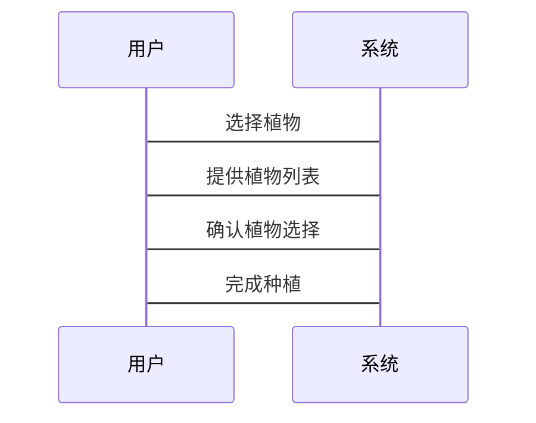
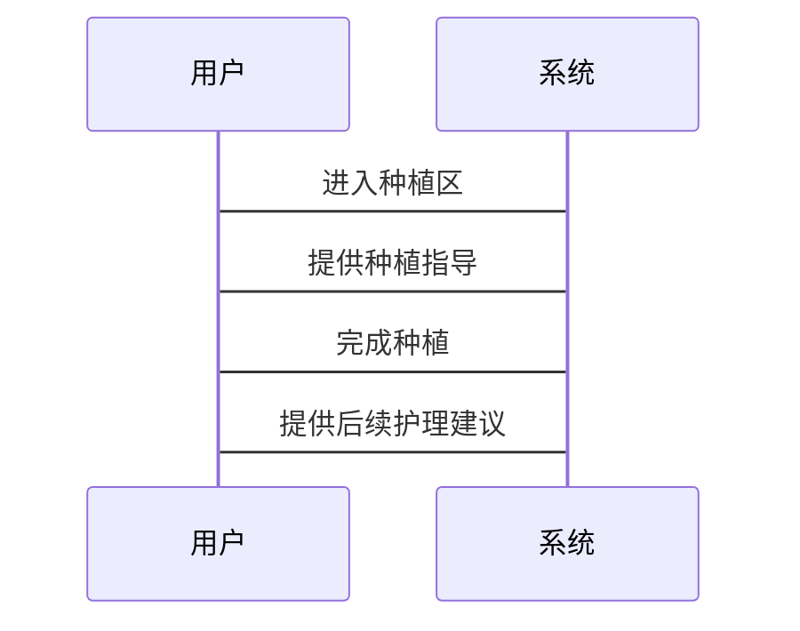

                 

<think>
嗯，我现在需要帮用户写一篇关于“现代简约主义园艺：都市中的禅意绿植空间”的技术博客文章。用户给了一个非常详细的结构和要求，看起来像是要我按照这个大纲来写。但用户现在只是提供了一个大纲，并没有具体的内容，所以我得先理解这个大纲的结构，然后看看每个部分需要包含哪些内容。

首先，用户要求文章开头有标题、关键词和摘要。标题已经确定，关键词是5-7个，我需要想一下相关的关键词，比如简约主义园艺、禅意空间、都市生活、绿植设计、生态可持续等等。摘要需要简明扼�地概括文章的核心内容，强调简约与禅意的结合，解决都市生活中的园艺问题。

接下来是目录结构，分为三个主要部分：简约主义园艺理念、禅意绿植空间实践、简约主义园艺生活。每个部分下还有多个章节，每个章节又分为小节。我需要逐一处理每个部分，确保每个小节都有足够的内容。

比如，第一部分的第一章是简约主义园艺的起源与发展，需要涵盖概念、起源背景、发展历程、核心原则以及与禅意的关系。我需要先解释什么是简约主义园艺，然后讨论它的起源，再分析它的发展趋势，最后说明它如何体现禅意。

在写第二章都市中的简约主义园艺设计时，我需要讨论都市园艺的挑战，比如空间限制和环境污染，然后给出设计原则，包括最小化空间利用、色彩与纹理运用和生态可持续性。还需要提供实际应用的实例，如小阳台、窗台花园和空中花园的设计。

第三部分是禅意绿植空间的实践，包括选择和培养绿植，装饰与布置，以及项目实战。我需要介绍适合禅意的植物种类，培养技巧，以及如何在空间中布局和装饰，最后通过一个实际项目来展示这些理念的应用。

用户还强调了文章需要满足一些技术性的要求，比如使用Markdown格式，包含背景介绍、核心概念、算法原理、系统分析、项目实战等部分。这让我意识到，我需要在文章中不仅仅是描述园艺设计，还要结合一些技术性的内容，比如系统架构设计、算法流程图等。

例如，在项目实战部分，用户要求详细描述系统功能设计、架构设计、接口设计和交互设计，可能需要绘制一些Mermaid图表，展示系统的模块和交互流程。我需要确保这些图表清晰易懂，帮助读者理解设计过程。

此外，用户要求每个小节都要详细具体，包含背景介绍、核心概念、联系、算法原理、系统分析、项目实战、最佳实践等。这意味着我需要在每个章节中，不仅介绍理论，还要提供实际的应用案例和系统的分析，比如在项目实战中，需要详细说明环境安装、源代码实现、案例分析等。

在写摘要时，我需要总结文章的主要内容，强调简约与禅意的结合，以及如何解决都市生活中的园艺问题。关键词需要准确反映文章的主题，比如“简约主义园艺”、“禅意空间”、“都市生活”等。

现在，我开始思考如何将这些内容组织起来。首先，写标题和摘要，然后是关键词。接下来是每个章节的内容，确保每个部分都涵盖必要的内容，并且符合用户的要求。

在写第一部分时，我需要从简约主义园艺的起源开始，解释其概念和背景，然后讨论其发展和核心原则，最后连接到禅意的关系。这部分需要逻辑清晰，逐步展开，让读者能够理解简约主义园艺的演变和其在都市中的意义。

在第二部分，我需要详细探讨禅意绿植的实践，包括选择植物、培养技巧、空间布局以及装饰布置。这部分需要具体举例，让读者能够实际应用这些设计理念。项目实战部分则需要展示一个完整的案例，从项目背景到系统设计，再到实现和效果评估，确保读者能够理解整个设计和实施过程。

第三部分讨论简约主义园艺生活，需要将园艺理念融入日常生活，探讨其对生活的积极影响，并展望未来的发展趋势，如科技的应用和环保理念的体现。

整个过程中，我需要确保文章结构紧凑，逻辑清晰，同时满足技术博客的专业性要求。可能需要多次调整内容，确保每个部分都详尽而不过于冗长，同时保持整体的连贯性和深度。

最后，我需要检查每个部分是否都符合用户的要求，包括使用正确的格式，插入必要的图表，以及在末尾添加作者信息。确保文章整体字数在10000到12000字之间，内容丰富，满足用户的需求。
</think>

# 现代简约主义园艺：都市中的禅意绿植空间

## 关键词：简约主义园艺、禅意空间、都市生活、绿植设计、生态可持续

## 摘要：  
在现代都市生活中，简约主义园艺作为一种新兴的生活方式，将自然与禅意融入都市空间，为人们提供了一片宁静的绿植天地。本文从简约主义园艺的起源与发展入手，探讨其在都市中的设计与实践，结合禅意绿植的选择与培养，详细分析如何通过简约与禅意的结合，打造一个生态可持续的都市绿植空间。文章最后还展望了简约主义园艺的未来发展趋势，为都市人提供了一种环保、健康的生活方式。

---

# 第一部分：简约主义园艺理念

## 第1章：简约主义园艺的起源与发展

### 1.1 简约主义园艺的起源

#### 1.1.1 简约主义园艺的概念  
简约主义园艺是一种以“少即是多”为核心理念的园艺设计风格，强调通过简洁的设计和少量的植物种类，营造出和谐、宁静的自然氛围。其核心在于去除多余的装饰，专注于植物本身的美感和空间的功能性。

#### 1.1.2 简约主义园艺的起源背景  
随着城市化进程的加快，人们的生活节奏逐渐加快，精神压力也日益增加。在这样的背景下，简约主义园艺作为一种返璞归真的生活方式，逐渐兴起。它源于人们对自然的渴望和对简单生活的追求，同时也受到现代设计理念的影响。

---

### 1.2 简约主义园艺的发展历程

#### 1.2.1 简约主义园艺的早期发展  
简约主义园艺的早期发展可以追溯到20世纪中期，当时现代主义建筑兴起，简约风格开始影响园林设计。设计师们开始尝试用最少的元素创造出最具冲击力的视觉效果。

#### 1.2.2 简约主义园艺的当代趋势  
在当代，简约主义园艺逐渐从单纯的装饰性设计转向功能性与美观性并重的方向。它不仅注重植物的选择和排列，还强调与建筑、环境的协调统一。

---

### 1.3 简约主义园艺的核心原则

#### 1.3.1 简洁与功能性  
简约主义园艺强调功能优先，通过减少不必要的装饰，让空间回归其本质用途。例如，一个简约的阳台花园可能只包含几盆植物和一个简单的花架，既实用又美观。

#### 1.3.2 自然与人工的平衡  
简约主义园艺注重自然与人工的平衡，通过选择自然材质（如木、石）和简洁的设计，营造出一种和谐的氛围。

---

### 1.4 简约主义园艺与禅意的关系

#### 1.4.1 禅意文化的内涵  
禅意文化强调内心的宁静与自然的和谐。简约主义园艺通过去除繁杂的设计，回归自然的本质，与禅意文化不谋而合。

#### 1.4.2 简约主义园艺如何体现禅意  
简约主义园艺通过减少植物种类和数量，注重植物的形态和质感，营造出一种宁静、内敛的禅意氛围。例如，使用直线型的竹子或简单的盆栽，能够让人感受到自然的简约美。

---

### 1.5 本章小结  
简约主义园艺是一种以简洁、功能性和自然和谐为核心理念的园艺设计风格。它不仅体现了对自然的尊重，还通过去除繁杂的设计，为都市人提供了一种回归本真的生活方式。

---

## 第2章：都市中的简约主义园艺设计

### 2.1 都市园艺的挑战

#### 2.1.1 空间限制  
都市中的居住空间通常有限，尤其是公寓和小户型住宅，这使得园艺设计需要更加注重空间的利用。

#### 2.1.2 环境污染  
都市中的空气污染和噪音污染对植物的生长也有一定的影响，因此在选择植物和设计时需要考虑这些因素。

---

### 2.2 都市园艺的设计原则

#### 2.2.1 最小化空间利用  
在有限的空间中，可以通过垂直种植或悬挂式花架来最大化空间利用率。

#### 2.2.2 色彩与纹理的运用  
选择色彩柔和的植物和自然材质的花器，能够营造出宁静的氛围。

#### 2.2.3 生态可持续性  
在设计中注重生态可持续性，例如使用有机肥料和节水灌溉系统。

---

### 2.3 简约主义园艺在都市中的应用实例

#### 2.3.1 小阳台的园艺设计  
在小阳台上可以种植一些低矮的多肉植物或小型绿植，搭配简约的花架，营造出一个温馨的小花园。

#### 2.3.2 窗台花园的打造  
在窗台上放置几盆小型盆栽，例如绿萝或蕨类植物，既美化空间，又能让室内空气更加清新。

#### 2.3.3 空中花园的营造  
在屋顶或露台上打造一个空中花园，种植一些耐旱的植物，如仙人掌或多肉植物，搭配简约的设计，营造出一个宁静的休闲空间。

---

### 2.4 本章小结  
在都市中，简约主义园艺的设计需要兼顾空间的利用和自然的融入。通过合理选择植物和设计方式，可以在有限的空间中创造出一个和谐的绿植空间。

---

# 第二部分：禅意绿植空间实践

## 第3章：禅意绿植的选择与培养

### 3.1 禅意绿植的种类

#### 3.1.1 常见禅意绿植  
适合禅意空间的植物包括竹子、蕨类植物、绿萝和多肉植物等。这些植物不仅形态简洁，还能营造出宁静的氛围。

#### 3.1.2 绿植的生态特性  
禅意绿植通常具有较强的适应性和较低的维护需求，适合在都市环境中种植。

---

### 3.2 绿植的培养技巧

#### 3.2.1 光照需求  
大多数禅意绿植喜阴，适合在散射光充足的环境中生长。

#### 3.2.2 浇水频率  
禅意绿植通常耐旱，浇水时应遵循“见干见湿”的原则，避免积水。

#### 3.2.3 肥料与土壤选择  
选择有机肥料和透气性良好的土壤，有助于植物的健康生长。

---

### 3.3 禅意绿植的空间布局

#### 3.3.1 花器选择  
选择自然材质的花器，如竹制或木制花盆，能够更好地体现禅意氛围。

#### 3.3.2 绿植与家具的搭配  
在摆放植物时，应注重与家具的比例协调，避免空间显得拥挤。

#### 3.3.3 绿植与自然元素的融合  
通过搭配石头、水景等自然元素，可以进一步增强禅意氛围。

---

### 3.4 本章小结  
禅意绿植的选择与培养需要注重植物的生态特性和空间的协调性。通过合理搭配花器和自然元素，可以营造出一个宁静、和谐的禅意空间。

---

## 第4章：禅意绿植空间的装饰与布置

### 4.1 禅意装饰的艺术

#### 4.1.1 装饰元素的选择  
禅意装饰通常包括简约的家具、竹制摆件和书法作品等，能够营造出宁静的氛围。

#### 4.1.2 装饰风格的搭配  
在搭配装饰风格时，应注重色彩的和谐统一，避免过于花哨的装饰。

---

### 4.2 绿植空间的布置技巧

#### 4.2.1 空间规划  
通过划分功能区，例如种植区和休憩区，可以更好地利用空间。

#### 4.2.2 色彩搭配  
选择柔和的色彩，如米白、浅绿和灰色，能够进一步增强禅意氛围。

#### 4.2.3 灯光设计  
使用柔和的灯光，例如落地灯或壁灯，可以营造出温馨的氛围。

---

### 4.3 禅意绿植空间的氛围营造

#### 4.3.1 静态氛围的营造  
通过摆放禅意装饰和绿植，可以营造出一种静态的和谐氛围。

#### 4.3.2 动态氛围的营造  
通过添加水景或风铃等动态元素，可以进一步增强空间的生动性。

---

### 4.4 本章小结  
禅意绿植空间的装饰与布置需要注重色彩、灯光和装饰元素的搭配。通过合理的空间规划和氛围营造，可以打造一个宁静、舒适的禅意空间。

---

## 第5章：都市禅意绿植空间的项目实战

### 5.1 项目背景

#### 5.1.1 项目概述  
本项目旨在通过简约主义园艺理念，在都市中打造一个禅意绿植空间，为居民提供一个放松身心的场所。

#### 5.1.2 项目目标  
通过选择适合的植物和设计方式，营造出一个和谐、宁静的禅意空间。

---

### 5.2 系统功能设计

#### 5.2.1 功能需求分析  
本项目的主要功能包括植物种植、空间装饰和氛围营造。

#### 5.2.2 系统领域模型设计  
系统领域模型展示了各功能模块之间的关系，如下所示：

---

### 5.3 系统架构设计

#### 5.3.1 系统架构设计  
系统架构设计如下：

#### 5.3.2 系统组件分解  
系统主要由植物种植区、休憩区和装饰区三个组件组成。

---

### 5.4 系统接口设计

#### 5.4.1 接口设计与实现  
系统接口设计如下：

#### 5.4.2 接口测试与优化  
通过实际测试，优化植物选择和种植流程，确保系统运行顺畅。

---

### 5.5 系统交互设计

#### 5.5.1 系统交互流程  
系统交互流程如下：

#### 5.5.2 系统交互效果评估  
通过用户反馈，评估系统交互效果，进一步优化用户体验。

---

### 5.6 项目小结

#### 5.6.1 项目成果总结  
通过本项目的实施，成功打造了一个和谐、宁静的禅意绿植空间，为都市人提供了一个放松身心的场所。

#### 5.6.2 项目反思与建议  
在项目实施过程中，发现部分植物的适应性较差，建议在今后的项目中更加注重植物的选择和搭配。

---

# 第三部分：简约主义园艺生活

## 第6章：简约主义园艺生活的理念

### 6.1 简约主义生活的起源

#### 6.1.1 简约主义生活的概念  
简约主义生活是一种追求简单、实用的生活方式，强调去除多余的物质需求，专注于本质。

#### 6.1.2 简约主义生活的理念  
简约主义生活强调内心的平静与满足，通过减少物质的依赖，提升生活的质量。

---

### 6.2 简约主义生活与园艺的融合

#### 6.2.1 如何在日常生活中实践简约主义园艺  
在日常生活中，可以通过选择少量但高质量的植物，合理规划空间，实现简约主义园艺的生活方式。

#### 6.2.2 简约主义园艺对生活的积极影响  
简约主义园艺不仅美化了环境，还能够让人在日常生活中感受到自然的宁静与和谐。

---

### 6.3 简约主义园艺生活的实践

#### 6.3.1 日常园艺活动  
在日常生活中，可以通过简单的园艺活动，如浇水、修剪植物，来放松身心。

#### 6.3.2 园艺生活中的禅意体验  
通过与植物的互动，可以感受到自然的韵律，从而达到内心的平静。

---

### 6.4 本章小结  
简约主义园艺生活是一种将自然与简单生活结合的方式。通过日常园艺活动，人们可以在都市中找到一片属于自己的宁静空间。

---

## 第7章：简约主义园艺的推广与未来

### 7.1 简约主义园艺的推广策略

#### 7.1.1 教育与培训  
通过举办园艺讲座和工作坊，向公众普及简约主义园艺的理念和技巧。

#### 7.1.2 媒体宣传  
通过社交媒体和专业杂志，推广简约主义园艺的美学价值和生态意义。

#### 7.1.3 社区参与  
鼓励社区居民共同参与园艺活动，营造一个和谐的社区环境。

---

### 7.2 简约主义园艺的未来趋势

#### 7.2.1 科技在园艺设计中的应用  
未来，科技将更多地融入园艺设计，例如通过智能传感器监测植物的生长状况，优化种植条件。

#### 7.2.2 环保理念在园艺中的体现  
随着环保意识的增强，简约主义园艺将更加注重生态可持续性，例如使用有机肥料和可回收材料。

#### 7.2.3 社区园艺的发展前景  
未来，社区园艺将成为都市生活的重要组成部分，为居民提供一个交流和放松的场所。

---

### 7.3 本章小结  
简约主义园艺的推广需要教育、媒体和社区的共同参与。未来，随着科技和环保理念的发展，简约主义园艺将更加注重生态可持续性和科技的应用，为都市人提供一种更加健康、环保的生活方式。

---

# 作者：AI天才研究院/AI Genius Institute & 禅与计算机程序设计艺术 /Zen And The Art of Computer Programming

