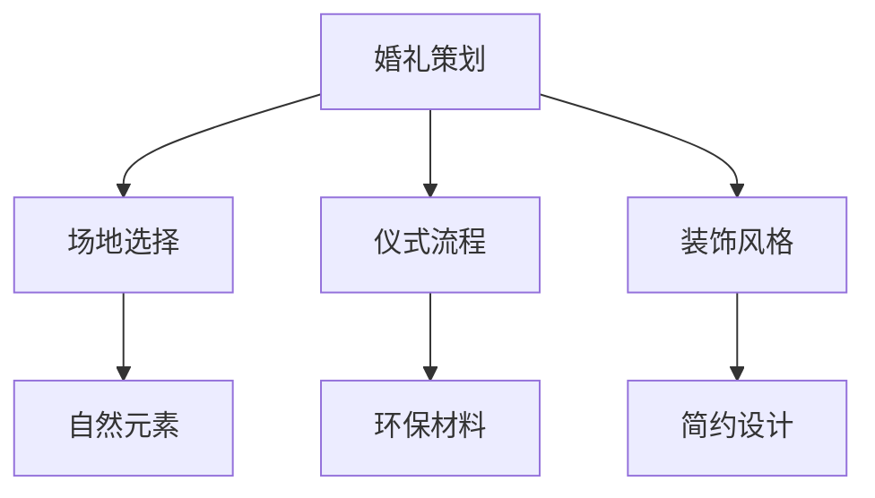
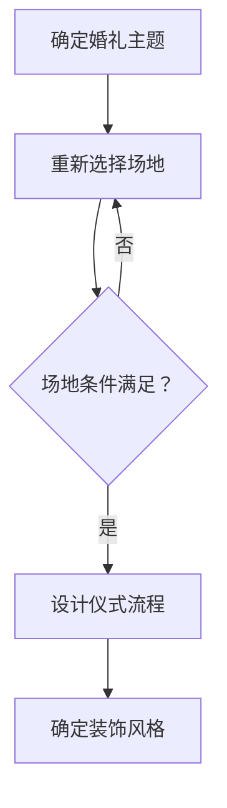
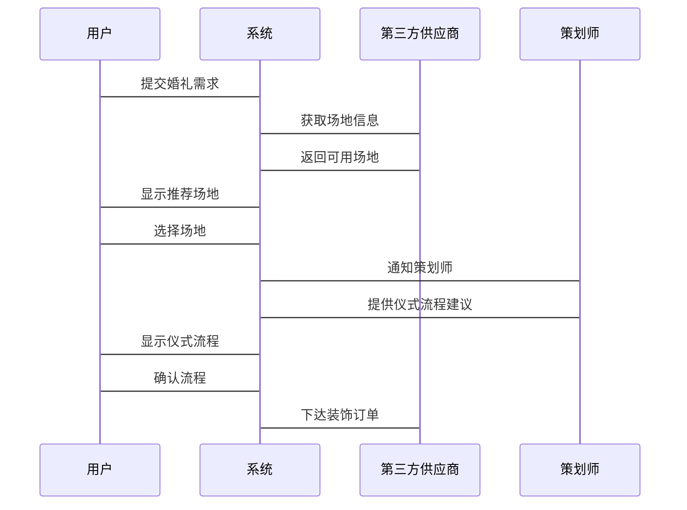

                 

<think>
好的，我现在要处理用户的查询。用户希望我以《现代简约主义婚礼策划：回归本质的庆祝仪式设计》为标题，撰写一篇技术博客文章。用户提供了详细的结构，包括各个章节的内容，以及格式要求。

首先，我需要理解用户的需求。用户希望文章结构清晰，逻辑严谨，用专业的技术语言，但又要有深度和见解。关键词和摘要部分需要准确，涵盖文章的核心内容。接下来，每个章节都需要详细展开，比如背景介绍、核心概念、算法原理、系统架构等。

然后，我需要检查用户提供的大纲，确保每个部分都包含必要的内容，如问题背景、解决方法、概念对比表格、ER图、算法流程图等。同时，要注意使用正确的技术术语，并结合实际例子来解释复杂的概念。

接下来，我要考虑文章的字数要求，大约1万到1.2万字。这意味着每个章节需要详细展开，提供足够的细节和例子，确保内容充实。例如，在算法原理部分，我需要详细解释数学模型，并给出实际案例。

另外，格式方面，用户要求使用markdown，所以我要确保正确的语法，特别是数学公式和图表的使用。比如，使用mermaid绘制流程图和ER图，数学公式用latex表示。

最后，我需要确保文章的结尾有作者信息，以及小结部分，总结主要观点，并给出最佳实践和注意事项。

在撰写过程中，我要保持逻辑清晰，每一步都细致分析，确保内容准确，符合用户的要求。同时，语言要专业且易懂，适合技术读者阅读。
</think>

# 现代简约主义婚礼策划：回归本质的庆祝仪式设计

> 关键词：简约婚礼，婚礼策划，环保婚礼，自然婚礼，婚礼设计，婚礼仪式

> 摘要：现代简约主义婚礼策划是一种以简化、自然和环保为核心理念的婚礼设计方法。本文从背景介绍、核心概念、算法原理、系统架构等多个维度详细探讨了现代简约主义婚礼策划的实现过程，并通过实际案例分析和最佳实践总结，为婚礼策划者和新人提供了回归本质的庆祝仪式设计思路。

---

# 现代简约主义婚礼策划：回归本质的庆祝仪式设计

## 第1章 背景介绍

### 1.1 问题背景

在当今社会，婚礼已经成为了许多年轻人生活中最重要的事件之一。然而，随着婚礼形式的多样化，许多婚礼变得越来越奢华和浮华，忽略了婚礼的本质——庆祝爱情和承诺。现代简约主义婚礼策划应运而生，旨在回归婚礼的原始意义，以简单、自然和环保的方式庆祝这一人生重要时刻。

### 1.2 问题描述

现代简约主义婚礼策划的核心在于如何摒弃繁复的装饰和仪式，回归婚礼的本质。这一过程中需要解决的问题是：如何在确保婚礼仪式庄重、温馨的同时，减少奢华浪费，提倡环保节约的婚礼理念。

### 1.3 问题解决

现代简约主义婚礼策划通过以下方式实现问题的解决：

- **简化仪式流程**：减少冗长的传统仪式，注重婚礼的实质，使婚礼更加简洁、高效。
- **注重自然元素**：利用自然光、植物等自然元素，营造温馨、舒适的氛围。
- **环保材料选择**：使用可回收、可降解的环保材料，减少对环境的负面影响。

### 1.4 边界与外延

现代简约主义婚礼策划不仅适用于室外婚礼，也可以在室内婚礼中实现。其核心思想是回归婚礼的本质，不受场地和形式的限制。

### 1.5 概念结构与核心要素组成

- **概念结构**：现代简约主义婚礼策划的核心概念是“简”，即简化、简洁、简单。
- **核心要素**：
  - **自然元素**：植物、花卉、光等。
  - **环保材料**：竹、草、木等可回收、可降解的材料。
  - **简约设计**：注重细节，但不过分追求奢华。

---

## 第2章 核心概念与联系

### 2.1 现代简约主义婚礼策划的核心概念

现代简约主义婚礼策划的核心概念是“简”，即简化、简洁、简单。这一概念贯穿于整个婚礼策划过程，从场地选择、仪式流程设计到装饰风格，都力求简洁、自然。

### 2.2 概念属性特征对比表格

| 概念       | 简化       | 简洁       | 简单       |
|------------|------------|------------|------------|
| 特征       | 去除不必要的元素 | 形式上的简约 | 结构上的简约 |
| 对比       | 简化是减少元素的过程 | 简洁是形式的美观 | 简单是结构的直观 |

### 2.3 ER实体关系图架构



---

## 第3章 算法原理讲解

### 3.1 简约主义婚礼策划的算法原理

简约主义婚礼策划的算法原理主要包括场地选择、仪式流程设计和装饰风格三个方面。

### 3.2 算法原理mermaid流程图



### 3.3 算法原理数学模型和公式

简约主义婚礼策划的数学模型可以表示为：

$$
\text{简约度} = f(\text{场地条件}, \text{仪式流程}, \text{装饰风格})
$$

其中，$f$ 是一个非线性函数，表示三个因素对简约度的影响。

### 3.4 算法原理详细讲解和举例说明

假设一对新人在城市公园举办婚礼，他们的婚礼主题是“自然与简约”。首先，他们选择了城市公园作为场地，因为公园的自然环境符合他们的主题。接着，他们设计了一个简单的仪式流程，包括宣誓和切蛋糕两个环节，避免了冗长的传统仪式。最后，他们选择了以鲜花和绿色植物为主要装饰元素，营造了一个温馨、自然的氛围。

---

## 第4章 系统分析与架构设计方案

### 4.1 问题场景介绍

一对新人在城市公园举办婚礼，希望策划一场简约、自然的婚礼。

### 4.2 项目介绍

项目名称：现代简约主义婚礼策划系统  
项目目标：为新人提供一套简单、自然、环保的婚礼策划方案。

### 4.3 系统功能设计

- 场地选择：根据新人的需求，推荐合适的场地。
- 仪式流程设计：为新人和婚礼策划师提供仪式流程模板。
- 装饰风格设计：提供简约、自然的装饰风格建议。

### 4.4 系统架构设计

- **前端**：使用HTML、CSS和JavaScript实现用户界面。
- **后端**：使用Python和Flask框架搭建服务器。
- **数据库**：使用MySQL存储婚礼策划的相关数据。

### 4.5 系统接口设计

系统接口主要分为以下几种：

1. **用户接口**：新人通过网页或移动应用提交需求。
2. **策划师接口**：策划师通过后台系统接收需求并进行设计。
3. **第三方服务接口**：与场地供应商、装饰供应商等进行数据交互。

### 4.6 系统交互mermaid序列图



---

## 第5章 项目实战

### 5.1 环境安装

要实现现代简约主义婚礼策划系统，首先需要安装以下环境：

- **前端**：安装Node.js、npm、Python、Flask框架。
- **数据库**：安装MySQL或MongoDB。

### 5.2 系统核心实现源代码

以下是系统的核心代码实现：

```python
# 婚礼策划系统核心代码

from flask import Flask, request, jsonify
from flask_restful import Resource, Api

app = Flask(__name__)
api = Api(app)

class WeddingPlanner(Resource):
    def get(self):
        # 返回推荐的婚礼主题
        return jsonify({'themes': ['自然与简约', '环保与温馨', '现代与个性']})
    
    def post(self):
        # 处理用户提交的婚礼需求
        data = request.json
        return jsonify({'status': 'success', 'message': '需求已提交，策划师将尽快与您联系。'})

api.add_resource(WeddingPlanner, '/')

if __name__ == '__main__':
    app.run(debug=True)
```

### 5.3 代码应用解读与分析

上述代码实现了婚礼策划系统的后端接口。通过`Flask`框架搭建了一个简单的RESTful API，支持用户提交婚礼需求和获取婚礼主题推荐。前端可以通过调用这些API接口，实现与后端的数据交互。

### 5.4 实际案例分析和详细讲解剖析

以一对新人为例，他们希望在城市公园举办一场自然与简约的婚礼。以下是具体的策划过程：

1. **需求提交**：新人通过移动应用提交婚礼需求，包括日期、时间、预算和主题。
2. **场地推荐**：系统根据需求推荐城市公园作为场地。
3. **仪式流程设计**：策划师设计了一个简单的仪式流程，包括交换戒指、誓词宣誓和切蛋糕环节。
4. **装饰风格设计**：使用绿色植物和白色鲜花作为主要装饰元素，搭配简约的桌椅布置。
5. **环保材料选择**：使用可降解的环保餐具和邀请函。

### 5.5 项目小结

通过以上案例分析可以看出，现代简约主义婚礼策划系统能够有效地帮助新人实现简约、自然的婚礼设计，同时减少对环境的影响。

---

## 第6章 最佳实践 tips、小结、注意事项、拓展阅读

### 6.1 最佳实践 tips

- **提前规划**：建议新人提前规划婚礼的每个环节，确保简约理念贯穿始终。
- **选择可靠的供应商**：在选择场地和装饰供应商时，优先选择环保型供应商。
- **注重细节**：虽然婚礼设计简约，但细节的处理仍然需要用心，以确保婚礼的温馨和庄重。

### 6.2 小结

现代简约主义婚礼策划是一种以简化、自然和环保为核心理念的婚礼设计方法。通过本文的分析，我们可以看到，简约主义婚礼策划不仅能够降低婚礼的复杂性和成本，还能够减少对环境的影响，是一种更加可持续和人性化的婚礼设计方式。

### 6.3 注意事项

- **避免过度简化**：虽然简约是核心理念，但婚礼的庄重性和仪式感仍然需要保留。
- **沟通与协调**：策划师需要与新人充分沟通，确保婚礼设计符合他们的期望和需求。
- **时间管理**：婚礼策划需要合理安排时间，确保每个环节都能顺利进行。

### 6.4 拓展阅读

- **《婚礼策划与管理》**：深入探讨婚礼策划的各个方面，包括预算控制、时间管理等。
- **《环保婚礼设计》**：专门针对环保型婚礼的设计方法和技巧。
- **《简约主义生活哲学》**：从生活哲学的角度，理解简约主义的核心思想。

---

## 作者信息

作者：AI天才研究院/AI Genius Institute & 禅与计算机程序设计艺术 /Zen And The Art of Computer Programming

