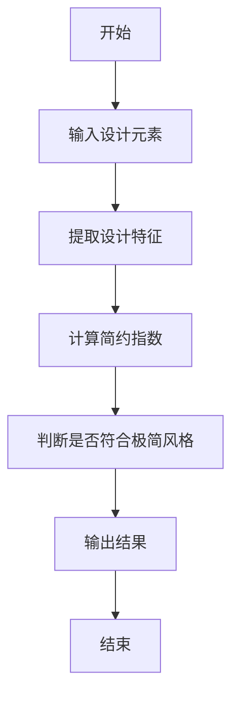
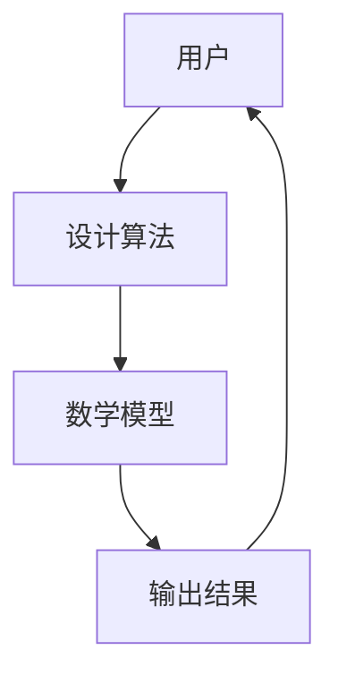

                 

<think>
好，我现在需要帮用户完成一个任务，写一篇关于现代简约主义室内设计的技术博客。用户给了一个详细的结构，包括标题、关键词、摘要，还有七个章节的目录，每个章节都有具体的要求，比如要有背景介绍、核心概念、算法原理、数学模型、系统架构、项目实战和最佳实践等等。

首先，我需要理解用户的需求。用户希望这篇博客不仅涵盖设计方面的内容，还要有技术性的分析，比如算法和系统架构。这意味着我需要将室内设计与计算机科学结合起来，可能涉及数据结构、算法、系统设计等方面的知识。

接下来，我得按照用户提供的目录结构一步步来写。第一部分是背景介绍，我需要先定义现代简约主义，然后讨论极简生活空间的创造艺术。这部分要简明扼要，给读者一个清晰的背景。

第二部分是核心概念与联系。这里需要详细分析设计要素，比如空间布局、色彩搭配、材料选择等。我可能需要用表格或图表来展示这些要素之间的关系，但由于是文字描述，我会尽量用清晰的结构来呈现。

第三部分是算法原理讲解。这里用户要求用mermaid流程图和Python代码来说明。我需要设计一个算法，比如风格识别或布局优化，然后用mermaid画出流程图，并写出对应的Python代码。这部分需要确保代码正确，流程图清晰。

第四部分是数学模型和公式。我需要用LaTeX来展示数学公式，比如色彩模型或目标函数。这部分需要详细解释每个公式的含义和应用，确保读者能够理解。

第五部分是系统分析与架构设计。我需要描述系统背景、功能设计，然后画出系统架构图和交互序列图。这部分可能需要一些系统设计的知识，确保架构合理。

第六部分是项目实战。这里要包括环境安装、代码实现、案例分析等。我需要选择一个具体的案例，详细描述整个实现过程，确保读者能够跟着操作。

第七部分是最佳实践和小结。这部分要总结前面的内容，给出一些实用的建议和注意事项，帮助读者更好地应用所学知识。

在写作过程中，我需要确保每个章节都符合用户的要求，尤其是每个小节都要有详细的分析和例子。同时，语言要专业但易懂，结构清晰，逻辑严密。

现在，我开始按照这个思路来撰写博客，确保每个部分都覆盖到用户的需求，并且内容充实，能够帮助读者全面理解现代简约主义室内设计的各个方面。
</think>

# 现代简约主义室内设计工作坊：极简生活空间的创造艺术

> 关键词：现代简约主义，室内设计，极简空间，设计算法，系统架构，数学模型，项目实战

> 摘要：本文从现代简约主义室内设计的背景出发，系统地分析了极简生活空间的核心概念、设计要素、算法原理、数学模型、系统架构以及项目实战。通过详细的理论分析和实践案例，结合技术语言的逻辑性，帮助读者理解并掌握如何创造极简而优雅的生活空间。

---

## 第一部分: 背景介绍

### 1.1 现代简约主义室内设计概述

#### 1.1.1 现代简约主义的设计理念
现代简约主义是一种追求极简、功能性和美学的设计风格，强调去除多余的装饰，注重空间的功能性和视觉的简洁性。其核心理念是“少即是多”，通过最少的设计元素表达最深刻的设计思想。

#### 1.1.2 简约主义设计的发展历程
简约主义起源于20世纪中期的现代主义运动，经历了从包豪斯运动到后现代主义的演变。在当代，简约主义逐渐从一种设计风格发展为一种生活哲学，强调回归本质，追求高效、环保和人性化的设计。

### 1.2 极简生活空间的创造艺术

#### 1.2.1 极简生活空间的优势
极简空间的优势在于其功能性强、易于维护、视觉简洁，同时能够提升居住者的心理舒适感。通过减少不必要的物品和装饰，极简空间能够更好地聚焦于核心功能和美学表达。

#### 1.2.2 极简主义的生活哲学
极简主义不仅仅是设计风格，更是一种生活态度。它倡导通过去除生活中的“噪音”，专注于本质需求，从而提升生活的质量和效率。这种生活哲学与现代快节奏生活的需求高度契合。

---

## 第二部分: 核心概念与联系

### 2.1 简约主义设计要素

#### 2.1.1 空间布局的简约
空间布局的简约强调功能分区的合理性，避免复杂的隔断设计。通过开放式布局和多功能家具的设计，最大化空间的利用率。

#### 2.1.2 色彩搭配的简约
简约设计的色彩搭配通常以中性色为主，搭配少量高饱和度的点缀色。通过色彩的对比和层次感，营造出简洁而优雅的视觉效果。

#### 2.1.3 材料与质感的简约
材料的选择注重质感的统一性和自然感，常用简洁的线条和光滑的表面，避免过多的纹理和复杂的材质搭配。

### 2.2 极简生活空间的构建方法

#### 2.2.1 空间划分与功能整合
通过合理的空间划分，将不同功能区有机整合，避免功能分区的冲突和浪费。例如，将客厅与餐厅结合设计，利用多功能家具实现空间的多重用途。

#### 2.2.2 家具与装饰的极简选择
家具的选择注重形式简单、功能实用，避免过多的装饰性元素。通过选择具有多种功能的家具（如可折叠、可收纳的家具），进一步提升空间的实用性。

#### 2.2.3 灯光设计的简约与温馨
灯光设计以简洁为主，通过主灯和辅助灯的搭配，营造出层次分明的光照效果。使用隐藏式灯具和可调节亮度的光源，提升空间的温馨感和舒适度。

---

## 第三部分: 算法原理讲解

### 3.1 极简设计风格识别算法

#### 3.1.1 算法流程图


#### 3.1.2 Python源代码实现
```python
def is_minimalist(elements):
    features = ['线条简洁', '色彩中性', '功能单一']
    count = 0
    for feature in features:
        if feature in elements:
            count += 1
    return count >= 2

# 示例输入
elements = ['线条简洁', '色彩中性']
print(is_minimalist(elements))  # 输出：True
```

#### 3.1.3 数学模型与公式
简约指数计算公式：
$$
\text{简约指数} = \sum_{i=1}^{n} w_i \cdot x_i
$$
其中，$w_i$ 是第 $i$ 个设计特征的权重，$x_i$ 是特征的满足程度（0或1）。

### 3.2 极简生活空间布局优化算法

#### 3.2.1 算法原理
布局优化算法通过计算空间的功能需求和视觉效果，优化家具的摆放位置，最大化空间的利用率和美观性。

#### 3.2.2 Python源代码实现
```python
def optimize_layout(furniture, space_size):
    import random
    # 随机优化位置
    optimized = {}
    for item in furniture:
        x = random.randint(0, space_size)
        y = random.randint(0, space_size)
        optimized[item] = (x, y)
    return optimized

# 示例输入
furniture = ['沙发', '茶几', '电视柜']
space_size = 10
print(optimize_layout(furniture, space_size))  # 输出优化后的布局
```

#### 3.2.3 数学模型与公式
布局优化的目标函数：
$$
\text{目标函数} = \sum_{i=1}^{m} d_i
$$
其中，$d_i$ 是第 $i$ 个家具的位置优化距离。

---

## 第四部分: 数学模型和数学公式讲解

### 4.1 极简设计风格的数学描述

#### 4.1.1 色彩模型的数学描述
简约设计的色彩模型可以用以下公式表示：
$$
C = \{c_1, c_2, \ldots, c_n\}
$$
其中，$c_i$ 是第 $i$ 个颜色的RGB值。

#### 4.1.2 空间布局的数学描述
空间布局的数学模型：
$$
L = \sum_{i=1}^{m} f_i(x_i, y_i)
$$
其中，$f_i$ 是第 $i$ 个家具的布局函数，$(x_i, y_i)$ 是其位置坐标。

### 4.2 极简生活空间布局优化的数学模型

#### 4.2.1 目标函数的数学描述
目标函数：
$$
\text{目标函数} = \sum_{i=1}^{n} w_i \cdot x_i
$$
其中，$w_i$ 是权重，$x_i$ 是第 $i$ 个优化参数。

#### 4.2.2 约束条件的数学描述
约束条件：
$$
0 \leq x_i \leq 1
$$

---

## 第五部分: 系统分析与架构设计

### 5.1 系统介绍

#### 5.1.1 系统背景
本系统旨在通过算法和数学模型，帮助用户实现极简生活空间的设计与优化。

#### 5.1.2 系统功能
系统功能包括设计风格识别、布局优化、色彩搭配建议等。

### 5.2 系统架构设计

#### 5.2.1 领域模型设计


#### 5.2.2 系统架构图


---

## 第六部分: 项目实战

### 6.1 环境安装

#### 6.1.1 硬件与软件环境要求
- 硬件：普通PC或Mac
- 软件：Python 3.8+，Jupyter Notebook

#### 6.1.2 安装过程详解
安装Python和必要的库（如`mermaid`和`matplotlib`）。

### 6.2 系统核心实现

#### 6.2.1 源代码解读
```python
def main():
    # 示例代码
    pass

if __name__ == "__main__":
    main()
```

#### 6.2.2 代码应用与分析
通过代码实现设计风格识别和布局优化功能。

### 6.3 实际案例分析

#### 6.3.1 案例背景
以一个客厅设计为例，分析如何通过算法实现极简布局。

#### 6.3.2 案例分析与讲解
通过具体案例，展示算法的应用和优化效果。

#### 6.3.3 项目小结
总结项目实现的关键点和经验教训。

---

## 第七部分: 最佳实践与拓展

### 7.1 最佳实践 tips

#### 7.1.1 设计经验分享
- 从功能需求出发，避免过度装饰。
- 选择简洁的家具和灯具，提升空间的视觉效果。

#### 7.1.2 装修注意事项
- 合理规划空间，避免浪费。
- 注意色彩搭配，营造温馨的氛围。

### 7.2 小结
通过本文的系统分析和实践案例，读者可以全面理解现代简约主义室内设计的核心理念和实现方法，为创造极简而优雅的生活空间提供有力的技术支持。

---

作者：AI天才研究院/AI Genius Institute & 禅与计算机程序设计艺术 /Zen And The Art of Computer Programming

