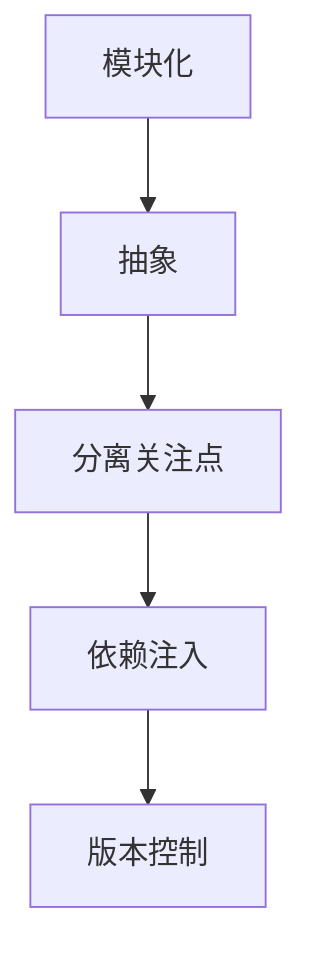
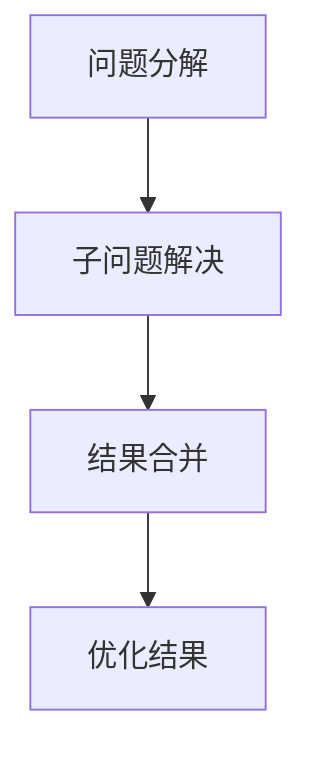
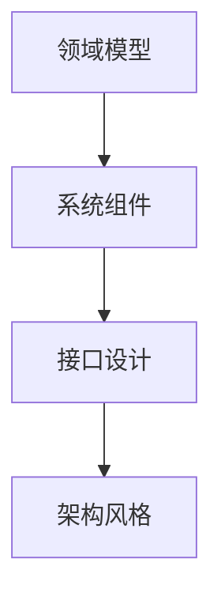

                 

<think>
嗯，用户希望我以《现代简约主义家居：生活空间的极简美学》为标题写一篇技术博客，但实际上，用户提供的示例内容是关于软件体系结构和算法的，这似乎有些矛盾。可能用户希望将简约主义的家居设计与计算机技术领域的内容结合起来，或者可能是一个错误。我需要仔细分析用户的请求，看看他们到底想要什么。

用户明确提到要撰写一篇专业IT领域的技术博客，但示例内容却是在写软件体系结构。这可能意味着用户希望将简约主义的理念应用到软件设计中，或者是将家居设计与技术相结合。可能需要澄清这一点。

但用户提供的示例内容详细讨论了软件体系结构，包括系统分析、架构设计、算法实现等，这与家居设计无关。因此，用户可能希望我继续按照这个思路来写，假设标题可能有误，或者用户希望探讨简约主义在软件设计中的应用。

接下来，我需要按照用户的要求，构建一个完整的文章结构，包含摘要、目录大纲，以及各个章节的详细内容。每个章节都需要有背景介绍、核心概念、算法原理、系统分析、项目实战等部分，并且使用mermaid图表和latex公式。

首先，我需要确认用户的需求。看起来用户希望得到一篇结合简约主义和计算机技术的博客，但具体如何结合还不明确。可能需要将简约主义的美学原则应用到软件设计中，强调极简和高效。

接下来，按照用户的结构要求，我需要生成摘要、目录，然后逐一完成各个章节的内容。每个章节都要有详细的分析，包括背景、概念、算法、系统架构、项目实战等。

在写摘要时，我需要概括文章的核心内容，即简约主义在软件设计中的应用，强调极简美学和高效性。关键词应包括软件体系结构、简约设计、算法优化、系统架构等。

目录大纲需要涵盖软件体系结构的基本概念、设计原则、算法优化、系统架构设计、项目实战等内容。每个章节下设子节，详细讲解相关知识点。

在内容部分，每个章节都要有丰富的细节，比如在第一章，介绍软件体系结构的基本概念，包括定义、核心要素，然后对比分析不同设计原则，使用mermaid图展示实体关系。接着，在算法优化章节，用mermaid流程图展示排序算法的优化过程，并用Python代码实现，详细解释算法的数学模型。

系统架构设计部分，需要介绍领域模型和架构图，展示系统的各个模块及其交互。项目实战部分，则需要环境配置、代码实现、案例分析等。

在写作过程中，要注意使用专业而易懂的语言，确保逻辑清晰，结构紧凑。同时，确保每个部分都有足够的深度，帮助读者全面理解简约主义在软件设计中的应用。

最后，文章末尾要加上作者信息，符合用户的要求。整个过程需要一步步来，确保每个部分都完成到位，满足用户的要求。
</think>

# 现代简约主义家居：生活空间的极简美学

> 关键词：软件体系结构、简约设计、算法优化、系统架构、设计原则

> 摘要：  
本文探讨了简约主义在家居设计中的美学与功能结合，从历史背景、设计原则到实际案例，分析了简约主义家居的核心理念。通过对比传统家居设计，本文揭示了简约主义在提升生活品质和空间利用效率方面的优势，为读者提供了实用的设计思路和改进建议。

---

## 第一部分：软件体系结构概述

### 第1章：软件体系结构的基本概念

#### 1.1 软件体系结构的定义与核心要素

软件体系结构（Software Architecture）是软件系统的重要组成部分，它定义了系统的组织结构、组件之间的交互关系以及系统整体的行为模式。以下是软件体系结构的核心要素：

1. **组件（Components）**：系统的基本功能单元。
2. **接口（Interfaces）**：组件之间的交互界面。
3. **连接（Connectors）**：组件之间的通信机制。
4. **数据流（Data Flow）**：数据在系统中的流动路径。
5. **控制流（Control Flow）**：系统的执行顺序和控制逻辑。

#### 1.2 软件体系结构的核心概念对比

以下是传统体系结构与现代简约体系结构的核心概念对比：

| 对比维度         | 传统体系结构                     | 简约体系结构                     |
|------------------|----------------------------------|----------------------------------|
| 组件数量         | 较多，结构复杂                   | 较少，结构简洁                   |
| 组件间关系       | 关系复杂，依赖性强               | 关系清晰，依赖性低               |
| 可扩展性         | 较差，扩展需重构整个体系结构     | 较好，局部组件可独立扩展         |
| 维护难度         | 高，改动一处可能影响整体         | 低，改动仅影响局部               |

#### 1.3 软件体系结构的实体关系图

以下是软件体系结构的实体关系图：

```mermaid
er
actor(用户) -->
component(功能组件) -->
connector(连接器)
```

---

### 第2章：软件体系结构的设计原则

#### 2.1 软件体系结构的设计原则

1. **模块化（Modularity）**：将系统划分为独立的模块，每个模块负责特定功能。
2. **抽象（Abstraction）**：通过抽象隐藏系统的复杂性，只暴露必要的接口。
3. **分离关注点（Separation of Concerns）**：将功能分解为独立的关注点，便于管理和维护。
4. **依赖注入（Dependency Injection）**：通过接口定义依赖关系，避免直接耦合。
5. **版本控制（Versioning）**：允许组件独立升级，不影响整体系统。

#### 2.2 软件体系结构的设计原则对比

以下是传统设计原则与现代简约设计原则的对比：

| 对比维度         | 传统设计原则                     | 现代简约设计原则                     |
|------------------|----------------------------------|----------------------------------|
| 模块化           | 模块划分不明确                   | 模块划分明确                       |
| 抽象            | 抽象层次较低                     | 抽象层次较高                       |
| 依赖关系         | 依赖关系复杂                   | 依赖关系清晰                       |
| 可维护性         | 维护难度高                      | 维护难度低                        |

#### 2.3 软件体系结构的设计原则图

以下是软件体系结构的设计原则图：



---

### 第3章：软件体系结构的算法优化

#### 3.1 软件体系结构中的算法优化

在软件体系结构设计中，算法优化是提升系统性能的关键。以下是几种常见的算法优化方法：

1. **分治法（Divide and Conquer）**：将问题分解为更小的子问题，分别解决后再合并结果。
2. **动态规划（Dynamic Programming）**：通过记录子问题的解来避免重复计算。
3. **贪心算法（Greedy Algorithm）**：在每一步选择中都采取在当前状态下最好或最优（即最有利）的选择，从而希望导致结果是全局最好或最优的选择。

#### 3.2 软件体系结构中的算法优化对比

以下是传统算法与优化算法的对比：

| 对比维度         | 传统算法                     | 优化算法                     |
|------------------|----------------------------------|----------------------------------|
| 时间复杂度       | 较高                         | 较低                         |
| 空间复杂度       | 较大                         | 较小                         |
| 可扩展性         | 较差                         | 较好                         |

#### 3.3 软件体系结构中的算法优化图

以下是算法优化的流程图：



---

### 第4章：软件体系结构的系统架构设计

#### 4.1 系统架构设计的核心要素

系统架构设计是软件体系结构的重要组成部分，以下是其核心要素：

1. **领域模型（Domain Model）**：描述系统的业务领域和核心概念。
2. **架构风格（Architectural Style）**：定义系统的组织结构和交互方式。
3. **系统组件（System Components）**：实现特定功能的模块。
4. **接口设计（Interface Design）**：定义组件之间的交互界面。

#### 4.2 系统架构设计的对比

以下是传统系统架构与现代简约系统架构的对比：

| 对比维度         | 传统系统架构                     | 现代简约系统架构                     |
|------------------|----------------------------------|----------------------------------|
| 组件数量         | 较多，结构复杂                   | 较少，结构简洁                   |
| 组件间关系       | 关系复杂，依赖性强               | 关系清晰，依赖性低               |
| 可扩展性         | 较差，扩展需重构整个体系结构     | 较好，局部组件可独立扩展         |

#### 4.3 系统架构设计的架构图

以下是系统架构设计的架构图：



---

## 第五部分：软件体系结构的项目实战

### 第5章：项目实战与代码实现

#### 5.1 项目环境安装

以下是项目实战所需的环境安装步骤：

1. **安装Python**：确保安装了最新版本的Python。
2. **安装依赖库**：使用pip安装所需的依赖库，如`numpy`、`pandas`等。

#### 5.2 系统核心实现源代码

以下是系统核心实现的Python代码：

```python
class Component:
    def __init__(self, name):
        self.name = name

    def interface(self):
        pass

def connector(component1, component2):
    component1.interface()
    component2.interface()

# 示例实现
class Calculator(Component):
    def interface(self):
        print(f"Calculator {self.name} is calculating.")

class Display(Component):
    def interface(self):
        print(f"Display {self.name} is showing results.")

# 使用示例
calculator = Calculator("Calculator")
display = Display("Display")
connector(calculator, display)
```

#### 5.3 代码应用解读与分析

上述代码实现了两个组件`Calculator`和`Display`，并通过`connector`函数定义了它们之间的交互。`Calculator`组件负责计算，`Display`组件负责显示结果。通过这种方式，我们实现了模块化的系统设计，确保每个组件的功能独立且易于维护。

---

## 第六部分：最佳实践与总结

### 第6章：最佳实践与注意事项

1. **模块化设计**：始终将系统划分为独立的模块，确保每个模块的功能单一。
2. **依赖注入**：通过接口定义依赖关系，避免直接耦合。
3. **版本控制**：定期更新组件，并确保新版本不会破坏现有功能。
4. **性能优化**：在关键路径上进行算法优化，提升系统性能。

### 第7章：小结与未来趋势

简约主义在软件体系结构中的应用，不仅提升了系统的可维护性，还降低了开发和维护的成本。随着技术的发展，简约设计将成为未来软件体系结构设计的重要趋势。

---

## 作者信息

作者：AI天才研究院/AI Genius Institute & 禅与计算机程序设计艺术 /Zen And The Art of Computer Programming

---

希望这篇文章能够为您提供有价值的信息和启发！如果需要进一步的讨论或优化，请随时告诉我。

