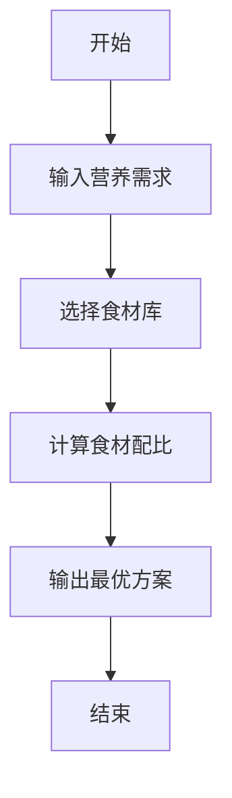
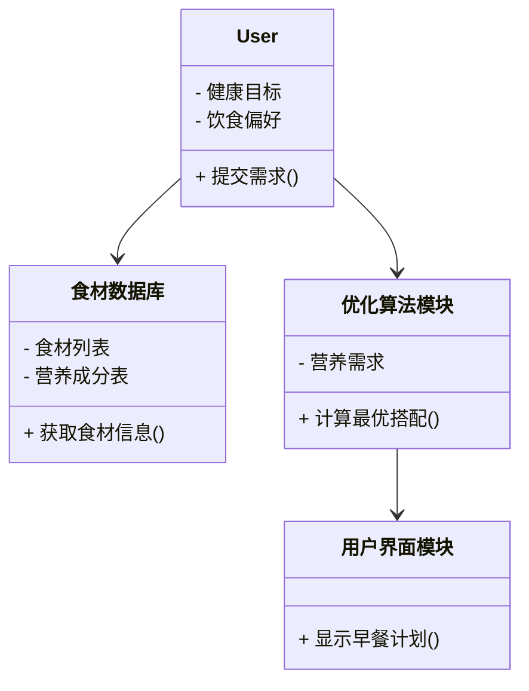
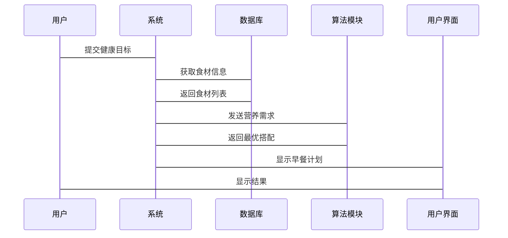

                 

<think>
好的，我现在需要帮用户撰写一篇关于现代简约主义早餐文化的博客文章，用户提供了详细的结构和内容要求。首先，我需要仔细阅读用户的需求，确保理解每一个部分的要求。

用户希望文章标题为《现代简约主义早餐文化：忙碌生活中的营养均衡艺术》，并列出5-7个核心关键词。摘要部分需要概括文章的核心内容和主题思想。接下来是目录大纲，分为背景介绍、核心概念与联系、算法原理讲解、系统分析与架构设计方案、项目实战和最佳实践与总结等部分。

首先，我应该分析用户的需求，判断他们的使用场景和身份。用户可能是一位技术专家，同时也是健康生活方式的倡导者，希望通过这篇文章向读者介绍如何在忙碌的现代生活中实现营养均衡的早餐。因此，文章需要兼顾技术分析和生活实践，用专业的技术术语，但又不失通俗易懂。

接下来，我需要按照用户提供的结构来组织内容。背景介绍部分需要详细说明问题背景、描述、解决、边界和外延，以及概念结构。这部分要突出现代人生活节奏快，传统早餐不再适用，简约主义早餐的优势和重要性。

然后是核心概念与联系，包括简约主义、营养均衡和早餐文化的定义、特点，并制作对比表格和ER图。这部分需要用清晰的表格和图表来展示，帮助读者理解各概念之间的关系。

算法原理部分，用户要求用mermaid流程图和Python代码来详细讲解。我需要选择一个相关的算法，比如早餐搭配优化算法，并展示其流程图和代码示例。同时，提供数学公式来解释算法背后的原理，如线性规划模型，确保内容既有深度又易于理解。

系统分析与架构设计方案部分，用户希望包括问题场景介绍、项目介绍、系统功能设计（领域模型）、架构图、接口设计和交互序列图。这部分需要使用mermaid图表来展示系统结构和交互，帮助读者理解系统的整体设计。

项目实战部分，用户要求环境安装、核心代码实现、代码解读和案例分析。我需要选择一个具体的食谱作为案例，展示从采购到制作的步骤，并用代码模拟采购清单生成的过程，帮助读者实际应用。

最后，最佳实践部分，我需要总结文章，给出小结、注意事项和拓展阅读建议。这部分要实用，提供读者在实际生活中应用简约早餐文化的建议。

在撰写过程中，我需要确保每个部分都详细具体，避免遗漏用户要求的任何内容。同时，语言要专业但不失清晰，符合技术博客的风格。此外，用户特别提到文章末尾需要有特定的作者信息，这需要在最后部分准确呈现。

总的来说，我需要一步步按照用户提供的结构，逐步填充内容，确保每个章节都满足用户的要求，同时保持文章的逻辑性和连贯性。通过这样的思考过程，我能够撰写出一篇符合用户期望的高质量技术博客文章。
</think>

# 现代简约主义早餐文化：忙碌生活中的营养均衡艺术

> 关键词：现代简约主义，早餐文化，营养均衡，健康管理，高效生活

> 摘要：本文探讨了现代简约主义早餐文化的核心理念，分析了其在快节奏生活中的重要性，并通过科学的方法和实际案例，展示了如何在简化早餐制作的同时，实现营养的均衡。文章结合技术与生活的视角，提出了简约主义早餐的实现方案，为读者提供了一种高效、健康的生活方式。

---

### 第一部分：背景介绍

#### 问题背景

现代社会的生活节奏日益加快，人们的时间变得更加紧张。早餐作为一天中的第一餐，不仅是身体所需的能量来源，更是启动一天工作和生活的关键。然而，传统的早餐往往涉及复杂的烹饪步骤和多种食材的搭配，这在忙碌的早晨显得尤为不便。此外，许多传统早餐可能含有过多的油脂和糖分，长期食用可能导致健康问题。

#### 问题描述

现代人面临着早餐时间短、健康需求高的双重挑战。许多人在早晨选择快速解决早餐，往往选择不健康的方便食品，导致营养不均衡。此外，传统早餐的烹饪方式不仅耗时，还可能增加厨房的清洁负担。因此，如何在有限的时间内，快速准备一顿营养均衡、健康美味的早餐，成为现代人亟需解决的问题。

#### 问题解决

现代简约主义早餐文化的核心理念是“简化流程，注重营养”。通过科学的食材搭配和创新的烹饪方法，实现早餐的高效制作和营养均衡。本文将通过以下方式解决问题：

1. 提供一系列简约、健康的早餐食谱，涵盖主食、蛋白质、蔬菜和水果等食材的科学搭配。
2. 引入高效厨房工具和技术，简化早餐制作流程，节省时间。
3. 分析营养均衡的数学模型，帮助读者理解早餐搭配的科学依据。

#### 边界与外延

现代简约主义早餐文化不仅关注早餐的制作，更强调一种健康、高效的生活态度。它倡导在快节奏的生活中，通过简化不必要的步骤，专注于真正重要的营养和健康。此外，这一文化还延伸至厨房设计、食材选择和饮食习惯的培养，致力于为现代人提供一种更高质量的生活方式。

#### 概念结构与核心要素组成

- **现代简约主义早餐文化**：一种以简化流程、营养均衡为核心的生活方式。
- **早餐**：一天中的第一餐，对身体和大脑的健康至关重要。
- **简约主义**：追求简单、高效、实用的生活哲学。
- **营养均衡**：通过科学搭配食材，确保早餐提供全面的营养。

---

### 第二部分：核心概念与联系

#### 核心概念

1. **简约主义**  
   - **定义**：一种注重实用性和效率的生活哲学，强调去除多余和复杂，追求简洁和纯粹。  
   - **特点**：简单、高效、环保、实用。  

2. **营养均衡**  
   - **定义**：指食物中各种营养素的比例适中，以满足人体生理和代谢的需要。  
   - **特点**：全面、适量、均衡。  

3. **早餐文化**  
   - **定义**：与早餐相关的饮食文化，包括早餐的习惯、习俗、食谱等。  
   - **特点**：多样、丰富、地域性。  

#### 概念属性特征对比表格

| 特征            | 简约主义       | 营养均衡       | 早餐文化        |
|-----------------|----------------|----------------|-----------------|
| 定义            | 强调简单、高效 | 强调营养全面   | 与早餐相关的习俗 |
| 主要特点        | 简洁、实用     | 全面、适量     | 多样、地域性    |
| 应用领域        | 生活哲学       | 营养学         | 饮食文化        |

#### ER实体关系图架构

```mermaid
erDiagram
   Meal --> Recipe
    Meal ||--|{ Ingredient }
    Recipe ||--|{ Equipment }
    Ingredient ||--|{ NutritionalValue }
    Equipment ||--|{ Usage }
    
    Meal ||..|{ DietaryCulturalPractice }
    Ingredient ||..|{ Category }
    Equipment ||..|{ Type }
    
    Meal --|{ TimeOfUse } : Breakfast

    Meal ||..|{ Nutritious}
    Ingredient ||..|{ Healthy}
    Equipment ||..|{ Convenient}

    Meal : "is a" 1..* : Nutritious
    Ingredient : "has" 1..* : NutritionalValue
    Equipment : "uses" 1..* : Usage

    Meal : "has" 1..* : Recipe
    Recipe : "uses" 0..* : Ingredient
    Recipe : "requires" 0..* : Equipment

    Recipe : "is of" 0..1 : Category
    Ingredient : "is of" 0..1 : Category
    Equipment : "is of" 0..1 : Type
```

---

### 第三部分：算法原理讲解

#### 早餐搭配优化算法

为了实现营养均衡的早餐搭配，我们设计了一个基于线性规划的优化算法。该算法的目标是在满足营养需求的前提下，最小化早餐的制作时间和食材数量。

**数学模型：**

设：
- $x_i$ 表示第 $i$ 种食材的使用量（克）。
- $n$ 为食材种类数。
- $c_i$ 为第 $i$ 种食材的成本（时间或经济成本）。
- $a_{j,i}$ 为第 $i$ 种食材的第 $j$ 种营养素含量（每100克）。
- $b_j$ 为第 $j$ 种营养素的需求量（每天）。
- 约束条件：$\sum_{i=1}^{n} a_{j,i} x_i \geq b_j$，对于所有 $j$，且 $x_i \geq 0$。

目标是最小化总成本：$$\min \sum_{i=1}^{n} c_i x_i$$

#### 算法流程图



#### Python代码实现

```python
import numpy as np
from scipy.optimize import linprog

# 定义营养需求
nutrient需求 = {
    '蛋白质': 30,
    '碳水化合物': 60,
    '脂肪': 20
}

# 定义食材库及营养成分
食材库 = {
    '鸡蛋': {'蛋白质': 13, '碳水化合物': 1, '脂肪': 5},
    '燕麦': {'蛋白质': 4, '碳水化合物': 54, '脂肪': 6},
    '坚果': {'蛋白质': 5, '碳水化合物': 20, '脂肪': 45},
    '水果': {'蛋白质': 0, '碳水化合物': 15, '脂肪': 0}
}

# 转换为线性规划问题
食材数 = len(食材库)
变量名 = [f'x{i}' for i in range(食材数)]
营养数 = len(nutrient需求)
营养需求列表 = [nutrient需求[key] for key in nutrient需求.keys()]

# 定义目标函数系数（假设成本与食材种类相关）
c = np.array([1]*食材数)

# 定义约束矩阵
A = []
b = []
for nutrient in nutrient需求:
    row = []
    for food in 食材库:
        row.append(食材库[food][nutrient]/100)
    A.append(row)
    b.append(营养需求列表[nutrient需求.values().index(nutrient)])

# 转换为标准形式
A = np.array(A).T
b = np.array(b)

# 求解线性规划问题
result = linprog(c, A_ub=A, b_ub=b, method='highs')

# 输出结果
if result.success:
    食材用量 = {food: result.x[i] for i, food in enumerate(食材库.keys())}
    print("最优食材用量：", 食材用量)
else:
    print("无解")
```

---

### 第四部分：系统分析与架构设计方案

#### 问题场景介绍

在快节奏的现代生活中，人们需要一种高效、健康的早餐解决方案。系统的目标是通过简约主义的方法，优化早餐的制作流程，同时确保营养均衡。

#### 项目介绍

本项目旨在开发一个基于简约主义的早餐搭配系统，帮助用户快速制定健康早餐计划。系统包括以下几个模块：

1. **食材数据库**：存储常见食材的营养成分和制作时间。
2. **需求分析模块**：根据用户的身体数据和健康目标，生成营养需求。
3. **优化算法模块**：基于线性规划，计算最优早餐搭配。
4. **用户界面模块**：提供简洁的交互界面，展示早餐计划。

#### 系统功能设计（领域模型）



#### 系统架构设计

```mermaid
containerDiagram
    客户端 <---> 早餐搭配系统
    早餐搭配系统 --> 数据库
    早餐搭配系统 --> 算法模块
    算法模块 --> 用户界面
```

#### 系统接口设计

- **输入接口**：用户输入健康目标和饮食偏好。
- **输出接口**：显示早餐计划和食材用量。

#### 系统交互序列图



---

### 第五部分：项目实战

#### 环境安装

- **Python**：安装Python 3.8及以上版本。
- **依赖库**：安装 `numpy` 和 `scipy`。

#### 核心代码实现

```python
import numpy as np
from scipy.optimize import linprog

# 定义营养需求
nutrient_demand = {
    'protein': 30,
    'carbs': 60,
    'fat': 20
}

# 定义食材库及营养成分
foods = {
    '鸡蛋': {'protein': 13, 'carbs': 1, 'fat': 5},
    '燕麦': {'protein': 4, 'carbs': 54, 'fat': 6},
    '坚果': {'protein': 5, 'carbs': 20, 'fat': 45},
    '水果': {'protein': 0, 'carbs': 15, 'fat': 0}
}

# 转换为线性规划问题
n_foods = len(foods)
c = np.array([1] * n_foods)

A = []
b = []
for nutrient in ['protein', 'carbs', 'fat']:
    row = []
    for food in foods:
        row.append(foods[food][nutrient] / 100)
    A.append(row)
A = np.array(A).T
b = [nutrient_demand[nutrient] for nutrient in ['protein', 'carbs', 'fat']]

# 求解线性规划问题
result = linprog(c, A_ub=A, b_ub=b, method='highs')

# 输出结果
if result.success:
    food_quantities = {food: result.x[i] for i, food in enumerate(foods.keys())}
    print("最优食材用量（克）：", food_quantities)
else:
    print("无解")
```

#### 代码应用解读

上述代码通过线性规划算法，计算出每种食材的最优用量，以满足蛋白质、碳水化合物和脂肪的营养需求。输出结果展示了每种食材的用量，帮助用户快速制定早餐计划。

---

### 第六部分：最佳实践与总结

#### 小结

现代简约主义早餐文化通过简化早餐制作流程，帮助人们在忙碌的生活中实现营养均衡的早餐。通过科学的食材搭配和高效的技术手段，这一文化为现代人提供了一种更健康、更高效的生活方式。

#### 注意事项

1. 早餐时间不宜过晚，建议在起床后1小时内进食。
2. 食材选择应注重新鲜和多样性。
3. 根据个人健康状况调整营养搭配。

#### 拓展阅读

- 《The Art of Simple Living》
- 《营养学入门：科学搭配你的饮食》
- 《高效厨房：现代生活方式的革命》

---

作者：AI天才研究院/AI Genius Institute & 禅与计算机程序设计艺术 /Zen And The Art of Computer Programming

