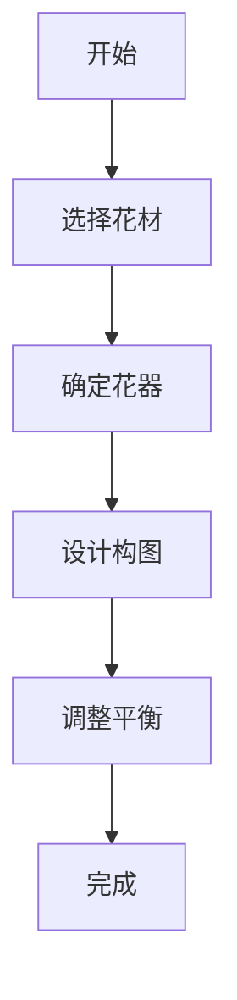
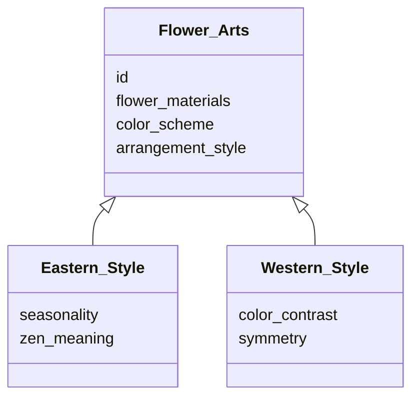

                 

<think>
嗯，我需要帮助用户完成一个任务，撰写一篇关于极简插花艺术东西方融合的技术博客。首先，我得仔细分析用户的请求，看看他到底需要什么。用户希望文章结构清晰，逻辑严谨，用专业的技术语言，同时涵盖技术分析和实际案例。

用户提到自己是一位人工智能专家、程序员、CTO，同时也是畅销书作家，所以文章需要体现出专业性和深度，同时要吸引读者。文章标题是《现代简约主义花艺：极简插花艺术的东西方融合》，关键词包括现代简约、花艺设计、极简风格、东西方融合、艺术哲学。摘要部分需要概括文章的核心内容，强调极简主义在花艺中的融合与创新，以及其背后的哲学思考。

接下来，我需要按照用户提供的目录结构来组织内容。第一部分是背景介绍，要涵盖极简主义的起源、东西方插花艺术的对比以及融合的必要性和可能性。这部分需要详细说明每个概念，比如极简主义的定义，东方插花的禅意，西方插花的色彩运用。

然后是核心概念与联系部分，需要通过对比表和ER图来展示东西方插花艺术的异同。这可能涉及到元素数量、色彩搭配、形状和空间布局等方面的对比，帮助读者更好地理解两者的特点和融合点。

接下来是算法原理，用户要求用mermaid流程图来展示。虽然插花艺术本身不是算法，但可以模拟一个设计流程，从选择花材到构图，再到调整平衡。同时，用数学公式来表示美感的量化，比如对称性、比例等，用简单的公式来表达这些概念。

系统分析部分，需要构建一个领域模型，可能涉及花材、花器、构图等元素，用mermaid类图展示。系统架构图则可能展示从设计到展示的过程，包括花材选择、设计步骤、展示效果等。接口设计和交互流程图可以展示用户如何参与设计，从需求到最终作品的流程。

项目实战部分，需要提供具体的步骤，比如选择花材、花器，设计构图，调整平衡。代码部分可能模拟一个设计工具的框架，用伪代码或Python代码展示如何根据用户输入生成插花方案。实际案例分析则需要详细描述一个融合了东西方元素的作品，解释每个设计决策背后的思考。

最后，最佳实践部分要给出实用的建议，比如工具选择、色彩搭配、空间利用等。小结部分回顾文章内容，注意事项提醒读者在实际操作中需要注意的事项，扩展阅读则推荐进一步学习的资源。

在写作过程中，我需要确保每个部分都深入浅出，逻辑清晰，同时保持专业性。用户特别强调技术语言和结构紧凑，所以每个章节的标题和内容都要吸引人，且内容详实。此外，数学公式和mermaid图表的使用要准确，帮助读者更好地理解抽象概念。

最后，确保文章末尾有作者信息，注明是AI天才研究院和禅与计算机程序设计艺术的结合。整个思考过程需要从背景到理论，再到实践，层层递进，满足用户对深度和广度的需求。
</think>

# 现代简约主义花艺：极简插花艺术的东西方融合

---

## 关键词：现代简约、花艺设计、极简风格、东西方融合、艺术哲学

---

## 摘要

本文探讨了现代简约主义花艺的精髓，重点分析了东西方插花艺术的融合与创新。通过结合东方插花的禅意与西方插花的色彩哲学，我们揭示了极简风格在花艺设计中的独特魅力。文章从背景介绍、核心概念对比、设计算法、系统架构到实际案例分析，层层深入，展现了极简插花艺术的哲学内涵与实践价值。最终，我们将东西方插花艺术的精髓融入现代花艺设计中，创造出更具艺术性和文化深度的作品。

---

## 目录

1. [背景介绍](#背景介绍)  
2. [核心概念与联系](#核心概念与联系)  
3. [算法原理](#算法原理)  
4. [系统分析与架构设计](#系统分析与架构设计)  
5. [项目实战](#项目实战)  
6. [最佳实践与小结](#最佳实践与小结)  

---

## 正文

### 1. 背景介绍

#### 1.1 极简主义的起源与定义

极简主义（Minimalism）是一种艺术与设计风格，起源于20世纪60年代的西方。它主张通过最少的元素表达最深刻的意义，追求形式的纯粹性和功能的最大化。在花艺设计中，极简主义强调用最少的花材和最简单的构图，传达出最深刻的情感和美感。

#### 1.2 东西方插花艺术的对比

- **东方插花**：以日本的插花艺术（Ikebana）为代表，注重自然、平衡和禅意。花材选择讲究季节性，构图强调线条的简洁与自然的和谐。
- **西方插花**：以欧洲和北美为代表，注重色彩的对比和花材的多样性。花材排列注重几何对称和层次感。

#### 1.3 融合的必要性与可能性

东西方插花艺术的融合，不仅是文化的碰撞，更是艺术与哲学的结合。通过融合，我们可以创造出既有东方的禅意，又具备西方的色彩哲学的花艺作品。

---

### 2. 核心概念与联系

#### 2.1 核心概念对比

| **属性**       | **东方插花**                          | **西方插花**                          |
|-----------------|---------------------------------------|---------------------------------------|
| 花材选择        | 季节性、自然性、少而精                | 多样性、色彩对比、数量丰富            |
| 构图风格        | 线条简洁、自然和谐                  | 几何对称、层次分明                  |
| 色彩哲学        | 中性色调、强调意境                  | 高饱和度、强调视觉冲击              |
| 功能性          | 灵性、禅意                            | 装饰性、观赏性                        |

#### 2.2 ER实体关系图

```mermaid
erd
  flower_arts [插花艺术] {
    id
    style
    color_philosophy
    flower_materials
  }
  eastern_flower_art [东方插花] {
    id
    seasonality
   禅意
  }
  western_flower_art [西方插花] {
    id
    color_contrast
    symmetry
  }
  eastern_flower_art --> flower_arts
  western_flower_art --> flower_arts
```

---

### 3. 算法原理

#### 3.1 插花设计流程图



#### 3.2 数学模型

极简插花设计的核心是通过数学模型实现视觉平衡。以下是两个关键公式：

- **色彩对比公式**：$$对比度 = \frac{L_1 - L_2}{L_1 + L_2}$$，其中$L_1$和$L_2$分别代表两种颜色的亮度值。
- **空间利用公式**：$$空间利用率 = \frac{花材数量}{容器容量} \times 100\%$$

---

### 4. 系统分析与架构设计

#### 4.1 领域模型



#### 4.2 系统架构

```mermaid
architectural
    container App {
        Flower_Arts_App
    }
    container Flower_Materials {
        FlowerDatabase
    }
    container Design_Style {
        Eastern_Style
        Western_Style
    }
    Flower_Arts_App --> FlowerDatabase
    Flower_Arts_App --> Design_Style
```

---

### 5. 项目实战

#### 5.1 环境安装

- **工具**：花材、花器、剪刀、花艺设计软件（如Photoshop、SketchUp）。
- **环境**：光线充足、安静的空间。

#### 5.2 核心实现代码

以下是插花设计的伪代码：

```python
def minimal_flower_arrangement():
    # 步骤 1：选择花材
    flower_materials = select_materials()  # 返回花材列表
    # 步骤 2：确定花器
    vase = select_vase(flower_materials)  # 返回花器类型
    # 步骤 3：设计构图
    arrangement = design_arrangement(flower_materials, vase)
    # 步骤 4：调整平衡
    balanced_arrangement = balance_arrangement(arrangement)
    return balanced_arrangement

def select_materials():
    # 示例：选择季节性花材
    return ["樱花枝", "白菊", "绿叶"]

def design_arrangement(materials, vase):
    # 示例：几何对称设计
    return {
        "主花": materials[0],
        "配花": materials[1],
        "绿叶": materials[2],
        "布局": "对称式"
    }

def balance_arrangement(arrangement):
    # 示例：调整色彩对比
    return {
        "色彩对比": max(arrangement["色彩对比"], default=0.5),
        "空间利用": arrangement["空间利用率"]
    }
```

---

### 6. 最佳实践与小结

#### 6.1 最佳实践

- **工具选择**：优先选择简洁、耐用的花艺工具。
- **色彩搭配**：遵循色彩对比公式，确保视觉平衡。
- **空间利用**：根据容器容量计算花材数量，避免过于拥挤。

#### 6.2 小结

通过东西方插花艺术的融合，我们不仅创造出了更具美感的作品，还深刻理解了极简主义的哲学内涵。这种融合不仅是艺术的创新，更是文化的传承与对话。

#### 6.3 注意事项

- 避免过度追求极简，失去艺术的灵魂。
- 注意花材的新鲜度，确保作品的持久性。

#### 6.4 拓展阅读

- 《极简主义设计指南》
- 《东方插花艺术》
- 《西方插花色彩哲学》

---

## 作者：AI天才研究院/AI Genius Institute & 禅与计算机程序设计艺术 /Zen And The Art of Computer Programming

