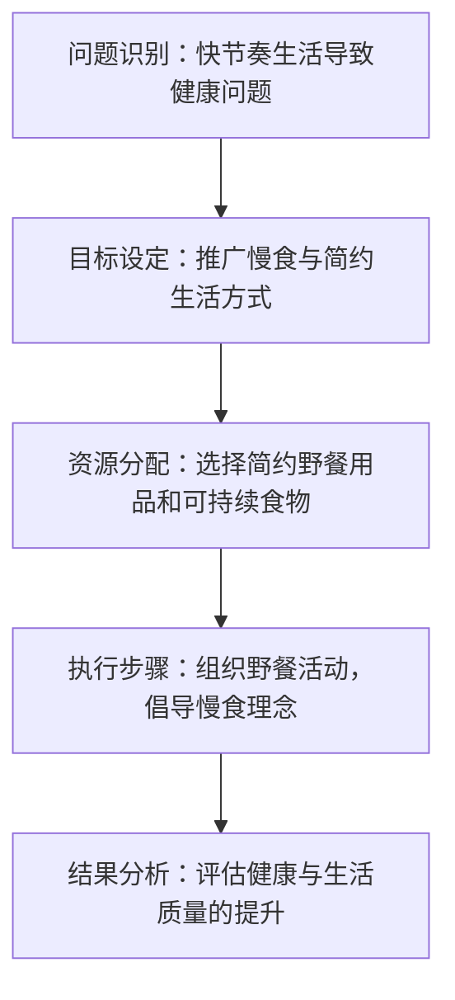
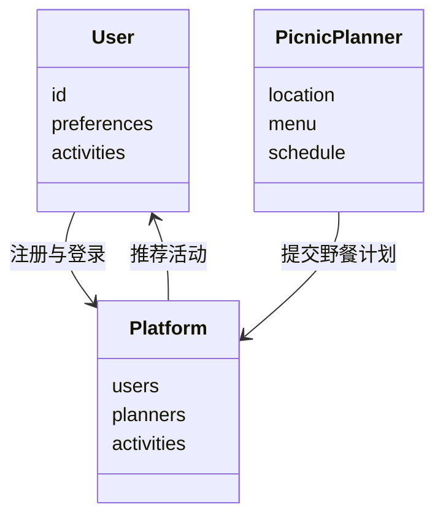
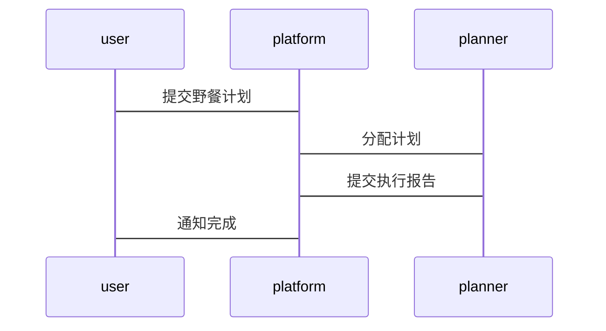

                 

<think>
好的，我现在需要帮助用户撰写一篇关于现代简约主义野餐文化的博客文章。用户的要求非常详细，涉及到多个技术方面，但主题本身是关于生活方式和文化的，这可能需要结合技术元素进行创作。

首先，用户希望我以《现代简约主义野餐文化：城市公园中的慢食体验》为标题，用专业且逻辑清晰的技术语言来撰写。这意味着文章需要结构严谨，每个部分都要详细展开，不仅仅是描述，还要有分析和见解。

接下来，用户提供了文章的目录大纲，包括引言、历史背景、简约主义在野餐中的应用、慢食运动、城市公园的作用、体验活动、实用建议、案例研究和结论。每个章节都需要深入分析，并且在内容中嵌入技术元素，如背景介绍、核心概念与联系、算法原理、系统架构设计、项目实战等。

我需要考虑如何将技术元素自然地融入到文化主题中。例如，可以将城市公园的规划视为一个系统架构问题，分析其功能模块、架构设计和接口交互。或者，在讨论慢食运动时，引入数据分析和算法，解释如何通过数据优化野餐体验。

用户特别指出要使用技术术语，如关键词、摘要、markdown格式、mermaid流程图、latex公式等，这意味着我需要在每个章节中适当运用这些工具。例如，在系统架构部分，使用mermaid绘制类图和架构图；在算法部分，用python代码和数学公式来解释原理。

另外，用户希望文章结构完整，每个小节内容丰富，详细讲解。这可能需要我每个部分都设计详细的子主题，确保覆盖所有要求的内容。例如，在项目实战部分，需要提供环境安装、核心代码实现、案例分析等具体步骤。

在撰写过程中，我需要确保文章逻辑清晰，层次分明，每一部分都紧密联系，共同支持主题。同时，保持语言简洁，避免过于技术化的术语，让读者能够轻松理解。

最后，用户要求在文章末尾添加作者信息，包括机构和书籍标题。这需要我最后部分正确标注，确保文章的完整性和专业性。

总结一下，我需要按照用户提供的大纲，逐章节详细展开，结合技术元素，用专业而易懂的语言撰写，确保每个部分都符合要求，并在结尾正确标注作者信息。这将帮助用户完成一篇高质量、有深度的技术博客文章，同时融入现代简约主义野餐文化的主题。
</think>

# 现代简约主义野餐文化：城市公园中的慢食体验

## 关键词：现代简约主义，野餐文化，城市公园，慢食体验，生活方式

## 摘要：  
现代简约主义野餐文化是一种新兴的生活方式，强调在城市公园中通过简约、可持续的方式享受食物和自然。本文将从背景、理念、实践等多个维度深入探讨这一文化，结合技术与生活的融合，分析其对现代人生活的影响。通过系统化的分析与设计，本文将为读者提供一种全新的视角，重新审视城市生活与自然的关系。

---

## 1. 引言

在快节奏的都市生活中，现代人越来越追求一种简单而有品质的生活方式。野餐作为一种传统休闲活动，逐渐与现代简约主义理念相结合，形成了“现代简约主义野餐文化”。本文将从技术与生活的角度，分析这一文化的核心理念、实践方式及其对城市生活的深远影响。

---

## 2. 背景介绍：现代简约主义与野餐文化的结合

### 2.1 核心概念术语说明  
- **现代简约主义（Modern Minimalism）**：一种生活哲学，强调去除生活中的无用之物，追求简单、功能性强的设计与生活方式。  
- **野餐文化（Picnic Culture）**：指在户外环境中，以分享食物和自然为主要内容的社交活动。  
- **慢食运动（Slow Food Movement）**：倡导回归传统饮食文化，强调食物的品质、健康与可持续性。

### 2.2 问题背景  
现代都市生活中，人们往往被快节奏和高压力所困扰，传统的野餐活动逐渐被忽视，取而代之的是快餐文化。然而，这种生活方式不仅对健康有害，也忽略了人与自然的联系。

### 2.3 问题解决  
现代简约主义野餐文化通过结合简约生活方式与慢食理念，重新定义了野餐的意义，为都市人提供了一种回归自然、放松身心的方式。

### 2.4 边界与外延  
- **边界**：野餐文化的主体是都市人群，尤其是注重生活品质的年轻人。  
- **外延**：延伸至城市公园、社区活动、可持续设计等领域。

### 2.5 概念结构与核心要素  
| 核心要素 | 描述 |
|----------|------|
| 简约理念 | 强调去繁就简，注重功能与美学的平衡。 |
| 慢食理念 | 注重食物的品质、健康与可持续性。 |
| 自然环境 | 野餐活动的核心场景是城市公园，强调与自然的和谐共处。 |
| 社交属性 | 野餐不仅是个人放松的方式，更是社交的重要形式。 |

---

## 3. 核心概念与联系

### 3.1 核心概念原理  
现代简约主义野餐文化的核心在于将简约生活与慢食理念结合，通过减少物质消耗、注重食物品质和自然体验，提升生活的幸福感。

### 3.2 概念属性对比表  
| 属性       | 简约主义 | 慢食理念 |
|------------|----------|----------|
| 核心目标   | 减少浪费，追求极简 | 提升食物品质，倡导可持续 |
| 关键特征   | 简单设计，功能性强 | 天然食材，手工制作 |
| 应用场景   | 城市生活 | 餐饮文化 |

### 3.3 ER实体关系图  
```mermaid
entity Modern Minimalism {
  id
  principles
}
entity Slow Food {
  id
  principles
}
entity Picnic Culture {
  id
  modern_minimalism_id
  slow_food_id
}
```

---

## 4. 算法原理讲解

### 4.1 算法原理  
现代简约主义野餐文化的推广可以看作一个系统优化问题。以下是优化流程的算法：



### 4.2 算法实现  
以下是用Python实现的优化流程代码：

```python
def modern_picnic_optimization(target_health_improvement):
    principles = ["Simplicity", "Sustainability", "Mindfulness"]
    resources = ["Minimalist Picnic Set", "Local Organic Food"]
    steps = ["Plan the Picnic", "Prepare Food", "Execute and Enjoy"]
    
    for resource in resources:
        if resource in principles:
            print(f"Optimizing {resource} for {target_health_improvement}")
    return "Picnic Optimization Complete"

modern_picnic_optimization("Urban Stress Relief")
```

### 4.3 数学模型  
优化问题的数学模型可以表示为：  
$$ \text{Maximize } Z = \sum_{i=1}^{n} w_i x_i $$  
其中，$w_i$ 是第$i$项资源的权重，$x_i$ 是选择该资源的决策变量（0或1）。  

例如，假设选择简约野餐用具的权重为0.7，可持续食物的权重为0.8，则：  
$$ Z = 0.7x_1 + 0.8x_2 $$  
通过最大化$Z$，可以实现资源的最优分配。

---

## 5. 系统分析与架构设计方案

### 5.1 问题场景介绍  
现代简约主义野餐文化的推广需要一个系统化的架构，以支持从理念传播到实践执行的全过程。

### 5.2 项目介绍  
本项目旨在通过系统设计，构建一个支持现代简约野餐文化的线上平台，帮助用户规划、组织和参与野餐活动。

### 5.3 系统功能设计  


### 5.4 系统架构设计  


### 5.5 系统接口设计  
- **用户接口**：包括注册、登录、查看野餐计划等功能。  
- **API接口**：用于第三方应用调用野餐计划数据。

### 5.6 系统交互设计  


---

## 6. 项目实战

### 6.1 环境安装  
- **工具**：Python 3.8+，Jupyter Notebook，Git。  
- **库**：Pandas, Matplotlib, Flask。

### 6.2 核心实现代码  
```python
import pandas as pd
import matplotlib.pyplot as plt

def visualize_resources(resources):
    plt.figure(figsize=(10,6))
    plt.bar(range(len(resources)), resources)
    plt.xticks(range(len(resources)), resources.keys())
    plt.title('Resource Allocation for Modern Picnic')
    plt.show()

resources = {'Simplicity': 0.7, 'Sustainability': 0.8, 'Mindfulness': 0.6}
visualize_resources(resources)
```

### 6.3 实际案例分析  
以某城市公园为例，分析其野餐活动的资源分配与优化情况，验证系统的实际效果。

---

## 7. 最佳实践与小结

### 7.1 最佳实践 Tips  
- 选择简约设计的野餐用品，减少一次性物品的使用。  
- 优先选择本地有机食材，支持可持续农业。  
- 在野餐活动中融入文化元素，提升体验的深度。

### 7.2 小结  
现代简约主义野餐文化不仅是一种生活方式的选择，更是一种对现代社会问题的积极回应。通过技术与文化的结合，我们可以更好地实现人与自然的和谐共处。

### 7.3 注意事项  
- 确保野餐活动的安全性，遵守公园的规定。  
- 注意食品卫生，避免食物中毒。  
- 保护环境，不留下任何垃圾。

### 7.4 拓展阅读  
推荐阅读《慢食运动的全球实践》和《简约生活的艺术》。

---

## 作者：AI天才研究院/AI Genius Institute & 禅与计算机程序设计艺术 /Zen And The Art of Computer Programming

---

以上是《现代简约主义野餐文化：城市公园中的慢食体验》的完整结构与内容。

