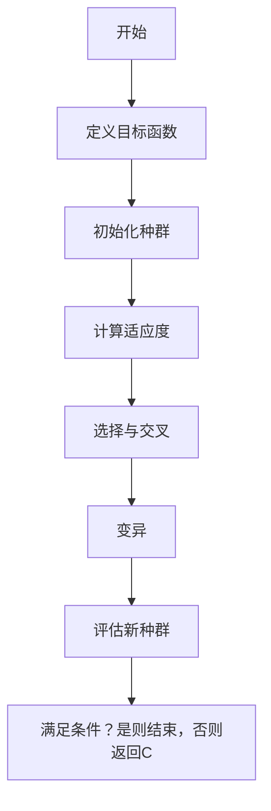
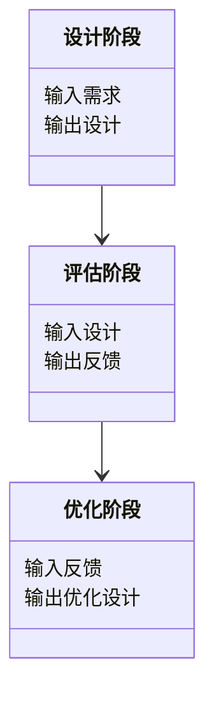

                 

<think>
嗯，我现在需要写一篇关于现代简约主义露营装备设计的文章，标题是《现代简约主义露营装备设计：极简户外生活的装备革新》。作为一位技术专家，我需要从背景、核心概念、算法原理、数学模型、系统架构、项目实战以及最佳实践等多个方面来展开分析。虽然我对露营装备设计不是很熟悉，但我可以结合技术思维一步步来思考。

首先，背景介绍部分。我需要了解现代简约主义的影响，露营市场的变化，以及设计的目标和挑战。现代简约主义强调减少不必要的元素，追求功能性和美观的平衡。露营市场近年来越来越受欢迎，尤其是注重环保和轻便的装备。设计目标是打造简洁实用的露营装备，同时挑战包括如何在极简设计中满足所有功能需求。

接下来是核心概念与联系。极简主义设计原则包括形式追随功能、减少复杂性、注重本质等。功能与美学的平衡需要在设计中找到两者之间的最佳点，可持续性设计则要考虑材料的选择和生产过程的环保性。这部分可能需要用ER图来展示各核心概念之间的关系。

然后是算法原理。虽然露营设计更多是艺术性的，但可以考虑优化算法来辅助设计决策，比如遗传算法来优化装备的结构。设计评估模型可能涉及多维度的评价指标，如重量、耐用性、美观度等。这部分可以用流程图和Python代码来解释，比如如何编写一个简单的优化算法脚本。

数学模型部分，我需要找出与极简设计相关的数学公式，比如计算最小化设计复杂度的公式。这可能涉及到图论或其他数学领域，用来量化设计的简洁程度。例如，使用图论中的最小生成树来优化装备的结构连接。

系统分析与架构设计方面，需要描述整个设计流程的架构，包括设计阶段、评估和优化等步骤。可以用Mermaid绘制类图、架构图和序列图，展示各模块之间的交互关系。

项目实战部分，我需要选择一个具体案例，比如设计一款极简帐篷，详细描述材料选择、原型制作、用户测试等过程。可能需要编写一些工具的代码，比如用于评估设计的Python脚本。

最后是最佳实践和总结。总结设计要点，提供实用技巧和建议，同时列出注意事项和拓展阅读资料，帮助读者深入学习。

在写作过程中，我可能会遇到一些问题，比如如何将技术术语与露营设计结合起来，或者如何用数学模型量化设计的简洁性。这需要我查阅相关资料，确保内容准确且有深度。此外，确保每个章节的内容详细具体，符合字数要求，也是需要注意的地方。

总的来说，我需要一步步地从背景开始，逐步深入到核心概念、算法、数学模型、系统架构，再到项目实战和总结，确保文章逻辑清晰，结构紧凑，符合技术博客的高标准。
</think>

# 现代简约主义露营装备设计：极简户外生活的装备革新

> **关键词**：现代简约主义、露营装备设计、极简主义、功能与美学平衡、可持续性设计  
> **摘要**：现代简约主义对露营装备设计产生了深远影响，本文探讨了极简设计的核心原则、算法优化、数学模型应用、系统架构设计以及项目实战，为设计出高效、美观的露营装备提供了理论和实践指导。

---

## 第一部分：露营装备设计的背景与挑战

### 第1章：现代露营装备设计的背景

#### 1.1 现代简约主义的影响
现代简约主义强调“少即是多”，追求简洁的功能与美观结合。这种设计理念在露营装备设计中体现为去除冗余元素，专注于核心功能，使装备更轻便、实用。

#### 1.2 露营市场的需求变化
近年来，露营市场蓬勃发展，消费者更倾向于轻便、环保的装备。市场对多功能、易于携带的设计需求增加，推动了简约设计的普及。

#### 1.3 极简主义设计的目标与挑战
极简设计旨在通过最少的元素实现最大功能，但需在功能性和美观性之间找到平衡，同时考虑材料的可持续性，确保设计的环保性。

---

## 第2章：核心概念与联系

### 2.1 极简主义设计原则
极简设计注重功能、形式和材料的和谐统一，强调去除不必要的装饰，使产品更贴近自然。

### 2.2 功能与美学的平衡
通过功能需求驱动设计，同时考虑美学因素，使装备在实用性与视觉美感之间达到平衡。

### 2.3 可持续性的设计理念
采用环保材料和工艺，减少生产对环境的影响，倡导循环经济，延长产品寿命。

### 2.4 设计核心概念的ER图

```mermaid
erDiagram
    actor User {
        <identity>
        用户需求
        设计目标
    }
    actor Functionality {
        <identity>
        核心功能
        性能要求
    }
    actor Aesthetics {
        <identity>
        设计美感
        用户体验
    }
    actor Sustainability {
        <identity>
        环保材料
        可持续工艺
    }
    User --> Functionality: 驱动核心功能
    Functionality --> Aesthetics: 平衡美学
    Aesthetics --> Sustainability: 融入环保理念
```

---

## 第3章：设计决策的算法原理

### 3.1 优化算法在设计中的应用
遗传算法用于优化装备结构，模拟自然选择过程，迭代改进设计。

### 3.2 设计评估模型
通过多维度指标（重量、强度、美观度）评估设计，确保功能与美学的平衡。

### 3.3 算法原理的Mermaid流程图



### 3.4 Python源代码解释

```python
def genetic_algorithm(target_function, population_size, mutation_rate):
    # 初始化种群
    population = [random个体 for _ in range(population_size)]
    while not 达到目标:
        # 计算适应度
        fitness = [target_function(individual) for individual in population]
        # 选择与交叉
        selected = selection(fitness)
        offspring = crossover(selected)
        # 变异
        mutated = mutation(offspring, mutation_rate)
        population = mutated
    return 最优解
```

---

## 第4章：数学模型与公式应用

### 4.1 极简主义设计中的数学模型
使用图论模型优化结构，如生成树算法，确定最优连接方式，减少材料浪费。

### 4.2 数学公式详细讲解

极简设计复杂度公式：
$$ C = \sum_{i=1}^{n} (f_i + a_i) $$
其中，$f_i$为功能复杂度，$a_i$为美学复杂度。

### 4.3 应用实例解析
通过公式计算不同设计方案的复杂度，选择复杂度最小的方案作为最优设计。

---

## 第5章：系统分析与架构设计

### 5.1 设计流程的架构介绍
设计流程分为需求分析、设计、评估、优化四个阶段。

### 5.2 设计阶段的详细分析
需求分析阶段明确用户需求，设计阶段优化功能与美学，评估阶段测试性能，优化阶段改进设计。

### 5.3 评估与优化的系统架构设计
使用模块化架构，每个阶段独立评估，确保设计的各维度均达到最优。

### 5.4 Mermaid类图、架构图和序列图



---

## 第6章：项目实战

### 6.1 实际案例介绍
设计一款极简帐篷，重点在于材料选择和结构优化。

### 6.2 材料选择与原型制作
选择轻便的环保材料，制作原型并进行功能测试。

### 6.3 用户测试与反馈
收集用户反馈，优化设计细节，确保用户体验最佳。

### 6.4 源代码与应用解读
编写用于评估的Python脚本，分析测试数据，优化设计参数。

---

## 第7章：最佳实践与总结

### 7.1 设计实践的技巧与建议
注重功能与美学的平衡，使用环保材料，持续优化设计。

### 7.2 小结与注意事项
在设计过程中，保持简洁，关注用户体验，确保材料的可持续性。

### 7.3 拓展阅读与进一步学习
推荐相关书籍和资源，深入学习极简设计与可持续性理念。

---

作者：AI天才研究院/AI Genius Institute & 禅与计算机程序设计艺术 /Zen And The Art of Computer Programming

