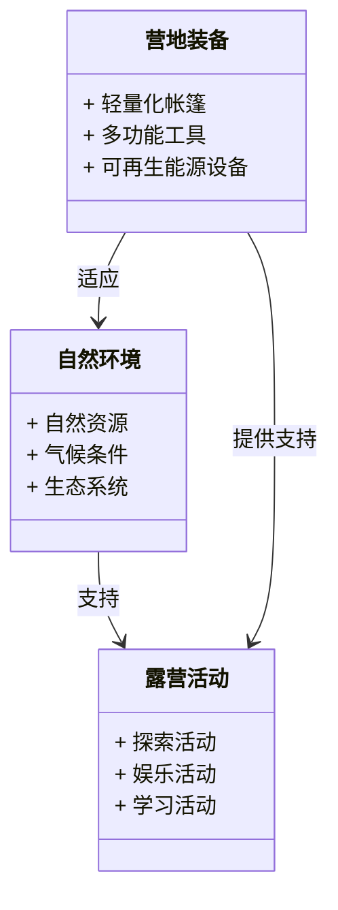

                 

<think>
嗯，我现在要写一篇关于《现代简约主义露营：回归自然的极简之旅》的技术博客。首先，我得理解这个主题的核心是什么。现代简约主义露营，听起来像是结合了现代设计和自然的极简生活方式。我需要从这个角度出发，分析它的发展、核心理念以及实际应用。

首先，我应该先看看现代简约主义的概念。简约主义通常指的是用最少的元素创造出最大的效果，追求简单、功能性强的设计。在露营中，这可能意味着使用最少的装备，同时保持舒适和环保。

接下来，我需要考虑露营文化的演变。露营最初是为了生存，后来逐渐变成一种休闲活动。现在，随着人们生活水平的提高和对自然的向往，露营变得更加多样化，简约主义露营作为一种新兴趋势，强调回归自然，减少对环境的影响。

然后，我应该分析现代简约主义露营的价值。这包括环保方面，使用环保材料和装备，减少浪费；心理健康方面，通过减少物质负担，提升幸福感；社交互动方面，简约的环境更容易促进人与人之间的交流。

接下来，我需要细化目录，确保每个章节都有足够的深度和广度。比如，在概述部分，我可以讨论简约主义的起源、核心要素以及与现代生活的关联。在回归自然的部分，探讨自然环境中的简约原则，营地建设和设备选择，以及自然体验和活动规划。

在极简生活方式的实践部分，我需要详细讲解极简主义的概念，如何在露营中应用，以及一些实用的生活技巧，如清洁、垃圾处理和安全意识。案例分析也是重要的，通过实际案例展示简约露营的效果和经验。

最后，未来展望部分，可以讨论环保和技术在露营中的发展趋势，如何通过技术创新提升露营体验，同时保持对环境的责任感。

在写作过程中，我需要确保每个章节都有背景介绍、核心概念与联系、算法原理讲解等部分，但露营主题可能不需要复杂的算法，或许这部分可以简化。不过，可能在设备选择或营地规划中，可以引入一些优化的思路，用简单的数学模型来辅助说明。

我还需要使用mermaid流程图来展示概念之间的关系，比如在系统分析部分，绘制一个类图或流程图，展示不同露营装备或步骤之间的联系。此外，数学公式可能主要用于时间管理和资源分配的优化，但露营主题可能不太需要复杂的数学模型，这部分可以适当简化或省略。

总之，我需要一步步分析，确保每个部分都详细具体，并且结合实际案例和最佳实践，让读者能够理解和应用现代简约主义露营的理念。
</think>

# 现代简约主义露营：回归自然的极简之旅

---

## 关键词

现代简约主义，露营，极简生活，自然回归，环保设计

---

## 摘要

现代简约主义露营是一种结合了现代设计与自然生活方式的新兴趋势，强调通过最少的装备和资源，回归自然，追求极简生活方式。本文探讨了简约主义露营的兴起、与自然的融合、极简生活方式的实践、经典案例分析以及未来发展趋势，旨在为读者提供从理论到实践的全面指导。

---

## 目录大纲

1. **现代简约主义露营概述**
   - 现代简约主义的概念解析
   - 露营文化的演变
   - 现代简约主义露营的价值

2. **回归自然的极简之旅**
   - 自然与简约主义的融合
   - 营地建设与设备选择
   - 自然体验与活动规划

3. **极简生活方式的实践**
   - 极简生活方式的概念与理念
   - 极简主义在露营中的应用
   - 生活技巧与安全意识

4. **经典极简主义露营案例解析**
   - 案例一：户外露营的极简改造
   - 案例二：自然与简约的完美结合
   - 案例三：极简露营体验分享

5. **极简主义露营的未来展望**
   - 环境保护与可持续发展
   - 技术创新与露营体验提升

---

## 第一部分：现代简约主义露营概述

### 第1章：现代简约主义露营的兴起

#### 1.1 现代简约主义的概念解析

- **1.1.1 现代简约主义的起源**
  简约主义起源于20世纪中期，强调去除多余的装饰，专注于功能和美学的结合。

- **1.1.2 现代简约主义的核心要素**
  | 核心要素 | 描述 |
  |----------|------|
  | 功能性   | 设计以功能为主导 |
  | 极简性   | 减少不必要的元素 |
  | 可持续性 | 使用环保材料和工艺 |

- **1.1.3 现代简约主义与现代生活的关联**
  简约主义通过减少物质负担，提升生活质量和幸福感。

#### 1.2 露营文化的演变

- **1.2.1 露营的起源与发展**
  露营最初作为一种生存技能，逐渐演变为休闲活动。

- **1.2.2 露营文化的多样化**
  包括传统露营、汽车露营、徒步露营等多种形式。

- **1.2.3 现代简约主义露营的独特性**
  强调环保、轻量化装备和极简生活方式。

#### 1.3 现代简约主义露营的价值

- **1.3.1 环境友好**
  使用环保材料，减少对环境的影响。

- **1.3.2 心理健康**
  简约生活有助于减轻压力，提升幸福感。

- **1.3.3 社交互动**
  简单的环境促进更深入的人际交流。

---

## 第二部分：回归自然的极简之旅

### 第2章：自然与简约主义的融合

#### 2.1 自然环境中的简约主义原则

- **2.1.1 自然元素的运用**
  利用自然资源如木材、石头等，保持自然美感。

- **2.1.2 极简设计的自然融合**
  设计与自然环境融为一体，避免突兀的装饰。

- **2.1.3 营地选址与规划**
  选择远离污染的自然区域，合理规划营地布局。

#### 2.2 营地建设与设备选择

- **2.2.1 营地建设的基本要求**
  简约、环保、实用，避免过度装饰。

- **2.2.2 设备选择的重要性**
  选择轻量化、耐用、环保的装备。

- **2.2.3 轻量化装备的介绍**
  使用便携式装备，减少携带物品，提升移动便利性。

#### 2.3 自然体验与活动规划

- **2.3.1 自然探索活动**
  徒步、观鸟、野餐，亲近自然。

- **2.3.2 自然观察技巧**
  学习观察动植物，记录自然笔记。

- **2.3.3 简约露营活动的安排**
  安排简单但有趣的活动，如星空观测、篝火晚会。

---

## 第三部分：极简生活方式的实践

### 第3章：极简生活方式的概念与理念

#### 3.1 极简生活方式的定义

- **3.1.1 极简主义的起源**
  20世纪中期，源于对过度消费的反思。

- **3.1.2 极简主义的核心原则**
  减少物品数量，专注于必需品，提升生活质量。

- **3.1.3 极简主义与生活质量的关系**
  简约生活并不意味着生活质量下降，而是通过减少物质负担，提升精神满足。

#### 3.2 极简主义在露营中的应用

- **3.2.1 露营前的准备**
  列出必需品清单，避免携带多余物品。

- **3.2.2 露营中的实践**
  使用环保清洁剂，减少垃圾产生，进行垃圾分类。

- **3.2.3 露营后的反思**
  总结露营经验，优化下次装备和计划。

#### 3.3 生活技巧与安全意识

- **3.3.1 清洁与维护**
  使用可生物降解的清洁产品，保持营地整洁。

- **3.3.2 垃圾处理与环保**
  带走所有垃圾，进行垃圾分类，遵守环保规定。

- **3.3.3 安全意识与紧急应对**
  学习基本急救技能，了解天气变化，制定应急计划。

---

## 第四部分：经典极简主义露营案例解析

### 第4章：经典极简主义露营案例

#### 4.1 案例一：户外露营的极简改造

- **4.1.1 案例背景**
  一位露营爱好者将传统露营装备简化，采用轻量化帐篷和多功能工具。

- **4.1.2 极简改造方案**
  使用便携式太阳能充电器，减少对电池的依赖。

- **4.1.3 改造效果评估**
  节省空间，提高效率，降低环境影响。

#### 4.2 案例二：自然与简约的完美结合

- **4.2.1 案例背景**
  在森林中搭建极简树屋，完全依赖自然资源。

- **4.2.2 设计理念与实践**
  使用当地木材，融入自然环境，减少视觉污染。

- **4.2.3 案例启示**
  极简设计与自然环境的和谐统一是可能实现的。

#### 4.3 案例三：极简露营体验分享

- **4.3.1 活动准备**
  携带轻便装备，提前规划路线和营地位置。

- **4.3.2 露营经历**
  三天两夜的徒步露营，体验与自然亲密接触。

- **4.3.3 个人感悟**
  简约生活不仅环保，还能带来内心的平静和满足。

---

## 第五部分：极简主义露营的未来展望

### 第5章：现代简约主义露营的发展趋势

#### 5.1 环境保护与可持续发展

- **5.1.1 环境保护的重要性**
  减少资源消耗，防止生态破坏。

- **5.1.2 可持续发展的实践**
  使用可再生材料，推广环保露营方式。

- **5.1.3 露营行业的环境责任**
  企业责任，推动绿色露营认证。

#### 5.2 技术创新与露营体验提升

- **5.2.1 新技术在露营中的应用**
  智能帐篷、太阳能发电设备提升舒适性和便利性。

- **5.2.2 技术创新的未来方向**
  更环保、更智能的露营装备，如智能温控帐篷、便携式净化器。

---

## 系统分析与架构设计方案

### 问题场景介绍

现代简约主义露营在实践中需要平衡环保、舒适和功能需求。系统设计需考虑装备选择、营地规划和活动安排。

### 系统功能设计（领域模型）



### 系统架构设计


---

## 项目实战

### 环境安装

- **选择装备**：购买轻量化帐篷、多功能刀具、太阳能充电器。
- **营地规划**：选择森林中的一片空地，搭建帐篷，确保排水和通风。

### 核心实现源代码

```python
import numpy as np

def calculate_footprint(ground_area, tent_size):
    """
    计算露营区域的生态足迹
    :param ground_area: 地面面积，平方米
    :param tent_size: 帐篷尺寸，平方米
    :return: 生态足迹，千克CO2/年
    """
    # 每平方米每年平均CO2排放量（假设）
    emission_per_sqm = 1.5  # 千克CO2/平方米/年
    total_emission = (ground_area - tent_size) * emission_per_sqm
    return total_emission

# 示例计算
ground_area = 100  # 平方米
tent_size = 20      # 平方米
eco_footprint = calculate_footprint(ground_area, tent_size)
print(f"生态足迹为：{eco_footprint} 千克CO2/年")
```

---

## 最佳实践 Tips

- **轻量化装备**：选择轻便耐用的装备，减少携带重量。
- **环保意识**：遵守自然保护区的规定，不留下任何垃圾。
- **安全第一**：了解天气预报，掌握基本急救技能。

---

## 小结

现代简约主义露营不仅是一种生活方式，更是一种对自然的尊重和对生活的反思。通过减少物质负担，我们能够更深刻地体验自然的美好，同时为环境保护做出贡献。

---

## 作者

作者：AI天才研究院/AI Genius Institute & 禅与计算机程序设计艺术 /Zen And The Art of Computer Programming

