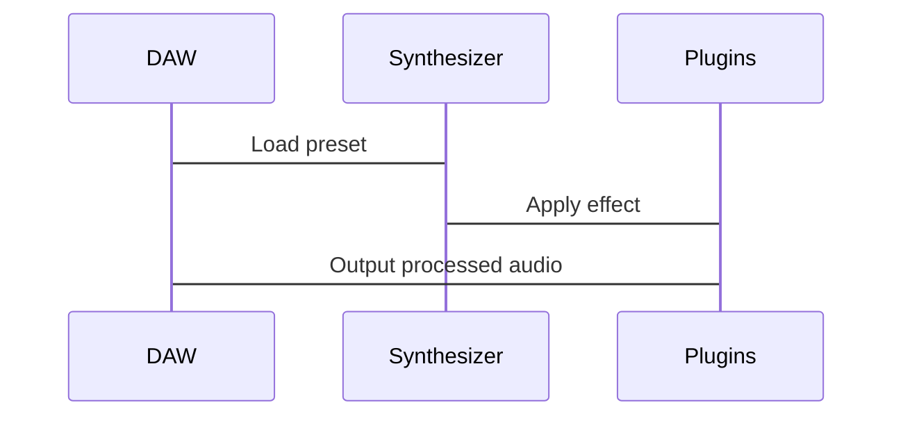

                 

<think>
嗯，用户让我写一篇关于现代极简主义音乐制作的技术博客，标题是《现代简约主义音乐制作：极简电子音乐的创作理念》。首先，我需要明确用户的需求，他们可能是一位音乐制作人或者对电子音乐制作感兴趣的人，想深入了解如何制作极简风格的音乐。

用户给出的结构很详细，包括引言、背景、基本元素、工具、创作过程、技术技巧、案例分析、系统架构和小结。我得确保每个部分都涵盖到位，并且内容专业且易懂。

首先，我得从背景和定义开始，解释极简主义音乐的来源和核心概念。然后，介绍基本的音乐理论，比如和声结构和节奏模式，这些都是创作的基础。接着，讨论空间和寂静在音乐中的作用，强调“少即是多”的理念。

接下来是工具部分，介绍数字音频工作站和合成器软件。这部分需要具体推荐一些常用的工具，比如Logic Pro X和Max/MSP，这样读者可以实际操作。

然后是创作过程，从规划、构思到润色，每个阶段都需要详细说明。例如，在规划阶段，如何定义项目范围，构思阶段如何发展旋律和节奏，润色阶段如何优化声音和结构。

技术技巧部分，要讲解合成、声音变换和循环制作的方法。比如，基本的合成方法和如何利用插件创造独特声音。

案例分析部分，通过一个具体项目来展示整个创作流程，这样读者能更直观地理解理论如何应用到实践中。

系统架构和小结部分，需要总结极简主义音乐的核心要素，并展望其未来的发展。这可能包括技术进步对音乐创作的影响，以及如何进一步简化创作流程。

整个过程中，我需要确保使用专业但易懂的语言，逻辑清晰，结构紧凑。同时，加入一些数学公式和图表，比如系统架构图和流程图，增强文章的技术性。

最后，别忘了在结尾加上作者信息，让文章看起来更正式和完整。总的来说，这篇文章需要兼顾理论和实践，帮助读者全面了解现代极简主义音乐的制作理念和方法。
</think>

# 现代简约主义音乐制作：极简电子音乐的创作理念

---

## 关键词：现代简约主义音乐、极简电子音乐、音乐制作工具、创作理念、数字音频工作站

---

## 摘要：  
本文深入探讨了现代简约主义音乐的创作理念，从背景、核心概念到工具和技巧，全面解析了极简电子音乐的制作过程。文章通过逐步分析，揭示了简约主义音乐的独特魅力，并结合实际案例，展示了如何利用现代技术实现音乐创作的极简美学。无论是音乐制作人还是电子音乐爱好者，都能从中获得启发，掌握如何在简单中创造深刻的音乐表达。

---

## 第一部分：现代简约主义音乐的背景与定义

### 第1章：现代简约主义音乐的背景与定义

#### 1.1 现代音乐的演变

- **1.1.1 现代音乐的起源与发展**  
  现代音乐的演变经历了从古典音乐到流行音乐，再到电子音乐的转变。随着技术的进步，音乐制作方式也在不断革新，简约主义音乐作为一种新兴的音乐风格，逐渐崭露头角。

- **1.1.2 简约主义音乐的崛起**  
  简约主义音乐起源于20世纪60年代，强调音乐的极简表达，通过重复、循环和空间感的运用，创造出独特的音乐体验。

#### 1.2 简约主义音乐的核心概念

- **1.2.1 简约主义音乐的定义**  
  简约主义音乐是一种通过极简的元素（如单一旋律、重复节奏）来表达复杂情感的音乐风格。它强调音乐的纯粹性和空间感，摒弃多余的装饰。

- **1.2.2 简约主义音乐的特点**  
  简约主义音乐的特点包括：  
  - **极简的元素**：使用最少的音乐元素，通过重复和循环创造深度。  
  - **空间感**：通过 silence 和 space 的运用，增强音乐的层次感。  
  - **技术驱动**：依赖现代技术工具（如数字音频工作站、合成器）实现极简的音乐表达。

#### 1.3 简约主义音乐的历史背景

- **1.3.1 早期发展**  
  20世纪60年代，简约主义音乐在西方音乐理论中逐渐形成，代表人物包括菲利普·格拉斯和斯蒂夫·赖希。

- **1.3.2 当代简约主义音乐**  
  在当代，简约主义音乐与电子音乐结合，形成了极简电子音乐这一新的音乐类型。

---

## 第二部分：简约主义音乐的核心元素与创作理念

### 第2章：简约主义音乐的核心元素

#### 2.1 基本音乐理论

- **2.1.1 和声结构**  
  简约主义音乐通常采用简单的和声结构，强调功能性和重复性。

- **2.1.2 节奏与旋律**  
  节奏和旋律是简约主义音乐的两大核心，通过简单的节奏模式和重复的旋律结构，创造出深度和层次感。

#### 2.2 空间与寂静的运用

- **2.2.1 "少即是多" 的理念**  
  简约主义音乐通过减少音乐元素的数量，强调每个音符的重要性。寂静和空间成为音乐表达的重要工具。

- **2.2.2 音乐的层次感**  
  通过动态变化和空间感的运用，简约主义音乐在极简中创造出丰富的层次感。

#### 2.3 简单的美学

- **2.3.1 简化音乐创作**  
  简约主义音乐强调简化创作过程，通过聚焦核心元素实现音乐的深度表达。

- **2.3.2 极简的音乐语言**  
  简约主义音乐使用最少的音乐语言，通过重复和循环创造复杂的情感表达。

---

## 第三部分：工具与技术在简约主义音乐中的应用

### 第3章：简约主义音乐的制作工具

#### 3.1 数字音频工作站（DAWs）

- **3.1.1 DAWs 的选择与使用**  
  数字音频工作站是简约主义音乐制作的核心工具，常用的包括 Logic Pro X、Ableton Live 和 FL Studio。

- **3.1.2 DAWs 的功能**  
  DAWs 提供了录音、编辑、混音和效果处理的功能，帮助音乐人实现极简的音乐表达。

#### 3.2 合成器与效果插件

- **3.2.1 合成器的作用**  
  合成器是简约主义音乐制作的关键工具，通过合成器可以创造出独特的音色和节奏。

- **3.2.2 效果插件的应用**  
  效果插件（如延迟、混响）可以帮助音乐人增强空间感和层次感。

#### 3.3 简约主义音乐的创作流程

- **3.3.1 从灵感到创作**  
  简约主义音乐的创作流程通常包括：灵感捕捉、元素选择、结构设计和最终润色。

- **3.3.2 创作中的技术应用**  
  通过技术工具实现音乐元素的精简和优化，确保音乐表达的极简美学。

---

## 第四部分：简约主义音乐的创作技术与技巧

### 第4章：简约主义音乐的创作技术

#### 4.1 合成与声音设计

- **4.1.1 基本合成方法**  
  简约主义音乐中常用的合成方法包括波形合成、FM合成和颗粒合成。

- **4.1.2 声音设计的技巧**  
  通过调制合成器参数，创造出独特的声音效果。

#### 4.2 音乐结构与节奏设计

- **4.2.1 结构设计**  
  简约主义音乐的结构通常采用重复的段落和循环的节奏模式。

- **4.2.2 节奏设计**  
  简约主义音乐强调节奏的简洁性和重复性，通过节奏的变化创造音乐的层次感。

#### 4.3 声音的空间与动态

- **4.3.1 空间感的创造**  
  通过混音和效果处理，增强音乐的空间感和立体感。

- **4.3.2 动态控制**  
  简约主义音乐通过动态控制，突出音乐的重点部分，增强听觉体验。

---

## 第五部分：简约主义音乐的实际案例分析

### 第5章：简约主义音乐的案例分析

#### 5.1 案例选择与分析

- **5.1.1 案例背景**  
  通过分析一个典型的简约主义音乐作品，揭示其创作理念和技术特点。

- **5.1.2 技术实现**  
  详细解析案例中的技术实现，包括工具选择、声音设计和音乐结构。

#### 5.2 创作经验与总结

- **5.2.1 创作经验**  
  总结简约主义音乐创作中的经验与教训，分享实用的创作技巧。

- **5.2.2 对未来的展望**  
  探讨简约主义音乐的发展趋势和技术进步对音乐创作的影响。

---

## 第六部分：系统分析与架构设计方案

### 第6章：系统分析与架构设计

#### 6.1 问题场景介绍

- **6.1.1 音乐制作的复杂性**  
  现代音乐制作涉及多种工具和技术，如何在复杂性中保持简约是音乐制作人面临的重要挑战。

#### 6.2 项目介绍

- **6.2.1 项目目标**  
  通过设计一个简约主义音乐制作系统，实现音乐创作的极简美学。

#### 6.3 系统功能设计

- **6.3.1 领域模型（Mermaid 类图）**  
  ```mermaid
  classDiagram
      class MusicProject {
          title: String
          tracks: List
          instruments: List
          effects: List
      }
      class Track {
          audio: String
          volume: Integer
          pan: Integer
      }
      class Instrument {
          type: String
          settings: Map
      }
      class Effect {
          type: String
          parameters: Map
      }
      MusicProject --> Track
      MusicProject --> Instrument
      MusicProject --> Effect
  ```

- **6.3.2 系统架构设计（Mermaid 架构图）**  
  ```mermaid
  rectangle DAW {
      Logic Pro X
  }
  rectangle Synthesizer {
      Max/MSP
  }
  rectangle Plugins {
      Ableton Live Plugins
  }
  DAW -- "controls" --> Synthesizer
  Synthesizer -- "feeds into" --> Plugins
  Plugins -- "outputs to" --> DAW
  ```

#### 6.4 系统接口设计

- **6.4.1 接口描述**  
  系统接口包括 DAW 的操作界面、合成器的参数设置界面和效果插件的控制界面。

#### 6.5 系统交互设计（Mermaid 序列图）



---

## 第七部分：项目实战与小结

### 第7章：项目实战

#### 7.1 环境安装与配置

- **7.1.1 DAW 的安装**  
  安装 Logic Pro X 或 Ableton Live 等 DAW 软件。

- **7.1.2 合成器与插件的安装**  
  安装 Max/MSP 或其他合成器插件。

#### 7.2 核心实现

- **7.2.1 合成器的设置**  
  在 Max/MSP 中设置基本的合成器参数，创建简单的波形合成。

- **7.2.2 音乐结构的设计**  
  通过 DAW 创建重复的旋律和节奏结构。

#### 7.3 实际案例分析

- **7.3.1 案例实现**  
  通过实际案例展示简约主义音乐的制作过程。

- **7.3.2 技术实现的解读**  
  解读案例中的技术实现，分析工具的使用和音乐元素的处理。

#### 7.4 项目小结

- **7.4.1 实践总结**  
  总结项目中的经验与教训，分享实用的创作技巧。

- **7.4.2 对未来的展望**  
  探讨简约主义音乐的发展趋势，以及技术进步对音乐创作的影响。

---

## 第八部分：最佳实践、小结与注意事项

### 第8章：最佳实践与注意事项

#### 8.1 最佳实践

- **8.1.1 简化创作过程**  
  通过聚焦核心元素，简化音乐创作过程。

- **8.1.2 利用技术工具**  
  充分利用现代技术工具实现音乐的极简美学。

#### 8.2 小结

- **8.2.1 简约主义音乐的魅力**  
  简约主义音乐通过极简的表达方式，创造出深刻的情感和丰富的层次感。

- **8.2.2 技术与艺术的结合**  
  技术的进步为简约主义音乐的创作提供了更多可能性，艺术与技术的结合是简约主义音乐发展的关键。

#### 8.3 注意事项

- **8.3.1 避免过度简化**  
  在追求简约的同时，避免过度简化音乐元素，确保音乐的完整性和表达力。

- **8.3.2 注重空间与动态**  
  空间感和动态控制是简约主义音乐的重要组成部分，需重点关注。

---

## 结语

现代简约主义音乐通过极简的表达方式，展现了音乐创作的深刻内涵。无论是背景、核心概念，还是工具与技术，简约主义音乐都为我们提供了一种全新的音乐制作理念。未来，随着技术的进步和艺术的创新，简约主义音乐将继续发展，为音乐创作带来更多的可能性。

---

## 作者：AI天才研究院/AI Genius Institute & 禅与计算机程序设计艺术/Zen And The Art of Computer Programming

--- 

如果需要进一步的扩展或具体案例分析，请随时告知！

