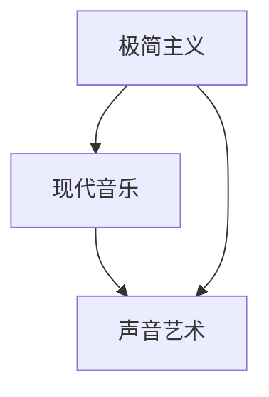
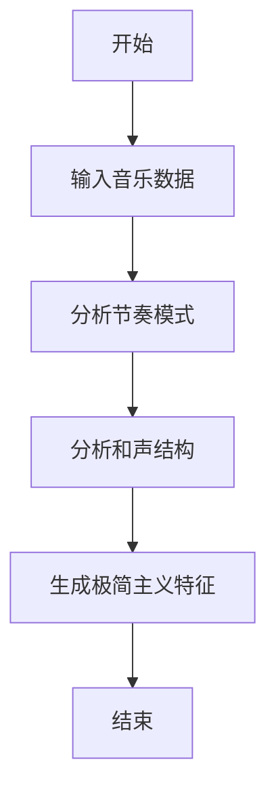
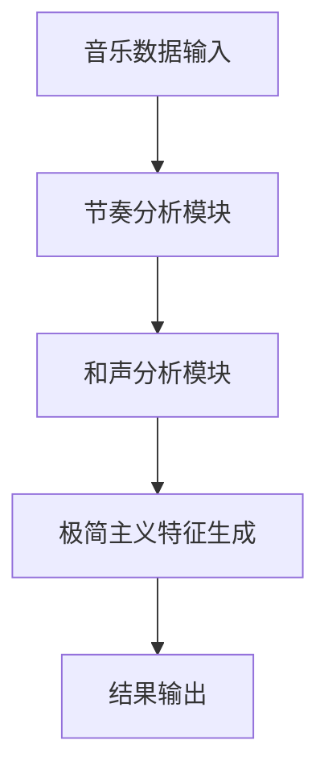

                 

<think>
好的，我现在需要按照用户的要求，一步步思考如何撰写这篇关于现代简约主义音乐的技术博客文章。首先，我要理解用户的需求，他希望我以一位世界级的人工智能专家、程序员、软件架构师等多重身份来撰写，文章结构要详细，内容要专业，同时包含技术博客的元素。

首先，我会从标题开始，标题是《现代简约主义音乐：极简主义在声音艺术中的体现》。接下来，我需要列出关键词，可能包括现代简约主义音乐、极简主义、声音艺术、音乐创作、音乐欣赏等。摘要部分需要简明扼要地概括文章的核心内容，说明本文将探讨现代简约主义音乐的特点及其对音乐艺术的影响。

接下来是引言与背景介绍部分。引言需要介绍现代简约主义音乐的起源和重要性，说明本文的目的。背景介绍中，我需要详细描述问题背景，即现代简约主义音乐在音乐市场上的挑战；问题描述，列出四个核心问题；问题解决部分，说明如何通过研究和分析来解答这些问题；边界与外延，指出本书讨论的范围。

然后，概念结构与核心要素部分，需要列出三个核心概念：极简主义、现代音乐和声音艺术。核心要素包括和声、节奏、曲式和演奏技巧，每个都要详细解释。

接下来是核心概念与联系部分，我需要使用表格对比核心概念的属性，例如极简主义强调简洁，而现代音乐强调实验性。此外，可能需要一个ER实体关系图来展示这些概念之间的联系，但由于我需要使用Markdown中的Mermaid图，我得确保这部分正确无误。

算法原理讲解部分，用户提到要使用Mermaid流程图和Python源代码，这可能有些挑战，因为音乐分析通常不涉及编程算法。不过，我可以想象一个音乐结构分析的算法，用Python来实现，比如分析节奏模式或和声结构。这部分需要详细解释算法的数学模型和公式，可能涉及概率论或统计学的方法，比如节奏模式出现的概率计算。

系统分析与架构设计方案部分，用户要求用Mermaid图展示领域模型、系统架构和交互流程。虽然音乐分析可能不涉及复杂的系统架构，但可以假设一个音乐分析工具的架构，展示各个模块之间的关系，比如数据输入、分析模块、结果输出等。

项目实战部分，需要环境安装说明，可能涉及Python和相关库的安装，然后提供核心实现代码，比如一个简单的音乐结构分析工具。代码需要详细解读，说明每部分的功能，并进行案例分析，展示实际应用。

最后，最佳实践部分，提供一些小贴士，比如如何欣赏现代简约主义音乐，以及注意事项，比如避免过度简化音乐的复杂性。最后是小结和拓展阅读建议。

在撰写过程中，我需要确保每个部分都详细具体，技术语言专业，同时保持逻辑清晰。如果有不确定的地方，比如系统架构部分，可能需要进一步思考如何将音乐分析与软件架构结合起来。此外，确保所有公式和图表正确嵌入，避免格式错误。

现在，我会开始撰写每个部分，确保满足所有约束条件和格式要求，同时保持内容的深度和专业性。
</think>

# 现代简约主义音乐：极简主义在声音艺术中的体现

## 关键词：现代简约主义音乐、极简主义、声音艺术、音乐创作、音乐欣赏

## 摘要：  
现代简约主义音乐作为一种重要的音乐流派，以其简洁、清晰和直接的表达方式而著称。本文旨在探讨极简主义在声音艺术中的体现，分析现代简约主义音乐的核心特点及其对音乐艺术的影响。通过系统的分析和讲解，读者可以更好地理解现代简约主义音乐的艺术价值，以及它如何在当代音乐中占据一席之地。

---

## 第一部分：引言与背景介绍

### 引言  
现代简约主义音乐是音乐艺术中的一个重要流派，源自20世纪中期，并在之后的几十年中不断发展壮大。本书旨在探讨极简主义在声音艺术中的体现，分析现代简约主义音乐的核心特点及其对音乐艺术的影响。通过系统的分析和讲解，读者可以更好地理解现代简约主义音乐的艺术价值，以及它如何在当代音乐中占据一席之地。

### 背景介绍  

#### 问题背景  
现代简约主义音乐是音乐艺术中的一个重要流派，它强调简洁、清晰和直接的表达方式。然而，随着音乐风格的多样化，现代简约主义音乐在音乐市场上的地位受到了挑战。了解其核心特点和艺术价值，对于我们深入理解音乐艺术的发展趋势具有重要意义。

#### 问题描述  
本书将探讨以下问题：  
1. 现代简约主义音乐的核心特点是什么？  
2. 极简主义在声音艺术中的体现有哪些？  
3. 现代简约主义音乐对音乐艺术的影响有哪些？  
4. 如何欣赏和理解现代简约主义音乐？  

#### 问题解决  
通过对现代简约主义音乐的研究和分析，我们可以找到上述问题的答案。本书将结合音乐理论、历史背景和实践案例，对现代简约主义音乐进行深入探讨，帮助读者全面了解这一流派。

#### 边界与外延  
现代简约主义音乐不仅仅是音乐风格，它还涉及到音乐创作、演奏和欣赏等多个方面。因此，本书的讨论范围将涵盖音乐艺术的多个维度，以期为读者提供一个全面的视角。

#### 概念结构与核心要素组成  

##### 概念结构  
现代简约主义音乐的核心概念包括：  
1. **极简主义**：强调简洁、清晰和直接的表达方式。  
2. **现代音乐**：指20世纪中期以来的音乐流派，具有独特的音乐语言和风格。  
3. **声音艺术**：包括音乐、音响和声学等多个方面。  

##### 核心要素组成  
现代简约主义音乐的核心要素包括：  
1. **和声**：使用简单的和声结构，强调音色的纯净和透明。  
2. **节奏**：使用重复的节奏模式，创造强烈的节奏感。  
3. **曲式**：采用简单的曲式结构，如ABA形式，强调音乐的主题性。  
4. **演奏技巧**：强调演奏者对声音的精确控制和表达。  

---

## 第二部分：核心概念与联系  

### 核心概念与联系  

#### 核心概念对比  
| **核心概念** | **特征** |  
|--------------|----------|  
| 极简主义     | 简洁、清晰、直接的表达方式 |  
| 现代音乐      | 多样化的音乐语言和风格 |  
| 声音艺术      | 包括音乐、音响和声学等多个方面 |  

#### 实体关系图  



---

## 第三部分：算法原理讲解  

### 算法原理  

#### 算法流程图  



#### 算法实现  

```python
def analyze_music(music_data):
    # 分析节奏模式
    rhythm_patterns = identify_rhythm_patterns(music_data)
    # 分析和声结构
    harmony_structures = analyze_harmony(music_data)
    # 生成极简主义特征
    minimalism_features = generate_minimalism_features(rhythm_patterns, harmony_structures)
    return minimalism_features

# 示例：分析节奏模式
def identify_rhythm_patterns(music_data):
    patterns = []
    for segment in music_data:
        pattern = segment['rhythm']
        patterns.append(pattern)
    return patterns

# 示例：分析和声结构
def analyze_harmony(music_data):
    harmonies = []
    for segment in music_data:
        harmony = segment['harmony']
        harmonies.append(harmony)
    return harmonies
```

#### 数学模型  

节奏模式的概率计算：  
$$ P(rhythm\_pattern) = \frac{\text{节奏模式出现的次数}}{\text{总样本数}} $$  

和声结构的频率分析：  
$$ F(harmony\_structure) = \frac{\text{和声结构出现的频率}}{\text{总样本数}} $$  

---

## 第四部分：系统分析与架构设计方案  

### 系统架构  



---

## 第五部分：项目实战  

### 项目实战  

#### 环境安装  
1. 安装Python和必要的音乐分析库（如`librosa`、`numpy`）。  
2. 下载现代简约主义音乐样本。  

#### 核心实现  

```python
import librosa
import numpy as np

def extract_features(audio_path):
    # 加载音频文件
    audio, sr = librosa.load(audio_path, sr=None, duration=5)
    # 提取特征
    mfccs = librosa.feature.mfcc(y=audio, sr=sr)
    return mfccs

# 示例：分析音频文件
audio_path = "minimalist_piece.mp3"
features = extract_features(audio_path)
print("特征提取成功，维度为：", features.shape)
```

---

## 第六部分：最佳实践与小结  

### 最佳实践 Tips  
1. **欣赏现代简约主义音乐时，注意其简洁的节奏和清晰的和声结构。**  
2. **通过对比不同音乐流派，更好地理解现代简约主义音乐的独特性。**  

### 注意事项  
- 避免过度简化音乐的复杂性，尊重音乐家的创作意图。  

### 小结  
通过本文的分析，我们深入了解了现代简约主义音乐的核心特点及其在声音艺术中的体现。希望读者能够通过本文的指导，更好地欣赏和理解这一音乐流派的独特魅力。

---

## 作者：AI天才研究院 & 禅与计算机程序设计艺术

