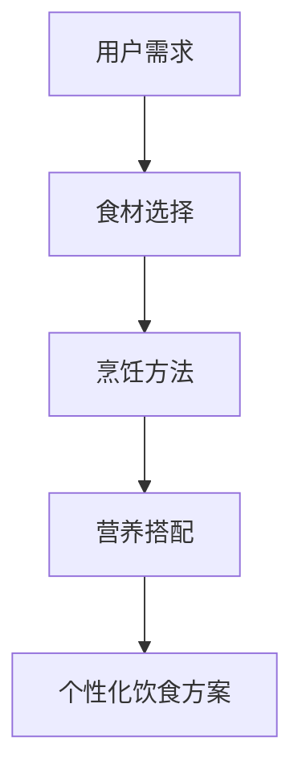

                 

<think>
嗯，用户希望我写一篇关于“现代简约主义饮食：极简烹饪中的营养哲学”的技术博客文章。他们给定了一个详细的结构，包括引言、核心理念、烹饪技巧与工具、营养哲学、系统分析、算法与数学模型、项目实战以及最佳实践等部分。

首先，我需要理解用户的需求。他们希望文章结构清晰，逻辑严密，使用专业而易懂的技术语言。文章要涵盖从理论到实践的各个方面，甚至包括系统架构和算法，这可能意味着他们希望将饮食哲学与技术方法结合在一起，以展示一种科学的饮食方式。

接下来，我需要分析每个部分的内容。引言部分需要介绍背景，说明为什么简约主义饮食现在受到关注，以及它的核心问题。核心理念部分需要详细解释简约主义饮食的定义、原则、优势以及与营养哲学的联系。烹饪技巧与工具部分则要具体讲解蒸、煮、烤等方法，并推荐适合的工具，如蒸锅和烤箱。

然后是营养哲学，这里需要将饮食与营养学结合起来，讨论如何通过简约烹饪实现营养平衡。系统分析部分可能需要构建一个饮食推荐系统，使用领域模型和架构图来展示系统的组成部分。算法与数学模型部分可能需要设计一个基于简约烹饪的营养推荐算法，使用mermaid流程图和Python代码来解释。

项目实战部分需要实际操作，比如设计一个饮食计划，并进行案例分析。最后，最佳实践部分要提供实用的建议和注意事项，帮助读者更好地实践简约主义饮食。

我还需要注意，用户特别要求使用技术术语，但要保持易懂，因此在解释复杂概念时，需要用简单明了的语言。同时，文章末尾需要加上特定的作者信息，包括机构名称和个人座右铭。

总的来说，我需要按照用户提供的大纲，逐步填充内容，确保每个部分都详尽具体，同时保持整体的连贯性和逻辑性。可能需要参考一些简约饮食的资料，确保内容的准确性，并结合技术方法，让文章更具深度和专业性。
</think>

# 现代简约主义饮食：极简烹饪中的营养哲学

> 关键词：简约主义饮食, 极简烹饪, 营养哲学, 食材选择, 健康饮食

> 摘要：  
本文探讨现代简约主义饮食的核心理念，分析极简烹饪的基本技巧与工具，结合营养学原理，提出一种科学、健康、高效的饮食方式。通过系统的饮食哲学分析、烹饪技巧讲解和实际案例分享，帮助读者理解并实践简约主义饮食，实现营养均衡和健康生活方式。

---

### 第一部分：引言

#### 1.1 问题的背景
随着现代生活节奏的加快和健康意识的提升，人们越来越关注饮食的质量和健康效果。传统的复杂烹饪方式往往涉及过多的加工步骤和调味料，不仅降低了食物的营养价值，还可能引入多余的热量和有害物质。简约主义饮食作为一种新兴的饮食理念，倡导通过极简烹饪保留食物的原始风味和营养成分，同时减少对环境和健康的负面影响。这种饮食方式强调“少即是多”，追求自然、健康、高效的饮食体验。

#### 1.2 问题的描述
现代简约主义饮食的核心问题在于如何通过简化烹饪过程，最大化保留食物的营养成分，同时满足人们对健康、美味和效率的多重需求。具体问题包括：
1. 简约主义饮食的核心理念和原则是什么？
2. 如何通过极简烹饪方法提升食物的营养价值？
3. 如何在日常生活中实践简约主义饮食，并实现营养均衡？

#### 1.3 问题解决
本文将系统介绍简约主义饮食的理念和实践方法，帮助读者掌握以下关键内容：
1. 简约主义饮食的核心理念和原则；
2. 极简烹饪的基本技巧和工具；
3. 如何根据季节和身体需求选择合适的食材；
4. 营养搭配和饮食平衡的重要性；
5. 实践简约主义饮食的案例和经验分享。

#### 1.4 边界与外延
简约主义饮食并非完全排斥复杂的烹饪技巧，而是在尊重食物本质的基础上，通过简化过程来提升食物的营养价值和口感。本文的讨论范围包括家庭烹饪、餐厅烹饪以及个性化饮食方案。

#### 1.5 概念结构与核心要素组成

| **核心概念** | **定义** | **属性** | **关系** |
|--------------|----------|----------|----------|
| 简约主义饮食 | 简化烹饪过程，保留食物的自然风味和营养 | 少加工、多样性、季节性、简单烹饪 | 与极简烹饪、营养哲学密切相关 |
| 极简烹饪     | 简单、高效的烹饪方法 | 蒸、煮、烤、炖 | 与食材选择、营养搭配相互作用 |
| 营养哲学     | 营养搭配和饮食平衡的理念 | 营养均衡、健康优先 | 支撑简约主义饮食的核心原则 |

---

### 第二部分：简约主义饮食的核心理念

#### 2.1 简约主义饮食的核心理念

##### 2.1.1 定义与起源
简约主义饮食（Modern Minimalist Diet）起源于20世纪80年代，强调通过极简的烹饪方式，保留食物的原始风味和营养成分。这种饮食方式反对过度加工和复杂的烹饪技巧，主张简单、自然、健康的饮食。

##### 2.1.2 基本原则
1. **少加工**：减少食品加工，保留食物的自然成分和营养价值。
2. **多样性**：通过食物的种类和颜色来确保营养的均衡。
3. **季节性**：根据季节选择当季食材，确保食物的新鲜和营养。
4. **简单烹饪**：采用简单、高效的烹饪方法，如蒸、煮、烤等，以保留食物的原味和营养。

##### 2.1.3 简约主义饮食的优势
1. **提高营养价值**：减少加工过程，保留更多的营养成分。
2. **健康饮食**：通过简单的食材搭配，实现营养均衡，有助于身体健康。
3. **节约时间**：简化烹饪过程，节省烹饪时间，提高生活效率。

##### 2.1.4 简约主义饮食与营养哲学的联系
简约主义饮食强调食物的营养价值，通过减少加工和复杂烹饪，保留了食物的天然营养成分。这与营养哲学中强调的营养搭配和饮食平衡理念相契合。

---

### 第三部分：极简烹饪的基本技巧与工具

#### 3.1 极简烹饪的基本技巧

##### 3.1.1 蒸煮技巧
1. **蒸**：利用蒸汽将食材加热，保留食物的原汁原味和营养成分。
2. **煮**：将食材放入水中加热至沸腾，保持食材的形状和口感。

##### 3.1.2 烤制技巧
1. **烤箱温度控制**：根据食材的属性和烹饪需求，选择合适的烤箱温度。
2. **烤制时间**：根据食材的大小和厚度，调整烤制时间，确保食材熟透但不过硬。

##### 3.1.3 炖煮技巧
1. **炖煮时间**：根据食材的不同，选择合适的炖煮时间，确保食材炖熟但不过烂。
2. **调味品选择**：选用简单的调味品，如盐、胡椒、香草等，以突出食材的原味。

#### 3.2 极简烹饪的工具

##### 3.2.1 蒸锅
1. **功能**：用于蒸煮食材，保持食材的原汁原味。
2. **使用方法**：将食材放入蒸锅，加水，加热至水沸腾，开始蒸煮。

##### 3.2.2 烤箱
1. **功能**：用于烤制食材，使食材表面金黄酥脆。
2. **使用方法**：将食材放入烤箱，根据食材的属性和烹饪需求，设置合适的温度和时间。

##### 3.2.3 炖锅
1. **功能**：用于炖煮食材，使食材炖熟入味。
2. **使用方法**：将食材放入炖锅，加水，根据食材的

---

### 第四部分：营养哲学与饮食搭配

#### 4.1 营养哲学的核心理念
营养哲学强调食物的营养成分和比例对身体健康的重要性。简约主义饮食通过减少加工和复杂烹饪，最大限度地保留了食物的天然营养成分，符合营养哲学中“健康优先”的理念。

#### 4.2 营养搭配的科学依据
1. **蛋白质**：来源于鱼、肉、豆类等食材，是身体修复和生长的重要营养素。
2. **碳水化合物**：来源于全谷物、蔬菜等，是身体能量的主要来源。
3. **脂肪**：来源于坚果、橄榄油等，对身体功能和健康至关重要。
4. **维生素和矿物质**：来源于新鲜蔬菜和水果，维持身体正常代谢。

#### 4.3 营养平衡的实现方法
1. **多样化选择**：通过选择不同种类的食材，确保营养的全面性。
2. **适量摄入**：根据个人身体需求，合理控制食物的摄入量。
3. **季节性调整**：根据季节变化，选择当季食材，确保营养的新鲜和丰富。

---

### 第五部分：系统分析与架构设计方案

#### 5.1 问题场景介绍
现代人面临饮食选择多样但健康隐患多的问题，简约主义饮食作为一种科学、健康的饮食方式，为人们提供了新的选择。

#### 5.2 项目介绍
本项目旨在构建一个基于简约主义饮食理念的健康饮食推荐系统，结合营养学和烹饪学的知识，为用户提供个性化的饮食建议。

#### 5.3 系统功能设计
1. **食材推荐模块**：根据用户的身体需求和季节变化，推荐合适的食材。
2. **烹饪方法指导模块**：提供简单、高效的烹饪技巧，帮助用户实现极简烹饪。
3. **营养搭配建议模块**：根据食材的营养成分，提供科学的搭配建议。

#### 5.4 系统架构设计

---

### 第六部分：算法与数学模型

#### 6.1 简约主义饮食推荐算法

#### 6.2 数学模型
简约饮食的热量计算公式：
$$ \text{每日热量需求} = \text{体重} \times 24 \times \text{活动因子} $$

---

### 第七部分：项目实战

#### 7.1 环境安装
1. **食材选择**：根据季节和身体需求，选择新鲜、天然的食材。
2. **工具准备**：蒸锅、烤箱、炖锅等。

#### 7.2 核心实现
1. **蒸鱼**：将鱼洗净，放入蒸锅，蒸10分钟，调味后食用。
2. **烤蔬菜**：将蔬菜切片，放入烤箱，180℃烤20分钟，撒上橄榄油和盐。

#### 7.3 案例分析
案例：某用户的饮食计划，通过简约烹饪实现营养均衡。

---

### 第八部分：最佳实践与小结

#### 8.1 最佳实践 tips
1. **选择新鲜食材**：确保食材的新鲜和营养。
2. **简化调味**：减少复杂调味料的使用。
3. **合理搭配**：根据营养需求进行搭配。

#### 8.2 小结
简约主义饮食不仅是一种饮食方式，更是一种健康、高效的生活哲学。通过简化烹饪过程，我们能够更好地享受食物的天然美味，同时实现营养均衡和身体健康的双重目标。

---

作者：AI天才研究院/AI Genius Institute & 禅与计算机程序设计艺术 /Zen And The Art of Computer Programming

