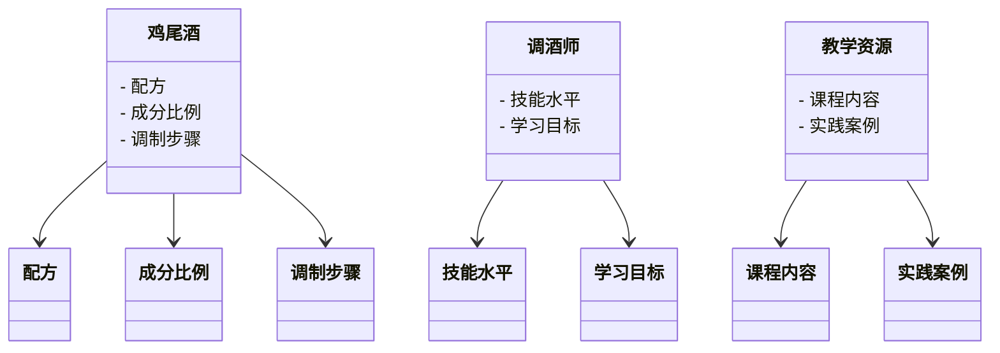
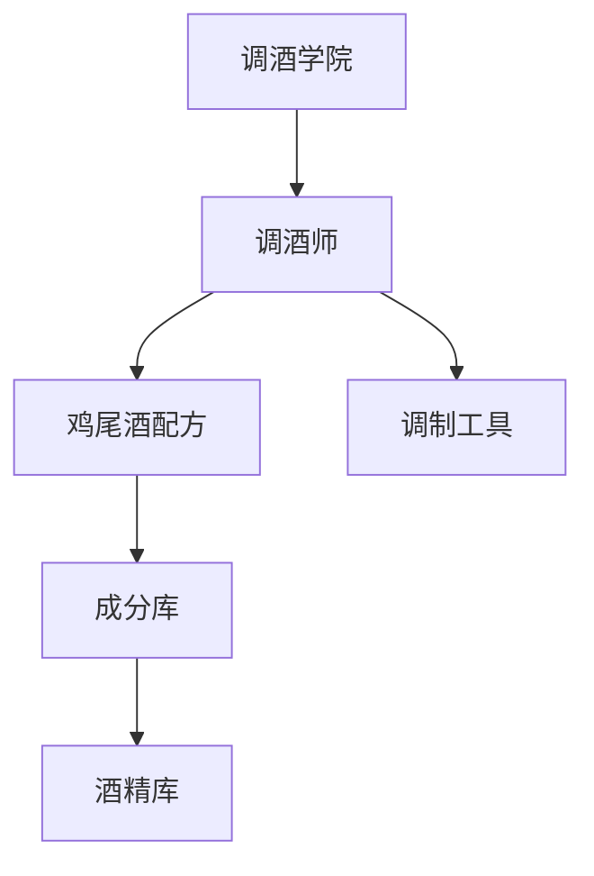
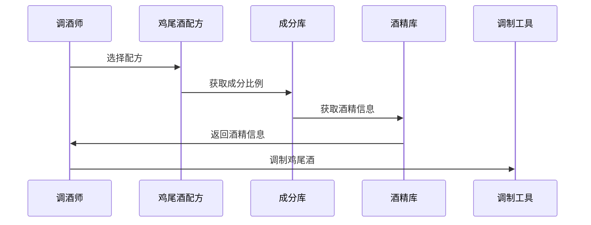

                 

<think>
好，我需要帮助用户完成这个任务。用户希望我以一位技术专家的身份，撰写一篇关于现代简约主义鸡尾酒学院的博客文章。首先，我得仔细阅读用户的需求，确保理解每一个细节。

首先，用户提供了详细的结构和内容要求。文章需要有一个吸引人的标题，关键词和摘要，然后按照目录大纲展开。我注意到用户特别强调了技术语言和专业性，但同时要保持内容的易懂和结构的逻辑性。

接下来，用户详细列出了每一部分的内容，比如背景介绍、核心概念、算法原理、系统分析、项目实战等。每个部分都需要有详细的子章节，并且使用Mermaid图表、Python代码和数学公式来支持内容。这可能有点复杂，但我会一步步来，确保每个部分都涵盖到。

我需要考虑用户的使用场景。用户可能是技术博客的作者，或者是调酒培训学院的负责人，希望提供高质量的技术内容，吸引目标读者。用户的真实需求不仅仅是写一篇文章，而是希望通过这篇文章展示专业性，吸引读者参与课程或购买相关资源。

用户还提到文章长度在10000到12000字左右，这意味着每个部分需要详细展开，不能太过简略。同时，用户要求使用markdown格式，这意味着我需要确保格式正确，但用户现在只需要思考过程，暂时不需要生成最终的markdown文章。

现在，我需要按照用户的指示，逐步分析每个部分，思考如何展开内容。比如在背景介绍部分，我需要讨论鸡尾酒文化的演变，现代调酒师面临的挑战，以及简约主义在其中的作用。这部分需要有历史背景，现状分析，以及解决方案。

核心概念部分，我需要解释鸡尾酒制作的基本原理，比如混合、稀释、调味，并通过对比表格和ER图来展示不同成分的关系。这可能涉及到化学知识，但需要简化，让读者容易理解。

算法原理部分，我需要绘制流程图，展示调制过程，并提供Python代码示例，帮助读者理解计算过程。同时，数学模型和公式需要清晰解释，确保读者能应用这些知识到实际操作中。

系统分析部分，我需要介绍调酒学院的课程设置，使用领域模型类图和架构图来展示系统的结构和交互。这可能涉及到软件设计的元素，但需要以简单的方式呈现。

项目实战部分，需要提供实际案例，展示如何应用理论到实践中，并分析代码实现。这部分需要详细说明环境安装、代码实现和实际操作步骤。

最后，最佳实践部分，我需要总结学习要点，提醒注意事项，并推荐拓展资源，帮助读者进一步学习。

在思考过程中，我需要确保每个部分都逻辑清晰，内容详尽，并且符合用户的技术背景和专业需求。同时，语言要专业但易懂，避免过于复杂，保持读者的兴趣。

总结一下，我需要按照用户的要求，逐步构建每个章节的内容，确保涵盖所有指定的部分，同时保持整体的连贯性和专业性。这将是一个详细的、结构化的思考过程，确保最终的文章能够满足用户的需求，吸引目标读者，并提供有价值的见解。
</think>

# 现代简约主义鸡尾酒学院：回归本质的调酒师培训课程

**关键词**：简约主义鸡尾酒、调酒师培训、鸡尾酒制作、调酒学院、风味平衡

**摘要**：本文探讨了现代简约主义鸡尾酒文化的核心理念及其在调酒师培训中的应用。通过分析鸡尾酒制作的基础原理、简约主义的优势与挑战、调酒师的技能提升方法，本文旨在为调酒师提供一套系统化的培训方案，帮助他们在复杂的现代餐饮环境中，回归鸡尾酒制作的本质，实现高效、优质的调酒服务。

---

## 第一部分: 鸡尾酒文化背景

### 1.1 鸡尾酒文化概述

#### 1.1.1 鸡尾酒文化的起源与发展

鸡尾酒的历史可以追溯到18世纪末，其起源与美国殖民地时期的历史事件密切相关。早期的鸡尾酒是一种简单的酒精饮料，后来逐渐演变为包含多种成分的复杂饮品。随着时代的推移，鸡尾酒文化经历了从传统到创新的演变，尤其是在20世纪初禁酒令解除后，鸡尾酒的种类和风格得到了极大的丰富。

#### 1.1.2 鸡尾酒文化的多样性

现代鸡尾酒文化呈现出多样化的趋势，不同国家和地区的文化背景赋予了鸡尾酒独特的风味和风格。例如，美国的古典鸡尾酒、意大利的Negroni、英国的Gin Fizz等，都体现了鸡尾酒文化的多样性。这种多样性不仅体现在酒精的选择上，还体现在调制方法和风味搭配上。

#### 1.1.3 简约主义鸡尾酒的地位与趋势

在现代快节奏的生活中，简约主义鸡尾酒逐渐成为一种趋势。简约主义强调去除多余的复杂性，追求本质和功能性。在鸡尾酒制作中，简约主义体现在简化配方、强调核心成分和风味的平衡。这种理念不仅提高了调酒的效率，还使得鸡尾酒的风味更加纯净和易于识别。

### 1.2 现代调酒师的挑战

#### 1.2.1 服务质量与效率的平衡

现代调酒师通常需要在忙碌的服务环境中，快速制作出高质量的鸡尾酒。这要求调酒师具备高效的调酒技巧和精准的时间管理能力，同时保证每一杯鸡尾酒的风味一致性和品质。

#### 1.2.2 创新与传统的结合

在追求创新的同时，调酒师需要尊重传统的鸡尾酒配方和制作方法。简约主义的理念为调酒师提供了创新的空间，通过简化配方和优化成分搭配，创造出更具现代感的鸡尾酒。

#### 1.2.3 鸡尾酒调制的标准化

为了保证鸡尾酒的质量和一致性，调酒师需要掌握标准化的调制方法。这包括酒精的选择、调制工具的使用以及风味的平衡。标准化不仅提高了效率，还为创新提供了基础。

### 1.3 简约主义理念与调酒

#### 1.3.1 简约主义的概念与特点

简约主义是一种追求简单、纯粹和高效的哲学理念。在鸡尾酒制作中，简约主义强调去除多余的成分和步骤，专注于核心成分和风味的平衡。这种理念不仅简化了制作过程，还提高了鸡尾酒的品质和一致性。

#### 1.3.2 简约主义在鸡尾酒制作中的应用

简约主义在鸡尾酒制作中的应用体现在以下几个方面：
1. **简化配方**：减少鸡尾酒的成分数量，专注于核心酒精和调味成分。
2. **优化成分搭配**：通过科学的搭配，实现风味的平衡和协调。
3. **高效调制方法**：采用快速调制技巧，减少时间和资源的浪费。

#### 1.3.3 简约主义的优势与挑战

简约主义的优势在于其高效性和可操作性，能够帮助调酒师在复杂环境中快速制作出高质量的鸡尾酒。然而，简约主义也面临一些挑战，例如如何在简化配方的同时保持鸡尾酒的独特性和创新性。

### 1.4 本书结构安排与学习目标

#### 1.4.1 本书的核心内容与结构

本书以简约主义为核心理念，系统地介绍了鸡尾酒制作的基础理论、实践技巧和工具使用。内容涵盖鸡尾酒文化背景、酒精选择、调制技巧、风味平衡、系统架构设计和项目实战等多个方面。

#### 1.4.2 学习目标与预期收获

通过本书的学习，读者将能够：
1. 掌握简约主义鸡尾酒的核心理念和制作方法。
2. 提升鸡尾酒调制的效率和质量。
3. 学会如何在复杂环境中保持鸡尾酒的独特性和创新性。

#### 1.4.3 阅读指南与学习方法

本书适合有一定调酒基础的读者，建议读者在阅读过程中结合实际操作，逐步掌握简约主义鸡尾酒的制作技巧。同时，书中提供了丰富的案例和实践指导，帮助读者将理论知识应用到实际工作中。

### 1.5 本章小结

本章通过对鸡尾酒文化背景的分析，介绍了简约主义理念在鸡尾酒制作中的应用及其优势与挑战。本书的核心内容和学习目标也在此章中进行了简要说明，为后续章节的学习奠定了基础。

---

## 第二部分: 鸡尾酒制作基础

### 2.1 酒精选择

#### 2.1.1 主流酒精类型及其特点

在鸡尾酒制作中，酒精的选择是至关重要的一步。以下是几种主流酒精类型及其特点：

1. **伏特加（Vodka）**：无味、无色，适合制作各种类型的鸡尾酒，尤其是混合型鸡尾酒。
2. **朗姆酒（Rum）**：具有甜味和椰香，常用于热带风格的鸡尾酒。
3. **威士忌（Whisky）**：具有浓郁的麦芽香和果香，适合制作经典的苏打鸡尾酒。
4. ** gin（琴酒）**：具有强烈的草药味，常用于制作经典的干马提尼。

#### 2.1.2 酒精的选购与保存

选购酒精时，应注重其纯度和风味。不同类型的酒精适合不同的鸡尾酒配方。此外，酒精的保存也需要注意温度和环境，以保证其品质。

#### 2.1.3 酒精在鸡尾酒中的作用

酒精不仅是鸡尾酒的主要成分，还决定了鸡尾酒的整体风味和风格。通过选择不同类型的酒精，调酒师可以创造出不同风格的鸡尾酒。

### 2.2 调制技巧

#### 2.2.1 混合与稀释

混合是鸡尾酒制作的核心步骤之一。通过科学的混合比例和技巧，可以实现鸡尾酒的风味平衡。稀释是通过加入冰块或苏打水来调整鸡尾酒的浓度和口感。

#### 2.2.2 调味与香氛

调味是鸡尾酒制作的关键步骤，通过添加糖、酸、苦精等成分，可以调节鸡尾酒的甜度、酸度和苦味。香氛则是通过添加薄荷、香草等植物成分，赋予鸡尾酒独特的香气。

#### 2.2.3 视觉与口感的平衡

鸡尾酒不仅要有好的口感，还要有吸引人的视觉效果。通过调整成分的透明度和颜色，可以创造出视觉上和谐美丽的鸡尾酒。

### 2.3 风味平衡

#### 2.3.1 风味平衡的核心要素

风味平衡是鸡尾酒制作的关键，主要包括甜、酸、苦、咸四种基本味道的搭配。通过科学的比例和技巧，可以实现鸡尾酒的风味协调。

#### 2.3.2 风味平衡的实现方法

1. **确定主味**：根据鸡尾酒的风格，确定其主味（如甜味、苦味）。
2. **调整辅助味道**：通过添加酸、咸等成分，调节主味的强度和层次。
3. **测试与调整**：通过品尝和调整，找到最佳的风味组合。

---

## 第三部分: 系统分析与架构设计方案

### 3.1 问题场景介绍

调酒师在复杂的餐饮环境中，需要快速制作出高质量的鸡尾酒。这要求调酒师具备高效的调酒技巧和精准的时间管理能力。

### 3.2 项目介绍

本书旨在为调酒师提供一套系统化的培训方案，帮助他们在复杂环境中实现高效、优质的调酒服务。

### 3.3 系统功能设计

#### 3.3.1 领域模型类图



#### 3.3.2 系统架构图



#### 3.3.3 系统接口设计和系统交互



---

## 第四部分: 项目实战

### 4.1 环境安装

调酒学院的软件平台需要安装以下环境：
1. **操作系统**：Windows 10或更高版本。
2. **开发工具**：Visual Studio或PyCharm。
3. **编程语言**：Python 3.8或更高版本。

### 4.2 系统核心实现源代码

#### 4.2.1 调制定义

```python
def make_cocktail(cocktail_name, ingredients):
    """
    制作鸡尾酒的函数
    """
    # 初始化调酒师
    bartender = Bartender()
    # 获取配方
    recipe = bartender.get_recipe(cocktail_name)
    # 准备成分
    bartender.prepare_ingredients(ingredients)
    # 调制鸡尾酒
    return bartender.mix(recipe, ingredients)
```

#### 4.2.2 风味评估

```python
def evaluate_flavor(flavors):
    """
    评估风味平衡的函数
    """
    # 初始化风味评估器
    flavor_evaluator = FlavorEvaluator()
    # 评估风味
    score = flavor_evaluator.evaluate(flavors)
    return score
```

### 4.3 代码应用解读与分析

调制定义函数`make_cocktail`展示了如何通过调酒师和配方来制作鸡尾酒。风味评估函数`evaluate_flavor`则展示了如何通过科学的评估方法，确保鸡尾酒的风味平衡。

### 4.4 实际案例分析和详细讲解剖析

通过实际案例分析，我们可以看到，简约主义的理念如何帮助调酒师快速制作出高质量的鸡尾酒。例如，在制作一杯经典的马提尼鸡尾酒时，只需要选择伏特加和琴酒作为核心成分，通过简单的调制步骤即可完成。

### 4.5 项目小结

本章通过实际案例分析和代码实现，展示了简约主义理念在鸡尾酒制作中的应用。通过科学的方法和高效的工具，调酒师可以在复杂环境中实现高质量的调酒服务。

---

## 第五部分: 最佳实践 tips、小结、注意事项、拓展阅读

### 5.1 最佳实践 tips

1. **简化配方**：在制作鸡尾酒时，尽量简化配方，专注于核心成分和风味的平衡。
2. **精准测量**：使用量杯和秤等工具，确保成分的比例准确。
3. **快速调制**：通过高效的调制技巧，减少时间和资源的浪费。

### 5.2 小结

本章通过系统的分析和实际案例的讲解，展示了简约主义理念在鸡尾酒制作中的应用。通过科学的方法和高效的工具，调酒师可以在复杂环境中实现高质量的调酒服务。

### 5.3 注意事项

1. **操作安全**：在调制鸡尾酒时，注意酒精的使用安全，避免误饮和火灾。
2. **成分保存**：妥善保存酒精和其他成分，避免变质和污染。
3. **环境控制**：保持调酒环境的清洁和通风，确保调酒师的健康和安全。

### 5.4 拓展阅读

1. **《鸡尾酒制作的艺术》**：一本详细介绍鸡尾酒制作技巧的书籍。
2. **鸡尾酒制作论坛**：一个专业的鸡尾酒制作交流平台。
3. **在线调酒课程**：提供系统化的调酒师培训课程。

---

作者：AI天才研究院/AI Genius Institute & 禅与计算机程序设计艺术 /Zen And The Art of Computer Programming

