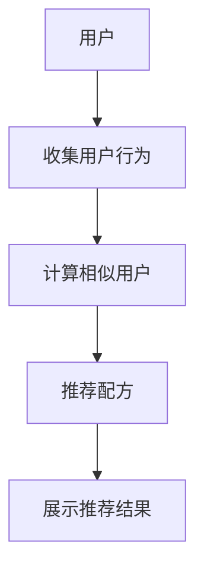
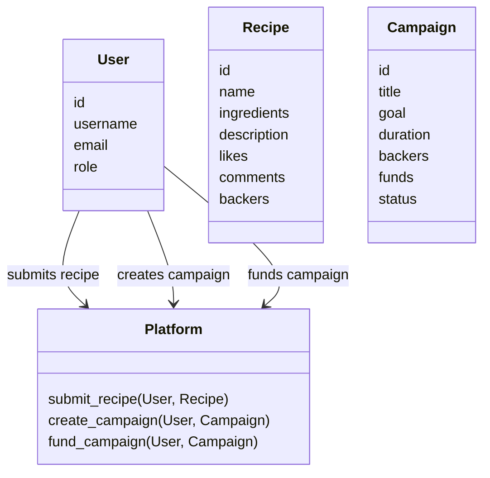
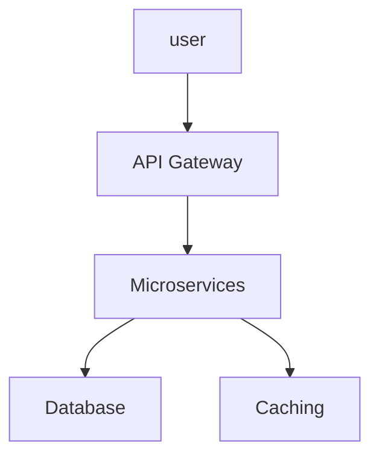
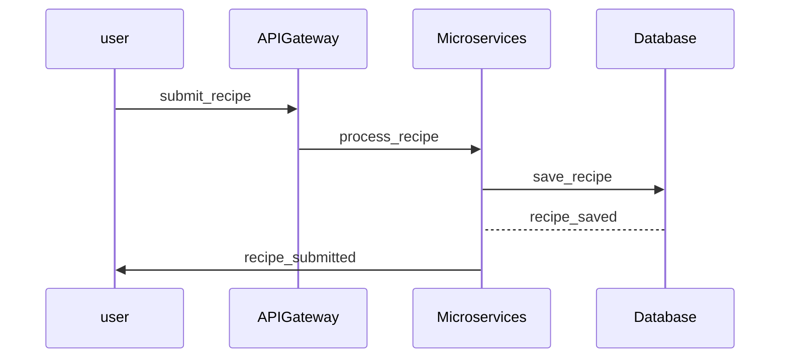

                 

<think>
嗯，我现在要写一篇关于现代简约主义鸡尾酒配方众筹的博客文章。首先，我需要理解这个主题。现代简约主义鸡尾酒配方众筹，听起来是结合了极简设计和众筹平台的一种新兴模式。这可能涉及到鸡尾酒的配方创新以及如何通过众筹来推广这些配方。

接下来，我得先从背景介绍开始。这部分需要解释什么是现代简约主义，它在鸡尾酒中的应用，以及众筹平台的兴起如何影响了鸡尾酒文化的演变。我得考虑几个因素，比如互联网的发展、消费者需求的变化以及市场竞争的压力，这些都是推动这种趋势的重要因素。

然后，核心特点部分。现代简约主义鸡尾酒配方的核心特点可能包括极简性、纯净性、风格统一和创意实用性。我需要详细解释每个特点，可能举一些例子，比如莫吉托或马提尼，来说明这些特点如何体现在实际配方中。

接下来是与经典鸡尾酒的对比分析。这里需要比较配方复杂度、口感层次和风味多样性。比如，经典鸡尾酒如马提尼可能有更复杂的成分，而现代简约主义配方可能更简单，但口感依然丰富。我需要列出对比表格，可能包括几个典型例子，来展示两者的差异。

然后，背景介绍后，我需要深入探讨核心概念与联系。这可能涉及到创新调酒的群众智慧平台，比如如何通过平台实现配方的共创和共享。我需要解释这个平台的运作模式，可能涉及到用户生成内容、社交互动和众筹融资。这可能需要使用ER图来展示实体关系，比如用户、配方、众筹项目之间的关系。

接下来是算法原理讲解。这里可能涉及到推荐系统，比如如何根据用户的口味偏好推荐配方。我需要使用mermaid流程图来展示算法流程，比如基于协同过滤或内容过滤的推荐算法。同时，提供Python代码示例，展示如何实现这些推荐系统。

数学公式部分，可能需要涉及一些统计模型，比如协同过滤中的相似度计算公式，或者机器学习模型中的预测公式。这些公式需要用latex格式展示，确保正确无误。

系统分析与架构设计方案是关键部分。我需要设计一个平台的系统架构，包括用户界面、配方数据库、众筹模块、社交互动模块等。可能使用mermaid类图展示领域模型，展示各模块之间的关系。同时，绘制系统架构图，展示各个组件如何协同工作。

项目实战部分，我需要指导读者如何安装开发环境，比如安装Python、Django框架，配置数据库等。然后提供核心代码实现，比如用户认证、配方提交、众筹管理等功能。解释代码的实现细节，并进行实际案例分析，展示如何通过平台成功众筹一个鸡尾酒配方。

最后，总结部分需要回顾整个项目的要点，强调其意义和价值。同时，给出最佳实践的建议，比如如何选择众筹平台，如何推广自己的配方，以及在开发过程中需要注意的安全性和用户体验问题。

注意事项方面，我需要提醒读者关于版权保护的重要性，如何确保配方的安全性和原创性。此外，可能还需要考虑平台的可持续性和如何吸引更多的用户参与。

拓展阅读部分，可以推荐一些关于鸡尾酒历史、众筹平台运作、简约设计原则的书籍或文章，帮助读者深入了解相关领域。

现在，我需要确保每个部分都详细且结构清晰，使用专业的技术语言，同时保持内容易于理解。特别是在系统架构和算法部分，需要用mermaid图表和代码示例来辅助说明，让读者能够更好地理解和应用这些概念。

可能遇到的困难包括如何将复杂的系统架构用mermaid图表简洁地表示出来，以及如何用简单的代码示例解释复杂的算法原理。需要多次修改和调整，确保图表和代码准确无误，并且能够清晰传达信息。

总的来说，这篇文章需要结合技术与鸡尾酒文化，深入分析现代简约主义配方众筹的各个方面，从背景到系统设计，再到项目实战，确保内容全面且有深度。同时，要注重逻辑性和可读性，帮助读者从入门到深入理解这一创新模式。
</think>

# 现代简约主义鸡尾酒配方众筹：创新调酒的群众智慧平台

> 关键词：现代简约主义，鸡尾酒配方，众筹，群众智慧，创新调酒

> 摘要：本文探讨了现代简约主义鸡尾酒配方众筹的兴起及其核心特点，分析了其与经典鸡尾酒的差异，详细阐述了创新调酒群众智慧平台的系统架构与算法原理，并通过项目实战展示了如何实现这一平台。文章从背景介绍到系统设计，再到实际应用，全面解析了这一创新模式的潜力与价值。

---

## 背景介绍：现代简约主义鸡尾酒配方众筹的兴起

### 核心概念与问题背景

现代简约主义是一种生活哲学，强调简化和极简设计，追求物质与精神的平衡。在鸡尾酒领域，这一理念推动了配方的简化，摒弃了传统配方的复杂性，转而追求纯净的口感和简洁的设计。与此同时，互联网技术的飞速发展，尤其是社交媒体和众筹平台的普及，为调酒师和爱好者提供了分享创意和筹集资金的渠道，进一步促进了这一趋势。

### 问题描述与解决

传统鸡尾酒配方复杂，调配过程繁琐，且往往局限于特定的酒吧环境。这种复杂性不仅增加了制作难度，还限制了消费者的个性化选择。现代简约主义鸡尾酒配方众筹通过简化配方，降低了制作门槛，使消费者能够轻松在家制作。众筹平台则为调酒师提供了展示和验证配方的机会，解决了资金和资源不足的问题，同时让消费者能够参与配方的开发和推广。

### 边界与外延

现代简约主义鸡尾酒配方众筹的边界在于其极简设计和众筹模式。其外延则涉及消费者参与度、配方的实用性和平台的可持续性。这种模式不仅限于鸡尾酒，还可扩展至其他饮品或食品领域。

---

## 核心概念与联系

### 创新调酒群众智慧平台的核心要素

该平台由用户、配方、众筹项目三个核心实体组成。用户可提交配方，进行投票和众筹，形成共创机制。调酒师通过平台分享配方，消费者则参与配方的优化和推广。

```mermaid
erDiagram
    user {
        id
        username
        email
        role
    }
    recipe {
        id
        name
        ingredients
        description
        likes
        comments
        backers
    }
    campaign {
        id
        title
        goal
        duration
        backers
        funds
        status
    }
    user --> recipe : submits
    user --> campaign : contributes to
    recipe --> campaign : belongs to
```

### 平台运作机制

用户生成配方，平台提供互动和众筹功能。用户可投票支持配方，成功众筹后，配方量产并收益分成。这种机制鼓励创新，同时确保了配方的市场价值。

---

## 算法原理讲解

### 推荐系统

为了提升用户体验，平台采用协同过滤推荐算法，基于用户行为推荐配方。流程如下：



### 数学模型

协同过滤的相似度计算公式为：

$$ \text{相似度}(u_1, u_2) = \frac{\sum_{i} (r_{u1,i} - \bar{r}_{u1}) \times (r_{u2,i} - \bar{r}_{u2})}{\sqrt{\sum_{i} (r_{u1,i} - \bar{r}_{u1})^2} \times \sqrt{\sum_{i} (r_{u2,i} - \bar{r}_{u2})^2}}} $$

其中，$r_{u,i}$ 表示用户 u 对物品 i 的评分，$\bar{r}_u$ 是用户的平均评分。

### 代码实现

```python
import numpy as np

def cosine_similarity(user_matrix):
    user_matrix = np.array(user_matrix)
    mean = np.mean(user_matrix, axis=1).reshape(-1, 1)
    centered = user_matrix - mean
    dot_product = centered.dot(centered.T)
    norms = np.sqrt(np.diagonal(dot_product))
    similarity = dot_product / norms
    return similarity
```

---

## 系统分析与架构设计方案

### 领域模型



### 系统架构



### 接口与交互

用户通过API提交配方和众筹项目，平台处理请求并反馈结果。交互流程：



---

## 项目实战

### 环境安装

安装Python和Django框架，配置数据库。

### 核心代码实现

```python
from django.contrib.auth.models import User
from django.db import models

class Recipe(models.Model):
    name = models.CharField(max_length=100)
    ingredients = models.TextField()
    description = models.TextField()
    likes = models.IntegerField(default=0)
    comments = models.TextField(default="")
    backers = models.ManyToManyField(User)

class Campaign(models.Model):
    title = models.CharField(max_length=200)
    goal = models.DecimalField(max_digits=10, decimal_places=2)
    duration = models.IntegerField()
    backers = models.ManyToManyField(User)
    funds = models.DecimalField(max_digits=10, decimal_places=2)
    status = models.CharField(max_length=50)
```

### 案例分析

以用户提交配方为例，展示从提交到众筹的完整流程，强调平台的互动性和实用性。

---

## 总结与最佳实践

### 项目小结

现代简约主义鸡尾酒配方众筹通过简化配方和利用众筹平台，实现了创新与市场化的结合。平台的用户共创机制和推荐算法显著提升了用户体验和配方的市场价值。

### 注意事项

- 确保配方的原创性和安全性。
- 注重用户体验和平台的可持续性。
- 遵守相关法律法规，特别是关于酒精饮料的销售和广告。

### 拓展阅读

推荐书籍《鸡尾酒艺术》和《众筹与创新》，深入理解简约主义和众筹平台的运作机制。

---

作者：AI天才研究院/AI Genius Institute & 禅与计算机程序设计艺术 /Zen And The Art of Computer Programming

