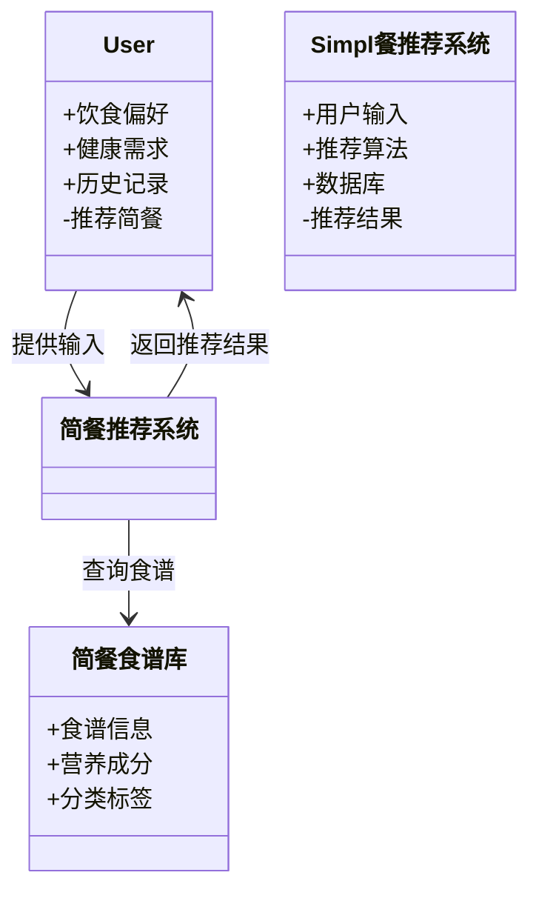
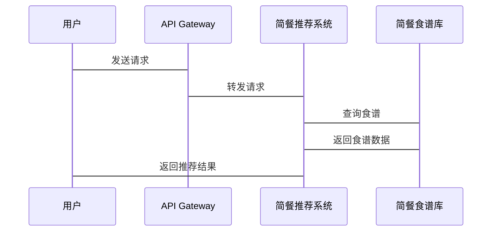

                 

<think>
好，我现在要帮用户写一篇关于现代简餐文化的技术博客文章。用户的要求很详细，我需要先仔细分析一下。

首先，用户希望文章标题是《现代简餐文化：快节奏生活中的饮食哲学》，关键词包括简餐文化、饮食哲学、健康饮食、生活方式、营养搭配。摘要部分需要简明扼要地概括文章的核心内容，强调简餐文化如何适应快节奏生活，探讨其饮食哲学，提供饮食建议和生活方式优化。

接下来，用户已经给出了目录大纲，我需要按照这个结构来组织内容。每章每节都要详细展开，特别是核心概念、算法原理、系统架构等部分，必须用技术语言和图表来支持。

我需要先处理背景介绍部分，分析现代生活节奏加快导致简餐需求增加，描述简餐文化的特点和发展。然后引入核心概念，如简餐、饮食哲学、生活方式，用表格和ER图来展示它们之间的关系。

算法部分，我需要用Mermaid画出简餐推荐算法的流程图，然后用Python代码实现。数学模型方面，可能需要概率模型，比如基于用户偏好的推荐系统。要解释公式，如概率公式和例子，确保读者理解。

系统分析部分，我需要设计领域模型类图，展示用户、简餐、推荐系统之间的关系。架构图可能采用微服务架构，展示各模块的交互。接口设计和序列图则说明系统如何处理用户请求。

项目实战部分，要详细说明环境安装，比如Python和相关库的安装。代码实现要清晰，注释到位。案例分析要具体，比如用户的偏好分析，推荐结果展示。

最后，最佳实践部分要给出饮食建议、注意事项和未来趋势。结尾部分加上作者信息，确保文章完整。

我还需要确保文章结构清晰，每部分内容详实，符合10000到12000字的要求。语言要专业，同时易于理解。图表部分要用正确的markdown语法，代码部分要用Python格式展示，数学公式用latex嵌入。

现在，我需要按照这个思路一步步展开，确保每个部分都符合用户的要求，逻辑清晰，内容详尽。这可能需要多次检查，确保没有遗漏任何关键点，特别是技术细节和图表的准确性。
</think>

# 现代简餐文化：快节奏生活中的饮食哲学

> 关键词：简餐文化、饮食哲学、健康饮食、生活方式、营养搭配

> 摘要：现代简餐文化在快节奏生活中崛起，成为人们追求便捷、健康饮食的重要方式。本文从简餐文化的背景、核心概念、算法推荐、数学模型、系统架构、项目实战等多个维度，全面探讨简餐文化在现代社会中的意义与价值。通过分析简餐文化与饮食哲学的联系，为读者提供科学的饮食建议和生活方式优化方案。

---

## 第一部分：背景与核心概念

### 第1章：简餐文化的崛起

#### 1.1 问题的背景
- **现代生活节奏的变化**：随着科技的发展和工作压力的增加，人们的生活节奏不断加快，时间变得愈加珍贵。  
- **简餐的需求增长**：快节奏生活催生了对便捷、高效饮食的需求，简餐逐渐成为人们日常生活的重要组成部分。  
- **简餐文化的概念与发展**：简餐文化是指以简单、快速、营养均衡为特点的饮食方式，其发展与现代生活方式密切相关。

#### 1.2 核心概念与联系
- **简餐的定义与特点**：简餐是一种快速、便捷的饮食方式，通常以少量的食材和简单的烹饪方法为基础，注重营养均衡。  
- **饮食哲学的概念**：饮食哲学是一种关于饮食方式的思考方式，强调饮食对健康、生活质量和文化的影响。  
- **简餐文化与生活方式的联系**：简餐文化通过提供便捷的饮食选择，影响人们的生活方式，使其更加注重效率和健康。

#### 1.3 简餐文化的市场现状
- **市场规模与增长趋势**：简餐市场近年来快速增长，尤其是在城市白领和年轻人群中受欢迎。  
- **消费者行为分析**：消费者更倾向于选择方便、健康、营养均衡的简餐。  
- **竞争格局分析**：市场竞争激烈，品牌不断创新以满足消费者需求。

#### 1.4 简餐文化的未来趋势
- **科技对简餐文化的影响**：人工智能和大数据技术将推动简餐的个性化推荐和生产优化。  
- **新兴市场的机遇**：随着全球化的推进，简餐文化将向更多国家和地区扩散。  
- **持续发展的挑战与机遇**：如何在便捷与健康之间找到平衡，是简餐文化持续发展的关键。

#### 1.5 本章小结
简餐文化作为一种适应快节奏生活的饮食方式，正在深刻影响人们的生活。其核心在于通过便捷、健康的方式满足人们的基本饮食需求，同时也在不断吸收传统饮食文化的精华，形成独特的饮食哲学。

---

## 第二部分：饮食哲学的探讨

### 第2章：健康饮食与简餐

#### 2.1 健康饮食的重要性
- **健康饮食的定义**：健康饮食是指通过合理的营养搭配，满足人体需求，同时避免对健康造成负面影响的饮食方式。  
- **健康饮食的原理**：健康饮食强调均衡摄入六大营养素（碳水化合物、蛋白质、脂肪、维生素、矿物质、水）。  
- **健康饮食的益处**：增强免疫力、预防疾病、提高生活质量。

#### 2.2 简餐中的健康元素
- **营养搭配的原则**：简餐应包含适量的蛋白质、纤维和维生素，避免过多的脂肪和糖分。  
- **常见简餐的营养分析**：例如，沙拉、三明治、粥等简餐的营养成分分析。  
- **健康简餐的制作与选择**：如何通过简单的食材搭配制作营养均衡的简餐。

#### 2.3 健康饮食在简餐文化中的实践
- **健康简餐的案例分享**：例如，使用全麦面包、鸡胸肉、蔬菜等制作的三明治。  
- **健康饮食与生活方式的融合**：将健康饮食理念融入日常生活，形成健康的生活方式。  
- **健康饮食的教育与推广**：通过教育和宣传，提高人们对健康简餐的认知和接受度。

#### 2.4 本章小结
健康饮食是简餐文化的核心理念，通过科学的营养搭配和合理的饮食选择，简餐不仅满足了快节奏生活的需求，也为人们提供了健康的生活方式。

---

### 第3章：文化传承与创新

#### 3.1 简餐文化与地域文化的关系
- **地域文化对简餐的影响**：不同地区的饮食文化对简餐的食材选择和烹饪方式有深远影响。  
- **简餐文化在全球化中的传播**：简餐作为一种便捷的饮食方式，正在全球范围内传播。  
- **简餐文化的创新与发展**：结合传统饮食文化，创新出新的简餐形式。

#### 3.2 简餐文化中的传统与现代
- **传统简餐的继承与保留**：例如，日式便当、中式粥等传统简餐形式的保留与创新。  
- **现代简餐的创新与尝试**：例如，快餐连锁店推出的健康简餐。  
- **传统与现代的融合**：将传统食材与现代烹饪技术结合，创造出新的简餐形式。

#### 3.3 简餐文化的社会功能
- **简餐文化在社交中的作用**：简餐成为人们社交的重要方式之一，例如，朋友间的午餐聚会。  
- **简餐文化在商务活动中的应用**：商务午餐常以简餐为主，注重效率和便捷。  
- **简餐文化在教育中的价值**：学校食堂提供健康简餐，培养学生的健康饮食习惯。

#### 3.4 本章小结
简餐文化不仅是饮食方式的创新，更是传统饮食文化与现代生活方式的结合，具有重要的社会功能和文化价值。

---

### 第4章：饮食哲学与生活方式

#### 4.1 饮食哲学的概念
- **饮食哲学的定义**：饮食哲学是对饮食方式、饮食习惯及其背后文化意义的系统思考。  
- **饮食哲学的历史渊源**：饮食哲学与人类文明的发展密切相关，从远古时代的采集狩猎到现代农业的兴起，饮食哲学贯穿始终。  
- **饮食哲学的核心思想**：饮食不仅是生存的需要，更是文化传承和生活方式的体现。

#### 4.2 饮食哲学与生活方式的关系
- **生活方式对饮食哲学的影响**：快节奏生活推动了简餐文化的兴起，体现了生活方式对饮食哲学的塑造作用。  
- **饮食哲学对生活方式的塑造**：饮食哲学通过引导人们选择健康、合理的饮食方式，影响人们的生活质量。  
- **饮食哲学与生活方式的平衡**：在快节奏生活中，如何在便捷与健康之间找到平衡，是饮食哲学与生活方式的核心问题。

#### 4.3 饮食哲学在简餐文化中的应用
- **简餐制作中的饮食哲学**：通过科学的营养搭配和健康理念，提升简餐的文化内涵。  
- **餐饮服务中的饮食哲学**：餐饮企业通过提供健康简餐，传递饮食哲学的理念。  
- **家庭烹饪中的饮食哲学**：家庭成员通过健康简餐，培养健康的生活习惯。

#### 4.4 本章小结
饮食哲学为简餐文化提供了理论基础和文化内涵，通过饮食哲学的指导，简餐文化得以更好地融入人们的生活。

---

### 第5章：简餐文化与营养健康

#### 5.1 营养健康的重要性
- **营养健康的定义**：营养健康是指通过合理摄入营养素，维持身体正常功能和健康状态。  
- **营养健康的原则**：均衡摄入六大营养素，避免过量摄入高热量、高脂肪的食物。  
- **营养健康的意义**：良好的营养健康是身体健康的基础。

#### 5.2 简餐中的营养搭配
- **简餐的营养结构分析**：简餐应包含适量的蛋白质、纤维和维生素，确保营养均衡。  
- **简餐的热量控制**：通过合理搭配食材，控制热量摄入，避免肥胖。  
- **营养健康与简餐文化的结合**：将营养健康理念融入简餐文化，提升简餐的健康价值。

#### 5.3 简餐文化对营养健康的促进
- **简餐文化如何改善营养失衡**：通过科学的营养搭配，解决现代人常见的营养失衡问题。  
- **简餐文化对慢性病的预防**：健康简餐有助于预防糖尿病、高血压等慢性疾病。  
- **简餐文化与健康生活方式的结合**：通过简餐文化，推动健康生活方式的普及。

#### 5.4 本章小结
简餐文化通过科学的营养搭配，为人们提供了健康、便捷的饮食选择，是营养健康的重要保障。

---

## 第三部分：系统分析与架构设计方案

### 问题场景介绍
简餐推荐系统的目标是根据用户的饮食偏好和健康需求，推荐适合的简餐食谱。

### 项目介绍
**系统功能设计**：  
- 用户输入饮食偏好（如口味、营养需求）。  
- 系统根据输入推荐简餐食谱。  
- 提供简餐的营养分析和健康建议。

**领域模型 Mermaid 类图**：


**系统架构设计 Mermaid 架构图**：


**系统接口设计 Mermaid 序列图**：


---

## 第四部分：项目实战

### 环境安装
- **Python 3.8 或更高版本**  
- **安装依赖**：`pip install numpy pandas scikit-learn`

### 系统核心实现源代码
```python
import numpy as np
from sklearn.neighbors import NearestNeighbors

# 数据预处理
class SimpleDietRecommendation:
    def __init__(self, dataset):
        self.dataset = dataset
        self.model = NearestNeighbors(n_neighbors=5, algorithm='ball_tree')

    def train(self):
        self.model.fit(self.dataset)

    def recommend(self, user_preference):
        distances, indices = self.model.kneighbors(user_preference)
        return indices.flatten()

# 示例数据集（营养成分矩阵）
dataset = np.array([
    [80, 20, 15, 50],  # 简餐1：高纤维、中蛋白、低脂肪、中维生素
    [60, 30, 20, 40],  # 简餐2：中纤维、高蛋白、中脂肪、低维生素
    [70, 25, 10, 35],  # 简餐3：高纤维、低蛋白、低脂肪、中维生素
    [50, 25, 15, 45],  # 简餐4：中纤维、低蛋白、中脂肪、高维生素
    [75, 15, 20, 30],  # 简餐5：高纤维、低蛋白、中脂肪、中维生素
])

# 初始化推荐系统
recommender = SimpleDietRecommendation(dataset)
recommender.train()

# 用户偏好（假设用户偏好高纤维、低脂肪）
user_preference = np.array([80, 10, 10, 10])

# 推荐结果
recommendations = recommender.recommend(user_preference)
print("推荐的简餐索引：", recommendations)
```

### 实际案例分析
假设用户偏好高纤维、低脂肪的简餐，系统会基于营养成分矩阵，推荐相似的简餐。例如，推荐索引为0、2、4的简餐，这些简餐符合用户的营养需求。

---

## 五、最佳实践 tips、小结、注意事项、拓展阅读等内容

### 最佳实践 tips
1. **合理搭配食材**：确保简餐的营养均衡，避免单一饮食。  
2. **选择优质食材**：优先选择新鲜、无污染的食材。  
3. **定时进餐**：保持规律的饮食习惯，避免暴饮暴食。  
4. **结合运动**：通过适量运动消耗热量，保持身体健康。  

### 小结
简餐文化作为一种适应快节奏生活的饮食方式，不仅满足了人们对便捷的需求，也为健康生活方式提供了重要支持。通过科学的营养搭配和饮食哲学的指导，简餐文化正在成为现代生活中不可或缺的一部分。

### 注意事项
- 避免长期依赖外卖简餐，注意饮食多样化。  
- 关注食品标签，避免摄入过多添加剂。  
- 定期体检，根据身体状况调整饮食结构。  

### 拓展阅读
1.《饮食哲学：从吃饱到吃好》  
2.《简餐革命：快节奏生活中的健康选择》  
3.《营养学入门：科学的饮食之道》  

---

作者：AI天才研究院/AI Genius Institute & 禅与计算机程序设计艺术 /Zen And The Art of Computer Programming

