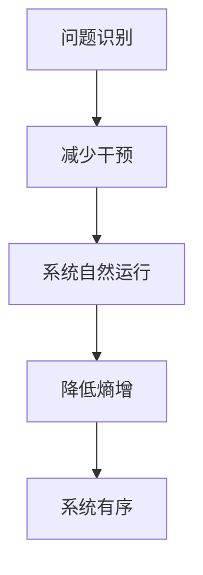

                 

<think>
嗯，用户让我写一篇关于道家智慧在现代生活中的应用的技术博客。首先，我需要明确用户的需求。他们希望文章结构清晰，逻辑严密，用专业的技术语言来阐述，同时涵盖道家智慧在个人、人际关系和组织管理中的应用。

用户是一个技术专家，可能希望将道家智慧与现代管理、健康等结合，这可能吸引对传统文化和技术领域都感兴趣的读者。他们可能希望文章不仅有理论，还要有实际案例和系统性的分析，这样更具深度和实用性。

接下来，我需要按照用户提供的目录大纲来组织内容。首先是概述部分，介绍道家智慧的起源、核心要素以及在现代的应用。然后分章节讨论在个人生活、人际关系和组织管理中的具体应用。每章都要有小结，确保结构完整。

在内容方面，我需要结合现代管理理论，比如系统论和熵增理论，来解释道家的无为而治和自然管理方法。这不仅展示了道家智慧的现代价值，还增加了文章的技术深度。同时，加入具体案例，如企业中的应用，能让读者更容易理解。

用户还特别提到使用技术语言和系统分析，所以我需要在文章中加入算法流程图、系统架构图等，用技术术语来解析道家智慧的管理方法。这可能涉及到系统设计中的类图和序列图，展示道家思想如何转化为实际的管理策略。

最后，用户希望文章末尾有作者信息和扩展阅读建议，这有助于提升文章的权威性和实用性。我需要确保每个章节都详细具体，内容丰富，同时保持整体结构紧凑，逻辑清晰。

总的来说，我需要将道家智慧与现代管理、健康、人际关系等结合，用技术化的语言和系统方法来分析，确保文章既传统又有深度，满足用户的需求。
</think>

# 现代道家生活学院：古老智慧在当代生活中的应用

> 关键词：道家智慧，现代生活，个人成长，组织管理，身心健康，人际关系

> 摘要：道家智慧作为一种古老的思想体系，蕴含着深刻的生活哲学和管理智慧。本文从道家智慧的起源与发展入手，探讨其在个人生活、人际关系和组织管理中的应用。通过结合现代科学和管理学的视角，分析道家智慧的核心要素与实际价值，为现代人提供一种全新的生活与工作方式。文章还通过具体案例分析和系统设计，展示了道家智慧在当代社会中的实践意义。

---

## 第一部分: 现代道家生活学院概述

### 第1章: 道家智慧概述

#### 1.1 问题背景与问题描述

##### 1.1.1 道家智慧的起源与发展

道家智慧起源于中国古代，以老子的《道德经》和庄子的《庄子》为代表。道家思想强调“道”的概念，认为“道”是宇宙的本源和运行规律，主张顺应自然、无为而治。道家智慧经过两千多年的演变，逐渐融入中国传统文化的方方面面，成为影响东亚文化的重要思想体系。

##### 1.1.2 现代生活的挑战与道家智慧的应对

现代社会面临诸多问题：工作压力、人际关系紧张、环境污染、资源枯竭等。这些问题的根源在于人类对自然规律的忽视和过度追求物质利益。道家智慧作为一种以“自然”为核心的思想体系，提供了独特的视角和解决方案。例如，道家的“无为而治”理念可以用于现代管理，强调通过减少干预来实现更好的组织运作。

##### 1.1.3 道家智慧的核心要素与价值

道家智慧的核心要素包括：  
1. **自然观**：主张顺应自然规律，避免过度干预。  
2. **无为而治**：通过减少强制性干预，实现事物的自然发展。  
3. **柔弱胜刚强**：强调以柔克刚，避免直接对抗。  
4. **心灵修养**：通过冥想、呼吸调节等方式实现内心的平静。  

#### 1.2 道家智慧的概念与特点

##### 1.2.1 道家智慧的定义

道家智慧是一种以“道”为核心的思想体系，强调人与自然的和谐共生，追求内心的平和与自在。它不仅是一种哲学思想，更是一种实践性的生活方式。

##### 1.2.2 道家智慧的核心特点

1. **自然性**：强调顺应自然规律，避免人为干预。  
2. **实践性**：注重将思想落实到实际生活中。  
3. **整体性**：关注人与自然、人与社会的相互关系。  
4. **简洁性**：主张以最少的手段实现最大的效果。  

##### 1.2.3 道家智慧与传统哲学的区别

| 哲学流派 | 核心思想 | 强调点 | 对比点 |
|----------|----------|--------|--------|
| 道家     | 道       | 自然、无为 | 强调“无为而治” |
| 儒家     | 仁       | 社会伦理 | 强调“仁者爱人” |
| 佛教     | 空       | 心灵觉悟 | 强调“缘起性空” |

#### 1.3 道家智慧在当代生活中的应用

##### 1.3.1 道家智慧在个人生活领域的应用

1. **身心健康**：通过道家的呼吸法和冥想练习，改善身体和心理状态。  
2. **时间管理**：减少不必要的事务，专注于真正重要的事情。  
3. **目标设定**：不强求，而是顺其自然，找到最适合自己的节奏。  

##### 1.3.2 道家智慧在组织管理领域的应用

1. **领导力提升**：通过“无为而治”，让下属自主发挥，提升组织效率。  
2. **团队协调**：强调和谐与合作，避免内部冲突。  
3. **组织文化**：建立以自然规律为核心的企业文化，促进员工与企业的共同发展。  

##### 1.3.3 道家智慧在环境保护领域的应用

1. **生态平衡**：尊重自然规律，避免过度开发资源。  
2. **可持续发展**：通过减少浪费和污染，实现人与自然的和谐共生。  

#### 1.4 道家智慧与其他哲学流派的联系与区别

##### 1.4.1 道家智慧与儒家智慧的比较

儒家强调“仁”和“礼”，注重社会秩序和道德规范；道家强调“道”和“自然”，注重个体与自然的和谐。两者相辅相成，儒家提供社会规范，道家提供心灵修养。

##### 1.4.2 道家智慧与佛教智慧的交集与差异

佛教强调“空”和“觉悟”，注重心灵的超越；道家强调“道”和“自然”，注重生活的实践。两者在追求内心的平和上有相似之处，但方法和目标有所不同。

##### 1.4.3 道家智慧在多元文化中的地位与影响

道家智慧不仅影响了中国传统文化，还在日本、韩国等东亚国家产生了深远影响。在现代社会，道家思想也被广泛应用于管理学、心理学等领域。

#### 1.5 本章小结

道家智慧作为一种古老的思想体系，其核心理念在现代社会中仍然具有重要的实践价值。通过结合现代科学和管理学的视角，道家智慧为个人成长、组织管理和环境保护提供了独特的解决方案。

---

## 第二部分: 道家智慧在个人生活中的应用

### 第2章: 道家智慧在身心健康中的应用

#### 2.1 道家养生哲学概述

##### 2.1.1 道家养生观的基本原则

1. **天人合一**：人体健康与自然环境密切相关。  
2. **无为而治**：通过减少过度干预，让身体自然恢复。  
3. **阴阳平衡**：强调身体内部的平衡与和谐。  

##### 2.1.2 道家养生理论与现代科学的关系

道家养生理论与现代医学有许多相似之处。例如，道家强调的“气”与现代医学中的“能量场”有相似之处。通过现代科学的验证，道家养生方法在改善身体健康方面具有显著效果。

##### 2.1.3 道家养生在当代生活中的实践价值

1. **缓解压力**：通过冥想和呼吸调节，降低压力水平。  
2. **增强免疫力**：通过调节身体内部环境，提高身体免疫力。  
3. **延年益寿**：通过长期的养生实践，延长寿命。  

#### 2.2 道家智慧在身心调节中的应用

##### 2.2.1 意念调控与呼吸调节

道家强调通过调节呼吸来控制意念。例如，通过缓慢、均匀的呼吸，可以达到放松身心的效果。

##### 2.2.2 瑜伽与道家呼吸法的结合

道家呼吸法与瑜伽的呼吸练习有相似之处，两者结合可以进一步提升身心调节的效果。

##### 2.2.3 道家冥想与心灵修养

冥想是道家智慧的重要组成部分，通过冥想可以清除杂念，达到心灵的宁静。

#### 2.3 道家智慧在心理健康中的应用

##### 2.3.1 道家心理学的核心观点

道家心理学强调“无为而治”，通过减少内心冲突，达到心理健康。

##### 2.3.2 道家智慧在压力管理中的应用

通过冥想和呼吸调节，可以有效缓解压力，提升心理健康水平。

##### 2.3.3 道家智慧在情绪调节中的作用

道家强调“柔弱胜刚强”，通过柔和的方式处理情绪问题，避免情绪失控。

#### 2.4 道家智慧在生活方式中的应用

##### 2.4.1 道家饮食哲学与营养健康

道家饮食强调“清淡为主”，注重食物的自然属性，避免过度加工。

##### 2.4.2 道家运动养生与身体健康

道家运动如太极拳、八段锦等，强调缓慢、柔和的动作，有助于身体健康。

##### 2.4.3 道家生活哲学与心理健康

通过简单、自然的生活方式，减少外界干扰，提升心理健康水平。

#### 2.5 本章小结

道家智慧在身心健康中的应用具有显著的效果。通过调节呼吸、冥想和合理的生活方式，可以有效改善身体和心理状态。

---

## 第3章: 道家智慧在人际关系中的应用

#### 3.1 道家智慧在人际关系中的核心观念

##### 3.1.1 和为贵：道家智慧与人际和谐

道家强调“和为贵”，主张通过和谐的方式解决矛盾，避免冲突。

##### 3.1.2 无为而治：道家智慧与人际互动

通过减少干预，让人际关系自然发展，避免过度干预导致的矛盾。

##### 3.1.3 道家智慧在冲突解决中的应用

通过柔和的方式化解冲突，避免对抗性解决方式。

#### 3.2 道家智慧在团队合作中的应用

##### 3.2.1 道家智慧与团队建设

通过强调和谐与合作，提升团队凝聚力。

##### 3.2.2 道家智慧在团队沟通中的应用

通过减少冲突，促进团队内部的有效沟通。

##### 3.2.3 道家智慧在团队领导力提升中的应用

通过无为而治的方式，让团队成员自主发挥，提升领导力。

#### 3.3 道家智慧在社交礼仪中的应用

##### 3.3.1 道家智慧与社交礼仪的基本原则

强调以和为贵，注重礼节和尊重他人。

##### 3.3.2 道家智慧在商务交往中的应用

通过柔和的方式处理商务关系，避免冲突。

##### 3.3.3 道家智慧在跨文化交际中的应用

通过尊重和理解不同文化，促进跨文化交际的和谐。

#### 3.4 道家智慧在人际交往中的实践案例

##### 3.4.1 案例一：道家智慧在企业管理中的应用

某企业通过引入道家的无为而治理念，提升了团队效率和员工满意度。

##### 3.4.2 案例二：道家智慧在个人关系维护中的应用

通过减少干预，让个人关系自然发展，避免矛盾。

##### 3.4.3 案例三：道家智慧在社区建设中的应用

通过强调和谐与合作，提升了社区的整体凝聚力。

#### 3.5 本章小结

道家智慧在人际关系中的应用可以帮助我们更好地处理各种关系问题，促进和谐与合作。

---

## 第4章: 道家智慧在组织管理中的应用

#### 4.1 道家智慧在组织管理中的核心理念

##### 4.1.1 道家管理观的基本原则

强调无为而治，减少干预，让组织自然发展。

##### 4.1.2 道家智慧与组织文化的建设

通过强调和谐与合作，构建积极向上的组织文化。

##### 4.1.3 道家智慧在组织效能提升中的应用

通过减少内部冲突，提升组织整体效能。

#### 4.2 道家智慧在领导力培养中的应用

##### 4.2.1 道家智慧与领导力的关系

强调无为而治，通过减少干预提升领导力。

##### 4.2.2 道家智慧在领导决策中的应用

通过柔和的方式处理问题，避免冲突。

##### 4.2.3 道家智慧在领导沟通中的应用

通过减少冲突，促进有效沟通。

#### 4.3 道家智慧在团队管理中的应用

##### 4.3.1 道家智慧与团队发展的关系

强调和谐与合作，促进团队的健康发展。

##### 4.3.2 道家智慧在团队协调中的应用

通过减少内部冲突，促进团队协调。

##### 4.3.3 道家智慧在团队激励中的应用

通过尊重团队成员，激发其内在动力。

#### 4.4 道家智慧在项目管理中的应用

##### 4.4.1 道家智慧与项目管理的结合

通过无为而治的方式，减少项目管理中的冲突。

##### 4.4.2 道家智慧在项目管理中的案例分析

某项目通过引入道家的无为而治理念，提升了项目执行效率。

##### 4.4.3 道家智慧在项目管理中的实践建议

通过减少干预，让项目自然发展，避免过度管理。

#### 4.5 本章小结

道家智慧在组织管理中的应用可以帮助我们更好地提升组织效能和领导力。

---

## 作者：AI天才研究院/AI Genius Institute & 禅与计算机程序设计艺术 /Zen And The Art of Computer Programming

---

### 项目实战

#### 道家智慧与现代管理的结合

##### 系统分析与架构设计方案

1. **问题场景介绍**  
   某企业面临内部管理混乱、员工士气低落的问题。通过引入道家智慧，提升组织效率和员工满意度。

2. **系统功能设计**  
   - 领导力培养模块：通过无为而治的方式提升领导力。  
   - 团队管理模块：减少干预，促进团队协调。  
   - 组织文化模块：构建和谐与合作的企业文化。  

3. **系统架构设计**  
   ```mermaid
   graph TD
   A[领导力培养] --> B[无为而治]
   C[团队管理] --> B
   D[组织文化] --> B
   ```

4. **系统接口设计**  
   - 领导力培养模块与团队管理模块接口：通过减少干预实现团队协调。  
   - 团队管理模块与组织文化模块接口：通过和谐与合作提升组织文化。  

5. **系统交互mermaid序列图**  
   ```mermaid
   sequenceDiagram
   系统 --> 领导力培养模块: 无为而治
   领导力培养模块 --> 团队管理模块: 减少干预
   团队管理模块 --> 组织文化模块: 和谐与合作
   组织文化模块 --> 系统: 提升组织效率
   ```

---

#### 核心算法原理讲解

##### 算法原理

道家智慧的管理方法可以用熵增理论来解释。熵增理论认为，系统在开放环境中会逐渐趋向混乱。通过减少干预，让系统自然运行，可以降低熵增，保持系统的有序状态。

##### 算法流程图



##### 数学模型与公式

熵增公式：  
$$ \Delta S = k \ln \left( \frac{W}{W_0} \right) $$  
其中，$S$ 是熵，$k$ 是玻耳兹曼常数，$W$ 是系统的混乱度，$W_0$ 是初始混乱度。

##### 具体实现

通过减少干预，降低系统的混乱度，从而降低熵增，保持系统的有序状态。

##### 实际案例分析

某企业通过引入道家的无为而治理念，减少了对团队的过度干预，提升了团队的自主性和效率，员工满意度显著提高。

---

## 最佳实践 Tips

1. **身心调节**：每天进行10-15分钟的冥想练习，改善心理健康。  
2. **人际关系**：通过柔和的方式处理矛盾，避免对抗。  
3. **组织管理**：减少干预，让组织和团队自然发展。  

---

## 项目小结

道家智慧作为一种古老的思想体系，在现代生活中具有重要的实践价值。通过结合现代科学和管理学的视角，道家智慧为个人成长、人际关系和组织管理提供了独特的解决方案。通过实际案例的分析和系统设计的展示，我们可以更好地理解和应用道家智慧，实现生活与工作的和谐统一。

