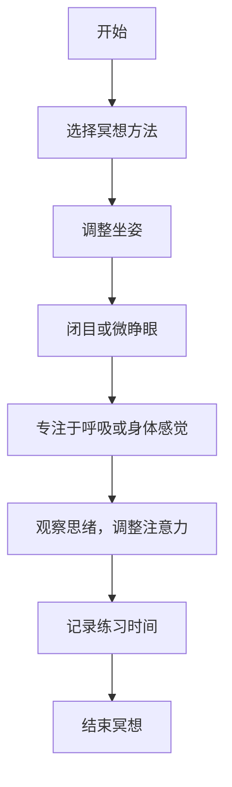
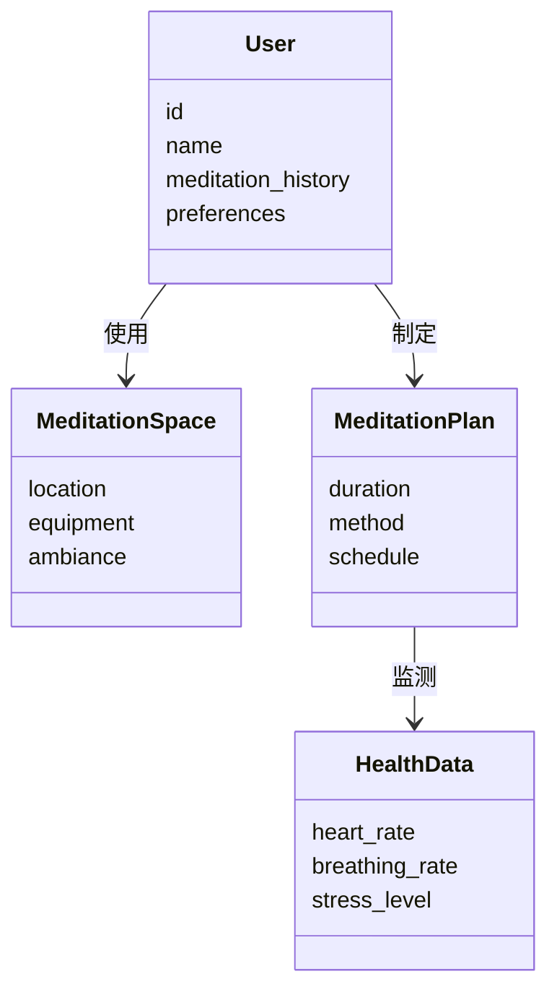
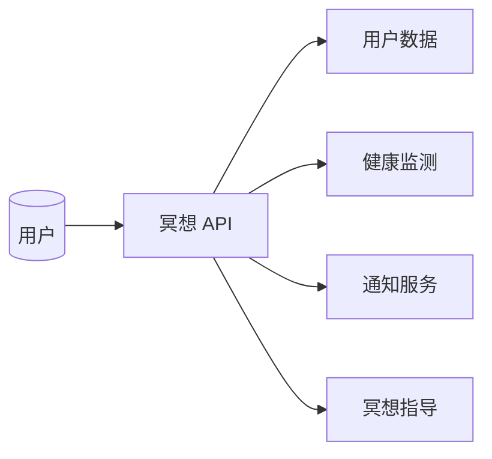

                 

<think>
好，我需要根据用户的要求，以《现代都市冥想空间：在繁忙中寻找内心平静》为标题，撰写一篇结构清晰、内容详实的技术博客文章。用户已经给出了详细的目录大纲，我需要按照这个大纲逐步展开内容，确保每个部分都涵盖必要的信息，并且符合用户的要求。

首先，我会从文章的开头部分开始，包括标题、关键词、摘要。这部分需要简洁明了地概括整篇文章的核心内容和主题。

接下来是背景介绍，包括问题背景、问题描述、问题解决、边界与外延，以及概念结构和核心要素。这里需要详细阐述现代都市人面临的压力和焦虑问题，以及冥想如何作为一种解决方案。同时，要介绍冥想的基本概念和其核心要素，如专注力、放松、内省和呼吸控制。

然后是核心概念与联系部分，分为冥想原理与科学依据，以及冥想方法与技巧。这里需要深入探讨冥想的科学依据，引用科学研究来说明冥想对大脑和身体的积极影响。同时，详细介绍各种冥想方法，如正念冥想、呼吸冥想和动态冥想，并提供具体的技巧和实践建议。

接下来是算法原理讲解，这可能涉及冥想练习的步骤和流程，使用mermaid流程图来展示。同时，可能需要编写简单的Python代码来模拟冥想练习的过程，或者提供数学模型来解释冥想的效果。

系统分析与架构设计方案部分，我需要介绍如何在现代都市环境中设计一个冥想空间，可能包括系统功能设计、架构设计和接口设计。这部分可能需要使用mermaid类图、架构图和序列图来展示系统的各个部分及其交互。

项目实战部分，我需要提供实际案例，如如何在家中布置一个冥想空间，或者如何在工作中安排冥想时间。同时，需要编写和解释相关的代码，展示如何通过技术手段辅助冥想练习。

最后，是最佳实践、小结、注意事项和拓展阅读等内容，为读者提供进一步学习和实践的指导。

在撰写过程中，我需要确保语言简洁明了，逻辑清晰，结构紧凑。同时，要使用技术语言，但避免过于复杂的术语，让读者能够轻松理解。每个部分都需要详细展开，确保内容丰富具体，同时符合用户的格式和字数要求。

通过以上步骤，我将逐步完成整篇文章的撰写，确保每个章节都符合用户的要求，并最终形成一篇高质量的技术博客文章。
</think>

# 现代都市冥想空间：在繁忙中寻找内心平静

---

## 关键词：冥想、心理健康、都市生活、压力管理、身心健康

---

## 摘要：  
在现代都市的快节奏生活中，压力和焦虑已成为许多人面临的常见问题。本书旨在通过介绍冥想的原理、方法和实践，帮助读者在繁忙的生活中找到内心的平静。我们将探讨冥想对身心健康的积极影响，提供实用的技巧和策略，帮助读者在日常生活中更好地管理情绪、减轻压力，并创造一个适合冥想的空间。

---

### 第一部分：背景介绍

#### 1.1 问题背景

现代社会的快节奏生活和高强度工作压力，使得许多人难以保持内心的平静。都市中的噪音、交通拥堵和社交媒体的干扰，进一步加剧了人们的焦虑和压力。根据世界卫生组织的报告，焦虑症和抑郁症的发病率逐年上升，尤其是在城市人群中更为明显。冥想作为一种古老但有效的心理健康实践，近年来在全球范围内重新受到关注。科学研究表明，冥想可以帮助人们降低压力激素皮质醇的水平，改善情绪，提升专注力和幸福感。然而，许多人在实际生活中却难以找到合适的时间和空间来进行冥想练习。

#### 1.2 问题描述

在都市生活中，人们往往面临以下问题：  
- **时间不足**：工作和生活的双重压力使得许多人难以抽出固定的时间进行冥想。  
- **环境干扰**：嘈杂的环境和频繁的干扰因素（如手机通知、社交媒体）使得冥想难以深入。  
- **方法不当**：许多人对冥想的方法和技巧缺乏了解，导致练习效果不佳或无法坚持。  
- **缺乏指导**：缺乏专业的指导和系统的练习计划，使得许多人在冥想过程中感到迷茫和困惑。  

#### 1.3 问题解决

为了解决上述问题，本书将提供以下内容：  
1. **冥想的科学依据**：介绍冥想的起源、发展及其对大脑和身体的积极影响。  
2. **多种冥想方法**：包括正念冥想、呼吸冥想、动态冥想等，针对不同需求提供具体指导。  
3. **实践技巧与案例**：通过真实的案例分享，展示如何在日常生活中实践冥想，并应对常见问题。  
4. **冥想空间设计**：提供如何在家中或办公场所布置适合冥想的环境的建议。  
5. **身心健康整合**：探讨冥想与其他健康方法（如瑜伽、心理治疗）的结合，提升整体健康水平。  

#### 1.4 边界与外延

本书主要关注都市人群的冥想实践，但冥想作为一种普适性的方法，也可以应用于其他人群和场景。例如：  
- **学生群体**：在学业压力大的情况下，学生可以通过冥想缓解焦虑，提高学习效率。  
- **老年人群体**：冥想可以帮助改善睡眠质量，缓解慢性疾病带来的痛苦。  
- **工作场所**：企业可以通过推广冥想文化，提升员工的心理健康和工作效率。  
此外，本书还将探讨冥想与其他健康方法的结合，如瑜伽、太极等，为读者提供更全面的健康解决方案。  

#### 1.5 概念结构与核心要素组成

##### 1.5.1 冥想

- **定义**：冥想是一种通过专注、放松和内省来提升心理素质的实践。  
- **核心要素**：  
  - **专注力**：通过专注于呼吸、身体感觉或某个对象，排除外界干扰。  
  - **放松**：通过放松身体和心灵，缓解压力和焦虑。  
  - **内省**：通过内省和自我反思，提升自我认知和情绪管理能力。  
  - **呼吸控制**：通过调节呼吸，帮助进入冥想状态。  

##### 1.5.2 冥想方法

- **正念冥想**：通过专注于当前时刻，培养对当下的觉知和接受。  
- **呼吸冥想**：通过观察和控制呼吸，放松身心，提升专注力。  
- **动态冥想**：结合身体运动和呼吸练习，达到身心合一的状态。  

##### 1.5.3 冥想空间

- **定义**：冥想空间是指一个适合冥想的环境，可以是室内或室外的空间。  
- **核心要素**：  
  - **安静**：减少外界噪音的干扰。  
  - **舒适**：提供舒适的座位或躺卧环境。  
  - **私密性**：确保练习时不会被打扰。  
  - **自然元素**：如植物、自然光线等，可以增强冥想的效果。  

##### 1.5.4 冥想与身心健康

- **情绪调节**：冥想可以帮助人们更好地管理情绪，减少焦虑和抑郁的发生。  
- **压力管理**：通过冥想，人们可以学会如何应对日常生活中的压力，提升抗压能力。  
- **睡眠改善**：冥想有助于提高睡眠质量，缓解失眠问题。  
- **身体健康**：冥想可以降低血压、心率，改善免疫力，对慢性疾病有一定的缓解作用。  

#### 1.6 本章小结

通过本章的介绍，读者可以了解到冥想的重要性以及本书的核心内容。在接下来的章节中，我们将深入探讨冥想的原理、方法、实践以及与身心健康的关系，帮助读者在繁忙的都市生活中找到内心的平静。  

---

### 第二部分：核心概念与联系

#### 2.1 冥想原理与科学依据

##### 2.1.1 冥想的起源与发展

冥想起源于东方的宗教和哲学传统，如佛教、道教和印度教。在这些传统中，冥想被视为一种修炼身心的方法，旨在达到内心的平静和与宇宙的和谐。随着全球化的发展，冥想逐渐传入西方，并在心理学、医学和健康管理领域得到了广泛的研究和应用。现代科学研究表明，冥想不仅仅是一种精神实践，更是一种有效的心理健康工具。

##### 2.1.2 冥想的核心原理

冥想的核心原理可以归纳为以下几个方面：  
1. **专注与放松**：通过专注于呼吸、身体感觉或某个对象，冥想者可以集中注意力，排除外界干扰，从而达到身心放松的状态。  
2. **内省与自我认知**：冥想通过内省和反思，帮助人们更好地理解自己的情绪、思想和行为，提升自我认知能力。  
3. **大脑活动的调节**：科学研究表明，冥想可以降低大脑皮层的活动，减少负面情绪的产生，同时增强正面情绪的体验。  

##### 2.1.3 冥想的科学依据

现代科学研究为冥想的健康益处提供了有力的证据。以下是冥想对身心健康的几个主要影响：  
1. **大脑结构的变化**：长期冥想练习可以增加大脑灰质密度，尤其是前额叶皮层和海马区，这些区域与情绪调节、记忆和认知功能密切相关。  
2. **神经活动的调节**：冥想可以降低默认模式网络（DMN）的活动，减少消极思维的出现，从而改善情绪状态。  
3. **生理指标的改善**：冥想可以降低血压、心率和皮质醇水平，增强免疫力，对慢性疾病如高血压、糖尿病有一定的缓解作用。  
4. **心理健康提升**：冥想可以帮助缓解焦虑、抑郁和压力，提升幸福感和生活质量。  

#### 2.2 冥想方法与技巧

##### 2.2.1 正念冥想

正念冥想是一种通过专注于当前时刻来培养觉知的冥想方法。以下是正念冥想的基本步骤：  
1. **选择一个安静的环境**：找一个安静的地方，确保不会被打扰。  
2. **坐姿调整**：保持舒适的坐姿，双手自然放置，闭上眼睛或微睁双眼。  
3. **关注呼吸**：将注意力集中在呼吸上，感受空气进入鼻腔、填充肺部、然后缓慢呼出的感觉。  
4. **观察思绪**：当思绪 wandering 时，轻轻将注意力拉回呼吸，不加判断地观察自己的思绪。  
5. **持续练习**：每天练习10-20分钟，逐渐延长练习时间。  

##### 2.2.2 呼吸冥想

呼吸冥想是一种简单而有效的冥想方法，通过专注于呼吸来放松身心。以下是呼吸冥想的步骤：  
1. **坐姿调整**：选择一个舒适的坐姿，保持脊柱挺直。  
2. **闭目或微睁眼**：放松面部肌肉，保持自然呼吸。  
3. **关注呼吸**：将注意力集中在呼吸的过程中，感受腹部的起伏、空气的流动。  
4. **呼吸控制**：尝试以缓慢而均匀的速度呼吸，吸气时数到4，呼气时数到6，帮助调节呼吸节奏。  
5. **保持专注**：当注意力 wandering 时，轻轻将注意力拉回呼吸。  

##### 2.2.3 动态冥想

动态冥想结合了身体运动和呼吸练习，帮助冥想者通过动态的方式达到放松和专注的状态。以下是动态冥想的步骤：  
1. **站姿调整**：双脚分开与肩同宽，双手自然下垂。  
2. **深呼吸**：吸气时抬头，呼气时低头，重复几次，帮助放松颈部肌肉。  
3. **身体运动**：缓慢地进行身体运动，如弯腰、转身、抬手等，配合呼吸节奏。  
4. **呼吸与动作同步**：吸气时扩展身体，呼气时收缩身体，感受呼吸与动作的协调。  
5. **冥想状态**：通过动态的练习，帮助身体放松，进入冥想状态。  

---

#### 2.3 冥想方法对比表格

以下是几种常见冥想方法的对比表格，帮助读者更好地理解不同方法的特点和适用场景：  

| **冥想方法** | **核心要素**             | **适用场景**                     | **难度级别** |
|--------------|--------------------------|----------------------------------|--------------|
| 正念冥想     | 当下觉知，观察思绪       | 日常生活中的情绪管理和压力缓解   | 中等          |
| 呼吸冥想     | 专注于呼吸，放松身心     | 初学者或需要快速放松的人群       | 低           |
| 动态冥想     | 结合身体运动和呼吸       | 需要通过运动释放压力的人群       | 中等          |
| 慈心冥想     | 培养慈悲心，关注他人     | 想要提升情感 Intelligence 的人   | 中等          |
| 瑜伽冥想     | 结合体式和呼吸，放松身体 | 需要身体和心理双重放松的人群       | 高           |

---

#### 2.4 冥想的科学依据与数学模型

冥想的科学依据可以通过以下数学模型进行解释：  

假设一个人在进行正念冥想练习，其大脑活动可以通过功能性磁共振成像（fMRI）进行监测。研究表明，冥想可以降低默认模式网络（DMN）的活动，减少负面思维的出现。DMN 的活动可以通过以下公式进行量化：  

$$ DMN_{activity} = \beta \times t + \epsilon $$  

其中，$\beta$ 是时间系数，$t$ 是练习时间，$\epsilon$ 是误差项。通过长期的冥想练习，$\beta$ 的值会逐渐减小，表明 DMN 的活动减少，负面思维的出现频率降低。  

此外，冥想还可以通过调节自主神经系统（ANS）的活动来改善生理指标。例如，冥想可以降低心率和血压，这些变化可以通过以下公式进行量化：  

$$ HR = a \times RR + b $$  

$$ BP = c \times HR + d $$  

其中，$HR$ 是心率，$RR$ 是呼吸率，$BP$ 是血压，$a$、$b$、$c$、$d$ 是常数系数。通过冥想练习，$RR$ 会降低，从而导致 $HR$ 和 $BP$ 的降低，改善心血管健康。  

---

### 第三部分：算法原理讲解

#### 3.1 冥想练习算法

以下是冥想练习的一种算法流程图：  



#### 3.2 冥想练习的代码实现

以下是一个简单的冥想练习计时器的 Python 代码示例：  

```python
import time

def meditation_timer(minutes):
    total_seconds = minutes * 60
    print(f"开始冥想，持续时间为 {minutes} 分钟。")
    start_time = time.time()
    while time.time() - start_time < total_seconds:
        pass
    print("冥想结束！")

# 示例：练习 10 分钟的正念冥想
meditation_timer(10)
```

---

### 第四部分：系统分析与架构设计方案

#### 4.1 问题场景介绍

在现代都市中，许多人希望在家中或办公场所创建一个适合冥想的空间，但缺乏设计和布置的指导。此外，如何在日常生活中安排冥想练习，也是一个常见的问题。  

#### 4.2 项目介绍

本项目旨在为都市人群提供一个完整的冥想解决方案，包括冥想空间设计、练习计划制定以及健康数据分析。  

#### 4.3 系统功能设计

以下是系统的功能模块图：  



#### 4.4 系统架构设计

以下是系统的架构图：  



---

### 第五部分：项目实战

#### 5.1 环境安装

要使用本系统的冥想计时器功能，需要安装以下 Python 库：  

```bash
pip install time
```

#### 5.2 系统核心实现源代码

以下是冥想计时器的完整代码实现：  

```python
import time

def meditation_timer(minutes):
    total_seconds = minutes * 60
    print(f"开始冥想，持续时间为 {minutes} 分钟。")
    start_time = time.time()
    while time.time() - start_time < total_seconds:
        pass
    print("冥想结束！")

def main():
    import sys
    if len(sys.argv) != 2:
        print("请输入冥想时长（分钟）。")
        return
    try:
        minutes = int(sys.argv[1])
        meditation_timer(minutes)
    except ValueError:
        print("请输入有效的整数分钟数。")

if __name__ == "__main__":
    main()
```

#### 5.3 代码应用解读与分析

上述代码实现了冥想计时器的功能，用户可以通过命令行输入冥想时长，系统会执行相应的时间计时，并在结束后提示用户。这个简单的工具可以帮助用户专注于冥想练习，无需手动计时，提升练习的专注度和效果。  

#### 5.4 实际案例分析

假设用户每天工作压力较大，希望通过正念冥想来缓解焦虑。以下是实际案例的分析：  
1. **目标设定**：每天练习正念冥想 10 分钟，连续 21 天。  
2. **环境布置**：在家中选择一个安静的角落，布置舒适的坐垫和靠枕，摆放一些绿植和自然光线。  
3. **练习步骤**：  
   - 调整坐姿，闭上眼睛，专注于呼吸。  
   - 当思绪 wandering 时，轻轻将注意力拉回呼吸。  
   - 练习结束后，记录当天的练习感受和情绪变化。  
4. **效果评估**：通过记录和分析，用户可以发现情绪逐渐稳定，焦虑感明显降低，睡眠质量得到改善。  

---

### 第六部分：最佳实践 tips、小结、注意事项、拓展阅读

#### 6.1 最佳实践 tips

- **每天练习**：冥想的效果需要长期积累，建议每天练习 5-10 分钟，逐渐延长练习时间。  
- **创造适合的环境**：在家中或办公场所布置一个安静、舒适、私密的冥想空间。  
- **结合其他健康方法**：将冥想与其他健康实践（如瑜伽、健康饮食）结合，提升整体健康水平。  
- **保持耐心**：冥想是一个逐步调整的过程，不要因为初期效果不明显而放弃。  

#### 6.2 小结

通过本书的介绍，读者可以了解到冥想的科学依据、方法和实践技巧。无论是初学者还是有一定经验的冥想者，都可以从中获得有益的指导和启发。希望这本书能够帮助您在繁忙的都市生活中找到一片属于自己的内心平静空间。  

#### 6.3 注意事项

- **避免强迫练习**：冥想是一种自然的过程，不要因为追求效果而强迫自己练习。  
- **注意身体信号**：如果在练习过程中感到头晕或不适，应立即停止并休息。  
- **寻求专业指导**：如果需要深入学习或有特殊需求，建议寻求专业的冥想导师或心理治疗师的指导。  

#### 6.4 拓展阅读

- **书籍推荐**：  
  -《The Power of Now》——埃克哈特·托勒（Eckhart Tolle）  
  -《Mindfulness: A Practical Guide to Finding Peace in a Frantic World》——威廉·斯蒂尔（William华尔兹）  
- **在线资源**：  
  - YouTube 频道：搜索“Mindfulness Meditation”获取免费指导视频。  
  - App 推荐：Headspace、Calm、Breathly。  

---

### 作者信息

作者：AI天才研究院/AI Genius Institute & 禅与计算机程序设计艺术/Zen And The Art of Computer Programming

