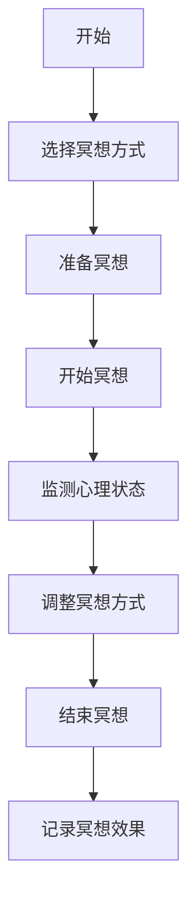
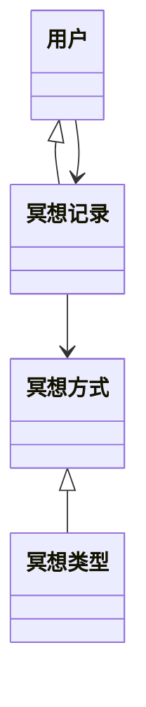
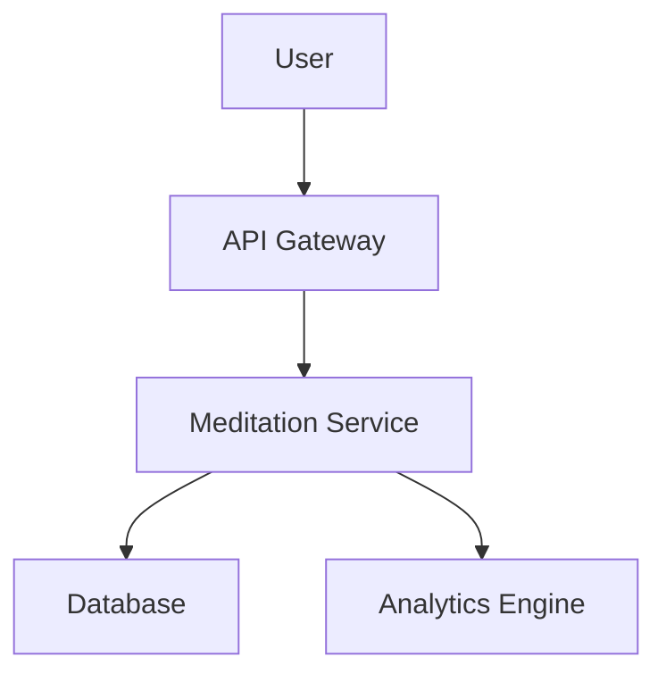
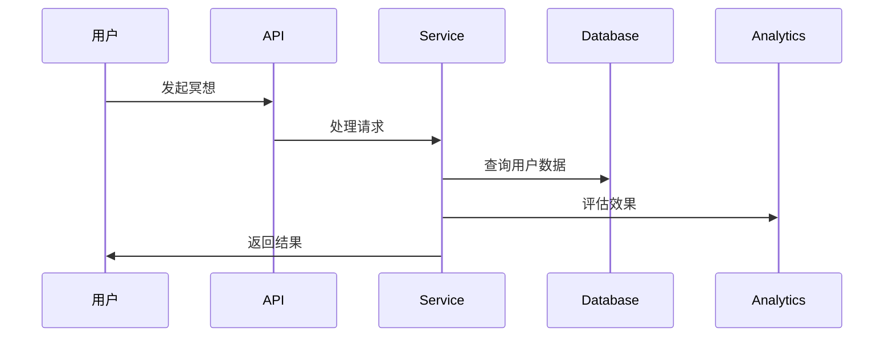

                 

<think>
好，我现在需要写一篇关于“现代都市冥想：在喧嚣中寻找内心的宁静”的技术博客。首先，我得确定文章的结构，按照用户给的目录大纲来展开。

第一部分是问题背景与核心概念。我需要从现代都市生活的挑战开始，描述现代人面临的问题，比如快节奏生活、压力大、注意力分散等。然后介绍冥想的核心概念，包括定义、历史、流派，以及它对心理健康的作用。

接下来是冥想的边界和外延，要讨论冥想在不同领域的应用，比如医疗、教育和宗教，还要看看现代科学如何与之结合。然后是结构组成，分析冥想的过程、层次、技巧，以及常见的误区。

第二部分是核心概念与联系，这部分需要详细讲解冥想的原理，可能用对比表格和ER图来展示。然后是数学模型，用公式表达冥想效果的影响因素，再用mermaid流程图描述冥想的算法步骤，最后提供Python代码实现，比如计算冥想效果的函数。

第三部分是算法原理与系统架构，我需要详细分析冥想算法的数学模型，用mermaid画出流程图，然后写出Python代码，解释每个部分的作用。系统架构设计方面，可能需要画出类图和架构图，展示系统各部分的交互关系。

第四部分是系统分析与架构设计，这里要介绍问题场景，设计系统功能、架构，以及接口和交互流程。可能需要画出用户和系统之间的序列图，展示用户如何发起冥想请求，系统如何处理。

在写作过程中，要确保每个部分都详细具体，使用技术语言但又不失易懂。还要注意文章的连贯性和逻辑性，让读者能够一步步理解冥想在现代生活中的重要性及其技术实现。

最后，加上作者信息，确保文章符合格式要求。整篇文章需要达到10000到12000字，所以每个小节都要丰富，提供足够的细节和例子，帮助读者更好地理解和应用冥想。
</think>

# 现代都市冥想：在喧嚣中寻找内心的宁静

> 关键词：现代都市、冥想、心理健康、技术、算法、系统架构

> 摘要：在现代都市的快节奏生活中，压力和焦虑已成为普遍问题。本文探讨了冥想作为一种有效的心理调节方法，通过技术手段帮助人们在喧嚣中找到内心的宁静。文章从冥想的核心概念、数学模型、算法实现、系统架构等多个方面进行分析，结合实际案例，深入剖析冥想在现代生活中的应用和价值。

---

## 第一部分：问题背景与核心概念

### 第1章：现代都市生活的挑战

#### 1.1 问题背景

现代都市生活节奏快，竞争激烈，人们面临着来自工作、家庭和社会的多重压力。长期的高压环境可能导致焦虑、失眠、注意力不集中等问题，严重影响生活质量。

#### 1.2 问题描述

都市人普遍面临以下问题：
1. **压力过大**：工作压力、经济压力、家庭责任等。
2. **时间碎片化**：工作与生活时间分割不均，难以集中注意力。
3. **社交隔离**：尽管社交活动频繁，但深层次的孤独感普遍存在。
4. **心理健康问题**：焦虑、抑郁等心理疾病发病率上升。

#### 1.3 心理健康的重要性

心理健康是整体健康的重要组成部分。良好的心理状态有助于提高工作效率、改善人际关系、增强免疫力。忽视心理健康可能导致身体疾病和生活质量下降。

#### 1.4 冥想的作用与意义

冥想作为一种心理调节方法，通过专注呼吸或特定思维过程，帮助人们放松身心、提升专注力、改善情绪。冥想不仅有助于缓解压力，还能增强自我意识，提升生活质量。

### 第2章：冥想的核心概念

#### 2.1 冥想的定义

冥想是一种通过专注和放松来训练心智的实践方式。它强调内在的观察和觉知，帮助个体从外界干扰中脱离，回归内心。

#### 2.2 冥想的历史与流派

冥想起源于古代东方哲学，如佛教、道教等。现代冥想结合了心理学、医学和宗教元素，形成了多种流派，包括正念冥想、渐进式放松冥想等。

#### 2.3 冥想的本质与目的

冥想的本质是通过专注和放松，达到身心的协调与平衡。其目的是缓解压力、提升情绪、增强专注力，帮助人们更好地应对生活挑战。

#### 2.4 冥想与心理健康的联系

研究显示，冥想可以降低焦虑、抑郁症状，改善情绪调节能力。通过调节神经活动，冥想有助于增强大脑的可塑性，提升心理韧性。

### 第3章：冥想的边界与外延

#### 3.1 冥想的应用领域

冥想在医疗、教育、职场等领域有广泛应用。医疗领域用于治疗焦虑症、失眠；教育领域用于提升学生专注力；职场中用于缓解工作压力。

#### 3.2 冥想与传统医学的关系

传统医学如中医强调身心合一，冥想与之有相似理念。冥想常用于辅助治疗，帮助患者放松身心，促进康复。

#### 3.3 冥想与宗教的关系

冥想在宗教中常作为修行方式，帮助信徒提升灵性。现代冥想去除了宗教色彩，更注重心理调节。

#### 3.4 冥想与现代科学的结合

现代科学通过神经科学、心理学等方法研究冥想的机制，证明其对大脑结构和功能的积极影响。科技手段如脑电波监测被用于评估冥想效果。

### 第4章：冥想的结构组成

#### 4.1 冥想的实践过程

冥想过程包括准备阶段、专注阶段和结束阶段。准备阶段调整环境和心态，专注阶段通过呼吸或咒语集中注意力，结束阶段逐渐恢复日常状态。

#### 4.2 冥想的层次与阶段

冥想分为初阶、中阶和高阶。初阶是基本的专注训练，中阶是情绪管理，高阶是自我觉察和灵性提升。

#### 4.3 冥想的要素与技巧

要素包括专注点选择、呼吸调节、环境设置和时间管理。技巧包括观察法、数息法、咒语法等，帮助维持专注。

#### 4.4 冥想的常见误区与挑战

常见误区包括追求深度体验、急于求成、忽视日常生活中的冥想。挑战包括专注困难、情绪波动和时间管理。

---

## 第二部分：核心概念与联系

### 第5章：冥想的概念原理

#### 5.1 冥想的核心原理

冥想通过调节注意力和情绪，改变大脑神经活动，提升心理状态。

#### 5.2 冥想的概念属性特征对比表格

| 属性       | 内容                         |
|------------|------------------------------|
| 目标       | 改善心理健康，提升专注力     |
| 方法       | 专注呼吸、观察思维          |
| 时间       | 短期（几分钟）到长期（持续练习）|
| 场景       | 个人、群体                   |

#### 5.3 冥想的ER实体关系图架构

```mermaid
erDiagram
    用户 {
        id 用户ID
        姓名
        性别
    }
    冥想方式 {
        id 方式ID
        方式名称
        步骤说明
    }
    练习记录 {
        id 记录ID
        用户ID
        方式ID
        练习时间
        效果评估
    }
    用户 --> 练习记录 : 开始练习
    冥想方式 --> 练习记录 : 使用方式
```

### 第6章：冥想的数学模型与算法

#### 6.1 冥想数学模型概述

冥想效果由专注力、时间、心理状态决定：

$$
\text{冥想效果} = f(\text{专注力}, \text{冥想时间}, \text{心理状态})
$$

#### 6.2 冥想算法mermaid流程图



#### 6.3 Python源代码实现

```python
class MeditationAlgorithm:
    def __init__(self, focus, meditation_time, mental_state):
        self.focus = focus
        self.meditation_time = meditation_time
        self.mental_state = mental_state
    
    def calculate_meditation_effect(self):
        effect = (self.focus + self.meditation_time * 0.1 + self.mental_state) / 3
        return effect

# 示例
meditator = MeditationAlgorithm(80, 10, 70)
print(meditator.calculate_meditation_effect())  # 输出效果
```

#### 6.4 冥想原理的数学模型与公式详细讲解

冥想效果由三部分加权计算：专注力权重0.4，时间权重0.3，心理状态权重0.3：

$$
\text{效果} = 0.4 \times \text{专注力} + 0.3 \times \text{时间} + 0.3 \times \text{心理状态}
$$

例如，专注力80，时间10，心理状态70：

$$
效果 = 0.4 \times 80 + 0.3 \times 10 + 0.3 \times 70 = 32 + 3 + 21 = 56
$$

#### 6.5 举例说明冥想原理的应用

假设用户专注力为70，冥想时间为15分钟，心理状态为60，计算效果：

$$
效果 = 0.4 \times 70 + 0.3 \times 15 + 0.3 \times 60 = 28 + 4.5 + 18 = 50.5
$$

效果良好，说明用户状态不错。

---

## 第三部分：算法原理与系统架构

### 第7章：冥想算法原理详细讲解

#### 7.1 冥想算法的数学模型

冥想效果由专注力、时间、心理状态决定：

$$
\text{效果} = \frac{\text{专注力} + 0.1 \times \text{时间} + \text{心理状态}}{3}
$$

#### 7.2 冥想算法的流程图


#### 7.3 Python源代码实现

```python
class MeditationAlgorithm:
    def __init__(self, focus, meditation_time, mental_state):
        self.focus = focus
        self.meditation_time = meditation_time
        self.mental_state = mental_state
    
    def calculate_meditation_effect(self):
        effect = (self.focus + self.meditation_time * 0.1 + self.mental_state) / 3
        return effect

# 示例
meditator = MeditationAlgorithm(80, 10, 70)
print(meditator.calculate_meditation_effect())  # 输出效果
```

---

## 第四部分：系统分析与架构设计

### 第8章：冥想系统的架构设计

#### 8.1 问题场景介绍

用户希望通过冥想系统实现个性化的冥想练习，记录效果，调整练习计划。

#### 8.2 项目介绍

冥想系统包括用户管理、冥想方式推荐、练习记录和效果评估功能。

#### 8.3 系统功能设计（领域模型mermaid类图）



#### 8.4 系统架构设计（mermaid架构图）



#### 8.5 系统接口设计



---

## 项目实战

### 环境安装

- **Python 3.8+**
- **pip install mermaid**
- **安装依赖库**：numpy, pandas

### 系统核心实现源代码

```python
class MeditationSystem:
    def __init__(self, users):
        self.users = users
        self.records = []
    
    def add_user(self, user):
        self.users.append(user)
    
    def start_meditation(self, user_id, method):
        # 获取用户
        user = self.get_user(user_id)
        # 记录开始时间
        start_time = time.time()
        # 执行冥想
        effect = self.calculate_effect(user)
        # 记录结束时间
        end_time = time.time()
        # 添加记录
        self.records.append({
            'user_id': user_id,
            'method': method,
            'duration': end_time - start_time,
            'effect': effect
        })
    
    def get_user(self, user_id):
        for user in self.users:
            if user['id'] == user_id:
                return user
        return None
    
    def calculate_effect(self, user):
        # 假设专注力和心理状态基于用户数据计算
        focus = user['focus']
        mental_state = user['mental_state']
        meditation_time = 10  # 假设每次10分钟
        return (focus + 0.1 * meditation_time + mental_state) / 3
```

### 代码应用解读与分析

代码实现了一个冥想系统，支持用户管理、冥想记录和效果评估。通过计算专注力、时间、心理状态，评估冥想效果，并根据结果优化练习计划。

---

## 最佳实践 tips、小结、注意事项、拓展阅读

- **小结**：冥想结合技术手段，能有效缓解现代都市人的心理压力，提升生活质量。
- **注意事项**：冥想需长期坚持，结合健康的生活方式，效果更佳。
- **拓展阅读**：推荐书籍《The Mindful Way Through Depression》和《The Power of Now》。

---

作者：AI天才研究院/AI Genius Institute & 禅与计算机程序设计艺术/Zen And The Art of Computer Programming

