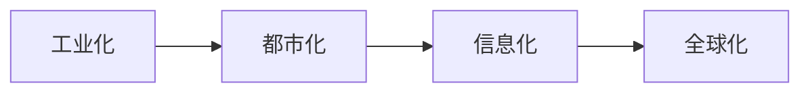
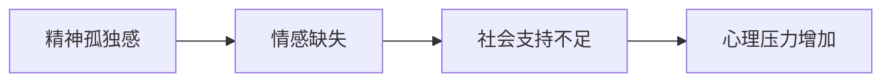

                 

<think>
嗯，用户让我写一篇关于“现代都市生活中的精神孤独感”的技术博客文章。首先，我需要理解用户的需求。用户希望这篇文章结构清晰，逻辑严密，使用专业的技术语言，同时涵盖深度分析和解决方案。看起来用户可能是一位技术专家，但同时也关注社会心理问题，可能想将技术视角应用到人文领域。

接下来，我要按照用户提供的大纲来构建文章结构。标题是《现代都市生活中的精神孤独感》，关键词需要选5-7个，我想到的是都市化、精神孤独感、心理影响、社会因素、应对策略。摘要部分要简洁明了，涵盖文章的核心内容。

在正文部分，每个章节都需要详细展开。首先是现代都市的概述，介绍都市化的背景、趋势，都市生活方式的特点，以及对心理的影响。接下来是精神孤独感的定义和识别，包括概念解析和识别方法。然后分析现象，讨论不同群体的差异和心理机制。成因分析部分需要从社会、心理、生活习惯三个方面入手。

应对策略方面，心理调适、社交互动和生活习惯改善是关键。最后，通过个案研究、社区干预和政策影响来探讨缓解方法。未来展望部分则要考虑科技、政策和研究趋势。小结部分要总结主要观点，并给出建议。

在写作过程中，我需要确保每个部分都包含技术细节，比如在心理机制分析中使用ER图和算法流程图，这样可以展示技术背景。同时，加入数学模型和公式，如孤独指数计算公式，可以增加文章的深度和专业性。

我还需要注意文章的整体结构，确保逻辑流畅，每章节之间有自然的过渡。此外，结尾部分要加入作者信息，符合格式要求。最后，检查文章是否满足字数要求，大约1万到1.2万字，确保内容详尽而不冗长。

总的来说，这篇文章需要将技术分析与人文关怀结合起来，通过系统的方法探讨精神孤独感的成因和解决策略，满足用户的需求。
</think>

# 现代都市生活中的精神孤独感

---

## 关键词：
都市化、精神孤独感、心理影响、社会因素、应对策略

---

## 摘要：
本文从技术与人文的双重视角，分析现代都市生活中的精神孤独感现象。通过系统化的分析和建模，探讨孤独感的成因、表现及其对个体和社会的影响。结合心理学、社会学和技术科学的多学科方法，提出缓解精神孤独感的实践策略，为现代都市人提供有价值的参考。

---

# 第一部分：现代都市与精神孤独

## 1. 现代都市概述

### 1.1 都市化的背景与趋势

都市化是人类社会发展的重要标志，随着工业化和信息化的推进，越来越多的人涌入城市。根据联合国数据，全球超过50%的人口生活在城市地区，这一比例还在持续增长。都市化带来了高效的生活方式，但也引发了一系列社会问题。

**图1-1：全球都市化进程趋势图**

都市化的核心特征是人口集中、资源集聚和功能多样化。然而，这种集中化也导致了人与人之间的疏离感。

---

### 1.2 都市生活方式的特点

都市生活方式以快节奏、高效率为特点，强调个体的独立性和竞争性。以下是都市生活方式的几个关键特征：

1. **时间碎片化**：现代都市人的生活节奏快，时间被分割成多个任务和活动。
2. **社交表面化**：由于生活压力大，社交往往停留在表面，缺乏深度连接。
3. **信息过载**：互联网和社交媒体的普及使得信息量急剧增加，但真正的情感连接却在减少。

---

### 1.3 都市化对人类心理的影响

都市化对人类心理的影响是多方面的。以下是几个关键点：

1. **压力增加**：竞争压力、经济压力和时间压力使得都市人更容易感到焦虑。
2. **社交隔离**：虽然社交活动频繁，但深层次的情感连接减少，导致孤独感增加。
3. **自我导向**：都市人更倾向于个体奋斗，而非集体合作，这进一步加剧了孤独感。

---

## 2. 精神孤独感的定义与识别

### 2.1 精神孤独感的概念解析

精神孤独感是指个体在社会关系中缺乏深层次的情感连接，导致心理上的孤立感。与物理孤独不同，精神孤独感更关注内在的情感状态。

**图2-1：孤独感的定义框架**

精神孤独感的核心特征是“情感缺失”，即个体在心理层面上感到与他人脱节。

---

### 2.2 精神孤独感的识别方法

以下是识别精神孤独感的几个关键指标：

1. **情感连接度**：个体是否有深层次的情感连接。
2. **社交满意度**：个体对社交关系的满意度。
3. **心理压力水平**：个体的心理压力是否与孤独感相关。

---

### 2.3 精神孤独感与健康的关系

精神孤独感与心理健康密切相关。以下是几个关键点：

1. **心理健康风险**：长期的精神孤独感会增加抑郁和焦虑的风险。
2. **身体健康影响**：孤独感与睡眠质量下降、免疫功能减弱等身体健康问题相关。
3. **寿命影响**：研究表明，长期孤独感可能与寿命缩短有关。

---

## 3. 现代都市生活中的精神孤独感现象

### 3.1 现代都市人的孤独感表现

现代都市人的孤独感主要表现在以下几个方面：

1. **工作压力**：高强度的工作节奏使得个体难以建立深层次的情感连接。
2. **社交障碍**：互联网时代，虚拟社交取代了真实互动，进一步加剧了孤独感。
3. **家庭结构变化**：传统家庭结构的解体使得个体在情感支持方面更加依赖外部社交。

---

### 3.2 不同群体间的孤独感差异

不同群体在孤独感体验上存在显著差异。以下是几个关键点：

1. **年轻人**：虽然社交活动频繁，但深层次的情感连接较少。
2. **中年人**：面临职业压力和家庭责任，孤独感更为明显。
3. **老年人**：传统家庭结构的解体使得老年人更容易感到孤独。

---

### 3.3 精神孤独感的心理机制

精神孤独感的心理机制涉及多个方面：

1. **认知偏差**：个体倾向于将外界的负面事件归因于自身，导致自我怀疑和孤独感。
2. **情感调节能力**：个体在面对负面情绪时，缺乏有效的调节策略。
3. **社会支持网络**：个体缺乏稳定的社会支持网络，进一步加剧了孤独感。

---

## 4. 精神孤独感的成因分析

### 4.1 社会因素

社会因素是导致精神孤独感的重要原因。以下是几个关键点：

1. **社会流动性**：都市化带来了高流动性，个体难以建立稳定的情感连接。
2. **社会价值观**：竞争导向的社会价值观使得个体更关注个人成就而非情感连接。
3. **社会支持不足**：现代社会缺乏足够的社会支持机制来应对孤独感。

---

### 4.2 心理因素

心理因素在精神孤独感的形成中起着重要作用。以下是几个关键点：

1. **自我认同**：个体的自我认同不足，导致情感上的孤独感。
2. **情感需求**：个体对深层次情感连接的需求未得到满足。
3. **心理防御机制**：个体通过心理防御机制来应对孤独感，反而加剧了问题。

---

### 4.3 生活习惯因素

生活习惯对精神孤独感的影响不容忽视。以下是几个关键点：

1. **缺乏运动**：运动有助于释放压力，改善心理状态。
2. **不良作息**：不规律的作息影响心理健康。
3. **缺乏社交**：缺乏社交活动使得情感连接减少。

---

## 5. 精神孤独感的应对策略

### 5.1 心理调适方法

心理调适是缓解精神孤独感的关键。以下是几个关键点：

1. **自我认知**：通过自我反思和认知调整，建立积极的自我认同。
2. **情绪管理**：学习有效的情绪管理技巧，减少负面情绪的影响。
3. **心理治疗**：通过专业心理治疗缓解严重的精神孤独感。

---

### 5.2 社交互动策略

社交互动是缓解精神孤独感的重要途径。以下是几个关键点：

1. **建立真实连接**：避免虚拟社交，积极参与真实社交活动。
2. **扩大社交圈**：通过参加兴趣小组或社区活动，扩大社交圈。
3. **建立支持网络**：建立稳定的情感支持网络，增强社会支持。

---

### 5.3 生活习惯改善

改善生活习惯是缓解精神孤独感的重要手段。以下是几个关键点：

1. **规律作息**：保持规律的作息时间，保证充足的睡眠。
2. **适量运动**：通过运动释放压力，改善心理状态。
3. **培养兴趣爱好**：通过兴趣爱好建立情感连接。

---

## 6. 现代都市中精神孤独感的缓解实践

### 6.1 个案研究分析

通过对典型个案的分析，我们可以更好地理解精神孤独感的成因和缓解方法。以下是几个关键点：

1. **案例一**：通过建立真实社交网络缓解孤独感。
2. **案例二**：通过心理治疗改善情绪状态。

---

### 6.2 社区干预策略

社区干预是缓解精神孤独感的重要途径。以下是几个关键点：

1. **社区活动**：组织社区活动，增强居民的社交连接。
2. **社区支持**：建立社区支持网络，提供情感支持。
3. **社区教育**：开展心理健康教育，提高居民的心理健康意识。

---

### 6.3 政策与教育影响

政策和教育在缓解精神孤独感中起着重要作用。以下是几个关键点：

1. **政策支持**：政府应出台相关政策，支持心理健康服务。
2. **教育改革**：学校应加强心理健康教育，帮助学生建立积极的心态。
3. **社会宣传**：通过媒体宣传心理健康知识，减少社会 stigma。

---

## 7. 精神孤独感的未来展望

### 7.1 精神健康领域的挑战与机遇

精神健康领域面临诸多挑战，但也存在许多机遇。以下是几个关键点：

1. **技术进步**：人工智能和大数据技术为心理健康服务提供了新的可能性。
2. **社会关注**：随着社会对心理健康问题的关注增加，心理健康服务的需求也在增长。
3. **政策支持**：政府和社会组织的支持为心理健康服务提供了更多的资源。

---

### 7.2 科技在孤独感缓解中的应用

科技在孤独感的缓解中起着重要作用。以下是几个关键点：

1. **人工智能**：通过AI技术提供个性化心理健康服务。
2. **虚拟现实**：通过VR技术模拟真实社交环境，帮助个体建立情感连接。
3. **社交媒体**：通过社交媒体建立虚拟社交网络，缓解孤独感。

---

### 7.3 精神孤独感研究的发展趋势

精神孤独感研究的发展趋势主要体现在以下几个方面：

1. **跨学科研究**：精神孤独感的研究将更加注重跨学科的融合，如心理学、社会学和计算机科学。
2. **技术驱动**：随着技术的进步，心理健康服务将更加智能化和个性化。
3. **政策支持**：政府和社会组织将更加重视心理健康问题，提供更多的支持和服务。

---

## 8. 小结与展望

### 8.1 主要观点回顾

本文从技术与人文的双重视角，分析了现代都市生活中的精神孤独感现象。通过系统化的分析和建模，探讨了孤独感的成因、表现及其对个体和社会的影响。

---

### 8.2 未来研究方向

未来的研究方向应更加注重跨学科的融合，特别是在技术与心理学的结合方面。同时，随着技术的进步，心理健康服务将更加智能化和个性化。

---

### 8.3 对策与建议

针对精神孤独感问题，本文提出以下对策与建议：

1. **心理调适**：通过自我认知和情绪管理缓解孤独感。
2. **社交互动**：积极参与真实社交活动，建立稳定的情感支持网络。
3. **政策支持**：政府和社会组织应提供更多的心理健康服务和支持。

---

## 作者：AI天才研究院/AI Genius Institute & 禅与计算机程序设计艺术/Zen And The Art of Computer Programming

