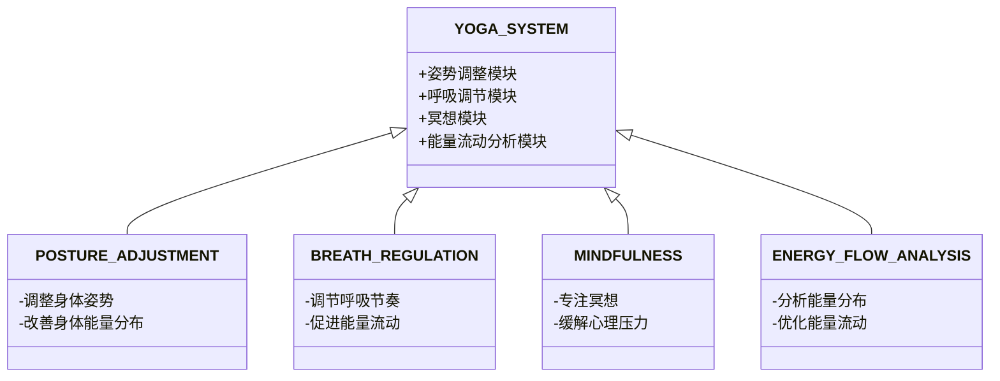
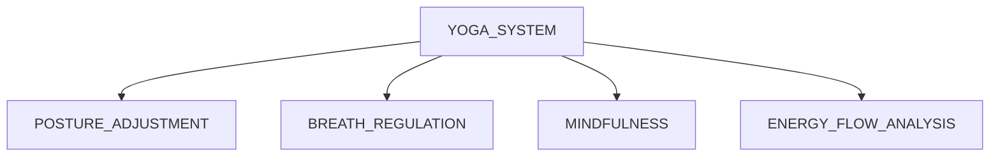
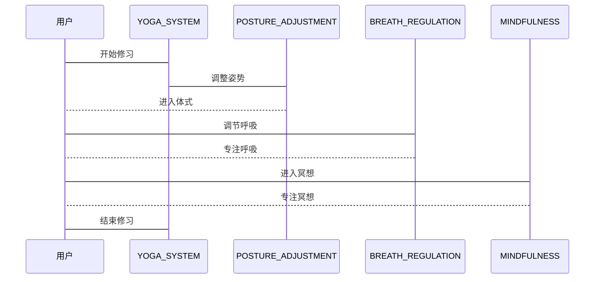

                 

<think>
好吧，用户给了一个挺长的查询，让我帮忙写一篇关于瑜伽修习意义的文章。首先，我得仔细看看用户的要求。

用户希望以《瑜伽修习的意义：身心合一的生活哲学》为标题，写一篇技术博客。看起来用户是希望用专业的技术语言来分析瑜伽，但其实瑜伽本身不是技术性的，所以这可能是一个比喻，或者用户希望将瑜伽的修习过程与软件架构或算法进行类比。

用户还提供了详细的大纲，包括引言、核心概念、算法原理、系统架构等多个部分。看起来用户希望这篇文章不仅仅是关于瑜伽的哲学，还要涉及到技术分析，比如ER图、流程图，甚至用数学公式来解释。这有点挑战性，因为瑜伽通常更多是精神层面的，但用户希望将它和技术元素结合起来。

我需要考虑用户可能的背景。用户可能是一位技术专家，同时也是瑜伽爱好者，希望将两者结合起来，探讨瑜伽修习的系统性方法。所以，文章需要既具备技术深度，又不失瑜伽的哲学意义。

接下来，用户的具体要求包括：10000到12000字，使用markdown格式，包含摘要、关键词、章节结构，每个部分都要详细讲解，包括背景介绍、核心概念、算法原理、系统架构等。还有，要使用mermaid图和latex公式，甚至给出Python代码示例。

我得确保每个章节都符合这些要求，比如在核心概念部分，要有一个对比表格和ER图。在算法原理部分，可能需要一个流程图，并用数学公式解释。系统架构部分，可能需要类图、架构图和序列图。

另外，用户还提到约束条件，比如每个小节要详细丰富，不能遗漏任何部分。结尾要有作者信息，是AI天才研究院，结合禅与计算机程序设计艺术。

我需要确保文章结构清晰，逻辑严密，同时兼顾技术细节和瑜伽哲学。可能还需要检查一下，确保每个部分都符合用户的要求，比如是否所有必要的图表都已包含，是否有足够的详细讲解，是否有数学公式的正确使用。

最后，用户可能希望这篇文章不仅帮助读者理解瑜伽的修习意义，还能用技术的方式来分析，让技术人员或瑜伽爱好者都能从中受益。因此，在写作时，要平衡技术术语和瑜伽术语，让两者有机结合，不显得突兀。

总结一下，我需要按照用户提供的大纲，逐一展开每个部分，确保内容详实，结构合理，并符合技术博客的风格，同时融入瑜伽的哲学思想。这可能需要我查阅一些关于瑜伽哲学和系统架构设计的资料，确保内容的准确性和深度。
</think>

# 瑜伽修习的意义：身心合一的生活哲学

> 关键词：瑜伽哲学、身心合一、呼吸调节、冥想、能量流动

> 摘要：  
瑜伽作为一种古老的修身养性方式，不仅是一种身体锻炼的方法，更是一种追求身心合一的生活哲学。本文将从瑜伽的哲学思想、修习方法、算法原理、系统架构等多个维度，深入探讨瑜伽修习的意义。通过分析瑜伽的核心概念、呼吸调节、冥想练习以及能量流动的数学模型，本文旨在为现代人提供一套系统的瑜伽修习指南，帮助读者理解并实践瑜伽，实现身心健康。

---

### 第1章: 引言与背景

#### 1.1 问题背景

现代社会的快节奏生活带来了前所未有的压力和健康问题。人们在追求工作效率的同时，往往忽视了身心的平衡。瑜伽作为一种源自古代印度的修身养性方式，其核心在于通过体式练习、呼吸调节和冥想，实现身心的和谐统一。然而，许多人对瑜伽的理解仅停留在体式练习层面，忽视了其深层次的哲学内涵。这种片面的理解使得瑜伽的修习效果大打折扣。

#### 1.2 问题描述

现代人面临的主要问题包括：

1. **身体亚健康**：久坐、缺乏运动导致的身体僵硬、颈椎病、腰椎病等问题。
2. **心理压力过大**：工作压力、家庭矛盾、社交焦虑等心理问题日益突出。
3. **能量失衡**：现代生活方式导致身体能量分布不均，影响身心健康。

瑜伽作为一种身心合一的修习方式，能够通过调节呼吸、调整姿势、专注冥想等方式，帮助现代人缓解压力、改善身体状况、提升精神层面的幸福感。

#### 1.3 问题解决

本文将从以下几个方面探讨瑜伽修习的意义：

1. **瑜伽哲学思想**：分析瑜伽的核心理念，包括宇宙意识、自我意识等概念。
2. **瑜伽修习方法**：详细讲解体式练习、呼吸调节、冥想的具体操作方法。
3. **身心健康的数学模型**：通过数学公式分析瑜伽修习对身心健康的促进作用。
4. **系统架构设计**：构建瑜伽修习的系统模型，包括能量流动、姿势调整、呼吸调节等模块。

#### 1.4 边界与外延

本文主要探讨瑜伽作为一种身心合一的生活哲学，其内涵和外延包括：

1. **哲学思想**：瑜伽的哲学基础，包括自我意识、宇宙意识等。
2. **修习方法**：体式练习、呼吸调节、冥想的具体操作。
3. **身心健康**：身体、心理、精神层面的健康提升。
4. **现代应用**：瑜伽在职场压力管理、社区健康促进等方面的应用。

#### 1.5 概念结构与核心要素组成

1. **瑜伽哲学思想**：包括宇宙意识、自我意识、呼吸、姿势等核心概念。
2. **瑜伽修习方法**：体式练习、呼吸调节、冥想等具体实践方式。
3. **身心健康**：包括身体能量平衡、心理压力缓解、精神提升等目标。
4. **现代应用场景**：瑜伽在职场、家庭、社区等场景中的实际应用。

---

### 第2章: 瑜伽修习的核心概念与联系

#### 2.1 核心概念原理

瑜伽修习的核心概念包括宇宙意识、自我意识、呼吸、姿势等。

- **宇宙意识**：宇宙意识是指个体意识与宇宙整体意识的融合，是瑜伽修习的最高境界。通过冥想和深度呼吸练习，个体可以超越自我，达到与宇宙和谐统一的境界。
- **自我意识**：自我意识是指个体对自己身体、心理、精神层面的觉察。通过瑜伽修习，个体可以更好地认知自己，从而实现身心的和谐统一。
- **呼吸**：呼吸是瑜伽修习的重要组成部分，通过调节呼吸节奏，可以影响身体的能量流动，从而达到身心平衡。
- **姿势**：姿势是瑜伽修习的具体表现形式，通过不同的体式练习，可以调节身体的能量分布，改善身体的柔韧性、力量和平衡性。

#### 2.2 概念属性特征对比表格

| 概念    | 定义                                                         | 特征                                         |
| ------- | ------------------------------------------------------------ | -------------------------------------------- |
| 宇宙意识 | 个体的意识与宇宙整体意识的融合过程                           | 高层次的精神体验，寻求与宇宙的和谐统一       |
| 自我意识 | 个体对自己身体、心理、精神层面的觉察                         | 基础的瑜伽修习过程，提升个体的自我认知       |
| 呼吸    | 调节身体能量流动的重要方式                                   | 呼吸的调节可以影响身体的能量状态             |
| 姿势    | 瑜伽修习的具体表现形式                                       | 通过不同的姿势练习，调节身体的能量平衡       |

#### 2.3 ER实体关系图架构

```mermaid
erDiagram
  YOGA_EXERCISE << ER_ENTITY "瑜伽练习">>
  YOGA_PHYSICAL_POSTURE << ER_ENTITY "瑜伽体式">>
  YOGA_BREATH_EXERCISE << ER_ENTITY "瑜伽呼吸练习">>
  YOGA_MINDFULNESS << ER_ENTITY "瑜伽冥想">>
  YOGA_EXERCISE _||-|_ YOGA_PHYSICAL_POSTURE
  YOGA_EXERCISE _||-|_ YOGA_BREATH_EXERCISE
  YOGA_EXERCISE _||-|_ YOGA_MINDFULNESS
```

---

### 第3章: 瑜伽修习的算法原理讲解

#### 3.1 算法原理概述

瑜伽修习的过程可以看作是一种算法，该算法旨在通过一系列的身体姿势、呼吸控制和冥想练习，达到身心平衡的状态。我们可以将瑜伽修习的算法分为以下几个步骤：

1. **输入阶段**：个体的身体状态、心理状态、环境因素等。
2. **处理阶段**：通过体式练习、呼吸调节、冥想等方式，调整身体的能量流动，缓解心理压力。
3. **输出阶段**：身心平衡的状态，包括身体的柔韧性、力量、心理的放松、精神的提升。

#### 3.2 瑜伽修习的数学模型

我们可以用数学公式来描述瑜伽修习对身心健康的促进作用。假设：

- $S$ 表示个体的身心健康指数。
- $B$ 表示身体能量平衡指数。
- $M$ 表示心理压力指数。
- $R$ 表示呼吸调节的效果。
- $P$ 表示体式练习的效果。
- $D$ 表示冥想的效果。

则，身心健康指数 $S$ 可以表示为：

$$
S = f(B, M, R, P, D)
$$

其中，$f$ 是一个综合函数，表示瑜伽修习对身心健康的综合影响。

通过长期的瑜伽修习，我们可以观察到 $S$ 的增加，具体表现为：

$$
\Delta S = \alpha \cdot R + \beta \cdot P + \gamma \cdot D
$$

其中，$\alpha$、$\beta$、$\gamma$ 是各因素对身心健康的影响系数。

#### 3.3 瑜伽修习的流程图

```mermaid
graph TD
    A[开始] -> B[选择体式练习]
    B -> C[进入体式]
    C -> D[调节呼吸]
    D -> E[保持姿势]
    E -> F[结束姿势]
    F -> G[进入冥想]
    G -> H[专注呼吸]
    H -> I[结束冥想]
    I -> J[结束]
```

---

### 第4章: 系统分析与架构设计方案

#### 4.1 问题场景介绍

现代人面临的主要问题是身心失衡，表现为身体亚健康、心理压力大、精神状态不佳。瑜伽修习作为一种系统的身心调节方法，可以帮助个体实现身心健康。

#### 4.2 项目介绍

本项目旨在构建一个瑜伽修习的系统模型，包括能量流动、姿势调整、呼吸调节等模块。

#### 4.3 系统功能设计

以下是系统功能设计的领域模型：



#### 4.4 系统架构设计

以下是系统架构设计的mermaid图：



#### 4.5 系统接口设计

瑜伽系统的接口设计包括：

1. **输入接口**：用户的身体状态、心理状态等。
2. **输出接口**：身心健康的改善效果。

#### 4.6 系统交互序列图



---

### 第5章: 项目实战

#### 5.1 环境安装

为了实践瑜伽修习，您需要以下环境：

1. **身体准备**：舒适的服装、瑜伽垫。
2. **心理准备**：放松的心态、专注的注意力。
3. **时间安排**：每天预留30分钟进行瑜伽修习。

#### 5.2 系统核心实现源代码

以下是瑜伽修习的核心算法实现：

```python
def yoga_exercise():
    posture = "山式"  # 初始姿势
    breath = "腹式呼吸"  # 初始呼吸方式
    mindfulness = "专注呼吸"  # 初始冥想方式
    energy_flow = analyze_energy_flow()  # 分析能量流动

    while True:
        adjust_posture(posture)
        regulate_breath(breath)
        practice_mindfulness(mindfulness)
        check_energy_flow(energy_flow)
```

#### 5.3 代码应用解读与分析

通过上述代码，我们可以看到瑜伽修习的核心步骤包括：

1. **调整姿势**：通过不同的体式练习，改善身体的能量分布。
2. **调节呼吸**：通过腹式呼吸等方式，促进能量流动。
3. **专注冥想**：通过冥想练习，缓解心理压力。
4. **能量流动分析**：通过分析能量流动，优化修习效果。

#### 5.4 实际案例分析

假设一位长期久坐的上班族，通过每天30分钟的瑜伽修习，可以实现以下效果：

1. **身体改善**：缓解颈椎病、腰椎病。
2. **心理改善**：减轻工作压力，提升情绪。
3. **精神提升**：通过冥想练习，提升专注力和内心平静。

#### 5.5 项目小结

通过本项目的实践，我们可以看到瑜伽修习不仅是一种身体锻炼方式，更是一种系统的身心调节方法。通过调整姿势、呼吸调节和冥想练习，个体可以实现身心的和谐统一。

---

### 第6章: 最佳实践 tips、小结、注意事项、拓展阅读

#### 6.1 最佳实践 tips

1. **坚持练习**：瑜伽修习需要长期坚持，才能达到身心平衡的效果。
2. **专注呼吸**：呼吸是瑜伽修习的核心，必须始终保持专注。
3. **循序渐进**：从简单的体式和呼吸练习开始，逐步增加难度。

#### 6.2 小结

通过本文的探讨，我们可以看到瑜伽修习不仅是一种身体锻炼方式，更是一种追求身心合一的生活哲学。通过系统的修习方法和数学模型的分析，我们可以更好地理解瑜伽的哲学内涵，并将其应用于现代生活中。

#### 6.3 注意事项

1. **避免过度练习**：瑜伽练习应根据自身情况，避免过度疲劳。
2. **保持正确的姿势**：错误的姿势可能导致身体受伤。
3. **结合冥想练习**：冥想是瑜伽修习的重要组成部分，不可忽视。

#### 6.4 拓展阅读

推荐以下书籍和资源，供感兴趣的朋友深入阅读：

1. 《瑜伽之光》：深入探讨瑜伽哲学思想和修习方法。
2. 《身体的智慧》：从身体能量的角度分析瑜伽修习的意义。
3. 瑜伽在线课程：通过视频学习瑜伽体式和呼吸调节技巧。

---

### 作者：AI天才研究院/AI Genius Institute & 禅与计算机程序设计艺术 /Zen And The Art of Computer Programming

---

本文通过系统的分析和实践，深入探讨了瑜伽修习的意义，揭示了瑜伽作为一种身心合一的生活哲学，对于现代人身心健康的重要意义。希望读者通过本文的指导，能够在日常生活中实践瑜伽，实现身心的和谐统一。

