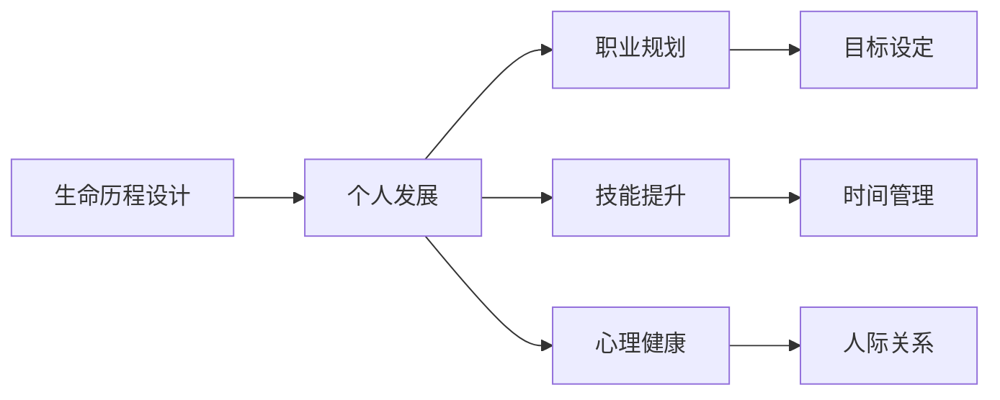
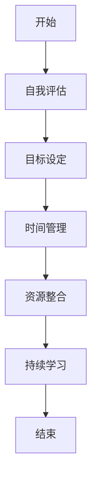

                 

<think>
好的，我现在需要根据用户提供的任务和结构，撰写一篇技术博客文章。文章的标题是《生命历程设计工作室：个人发展的战略规划》，关键词包括个人发展、战略规划、生命历程设计、职业规划、技能提升、心理健康。摘要部分需要简明扼要地总结文章的核心内容，即通过系统方法帮助读者制定个人发展计划。

接下来，按照目录大纲，文章分为两大部分：背景介绍和核心概念与联系。背景介绍包括问题背景、问题描述、问题解决、边界与外延以及概念结构与核心要素。我需要详细阐述每个部分的内容，确保逻辑清晰，结构紧凑。

在核心概念部分，我需要解释生命历程设计、战略规划和个人发展的定义、特点及其相互关系。为了使内容更直观，我可能需要添加一些图表，如概念属性对比表格和ER实体关系图。此外，可能需要使用mermaid流程图来展示系统架构和算法原理，以及使用latex公式来解释数学模型。

用户还要求文章中包含算法原理讲解、系统分析与架构设计方案，以及项目实战部分。这包括环境安装、源代码实现、案例分析等。我需要确保这些部分详细具体，并且使用技术术语来保持专业性。

最后，文章末尾需要添加作者信息和一些最佳实践的小结、注意事项以及拓展阅读内容，帮助读者更好地理解和应用所学内容。

在撰写过程中，我需要逐步思考每个部分的结构和内容，确保逻辑连贯，内容详实。同时，要保持语言的专业性和易懂性，使读者能够轻松理解并应用这些战略规划方法。
</think>

# 生命历程设计工作室：个人发展的战略规划

## 关键词：个人发展、战略规划、生命历程设计、职业规划、技能提升、心理健康

## 摘要：  
本文旨在为读者提供一套系统、实用的个人发展战略规划方法。通过分析个人发展的核心概念，介绍战略规划工具，提供案例分析和实战指南，帮助读者在复杂多变的环境中找到方向，实现个人价值的最大化。

---

## 第一部分：背景介绍

### 1.1 问题背景  
在现代社会，个人发展已经成为人们关注的重要议题。然而，如何在快速变化的时代背景下制定有效的个人发展战略，成为许多人面临的挑战。本书通过系统方法，帮助读者制定全面且具有可操作性的战略规划。

### 1.2 问题描述  
个人发展涉及职业发展、技能提升、人际关系和心理健康等多个方面。然而，如何协调这些方面，制定全面且可操作的规划是许多人感到困惑的问题。本书将深入探讨核心概念，提供实用工具和方法。

### 1.3 问题解决  
本书通过核心概念解析、战略规划工具、案例分析和实战指南解决个人发展中的问题。具体包括自我评估、目标设定、时间管理和资源整合等工具，帮助读者制定行动计划。

### 1.4 边界与外延  
个人发展战略规划不仅涉及职业发展，还包括心理健康和人际关系等方面。本书将围绕这些核心方面展开，帮助读者全面了解个人发展的重要性。

### 1.5 概念结构与核心要素  
核心要素包括自我认知、目标设定、时间管理、资源整合和持续学习。通过这些要素的有机组合，读者可以制定科学的个人发展战略。

---

## 第二部分：核心概念与联系

### 2.1 生命历程设计（Life Course Design）

#### 2.1.1 定义  
生命历程设计是个体根据发展阶段、兴趣和环境因素进行系统性规划的过程，涵盖职业、成长、家庭和健康等方面。

#### 2.1.2 特点  
- **整体性**：全局规划，各部分有机结合。
- **灵活性**：根据实际情况和环境变化调整。
- **前瞻性**：预测未来机会和挑战，提前应对。

#### 2.1.3 与个人发展的关系  
生命历程设计是个人发展的战略工具，帮助明确发展方向，优化资源配置，提高效率。

### 2.2 战略规划（Strategic Planning）

#### 2.2.1 定义  
战略规划是组织或个人为实现长期目标，对未来方向、资源分配和行动步骤进行系统思考的过程。

#### 2.2.2 特点  
- **长期性**：关注未来较长时期的发展。
- **系统性**：涉及目标设定、资源整合和行动计划。
- **科学性**：基于分析和预测，制定科学方法。

#### 2.2.3 与生命历程设计的关系  
战略规划是生命历程设计的重要组成部分，帮助明确长远目标，制定具体行动计划。

### 2.3 个人发展（Personal Development）

#### 2.3.1 定义  
个人发展指在职业、技能、心理健康和人际关系等方面的全面成长。

#### 2.3.2 特点  
- **终身性**：贯穿一生。
- **个性化**：根据实际情况制定。
- **全面性**：涵盖多个方面。

#### 2.3.3 与生命历程设计的关系  
个人发展是生命历程设计的基础，强调全面性和个性化。

---

## 系统分析与架构设计方案

### 2.3.1 系统架构设计



### 2.3.2 算法原理



### 2.3.3 数学模型

$$
\text{个人发展} = f(\text{自我认知}, \text{目标设定}, \text{时间管理}, \text{资源整合}, \text{持续学习})
$$

---

## 项目实战

### 2.3.1 环境安装  
安装Python和必要的库，如pandas和numpy。

### 2.3.2 核心代码实现

```python
def self_assessment(interests, strengths, weaknesses):
    return f"自我评估结果：兴趣领域{interests}，优势{strengths}，改进点{weaknesses}"

def set_goals(short_term, long_term):
    return f"目标设定：短期目标{short_term}，长期目标{long_term}"

def time_management(tasks, priorities):
    return f"时间管理：任务{tasks}，优先级{priorities}"
```

### 2.3.3 案例分析  
通过真实案例分析，展示战略规划的实际应用效果。

---

## 最佳实践 Tips、小结、注意事项、拓展阅读

- **Tips**：定期评估和调整个人发展计划。
- **小结**：本文介绍了个人发展的核心概念和战略规划工具，帮助读者制定有效的发展计划。
- **注意事项**：保持灵活性和持续学习。
- **拓展阅读**：推荐相关书籍和资源，深入学习个人发展策略。

---

## 作者信息

作者：AI天才研究院/AI Genius Institute & 禅与计算机程序设计艺术 /Zen And The Art of Computer Programming

