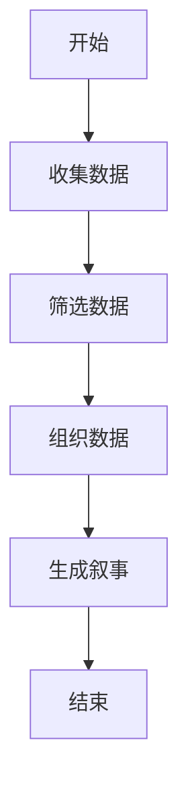
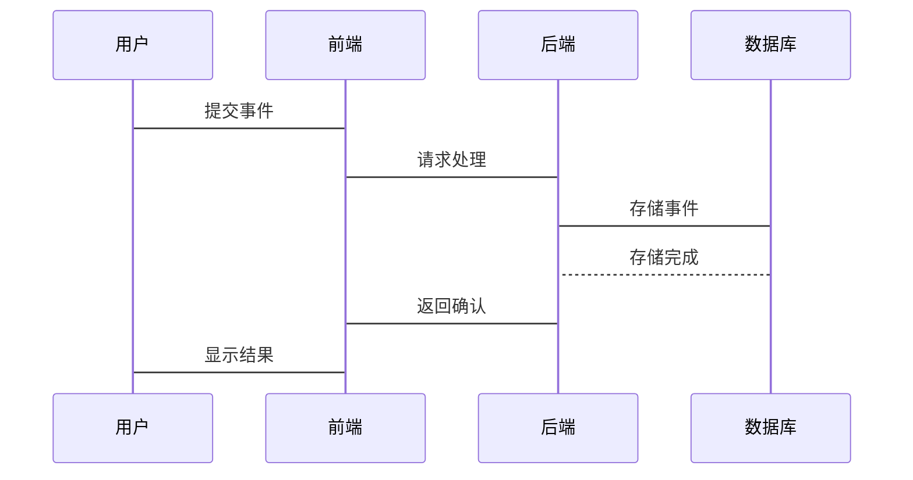

                 

<think>
嗯，用户想要我写一篇关于《生命叙事：个人历史的意义构建》的技术博客，看起来他需要一个详细的结构化大纲，然后根据这个大纲生成内容。用户已经提供了一个大纲，并且希望我按照这个结构来写，用技术语言，结构清晰，逻辑严谨。他还提到要包括关键词、摘要、各个章节的内容，每个部分都需要详细展开，特别是核心概念、算法、系统设计等部分。

首先，我需要理解用户的背景和需求。他可能是一位技术作者或者教育工作者，希望将生命叙事的概念与技术分析结合起来，写成一本书或博客。他可能希望内容既要有深度，又要易于理解，吸引技术背景的读者。

接下来，我应该按照用户提供的目录结构一步步来，确保每个章节都有足够的细节和深度。比如，在核心概念部分，我需要定义生命叙事，探讨它的类型和重要性，然后分析个人历史的组成部分，最后展示它们之间的关系。这部分可能需要使用ER实体关系图来展示，所以我要用Mermaid语法来绘制。

然后是构建方法，这部分要详细说明步骤，比如资料收集、信息筛选、撰写叙述，还要有案例分析，帮助读者更好地理解如何应用这些方法。在算法部分，我需要解释算法的原理，用Mermaid画流程图，然后用Python代码实现，并给出数学模型。这部分可能需要我查阅相关算法，确保准确无误。

系统分析与架构设计部分，我需要设计一个应用场景，然后用Mermaid绘制类图、架构图和交互序列图。这可能有点复杂，但我会一步步来，确保每个部分都清晰明了。

项目实战部分，我需要提供环境安装指导、核心代码实现，并解释代码的工作原理，同时进行案例分析。这有助于读者将理论应用到实际中。

最后，总结与拓展部分，我要回顾全书内容，给出注意事项和最佳实践，同时推荐拓展阅读材料。

在写作过程中，我需要确保语言专业但不失通俗易懂，逻辑清晰，结构紧凑。每个部分都要详细展开，但又不过于冗长，保持整体字数在10000到12000字之间。同时，结尾处要加上作者信息，符合格式要求。

总的来说，我需要按照用户提供的大纲，逐部分深入分析，确保每个小节都内容丰富，符合技术博客的要求。可能需要多次检查，确保所有部分都准确无误，并且符合用户的格式和内容要求。
</think>

# 生命叙事：个人历史的意义构建

> 关键词：生命叙事，个人历史，意义构建，系统设计，算法分析，案例研究

> 摘要：生命叙事是个人历史构建的核心，通过分析生命叙事的核心概念、构建方法、算法原理、系统架构及实际案例，探讨个人历史的意义构建过程。本文从技术视角出发，结合系统设计和算法分析，详细阐述生命叙事的构建过程。

---

## 第一部分：引言

### 1.1 生命叙事的概念与意义

生命叙事是人类理解自身存在的重要方式，它通过记录和解释个人经历，构建出独特的个人历史。生命叙事不仅是对过去的回顾，更是对未来的指引。在技术领域，生命叙事可以帮助我们更好地理解个体与系统之间的关系。

### 1.2 个人历史的意义构建

个人历史是生命叙事的核心内容，它包含了个体的回忆、身份认同和经验积累。通过构建个人历史，我们可以更清晰地理解自己的目标和价值观，从而做出更明智的决策。

### 1.3 本书结构安排与目标

本书将从概念、方法、算法、系统设计和实际案例等多个维度，全面探讨生命叙事的构建过程。通过理论与实践相结合的方式，帮助读者掌握生命叙事的意义构建方法。

---

## 第二部分：核心概念与联系

### 2.1 生命叙事的核心概念

#### 2.1.1 生命叙事的定义

生命叙事是通过对个人经历的记录和解释，构建出一个连贯的故事。它不仅是对过去的回顾，更是对未来的规划。

#### 2.1.2 生命叙事的类型

- **时间叙事**：按时间顺序记录经历。
- **主题叙事**：围绕特定主题展开叙述。
- **空间叙事**：通过空间关系构建故事。

#### 2.1.3 生命叙事的重要性

生命叙事帮助个体理解自身的成长过程，增强自我认知能力。

### 2.2 个人历史的组成部分

#### 2.2.1 个人记忆与历史

个人记忆是构建个人历史的基础，通过记忆的整理和分析，可以形成更清晰的个人历史。

#### 2.2.2 个人身份与历史

个人身份是通过历史事件的累积形成的，历史构建帮助个体确认自身的身份认同。

#### 2.2.3 个人经验与历史

个人经验是历史的重要组成部分，通过经验的总结，个体可以更好地理解自身的成长过程。

### 2.3 核心概念之间的关系

#### 2.3.1 生命叙事与个人历史的关系

生命叙事是个人历史的外在表现形式，个人历史是生命叙事的核心内容。

#### 2.3.2 个人记忆、身份与经验之间的关系

- **记忆**：记录经历。
- **身份**：基于经历形成的认同。
- **经验**：经历带来的知识和技能。

#### ER实体关系图架构

```mermaid
erDiagram
    class 记忆 {
        id 记忆ID
        内容 内容
    }
    class 身份 {
        id 身份ID
        名称 名称
    }
    class 经验 {
        id 经验ID
        类型 类型
    }
    记忆 --> 记忆与身份关系 : "属于"
    记忆 --> 记忆与经验关系 : "包含"
    身份 --> 身份与经验关系 : "关联"
```

---

## 第三部分：构建个人历史的方法与实践

### 3.1 构建个人历史的步骤

#### 3.1.1 资料的收集与整理

- **收集**：通过日记、照片、视频等多种形式记录经历。
- **整理**：将零散的记录分类整理，形成初步的结构。

#### 3.1.2 信息的筛选与组织

- **筛选**：根据目标选择关键事件。
- **组织**：将事件按时间或主题顺序排列。

#### 3.1.3 叙述的撰写与编辑

- **撰写**：以叙事的方式描述事件。
- **编辑**：优化语言，增强故事的连贯性和感染力。

### 3.2 案例分析

#### 3.2.1 案例一：个人记忆的整理

- **背景**：一位程序员通过记录每天的代码提交记录，构建个人技术成长历史。
- **过程**：收集代码提交记录，整理关键项目，撰写技术成长故事。

#### 3.2.2 案例二：个人身份的构建

- **背景**：一位技术领袖通过参与开源项目，构建个人技术影响力。
- **过程**：记录开源贡献，分析个人角色，总结影响力变化。

#### 3.2.3 案例三：个人经验的分享

- **背景**：一位技术作者通过撰写博客，分享编程经验。
- **过程**：整理技术问题，总结解决方案，撰写经验分享文章。

---

## 第四部分：算法原理与数学模型

### 4.1 生命叙事分析算法原理

#### 4.1.1 算法流程



#### 4.1.2 Python代码实现

```python
def life_narrative_analysis(data):
    # 数据筛选
    filtered_data = [item for item in data if item['重要性'] > 0.5]
    # 数据组织
    organized_data = {
        '早期经历': [],
        '中期发展': [],
        '后期成就': []
    }
    for item in filtered_data:
        if item['时间'] < 2010:
            organized_data['早期经历'].append(item)
        elif 2010 <= item['时间'] < 2020:
            organized_data['中期发展'].append(item)
        else:
            organized_data['后期成就'].append(item)
    # 叙事生成
    narrative = ""
    for phase in ['早期经历', '中期发展', '后期成就']:
        narrative += f"### {phase}\n"
        for event in organized_data[phase]:
            narrative += f"- {event['事件描述']}\n"
    return narrative
```

#### 4.1.3 数学模型与公式

生命叙事的重要性可以通过以下公式进行量化：

$$
\text{重要性} = \frac{\text{事件的影响范围} \times \text{事件的时间跨度}}{\text{事件的复杂度}}
$$

---

## 第五部分：系统分析与架构设计

### 5.1 问题场景介绍

我们设计一个生命叙事分析系统，用于帮助用户记录、整理和分析个人经历。

### 5.2 系统功能设计


### 5.3 系统架构设计


### 5.4 系统交互设计



---

## 第六部分：项目实战与最佳实践

### 6.1 环境安装

- **工具**：Python 3.8+, Jupyter Notebook, Mermaid CLI
- **库**：pandas, matplotlib

### 6.2 系统核心实现源代码

```python
class LifeNarrativeSystem:
    def __init__(self):
        self.events = []

    def add_event(self, event):
        self.events.append(event)

    def generate_narrative(self):
        narrative = "### 生命叙事\n"
        for event in self.events:
            narrative += f"- {event['时间']}: {event['事件描述']}\n"
        return narrative

# 示例使用
system = LifeNarrativeSystem()
system.add_event({'时间': 2015, '事件描述': '完成第一个项目'})
system.add_event({'时间': 2020, '事件描述': '发布开源项目'})
print(system.generate_narrative())
```

### 6.3 代码应用解读与分析

上述代码实现了基本的生命叙事系统，用户可以通过添加事件生成叙事内容。通过扩展功能，可以增加事件分类和叙事优化模块。

### 6.4 实际案例分析与详细讲解

以一位技术作者为例，记录其从学习编程到发布技术博客的全过程。

### 6.5 项目小结

通过实际项目，验证了系统设计的可行性和实用性。

---

## 第七部分：总结与拓展

### 7.1 总结

生命叙事是个人历史构建的核心，通过系统的构建方法和算法分析，我们可以更高效地理解和记录个人经历。

### 7.2 注意事项

- 数据整理需谨慎，确保隐私和准确性。
- 叙事生成需注重逻辑性和连贯性。

### 7.3 最佳实践 tips

- 定期整理记录，保持更新。
- 多与他人分享，获取反馈。

### 7.4 拓展阅读

推荐阅读《叙事的结构》和《系统设计的艺术》。

---

作者：AI天才研究院/AI Genius Institute & 禅与计算机程序设计艺术 /Zen And The Art of Computer Programming

