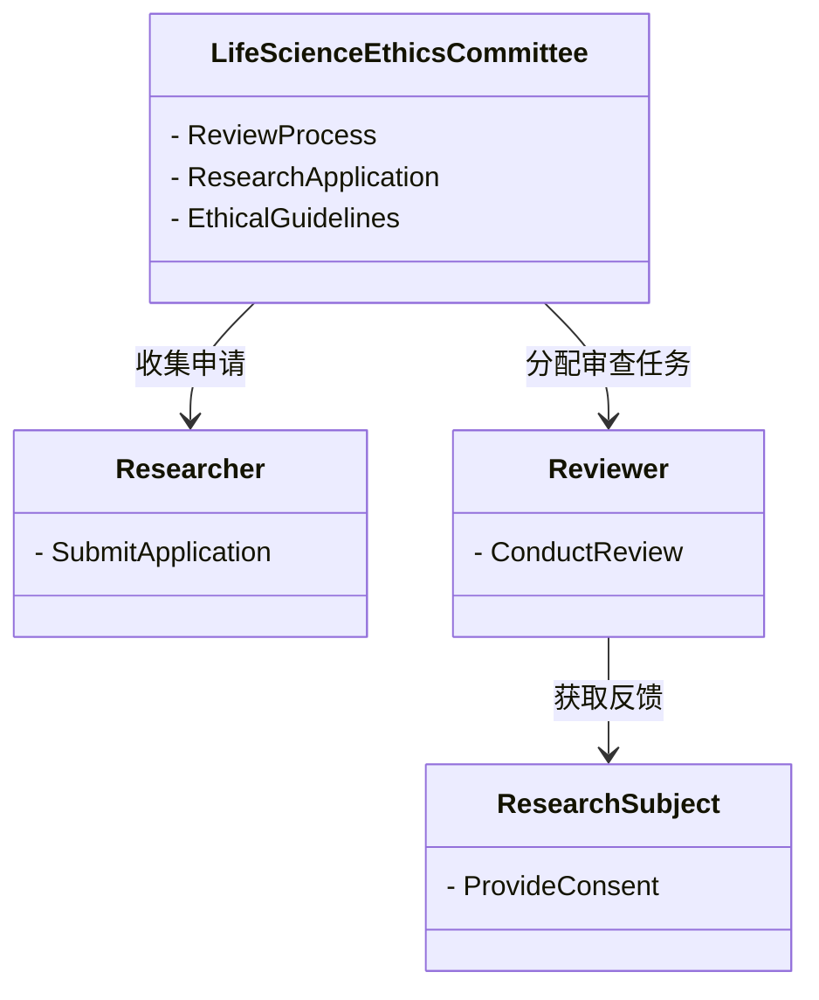

                 

<think>
嗯，用户希望我以《生命科学伦理委员会：探索存在本质的道德边界》为标题，撰写一篇技术博客。看起来他们需要一篇结构严谨、内容丰富的文章，涵盖伦理委员会的背景、核心伦理原则、在生物医学研究中的应用，以及基因组研究中的伦理问题。

首先，我需要明确文章的关键词和摘要。关键词可能包括生命科学伦理委员会、伦理边界、存在本质、伦理原则、基因编辑、隐私保护。摘要部分需要概括文章的核心内容，说明伦理委员会的重要性以及它们在不同领域的应用。

接下来，文章的结构已经有一个大纲，分为几个主要部分：背景、核心伦理原则、生物医学研究中的伦理考虑、基因和基因组研究中的伦理问题，以及未来的发展趋势。每个部分下还有子部分，比如历史背景、核心概念、伦理原则的分析等。

我应该从背景开始，介绍生命科学伦理委员会的起源和重要性。然后深入探讨四个核心伦理原则，如尊重自主权、不伤害、有益和公正，可能用表格来对比不同伦理理论。接着，分析基因编辑和隐私保护的问题，引用具体案例，比如CRISPR技术，来说明伦理挑战。

在系统分析部分，可能需要绘制领域模型和架构图，展示伦理委员会在系统中的角色。同时，用序列图展示系统交互，说明伦理审查的过程。代码部分可能涉及伦理审查的流程，用Python实现一个简单的审查模拟，帮助读者理解。

最后，总结生命科学伦理委员会的重要性，并指出未来的发展方向。作者信息需要放在结尾，确保格式正确。

用户可能希望文章不仅有理论分析，还有实际案例和系统设计，以展示技术细节和应用。因此，我需要确保每个部分都详细且具体，使用图表和代码来增强可读性。同时，语言要专业但不失清晰，让读者能够一步步理解伦理委员会的作用和挑战。

总的来说，我需要按照用户的要求，分步骤构建每个部分，确保内容完整、逻辑清晰，并满足技术博客的专业性要求。
</think>

# 生命科学伦理委员会：探索存在本质的道德边界

## 关键词：生命科学伦理委员会、伦理边界、存在本质、伦理原则、基因编辑、隐私保护、伦理审查

## 摘要：  
生命科学伦理委员会是确保生命科学研究和应用符合伦理规范的重要机构。本文从伦理委员会的背景、核心伦理原则、在生物医学研究中的应用，以及在基因和基因组研究中的伦理挑战等方面展开探讨，分析其在探索生命科学道德边界中的重要作用。通过结合实际案例和系统设计，本文旨在为读者提供一个全面理解生命科学伦理委员会的框架。

---

## 1. 背景与核心概念

### 1.1 生命科学伦理委员会的起源与作用  
生命科学伦理委员会（Life Science Ethics Committee, LSEC）是专门负责审查和指导生命科学研究及应用中的伦理问题的机构。其起源可以追溯到20世纪中期，随着生物技术的快速发展，社会对科学研究的伦理审查需求日益增加。  

#### 1.1.1 历史背景  
生命科学伦理委员会的形成与以下因素密切相关：  
1. **科技快速发展带来的伦理问题**：基因编辑、克隆技术等突破性进展引发了伦理争议。  
2. **社会对科学研究透明度的需求**：公众对科学研究的信任度下降，要求建立更严格的伦理审查机制。  
3. **法律与政策的推动**：各国政府逐步出台相关法规，要求对生命科学研究进行伦理审查。  

#### 1.1.2 核心概念与问题描述  
生命科学伦理委员会的主要职责包括：  
1. 审查研究的伦理合规性。  
2. 保护研究对象的权益。  
3. 指导研究人员遵守伦理原则。  

核心问题包括：  
- 如何平衡科学研究的创新性与伦理约束？  
- 如何确保伦理审查的公正性和透明度？  
- 如何应对新兴技术（如AI和基因编辑）带来的伦理挑战？  

---

## 2. 核心伦理原则与理论

### 2.1 四大伦理原则  
生命科学伦理委员会的工作基于以下四个核心伦理原则：  

| 原则 | 定义 | 适用场景 |  
|------|------|----------|  
| 尊重自主权（Autonomy） | 尊重个体的自主决策权 | 患者知情同意、研究对象的选择权 |  
| 非伤害（Nonmaleficence） | 避免对个体或群体造成伤害 | 研究中的潜在风险评估 |  
| 有益（Beneficence） | 努力带来最大利益 | 研究的社会价值与受益范围 |  
| 公正（Justice） | 公平分配利益与风险 | 研究对象的代表性与公平性 |  

#### 2.1.1 对比分析：主要伦理理论  
以下是对三种主要伦理理论的对比分析：  

| 理论 | 核心观点 | 适用场景 |  
|------|----------|----------|  
| 利用主义 | 行为的正确性取决于其带来的最大利益 | 适用于群体层面的伦理决策 |  
|义务论（Deontological Ethics） | 强调遵守道德义务和规则 | 适用于个体层面的伦理行为 |  
| 美德伦理（Virtue Ethics） | 强调道德品质的培养与实践 | 适用于伦理委员会的长期决策 |  

---

## 3. 生物医学研究中的伦理考量

### 3.1 知情同意与研究诚信  
#### 3.1.1 知情同意的定义与重要性  
知情同意是确保研究对象在参与研究时充分了解研究的目的、风险和益处，并自愿同意参与的核心原则。  

#### 3.1.2 知情同意的实现过程  
1. **信息提供**：研究者需向研究对象详细说明研究内容。  
2. **理解和同意**：研究对象需确认自己理解信息并同意参与。  
3. **记录与存档**：签署知情同意书并存档以备审查。  

#### 3.1.3 挑战与伦理困境  
- 研究对象可能因文化或语言障碍无法充分理解信息。  
- 研究者可能因急于推进研究而简化知情同意流程。  

---

## 4. 基因与基因组研究中的伦理挑战

### 4.1 遗传隐私与基因歧视  
#### 4.1.1 遗传隐私的概念  
遗传隐私是指个体基因信息的保密性和使用权的控制权。  

#### 4.1.2 基因隐私的保护挑战  
- 基因数据的共享可能导致个人隐私泄露。  
- 基因信息可能被用于保险、就业等方面的歧视。  

#### 4.1.3 解决基因歧视的伦理建议  
1. 建立严格的基因数据保护法律。  
2. 提高公众对基因隐私的认识。  

### 4.2 基因编辑的伦理争议  
#### 4.2.1 基因编辑技术的原理  
基因编辑技术（如CRISPR-Cas9）通过精确修改基因组来治疗或增强生物特性。  

#### 4.2.2 基因编辑的伦理争议  
- **治疗性用途**：用于治疗遗传性疾病是否可行？  
- **增强性用途**：是否会导致社会不平等？  
- **生态风险**：基因编辑对生态系统的影响。  

#### 4.2.3 全球治理的必要性  
建立跨国界的基因编辑监管框架，确保技术的合理使用。  

---

## 5. 系统分析与架构设计

### 5.1 问题场景介绍  
生命科学伦理委员会需要处理复杂的伦理审查流程，包括：  
1. 收集研究申请。  
2. 审查伦理合规性。  
3. 提供伦理指导。  

### 5.2 系统功能设计  
以下是生命科学伦理委员会的领域模型：  



### 5.3 系统架构设计  
以下是系统的整体架构图：  

```mermaid
graph TD  
    A[LifeScienceEthicsCommittee] --> B[Researcher]: 提交申请  
    B --> C[ReviewProcess]: 启动审查  
    C --> D[Reviewer]: 分配任务  
    D --> E[ResearchSubject]: 获取反馈  
    E --> C: 完成审查  
```

---

## 6. 项目实战：伦理审查流程模拟

### 6.1 环境安装  
需要安装以下工具：  
- Python 3.x  
- Mermaid工具链  

### 6.2 核心实现代码  
以下是一个简单的伦理审查流程模拟代码：  

```python
def review_process(applicant, guidelines):
    if applicant.status == "submitted":
        if applicant.ethical_compliance(guidelines):
            return "approved"
        else:
            return "rejected"
    else:
        return "error"

# 示例用法
class Researcher:
    def __init__(self, name):
        self.name = name
        self.status = "submitted"

    def submit_application(self, committee, guidelines):
        committee.review_process(self, guidelines)

committee = LifeScienceEthicsCommittee()
researcher = Researcher("Dr. Smith")
researcher.submit_application(committee, "伦理指南2023")
```

---

## 7. 总结与展望

### 7.1 总结  
生命科学伦理委员会在确保科学研究的伦理合规性方面发挥着至关重要的作用。通过遵循核心伦理原则、严格审查流程以及应对新兴技术的伦理挑战，伦理委员会为生命科学的发展提供了坚实的道德保障。

### 7.2 展望  
随着生物技术的快速发展，生命科学伦理委员会需要不断适应新的伦理挑战，探索更加灵活和高效的审查机制。未来，伦理委员会的角色将更加重要，成为连接科技与伦理的关键桥梁。

---

## 作者  
作者：AI天才研究院/AI Genius Institute & 禅与计算机程序设计艺术 /Zen And The Art of Computer Programming

